# 第10章 树

## 10.1 树及其性质

#### 定义10.1（树）

一个连通无回路的图（最小的连通图）称为**树**，记为$T$。
树中度数为1的顶点称为**树叶**（**悬挂点**）。
度数大于1的顶点称为**分枝点**或**内点**。
不相交的树的全体（无回路的图）称为**森林**。
平凡图（只有一个顶点）称为**平凡树**。

图10.1所示是森林，它的每个分支是一棵树。

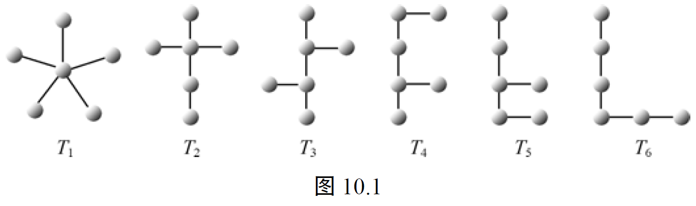

除了定义10.1给出树的定义外，还有几条等价的树的定义。

#### ⭐定理10.1（树的等价定义）

**设图$T$有$n$个顶点，有下列6条树的等价定义：

**(1) $T$是无回路的连通图。**
**(2) $T$是无回路图，并且$e=n-1$，其中$e$是边数。**
**(3) $T$是连通图，并且$e=n-1$。**
**(4) $T$是无回路图，并且在$T$的任何两个不相邻的顶点之间添加一边，恰得一条回路（也称$T$为最大无回路图）。**
**(5) $T$是连通图，但删去任一条边后，便不连通（也称$T$为最小连通图）。**
**(6) $T$的每一对不同的顶点之间有唯一的一条路。**

**证明**：**先证(1)(2)(3)等价，即连通、无回路、$e=n-1$ 三个条件中成立任意两个就是树**。

(1) $\Rightarrow$ (2)：**以顶点数$n$为归纳变量**，采用归纳法证明。
当$n=1$时，$e=0$，所以$e=n-1$成立。
假设$n=k$时命题成立，当$n=k+1$时：$T$ 连通，则 $d(v)\geq1,\forall v\in V$。如果 $d(v)\geq 2,\forall v\in V$，由**定理8.10**，一定存在回路，矛盾。
因为 $T$ 是连通的无回路的图，所以**至少有一个度数为 1 的顶点$v$**，在$T$中删去$v$及其关联边$\{u,v\}$，得$k$个顶点的连通无回路的图$T'$，由归纳假设，它有$k-1$条边。所以原图$T$边数为$(k-1)+1$，顶点数为$k+1$，所以$e=n-1$。因此$T$是无回路图，并且$e=n-1$。

(2) $\Rightarrow$ (3)：**假设$T$不连通**，则$T$有$k$个连通分支$T_1,\cdots,T_k(k\geq2)$，顶点数及边数分别为$n_1,\cdots,n_k,e_1,\cdots,e_k$，因为每个连通分支是无回路连通图，所以符合树的定义，即$e_i=n_i-1$成立。则$e=e_1+\cdots+e_k=n-k$，$k\geq1$，这与$e=n-1$前提矛盾。所以$T$是连通的，并且是$e=n-1$的图。

(3) $\Rightarrow$ (1)：若 $G$ 是连通的有回路的图，则 $e\geq n$。
设回路的顶点数为 $k$，剩下 $n-k$ 个顶点与这个回路连通，必有一个顶点与回路上的某个顶点相邻。以此类推。

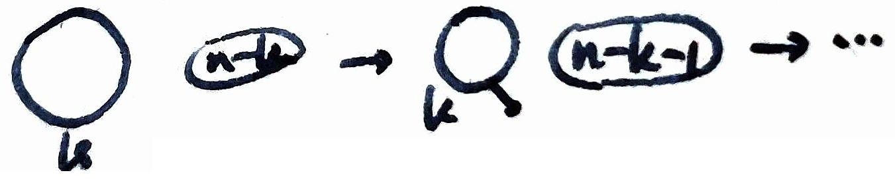

所以(1)(2)(3)等价。接下来推导(4)(5)(6)。

<!-- (3) $\Rightarrow$ (4)：首先证明$T$无回路。对顶点数$n$采用归纳法；因为$T$是连通的，并且$e=n-1$，所以当$n=2$时，$e=n-1=1$，显然$T$是无回路的。假设顶点数为$k-1$时无回路。当顶点数为$k$时，$e=k-1$；则可以证明至少有一个顶点$v$，使$d(v)=1$。因为如果每个顶点的度数至少为2，则所有顶点度数之和大于或等于$2k$，所以在$T$中至少有$k$条边，导致矛盾。故至少有一个顶点$v$，使$d(v)=1$。删去$v$及其关联边得图$T'$，则由归纳假设$T'$无回路，再加回$v$及关联边得图$T$，则$T$也无回路。 -->

(1) $\Rightarrow$ (4)：如果在连通图$T$的任意两个不相邻顶点 $v_i,v_j$ 之间添加一边，记为$\{v_i,v_j\}$。
因为图 $G$ 是连通图，所以$v_i,v_j$两个顶点之间有一条路，与新增的边 $\{v_i,v_j\}$ 构成一条回路。
这条回路是**唯一的**，因为如果不唯一；则删去该边$\{v_i,v_j\}$后，在$T$中仍有回路，从而导致矛盾。

(4) $\Rightarrow$ (5)：**若不连通**，则在$T$中存在顶点$v_i$和$v_j$，在$v_i$与$v_j$之间没有路，即 $v_i$ 和 $v_j$ 属于两个不同的连通分支。
显然，若增加边$\{v_i,v_j\}$不会产生回路，与假设矛盾。
又由于无回路，则删去任意一条边，$T$便不连通。

(5) $\Rightarrow$ (6)：因为$T$是连通的，所以任意两点之间有一条路。
如果某两个顶点之间多于一条路，则$T$中必有一条回路，删去该回路上任一条边，图仍连通，与假设矛盾。所以，每一对顶点间必有唯一的一条路。

(6) $\Rightarrow$ (1)：因为每一对顶点有唯一的一条通路，所以图是连通的。
若图有回路，则回路上任意两点之间有两条路，从而导致矛盾。
$\square$

#### **推论**

**若$G$是$n$个顶点，$\omega$个分枝的森林，则$G$有$n-\omega$条边**。

证明留作**习题10.1**。

#### 定理10.2

**在任意一棵非平凡树$T$中，至少有两片树叶**。

**证明：**
由于$T$是连通的，对于$T$的任一顶点$v_i$，$d(v_i)\geq1$；又因为$T$是图，所以$\sum_{i=1}^n d(v_i)=2e=2(n-1)$。
如果在某树中至多有一个顶点度数为1，其他顶点的度数均大于或等于2，于是$\sum_{i=1}^n d(v_i)\geq2(n-1)+1=2n-1>2(n-1)$，导致矛盾。
$\square$

---

## 10.2 生成树与割集

前面我们讨论了树本身的性质，本节讨论树作为一个图的子图的情况。

### 生成树

#### 定义10.2（生成树）

图$G$的生成子图（包含所有顶点）是树$T$，称$T$为$G$的**生成树**。
从$G$中删去$T$的边，得到的图称为$G$的**余枝**（余树），记为$\overline{T}$。
$T$中的边称为**树枝**（或**枝**）。$\overline{T}$中的边称为$G$的**弦**（或**连枝**）。

由定义10.2，只有连通图才有生成树；而且连通图的生成树不唯一，至少有一棵；生成树$T$和余枝$\overline{T}$成对出现。可以通过不断地删去图$G$中的回路中的边得到一棵生成树。有如下定理。

#### 定理10.3

**$G$是连通图当且仅当$G$有生成树**。

**证明：**
$\Leftarrow$因为生成树是连通图，显然，$G$是连通图。

$\Rightarrow$采用构造方法来证明。设$G$是连通图，若$G$没有回路，则$G$本身就是生成树。若$G$只有一条回路，从这条回路中删去一条边，仍保持连通，得到一棵生成树；若$G$中有多条回路，则重复上述过程，直到得到一棵生成树为止。
$\square$

**设连通图$G$有$n$个顶点，$e$条边，那么$G$的任意一棵生成树有$n-1$条枝，$e-n+1$条连枝**。

设图$G$有$n$个顶点，$e$条边，$\omega$个分支，$n,e,\omega$之间有两个简单的关系式：因为每个分支至少有一个顶点，所以有$n\geq\omega$，即$n-\omega\geq0$；然而由**例8.2**可知$e\geq n-\omega$，即$e-n+\omega\geq0$。

#### 🤔定义10.3（秩、零度）

设图$G$有$n$个顶点，$e$条边，$\omega$个分支，称$n-\omega$为图$G$的**秩**，$e-n+\omega$为图$G$的**零度**。

显然$G$的秩是$G$的各分支中生成树的枝数之和，$G$的零度是$G$的各分支中生成树的连枝数之和。对于连通图$G$来说，它的秩为$n-1$，零度为$e-n+1$。

### 割集与断集

割集是图论中的一个重要概念，它与树和回路的概念密切的联系。我们先引进割集的概念。

#### 定义10.4（割集）

设 $D\subseteq E$ 是图 $G$ 的一个边集，若在$G$中删去$D$的全部边后所得图的秩减少 1（即连通分支数增加 1），而$D$的任何真子集均无此性质（秩不变），则称$D$为$G$的**割集**。

#### 定义10.5（断集）

设$G$顶点非空子集为$V_1\subset V$，在$G$中一个端点在$V_1$中，另一个端点在$\overline{V_1}$中的所有边组成的集合称为$G$的一个**断集**（或称**边割**），记为$E[V_1\times\overline{V_1}]$，简记为$(V_1,\overline{V_1})$。即
$$E(V_i, \overline{V_i}) = \{(u, v) \in E \mid u \in V_i, v \in \overline{V_i}\}.$$

当$|(V_1,\overline{V_1})|=1$时，$(V_1,\overline{V_1})$中的那条边称为**割边**（或**桥**）。

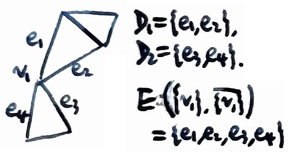

显然，**割集是断集，反之不一定**（因为割集 $D$ 只能分开一个连通分支）。

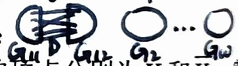

对于连通图$G(V,E)$，删去一个割集$D$，得两个分支，设它们的顶点分别为$V_1$和$\overline{V_1}$，割集$D$是$G$中一个端点在$V_1$中，另一个端点在$\overline{V_1}$中的边的全体。**如果在连通图$G$中，删去一个断集而不是一个割集，那么将得到两个以上连通分支**。

### 割集与回路

现在我们给出回路和割集的一些性质，这里不妨假设$G$是连通图。

#### 定理10.4

**任何一条回路和任何生成树的余树至少有一条公共边**。

**证明**：如果一条回路和一棵生成树的余树没有公共边，则表示该回路在该生成树中。这与树的定义矛盾。
$\square$

#### ⭐定理10.5

**任何一个割集（或断集）和任何一棵生成树至少有一条公共边**。

**证明**：如果一个割集和一棵生成树没有公共边，则删去该割集后留下一棵完整的生成树，也就是说，删去一个割集后，不能将图$G$分为两个分支，这与割集的定义相矛盾。
$\square$

#### ⭐定理10.6

**任何一条回路和任何一个割集（或断集）有偶数条公共边**。

**证明**：从连通图$G$中删去一个割集$D$后，得到彼此不连通的两个顶点子集$V_1$和$V_2$，考察其中任意一条回路$C$。

(1) 如果$C$中所有顶点在$V_1$（或$V_2$）中，则$C$与$D$没有公共边，0是偶数。

(2) 如果$C$中顶点既有一些在$V_1$中，又有一些在$V_2$中，先看$D$中任何一边，它的一个端点在$V_1$中，另一个端点在$V_2$中，且$G$中除$D$中边以外，不再有任何连接$V_1$与$V_2$的顶点。现从$V_1$中（也可以从$V_2$中）的一个顶点出发，沿$C$行走到达$V_2$中的某些顶点又回到$V_1$，这样在$V_1$与$V_2$之间来回行走，最后回到$V_1$的出发点。

因此，回路$C$中必有偶数条割集$D$中的边。
$\square$

在连通图$G$中，**给定生成树后**，我们可以给出基本割集和基本回路的概念。

#### 🤔定义10.6（基本割集）

设连通图$G$中给定生成树$T$，对于**只包含$T$中的一条枝的割集**，称此割集为关于$T$的**基本割集**。

在连通图$G$中，对于给定的生成树$T$，每一条枝恰对应唯一的一个基本割集。因为从生成树$T$中删去一条枝，将$T$分为两棵树，它将$G$的顶点集$V$划分为彼此不连通的两个顶点子集$V_1$和$\overline{V_1}$，在$G$中这两个顶点集之间的连边，便是对应这一条枝的唯一的基本割集。

连通图$G$有$e$条边，$n$个顶点，给定的生成树$T$应有$n-1$条枝，所以恰有$n-1$个基本割集，这些割集的全体称为生成树$T$的**基本割集组**。

#### 🤔定义10.7（基本回路）

设连通图$G$中给定生成树$T$，在$T$中加一条弦，恰产生一条回路，称此回路为关于$T$的**基本回路**。

由**定理10.1的等价定义（4）**，可知在$T$中加一条弦，产生**唯一的**回路。

连通图$G$有$e$条边，$n$个顶点，给定的生成树$T$应有$n-1$条枝，$e-n+1$条弦，所以恰有$e-n+1$条基本回路，这些回路的全体称为生成树$T$的基本回路组。

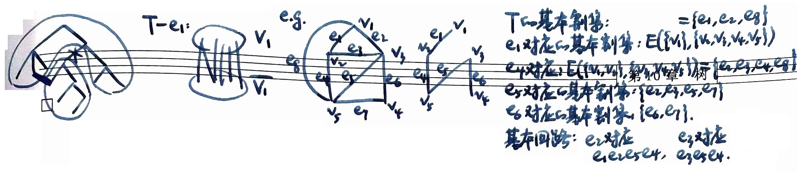

有关基本割集和基本回路之间的联系，请见**习题10.13**和**习题10.14**。

> **10.13** 在连通图中，对给定的一棵生成树，设 $D=\{e_1,e_2,\cdots,e_k\}$ 是一个基本割集，其中 $e_1$ 是树枝，$e_2,\cdots,e_k$ 是生成树的弦，则 $e_1$ 包含在对应于 $e_i(i=2,\cdots,k)$ 的基本回路中，且 $e_1$ 不包含在任何其他的基本回路中。
> 
> **10.14** 在连通图中，对给定的一棵生成树，设 $C=\{e_1,e_2,\cdots,e_k\}$ 是一条基本回路，其中 $e_1$ 是弦，$e_2,\cdots,e_k$ 是树枝，则 $e_1$ 包含在对应于 $e_i(i=2,\cdots,k)$ 的基本割集中，且 $e_1$ 不包含在任何其他的基本割集中。

### 🤔树的基本变换

设$T$是连通图$G$的一棵生成树，$\overline{e}$是任意一弦，则$T\cup\overline{e}$恰产生一条基本回路$C$，$e$是$C$上$T$的任意一枝，显然，**$(T\cup\overline{e})-e$仍然是一棵生成树**。

#### 定义10.8（树的基本变换）

设连通图$G$的生成树$T$，通过上述加一弦，再删去一枝得到另一棵生成树，这种变换称为**树的基本变换**。

#### 定义10.9（距离）

设连通图$G$的生成树$T_1$和$T_2$，出现在$T_1$而不出现$T_2$的边数称为$T_1$和$T_2$的**距离**，记为$d(T_1,T_2)$。

容易看出$d(T_1,T_2)\geq0$。如果$T_1=T_2$，则$d(T_1,T_2)=0$；反之亦然。

并且$d(T_1,T_2)=d(T_2,T_1)$。因为
$$d(T_1,T_2) = T_1\text{上的边数} - T_1\text{与}T_2\text{的公共边数} = (n-1) - T_1\text{与}T_2\text{的公共边数} = d(T_2,T_1).$$

#### 定理10.7

**设连通图$G$，$T_1$和$T_2$是$G$的两个不同的生成树，则由$T_1$通过有限次树的基本变换可以得到$T_2$**。

**证明**：
因为$T_1\neq T_2$，$d(T_1,T_2)=d(T_2,T_1)\neq0$，所以存在边$e_1\in T_2$，但$e_1\notin T_1$，于是$T_1\cup e_1$包含一条基本回路，显然这条回路上的边不全在$T_2$中，那么存在边$e_2\in T_1$，但$e_2\notin T_2$，设$T_1'=(T_1\cup e_1)-e_2$。$T_1'$无回路并且边数为$n-1$，因此$T_1'$还是一棵树，并且$d(T_1',T_2)=d(T_1,T_2)-1$。如果$d(T_1',T_2)\neq0$，重复上述步骤，经过有限步以后，必有某 $k$ 使得$d(T_k',T_2)=0$，即$T_k'=T_2$。

或：对 $d(T_1,T_2)$ 作数学归纳法。
设 $d(T_1,T_2)=k$ 时结论成立，当 $d(T_1,T_2)=k+1$ 时，$T_2$ 上有 $k+1$ 条边不属于 $T_1$，
任取 $e_2 \in T_2$ 但 $e_2 \notin T_1$，$T_1+e_2$ 有唯一的回路 $C$，
在 $C$ 上一定有一条属于 $T_1$ 但不属于 $T_2$ 的边 $e_1$，
令 $T_1'=T_1+e_2-e_1$，则由归纳假设 $d(T_1',T_2)=d(T_1+e_2-e_1,T_2)=k$。
$\square$

---

## 10.3 最小生成树

#### 定义10.10（最小生成树）

设$G(V,E,\omega)$是带权连通简单图，$\omega$是从$E$到正实数集的函数。又设$T$是$G$的一棵生成树，$T$中所有枝的权之和称为$T$的权，记为$W(T)=\sum_{\{i,j\}\in T}\omega(i,j)$。具有权$\min\{W(T)\}$的生成树称为**最小生成树**。

> 若不带权，即每条边权值为1，则所有生成树都有 $W(T) = n-1$。

如图10.2所示，图（a）给出带权连通简单图，图（b）为其最小生成树。

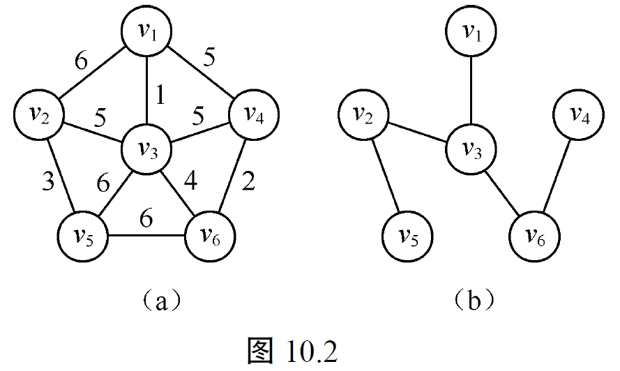

本节将给出在给定的一个带权连通图中求最小生成树的算法。这个问题是具有实际意义的。例如，$G$中的点表示城市，边表示城市间的道路，边的权表示对应道路的长度，现在我们沿着道路架设通信线路，将这些城市联系起来，要求架设的线路最短，这个问题就是求一棵最小生成树的问题。

下面我们介绍一种求最小生成树的**克鲁斯克尔（Kruskal）算法**。先看一个例子。

#### **例10.1** 

求图10.3中带权连通图$G(V,E,\omega)$的最小生成树。克鲁斯克尔算法的步骤，通俗地说，就是先将$G$中的边按权从小到大顺序排列，再从小到大依次取出每一边作检查。一开始取权最小的边，由该边导出一个部分子图，然后依次每取一边加入已得的部分子图。若保持无回路，将该边与原有部分子图中的边导出一个新的部分子图；若得到回路，将该边放弃。上述过程继续进行，直到所有边均检查完，得到的生成子图就是所求的最小生成树，过程如图10.3所示。

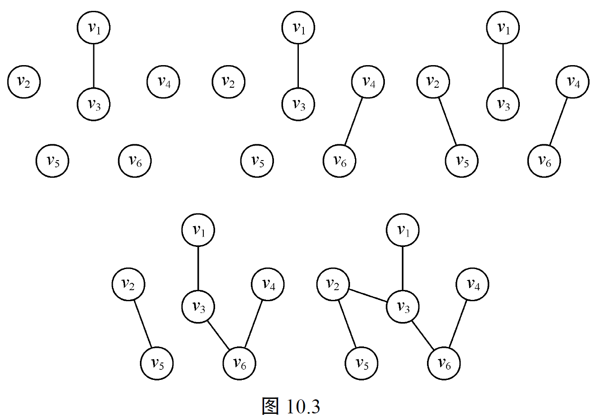

#### 克鲁斯克尔算法

设$G(V,E,\omega)$是有$n$个顶点的带权连通简单图。
(1) 在$G$中选一边$e_1$，使$\omega(e_1)$最小，令$E_1=\{e_1\}$，$1\Rightarrow i$。
(2) 若已选出$E_i=\{e_1,e_2,\cdots,e_i\}$，那么从$E-E_i$中选取一边$e_{i+1}$，满足：
   ① $E_i\cup\{e_{i+1}\}$的导出子图中不含回路。同时
   ② $\omega(e_{i+1})$为最小。
(3) 若$e_{i+1}$存在，令$E_{i+1}=E_i\cup\{e_{i+1}\}$，$i+1\Rightarrow i$，转（2）；若$e_{i+1}$不存在，则停，此时$E_i$导出的子图就是所求的最小生成树，记为$T$。

现在来证明上述算法的正确性。

#### 定理10.8

**克鲁斯克尔算法所得到的图$T$是最小生成树**。

**证明：**
首先证明由定理10.1等价定义（4）便知$T$是$G$的一棵生成树。并由等价定义（2）可知边数为$n-1$。

下面证明$T$是最小生成树即可。用反证法证明，假设$T$不是$G$的最小生成树，而$S$是$G$的最小生成树，并且$W(S)<W(T)$。在生成树$T$中有$n-1$条边，按权从小到大的顺序排列为$e_1,e_2,\cdots,e_k,\cdots,e_{n-1}$。若$e_k$是不在$S$中的第一条边，也就是说$e_1,e_2,\cdots,e_{k-1}$是$S$和$T$的公共边。现在对$S$进行基本变换，在$S$中加边$e_k$得到一条基本回路，记为$C$，在$C$中必有一边$e'\in S$，但$e'\notin T$，否则$T$中有回路，导致矛盾。再从$S\cup e_k$中删去$e'$，得到生成树$S'$，由于$\omega(e_k)\leq\omega(e')$，所以$W(S')\leq W(S)$，并且$S'$与$T$的公共边比$S$与$T$的公共边多一条。重复上述过程，每一步作一次树的基本变换，使总权数减少，最后生成树$S$变换到生成树$T$，且$W(T)\leq W(S)$，与假设$W(S)<W(T)$相矛盾。
$\square$

---

## 10.4 树的计数（略）

现考虑标定完全图的生成树的数目。例如标定完全图$K_3$的不同生成树共有3棵。一般情况下，标定$K_n$的不同生成树究竟有多少？凯莱（Cayley）于1889年首先解决了这个问题，并给出证明，称为凯莱定理。现在我们来证明这个定理，其中图为标定图。

#### 定理10.9
完全图$K_n(n\geq2)$的不同生成树总数$L(n)$为$n^{n-2}$。

**证明：**
在$K_n$的不同生成树中，对于任意给定标号为$v$的顶点，在每一棵生成树中，顶点$v$的度数为$1,2,\cdots,n-1$中之一。设给定顶点$v$度数为$k$的生成树总数记为$L(n,k)$，那么$K_n$的生成树总数为：
$$L(n)=\sum_{k=1}^{n-1}L(n,k)$$

下面我们来计算$L(n,k)$。

设$S$是任意生成树，使顶点$v$有$d(v)=k-1$。从$S$中删去与顶点$v$不关联的任一边$\{w,y\}$，得到两棵子树，其中一棵子树包含顶点$v$和$w$，而另一棵子树包含顶点$y$。现在连接$v$和$y$，得到生成树$T$，使$d(v)=k$。

从生成树$S$通过上述过程得到生成树$T$，称这对生成树$(S,T)$为一个连合。我们的目的是要计算这种连合$(S,T)$的总数。

因为$S$是使顶点$v$有$d(v)=k-1$的生成树，$S$可以有$L(n,k-1)$种选取方式。对于选取到的$S$，由上述过程可知，$T$是唯一地由边$\{w,y\}$决定，而$\{w,y\}$的选取方式是边数$n-1$减去顶点$v$关联的边数，即$n-1-(k-1)=n-k$种。所以连合$(S,T)$的总数为$(n-k)L(n,k-1)$。

另一方面，$T$是使顶点$v$有$d(v)=k$的生成树，从$T$中删去$v$及其关联的边，分别得到子树$T_1,T_2,\cdots,T_k$。现在从$T$中删去关联于$T_1$的那些边中的一边，例如$\{v,w_1\}$，其中$w_1$在$T_1$中，再连接$w_1$和$u$，其中$u$在$T_j(j\neq1)$中，这样便得到一棵生成树$S$，并且$d(v)=k-1$。从生成树$T$通过这个过程得到生成树$S$，也可以得到所有连合$(S,T)$的总数。

因为$T$是使顶点$v$有$d(v)=k$的生成树，$T$可以有$L(n,k)$种选取方式。对于选取到的$T$，由上述过程可知，$T$的顶点数是$n_1$，除$v$以及$T_1$中的顶点外还有$n-1-n_1$个顶点。所以连接$T_1$中某$w_1$和$T_j(j\neq1)$中的顶点$u$，共有$n-1-n_1$种方式。因此连合$(S,T)$的总数为：
$$L(n,k)[(n-1-n_1)+\cdots+(n-1-n_k)]=(n-1)(k-1)L(n,k)$$
其中$n_1+n_2+\cdots+n_k=n-1$（除顶点$v$外尚有$n-1$个顶点），因此$(n-k)L(n,k-1)=(n-1)(k-1)L(n,k)$

这是一个关于$k$的递推关系，并且$L(n,n-1)=1$，用迭代法求解。

由$L(n,k-1)=\frac{(n-1)(k-1)}{n-k}L(n,k)$可知
$$\begin{align*}
L(n,k)&=\frac{(n-1)k}{n-k-1}L(n,k+1)\\
&=\frac{(n-1)k}{n-k-1}\cdot\frac{(n-1)(k+1)}{n-k-2}L(n,k+2)\\
&=\cdots\\
&=\frac{(n-1)k\cdot(n-1)(k+1)\cdot\cdots\cdot(n-1)(n-2)}{(n-k-1)\cdot(n-k-2)\cdot\cdots\cdot1}L(n,n-1)\\
&=C(n-2,k-1)(n-1)^{n-k-1}
\end{align*}$$

所以$K_n$的生成树总数$L(n)$为
$$\begin{align*}
L(n)&=\sum_{k=1}^{n-1}L(n,k)=\sum_{k=1}^{n-1}C(n-2,k-1)(n-1)^{n-k-1}\\
&=[(n-1)+1]^{n-2}\\
&=n^{n-2}
\end{align*}$$
$\square$

---

## 10.5 有根树与二分树

前面几节主要考虑无向图中树的性质和一些算法。在本节中讨论有向图的有根树和有序树，它们在计算机科学中应用很广。

#### 定义10.11（有向树）

有向图在不考虑弧的方向时是一棵树，称该有向图为**有向树**。

显然有向树是弱连通的。现在我们将讨论一类重要的有向树，即有根树，定义如下。

#### 定义10.12（有根树）

若有一棵有向树恰有一个顶点的入度为0，其余所有顶点入度为1，称该有向树为**有根树**。
入度为0的顶点称为**根**，出度不为0的顶点称为**分枝点**或**内部顶点**，出度为0的顶点称为**树叶**或**外部顶点**。

在有根树中，从根$v$到其余每个顶点有唯一的一条有向路。这一性质由定义10.12即可得出。有根树中还有一些专门术语，现在介绍如下。

#### 定义10.13

设$a$和$b$是有根树$T$的顶点，若从$a$到$b$有一条边，则称$a$是$b$的**父节点**（父亲），$b$是$a$的**子节点**（儿子）。
同一个分枝点的儿子，称为**兄弟节点**。
若从$a$到$c$有一有向路径，则称$a$是$c$的**祖节点**（祖先），$c$是$a$的**孙节点**（后代）。
由顶点$a$和它所有的后代导出的子图，称为$T$的**子树**，从树根$r$到一顶点$a$的路径的边数称为$a$的**层数**。
有根树$T$中从根到树叶的最大层数称为有根树$T$的**高**。

当我们画有根树时，如果规定将一个分枝点的儿子放在它下面，那么弧的箭头就可以省略。

如图10.4中的图是有根树。顶点$a$是根，顶点$b,i,h,e,f$都是树叶，顶点$c,d,g$都是分枝点。顶点$a$的层数是0，顶点$b,c$的层数是1，顶点$d,e,f$的层数是2，顶点$g,h$的层数是3，顶点$i$的层数是4。

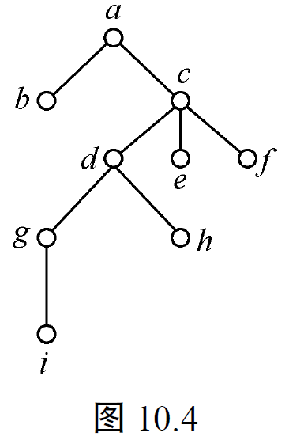

有根树的概念非常重要，原因在于它描述了一个离散结构的层次关系，而层次结构是一种重要的数据结构，所以有根树结构在相当广泛的领域中有它的应用。有时只要考虑某一层次上某分枝点为根的局部层次关系，因此引入下面的概念。

#### 定义10.14（子树）

设$u$是有根树$T$的任意一顶点，以$u$为根，$u$及其所有子孙所组成的顶点集$V'$，$u$到这些子孙的有向路上所有弧组成的弧集记为$E'$，称$T$的子图$T'(V',E')$为以$u$为根的**子树**。

上面讨论有根树时，没有考虑同一分枝点连出的弧的次序。但在计算机科学中的许多具体问题（如编码理论和程序设计语言等）一定要考虑这种弧的次序。为此，我们来引进有序树的概念。

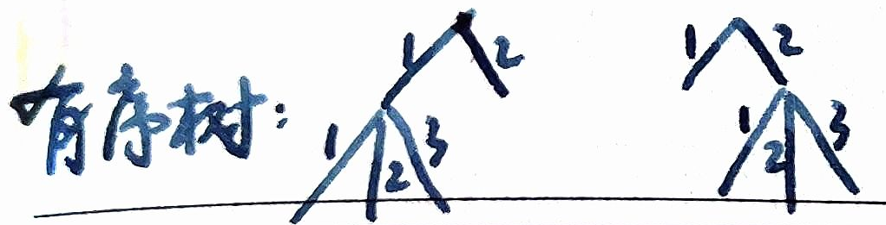

#### 定义10.15（有序树）

有根树的每个分枝点连出的弧（或者有根树的每一个顶点）从左到右用正整数1，2，…，$i$标上标号，称该有根树为**有序树**。

在确定树或画树的方式中，这些标号如果清楚的话，那么标号可以省略。

#### 定义10.16（$m$分树、正则$m$分树）

在树$T$中若每一顶点的儿子个数小于或等于$m$，则称$T$为$m$**分树**。
在树$T$中若每一顶点的儿子个数等于$m$或者等于0，称$T$为**正则$m$分树**。

一个重要的$m$分树是**二分树**和**正则二分树**。对于二分树，类分树的分枝点的左右两个儿子为根的子树分别称左子树和右子树。

#### **例10.2**（**算术表达式可以用二分树表示**）

算术表达式$((b+(c*d))/a)+((e*f)+(g*h)*i))$如图10.5所示。所有运算对象都处于树叶的位置，所有运算符号处于分枝点的位置。如果将分枝点连出的弧的次序改变了，那么所得到的二分树对应的算术表达式也就改变了。

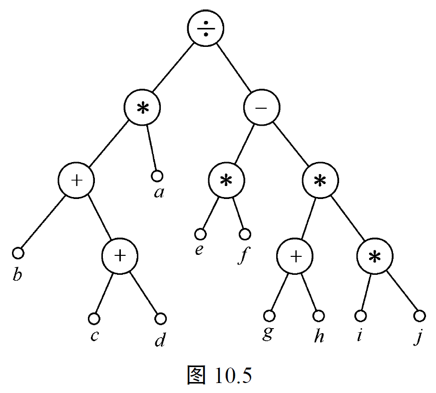

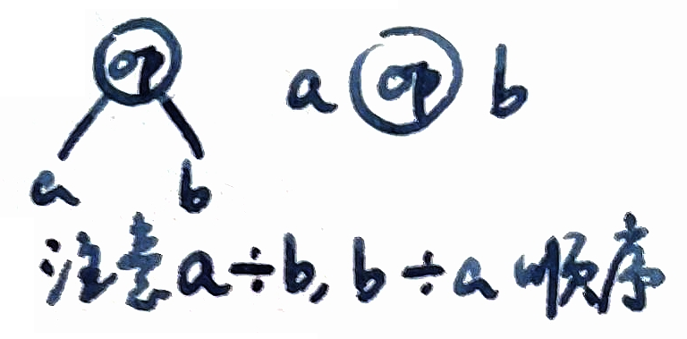

#### 🤔定理10.10

**在正则二分树中，树叶数为$t$，分枝点数为$i$，则$t=i+1$**。

**证明：**
因为每分枝点儿子的总数（即边数 $e$）为$2i$等于树的顶点数减1，即$2i=i+t-1$，所以$t=i+1$。
$\square$

同理可证，在正则$m$分树中，树叶数为$t$，分枝点数为$i$，则$t=(m-1)i+1$。

正则二分树的路长度在计算机程序中有重要的应用，它关系到计算机的执行时间。

#### 定理10.11

**在正则二分树$T$中，$I$表示所有分枝点路长度之总和，$E$表示所有树叶的路长度之总和，则$E=I+2i$，其中$i$为分枝点数**。

**证明**：采用归纳法证明，以分枝点数$i$为归纳变量。

当$i=1$时，$E=2$，$I=0$，所以$E=I+2i$。

假设$i=k-1$时结论成立。当$i=k$时，删去一个分枝点$v$连出的边及其儿子 $v_a,v_b$，得到 $T' = T - \{v_a,v_b\}$。
$v$的路长度为$l$，并且它的两个儿子是树叶，那么得到树$T'$，$E$减少$2(l+1)$，又因为删去$v$的儿子而使$E$增大$l$，$E' = E - 2(l+1) + l$，所以$E$的变化值为$-l-2$，$I$的变化值为$-l$。
由归纳假设知，在$T'$中，$E'=I'+2(k-1)$。于是再将$v$以及$v$与它的两个儿子的连边加回到$T'$中，得到$T$，由于$E=E'-l-2$，$I=I'-l$，所以$E=I+2k$。
$\square$

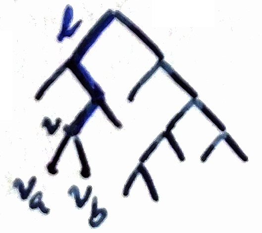

同理可证，在正则$m$分树中有$E=(m-1)I+mi$，具体证明留给读者作为**习题10.21**。

---

## 10.6 最优树

这一节主要介绍最优树的霍夫曼（Huffman）算法，并通过前缀码的设计说明最优树的用处。下面首先用例子引进前缀码的概念。

我们来考虑远距离通信中的一个问题，一篇英文字母组成的短文从发送端发出信息，通过远距离传输送到接收端。通常的电报是用长度为5的0和1序列来表示英文字母和标点符号的，这种长度为5的0和1序列组成的集合称为5单位编码。为了传输一篇短文，将对应的0和1序列组成的信息串发送出去以后，在接收端就将此信息串分成长度为5的序列，这样就得到对应的短文。

但在一篇短文中每个字母出现的频率是不同的。例如$e,t$出现的频率要比$j,z$出现的频率大很多。为了使短文对应的信息串的总长度缩短，首先要求出现次数多的字母用较短的0和1序列表示，出现次数少的字母用较长的0和1序列表示；其次要求在接收端能从一个信息串中明确地分辨出字母所对应的序列。例如字母$a,b,c,d,e$分别用下列0和1序列表示，对应关系如下：

| $a$ | $b$ | $c$ | $d$ | $e$ |
|-----|-----|-----|-----|-----|
| 00  | 110 | 010 | 10  | 01  |

我们把集合$\{00,110,010,10,01\}$叫做码。如果接收端收到信息串是010010，这时分辨不清发送来的是$ead$还是$cc$，这是因为$e$对应的序列01是$c$对应的序列010的前缀。为了避免这样的情况发生，就要将$c$对应的序列改为111，才能确定送来的是$ead$。集合$\{00,110,111,10,01\}$就叫前缀码。前缀码定义如下。

#### 定义10.17
二进制有限序列组成的集合称为码。其中每个元素称为一个码字。在一个码中，任一码字都不是其他码字的前缀，则称该码为二元前缀码，简称前缀码。

为了设计26个英文字母对应的前缀码，我们先来看前缀码与二分树的关系。

#### 定理10.12
给定一棵二分树，则可确定一个前缀码。反之，对应于一个前缀码，存在一棵二分树。

**证明：**
从给定二分树的每个分枝点向它儿子连出两条边，自左到右，分别标记0和1，从树根到树叶的路上边的标号组成的序列标记在该片树叶上，用方框标出，如图10.6所示。树叶上序列组成的集合就是前缀码。如果不是前缀码，则存在一个序列是另一个序列的前缀，那么该序列必位于根到另一序列对应树叶的这条路的分枝点上，导致矛盾。

反之，设前缀码中最长序列的长度为$h$，画一棵高度为$h$的正则二分树，并使树叶在同一层上。从每个分枝点向它的儿子连出两条边分别标记0和1。从根到每个顶点的路上边的标号组成的序列标在每个顶点上。然后将不属于前缀码中序列所对应的顶点及其关联的边删去，便得到一棵二分树。它的树叶对应的序列全体就是前缀码。

$\square$

例如，图10.6给出由前缀码$\{00,0100,011,11\}$对应的一棵二分树。

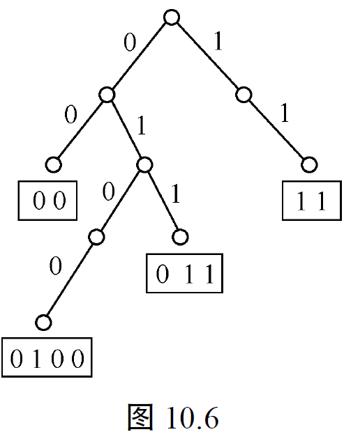

如何设计26个英文字母对应的前缀码，使得同一篇短文字母所对应的信息串穷尽尽可能地短，也就是说，使1000个字母的短文中其信息串长度$\sum_{k=1}^{26}n_k l_k$最小，其中$n_k$表示第$k$个字母出现的频率，$l_k$表示第$k$个字母对应的序列长度。这一问题归结为如何构造一棵最优二分树的问题，下面介绍结果最优二分树的霍夫曼算法，为此首先给出最优二分树的定义。

#### 定义10.18（最优树）
给定一组权$w_1,w_2,\cdots,w_n$且$w_1\leq w_2\leq\cdots\leq w_n$，如果一棵二分树的$n$片树叶带权$w_1,w_2,\cdots,w_n$，称这棵二分树为带权$w_1,w_2,\cdots,w_n$的二分树，记为$T$。$T$的权记为$W(T)$，$W(T)=\sum_{k=1}^n w_k l_k$，其中$l_k$是从根到带权$w_k$的树叶的路的长度。在所有带权$w_1,w_2,\cdots,w_n$的二分树$T$中，使$W(T)$最小的二分树称为最优二分树，简称最优树。

#### 霍夫曼算法
设$n$个权$w_1,w_2,\cdots,w_n$，$w_1\leq w_2\leq\cdots\leq w_n$。

首先构造$n$棵树的集合$F=\{T_1,T_2,\cdots,T_n\}$，其中每棵二分树$T_i$中只有一个带权为$w_i$的根顶点，其左右子树为空。然后在$F$中选取两个最小权$w_i$和$w_j$的顶点作为树叶，构造一棵二分树，且新二分树的根顶点的权为其左右子树根顶点权之和。于是得到$n-1$棵树，它的根权分别为$w_i+w_j,w_1,\cdots$（此$w_i$和$w_j$不一定按顺序）。再在$F$中得到两棵根权最小的树，合并为一棵新的二分树，每一步选择两棵权最小的树合并为一棵二分树，使这两棵树分别是它的左、右子树，新的二分树的根带的权为原两棵树根的权之和。每一步选择两棵权最小的树合并为一棵二分树，重复这一过程直到只有一棵树为止。这棵树即为最优树。

例如图10.3 带权为1,2,3,4,5的最优树，解题过程由图10.7给出，$W(T)=38$。

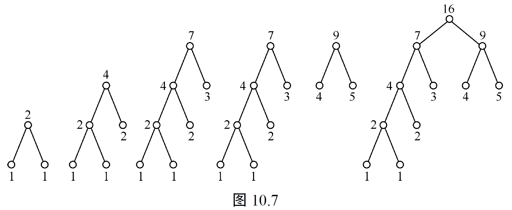

下面证明霍夫曼算法的正确性。

#### 定理10.13
霍夫曼算法得到的带权$w_1,w_2,\cdots,w_n$的二分树是最优树。

**证明：**
用归纳法证明，对于有两个权$w_1,w_2$的二分树是$n=2$的最优树。

假设对于$n-1$个权，用霍夫曼算法求出的树带权是$n-1$个权的最优树。

现考察有$n$个权的情况，设$w_1\leq w_2\leq\cdots\leq w_n$，设$T$是用霍夫曼算法得到的二分树，它的权记为$W(T)$。设$v$是在$T$中离根很远的分枝点，它的儿子$w_{n-1},w_n$都是树叶，如果$T$的权为$W(T)$。

在最优树$T_0$中，存在带权$w_{n-1},w_n$的一片树叶，它们为兄弟树，而且其父亲树的权为$w_{n-1}+w_n$。否则，将这两片带权的树叶与带权$w_{n-1},w_n$的树叶交换。交换以后，因为$w_{n-1}$是有最大的长的树叶，而$w_{n-1},w_n$是最小的两个权，所以不会增加树权，所得到的二分树还是最优树，记为$T_0'$，$W(T_0')=W(T_0)$。将$T_0'$中$w_{n-1}$和$w_n$及其父亲树构成的子树用权为$w_{n-1}+w_n$的树叶代替，得到一棵带权为$w_1,w_2,\cdots,w_{n-2},w_{n-1}+w_n$的二分树，其树权为$W(T_0')-w_{n-1}-w_n=W(T_0)-w_{n-1}-w_n$。

用霍夫曼算法求$w_1,w_2,\cdots,w_{n-2},w_{n-1}+w_n$的最优树，由归纳假设，得最优树$T_1'$，再用两片带权$w_{n-1}$和$w_n$的树叶及其带权的$w_{n-1}+w_n$父亲的二分树代回$T_1'$中的对应$w_{n-1}+w_n$得，得到用霍夫曼算法求得的树$T$。

显然$T$和$T_1'$都是最优树，所以$W(T_1')=W(T_0)-w_{n-1}-w_n$，则有$W(T)=W(T_1')+w_{n-1}+w_n=W(T_0)+w_{n-1}+w_n=W(T_0)$。因此$T$是一棵带权$w_1,w_2,\cdots,w_n$的最优树。

$\square$
