# 第11章 连通度、网络、匹配与Petri网

## 11.1 连通度与块

### 点连通度与边连通度

为了衡量一个图的连通程度，我们要定义图的点连通度与边连通度。

#### 顶点割和边割的定义

$G(V,E)$ 为连通图，$V' \subseteq V$，$E' \subseteq E$。
若 $G-V'$ 不连通，称 $V'$ 为 $G$ 的**顶点割**；
若 $G-E'$ 不连通，称 $E'$ 为 $G$ 的**边割**。

#### 定义11.1（点割/割点）

设图 $G$ 的顶点子集 $V'$，$\alpha(G-V')>\alpha(G)$，称 $V'$ 为 $G$ 的一个**点割**。
$|V'|=1$ 时，$V'$ 中的顶点称为**割点**。

如在图11.1所示的图中，$\{v_1, v_3\}$ 是点割，$v_5$ 和 $v_6$ 是割点。

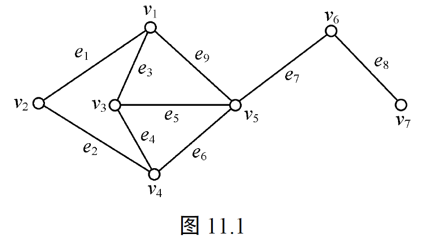

#### 定义11.2（点连通度/连通度）

设有图 $G$，为产生一个不连通图或平凡图需要从 $G$ 中删去的最少顶点数称为 $G$ 的**点连通度**，记为 **$\kappa(G)$**，简称为 $G$ 的**连通度**。

显然，$G$ 是不连通图或平凡图时，$\kappa(G)=0$；连通图 $G$ 有割点时，$\kappa(G)=1$；$G$ 是完全图 $K_n$ 时，$\kappa(K_n)=n-1$。

> $G'$ 为 $G$ 的**简单化**（去掉自环，多重边变一条边），则 $\kappa(G') = \kappa(G)$，$\chi(G') \le \chi(G)$。

在图11.1所示的图中，$\kappa(G)=1$。

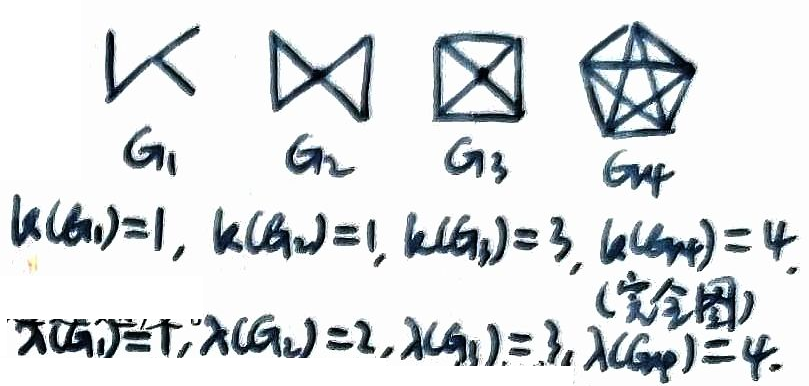

#### 定义11.3（边连通度）

设有图 $G$，为产生一个不连通图或平凡图需要从 $G$ 中删去的最少边数称为 $G$ 的**边连通度**，记为 $\lambda(G)$。

> “产生平凡图”对应于完全图的情形，去掉任意一条边仍然是连通图。

显然，$G$ 是不连通图或平凡图时，$\lambda(G)=0$；连通图 $G$ 有一桥时，$\lambda(G)=1$；$G$ 是完全图 $K_n$ 时，$\lambda(K_n)=n-1$。

> 设 $G(V,E)$ 为连通图，$E' \subseteq E$，$|E'| = \lambda(G)$，$G-E'$ 不连通，则 $E'$ 一定为割集，$E' = E(V_1, \overline{V_1})$。 反之不一定。

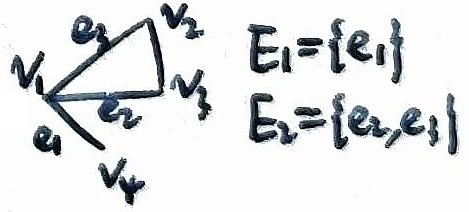

如在图11.1所示的图中，$\lambda(G)=1$，$e_7$ 和 $e_8$ 是桥。

点连通度，边连通度与最小顶点度数的关系由定理11.1给出。

#### ⭐定理11.1

**对任何一个图 $G$，$\kappa(G) \leq \lambda(G) \leq \delta(G)$**。

**证明**：

**首先证明 $\lambda(G) \leq \delta(G)$**。若 $G$ 没有边，则 $\lambda(G)=\delta(G)=0$；否则，必存在顶点 $v$，$d(v)=\delta(G)$。删除 $v$ 的所有关联边，得到的图必定不连通。即最多删除 $\delta(G)$ 条边就可以使 $G$ 不连通，所以 $\lambda(G) \leq \delta(G)$。

**下面证明 $\kappa(G) \leq \lambda(G)$**。若 $G$ 是不连通图或平凡图，则 $\kappa(G)=\lambda(G)=0$。若 $G$ 是连通图，取断集 $E'=E(V'\times \overline{V'})$，$|E'|=\lambda(G)$，记 $E'$ 关联于 $V'$ 中的点集为 $V'$，关联于 $\overline{V'}$ 中的点集为 $V''$，下面分三种情况分析证明。

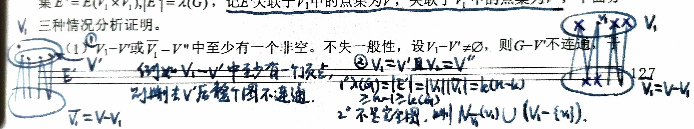

上图中的分类讨论：
(1) $V_1-V'$ 或 $\overline{V_1}-V''$ 中至少有一个非空
(2) $V_1-V'=\overline{V_1}-V''=\varnothing$
	(2.1) 完全二分图
	(2.2) 非完全二分图

另一写法：

(1) $V_1-V'$ 或 $\overline{V_1}-V''$ 中至少有一个非空。不失一般性，设 $V_1-V' \neq \varnothing$，则 $G-V'$ 不连通，于是有 $\kappa(G) \leq |V'| \leq |E'|=\lambda(G)$ 成立。

(2) $V_1-V'=\overline{V_1}-V''=\varnothing$，但 $\min\{|V'|, |\overline{V'}|\}=1$，不失一般性，设 $|\overline{V'}|=1$，则 $G-V'$ 为平凡图。于是 $\kappa(G) \leq |V'| \leq |E'|=\lambda(G)$ 成立。

(3) $V_1-V'=\overline{V_1}-V''=\varnothing$，但 $\min\{|V'|, |\overline{V'}|\}>1$，则从 $V'$ 和 $\overline{V'}$ 中各取若干与 $E'$ 中边关联的顶点，这些顶点构成子集 $V_2$，且使得 $V_1-V_2 \neq \varnothing$，$\overline{V_1}-V_2 \neq \varnothing$，$V_2$ 中顶点关联 $E'$ 中全部边，$|V_2| \leq |E'|$，那么 $G-V_2$ 不连通。于是 $\kappa(G) \leq |V_2| \leq |E'|=\lambda(G)$ 成立。$V_2$ 的取法如下：任取 $v \in V'$，使 $V_2=(V'- \{v\}) \cup \{v''|v'' \in \overline{V'} \text{ 且 } v'' \text{ 与 } v \text{ 关联}\}$，易知 $V_2$ 中的每个点都关联 $E'$ 中一条边，且这些边是互不相同的。
$\square$

#### 例11.1

设 $G$ 是有 $n$ 个顶点的简单图，且 $\delta \geq n-2$，证明 $\kappa(G)=\delta$。

**证明：**
当 $\delta=n-1$ 时 $G=K_n$，所以 $\kappa(G)=n-1=\delta$。
当 $\delta=n-2$ 时，若顶点 $v_1, v_2$ 不相邻，则对任意第3个顶点 $v_3$，$G$ 中存在边 $\{v_1, v_3\}, \{v_2, v_3\}$。此时对任意 $n-3$ 个顶点构成的子集 $V'$，均有 $G-V'$ 连通（在 $G$ 中删去任意 $n-3$ 个顶点依然连通）。所以 $\kappa(G) \geq n-2=\delta$。由**定理11.1**，$\kappa(G) \leq \lambda(G) \leq \delta$，即得 $\kappa(G)=\delta$。
$\square$

#### 定义11.4（$k$-连通的）

若图 $G$ 的点连通度 $\kappa(G) \geq k$，称 $G$ 为 **$k$-连通的**。

#### 定义11.5（$k$-边连通的）

若图 $G$ 的边连通度 $\lambda(G) \geq k$，称 $G$ 为 **$k$-边连通的**。

### 割点与块

下面我们先看一下2-连通图的特征。为此，我们先讨论一下割点。由定义11.4可知，有割点的连通图是1-连通的，但不是2-连通的，反之亦然。割点有如下几个等价条件。

#### ⭐定理11.2

**设 $v$ 是连通图 $G$ 的一个顶点，下列论断是等价的。**
**(1) $v$ 是 $G$ 的一个割点。**
**(2) 对于顶点 $v$，存在两个不同的顶点 $u$ 和 $w$，使顶点 $v$ 在每一条从 $u$ 到 $w$ 的路上。**
**(3) 存在 $V-\{v\}$ 的一个分成 $U$ 和 $W$ 的划分，使对任意两顶点 $u \in U$ 和 $w \in W$，顶点 $v$ 在每一条从 $u$ 到 $w$ 的路上。**

**证明：**
(1) $\Rightarrow$ (3)：因为 $v$ 是 $G$ 的一个割点，$G-\{v\}$ 是不连通的，它至少有两条分支。设 $U$ 是由其中一个分支中的顶点组成，$W$ 则是由其余顶点组成，形成 $V-\{v\}$ 的一个划分。于是任意两顶点 $u \in U$ 和 $w \in W$ 在 $G-\{v\}$ 的不同分支中。因此 $G$ 中每一条从 $u$ 到 $w$ 的路中包含顶点 $v$。

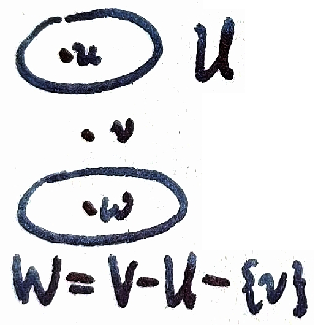

(3) $\Rightarrow$ (2)：(2) 是 (3) 的一个特殊情况，即在 $U$ 和 $V$ 中各取一个顶点，所以立即得证。

(2) $\Rightarrow$ (1)：若 $v$ 在每一条从 $u$ 到 $w$ 的路上，则在 $G-\{v\}$ 中不能有一条从 $u$ 到 $w$ 的路，因此 $G-\{v\}$ 是不连通的，即 $v$ 是 $G$ 的一个割点。
$\square$

#### 定义11.6（可分图/不可分图）

有割点的非平凡连通图称为**可分图**。没有割点的非平凡连通图称为**不可分图**。

没有割点的连通图称为**块**，即 $\kappa(G)\geq2$。

显然，顶点数 $n \geq 3$ 的不可分图是2-连通图，又称双连通图，下面的定理给出这种图的等价特征。

#### ⭐定理11.3

**设 $G$ 是顶点数 $n \geq 3$ 的连通图，下列论断是等价的。**
**(1) $G$ 中没有割点。**
**(2) $G$ 的任意两个顶点在同一条回路上。**
**(3) $G$ 的任意一个顶点和任意一条边在同一条回路上。**
**(4) $G$ 的任意两条边在同一条回路上。**

**证明：**
(1) $\Rightarrow$ (2)：设 $u, v$ 是 $G$ 的任意两点，$d(u, v)$ 是从 $u$ 到 $v$ 的距离。**对 $d(u, v)$ 用归纳法证明**。

**当 $d(u, v)=1$ 时**：由于 $G$ 中没有割点且 $n \geq 3$，因而 $G$ 是2-连通的，$\kappa(G) \geq 2$。又由**定理11.1**，$\kappa(G) \leq \lambda(G) \leq \delta(G)$。所以 $\lambda(G) \geq \kappa(G) \geq 2$。于是可知 $\{u, v\}$ 不是桥，因此 **$G-\{u, v\}$ 仍连通**，即从 $u$ 到 $v$ 有一条含其他顶点的路，与 $\{u, v\}$ 构成一条回路，也即 $u, v$ 在同一回路上。

假设 $d(u, v)=k-1$ 时结论成立。当 $d(u, v)=k$ 时，令 $w$ 是 $u$ 到 $v$ 长度 $k$ 的路上 $v$ 的相邻点。因 $d(u, w)=k-1$，按归纳假设 $G$ 中有一条包含 $u, w$ 的回路 $C$。又因 $G$ 没有割点，所以 $G-\{w\}$ 是连通的，且含有一条从 $u$ 到 $v$ 的路 $p$。

设 $x$ 是 $p$ 上与回路 $C$ 相交的最后一个顶点，$x$ 也可能就是 $u$。不失一般性，假设 $x \in C$，于是 $G$ 中有一条含有 $u$ 和 $v$ 的回路：在 $C$ 上 $x$ 到 $u$ 的一条路，并上 $p$ 上的 $x$ 到 $v$ 的一条路，再并上边 $\{w, v\}$，再并上在 $C$ 上 $w$ 到 $u$ 的一条路。

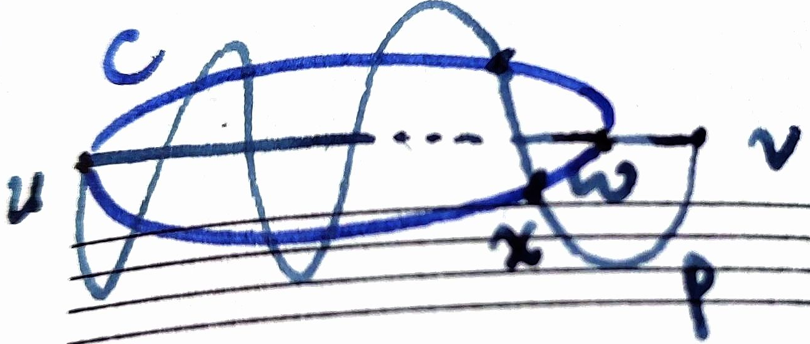

(2) $\Rightarrow$ (1)：由**定理11.2(2)**，若有割点$v$，则存在两点$u$和$w$之间没有回路，矛盾。所以 (1) 和 (2) 等价。

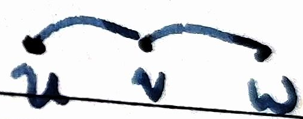

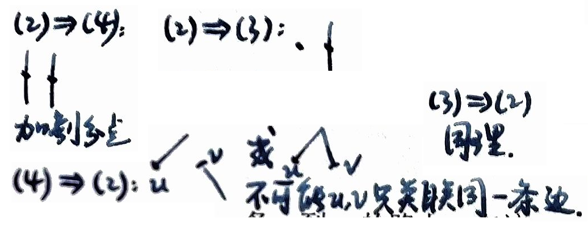

(2) $\Rightarrow$ (3)：设 $u$ 是任意一个顶点，$\{w, v\}$ 是任一边，由 (2) 可知，存在包含 $u$ 和 $v$ 的回路 $C$，若 $w \in C$，则即得证；若 $w \notin C$，由 (2)，$u, w$ 在同一回路上，那么 $v$ 一定不是割点。所以必存在不含 $v$ 的顶点 $v'$ 从 $w$ 到 $v'$ 的路 $p$，设 $x$ 是 $p$ 与 $C$ 相交的第一个顶点，则 $w$ 到 $x$ 沿 $C$ 经 $u$ 到 $v$，最后回到 $w$ 的回路即所要求的回路。

(3) $\Rightarrow$ (4)：与 (2) $\Rightarrow$ (3) 的证明类似。

(4) $\Rightarrow$ (1)：若 $G$ 中有割点 $v$，则存在顶点 $u$ 和 $w$，使 $v$ 在每一条 $u$ 到 $w$ 的路上，在该路上边 $\{u, v\}$ 与 $\{w, v\}$（$\{x, v\}$ 可能为 $v$）必定不在同一回路上，与 (4) 假设矛盾。
$\square$

### 双连通分支（略）

在 $G$ 的边集 $E$ 上建立如下关系：对于 $E$ 中任意两边 $e_1$ 和 $e_2$，$e_1$ 和 $e_2$ 有关系当且仅当 $e_1=e_2$ 或者 $e_1$ 和 $e_2$ 在同一回路上。容易验证这个关系是一个等价关系。它把边划分为等价类 $E_1, E_2, \dots, E_k$，使得两条不同的边在同一类中当且仅当这两条边在同一回路上。由 $E_i$ 导出的子图记为 $G_i$，$1 \leq i \leq k$。每个子图 $G_i$ 称为 $G$ 的一个块，或称双连通分支。所以对于顶点数 $n \geq 3$ 的块，它的任意两边在同一回路上，又由定理11.3可知，$n \geq 3$ 时，块等价于2-连通图，即等价于没有割点的连通图。而 $n=2$ 时，一条边也就是一个块。

---
## 11.2 网络最大流

运输问题是把商品从产地运往市场，运输的路线用有向图表示，用一个顶点表示产地，另一个顶点表示市场，其他顶点表示中转站，每条弧表示一段运输路线。在每段路线上给定运输能力的条件下，试设计一个运输方案，使得运输速率最大，即单位时间的运输量最大。

#### 定义11.7（网络）

设连通无自环的带权有向图中有两个不同顶点 $s$ 和 $t$，且在弧集 $E$ 上定义一个非负整数值函数 $c=\{c_{ij}\}$，称该有向图为**网络**，记为 $N(V, E, C)$。

称 $s$ 为**出发点**，$t$ 为**接收点**，除 $s$ 和 $t$ 外其他顶点称为**中间点**。

$C$ 称为**容量函数**，弧 $(i, j)$ 上的容量为 $c_{ij}$。

#### 定义11.8（流量）

在网络 $N(V, E, C)$ 的弧集 $E$ 上定义一个非负整数值函数 $f=\{f_{ij}\}$，称 $f$ 为网络 $N$ 上的流，$f_{ij}$ 称为弧 $(i, j)$ 上的**流量**。若无弧 $(i, j)$，则 $f_{ij}$ 定义为0。设流 $f$ 满足下列条件。

**(1) 容量限制条件**：对每一条弧 $(i, j)$，有 $f_{ij} \leq c_{ij}$。
**(2) 平衡条件**：除 $s$ 和 $t$ 外的每个中间点，有 $\sum_{i} f_{ki}=\sum_{j} f_{kj}$，对于 $s$ 和 $t$ 有
$$
\sum_{i \in t} f_{si} = \sum_{j \in t} f_{jt} = \begin{cases}
V_f, & k=s \\
-V_f, & k=t
\end{cases}
$$
则称 $f$ 为网络 $N$ 的一个**可行流**，$V_f$ 为流的值，或称 $f$ 的**流值**（流量）。

若 $N$ 中无可行流 $f'$，使 $V'_f > V_f$，即 $f$ 为使 $V_f$ 最大的可行流，则称 $f$ 为**最大流**。

图11.2是一个网络，每条弧上第一个数表示容量，第二个数表示流量。上述条件 (1) 表示在一段运输路线上运输量不超过它的容量，条件 (2) 表示除发点和收点外每个中转站的输入量等于输出量，而发点净出量等于收点净入量，它们的值均为 $V_f$。

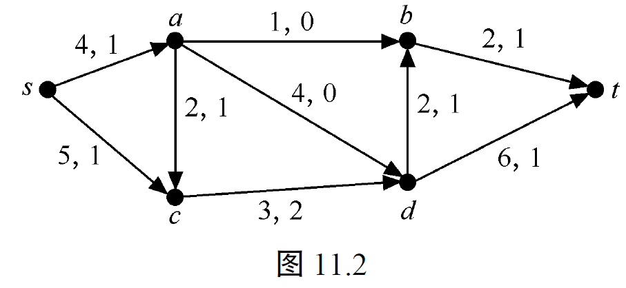

#### 补充相关定义和记号

若 $K\subseteq E$，记$f(K) = \sum_{a \ni K} f(a)$。
若$S \subseteq V$，定义割$(S, \overline{S}) = \{(i,j) \in E \mid i \in S, j \in \overline{S}\} \subseteq E$，记：
- $f^+(S) = f(S, \overline{S})$（从$S$流出的流量），
- $f^-(S) = f(\overline{S}, S)$（流入$S$的流量）。

特别地，当$S = \{v\}$时，$f^+(S) = f^+(v)$（$v$流出的流量之和），$f^-(S) = f^-(v)$（流入$v$的流量之和）。

容量约束条件和平衡条件对应的符号化表述：$\begin{cases} \forall a \in E, f(a) \le c(a) \\ \forall \text{中间点} v, f^+(v) = f^-(v) \end{cases}$.

对任意$S \subseteq V$，有$f^+(S) - f^-(S) = \sum_{v \in S} (f^+(v) - f^-(v))$。

当$f$是可行流时，$\sum_{v \in V} (f^+(v) - f^-(v)) = 0$，且$V_f = f^+(s) - f^-(s) = f^-(t) - f^+(t)$（可行流的流量）。

对任意 $S \subseteq V$，则
$$f^+(S) - f^-(S) = \sum_{v \in S} (f^+(v) - f^-(v)).$$
当 $v_1, v_2 \in S$，$(v_1, v_2) \in E$，则 $f((v_1, v_2))$ 在 $\sum_{v \in S} (f^+(v) - f^-(v))$ 中没有影响。

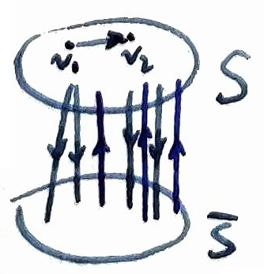

#### 流值的推导

设$f$为网络$N$的可行流，则由平衡条件有 $\sum_{k \in V} \left( \sum_{i \in V} f_{ki} - \sum_{i \in V} f_{ik} \right) = 0$，即
$$\left( \sum_{i \in V} f_{si} - \sum_{i \in V} f_{is} \right) +\sum_{k\text{为中间点}}\left( \sum_{i \in V} f_{ki} - \sum_{i \in V} f_{ik} \right) + \left( \sum_{i \in V} f_{ti} - \sum_{i \in V} f_{it} \right) = 0.$$
由平衡条件，中间点满足 $\sum_{i \in V} f_{vi} = \sum_{j \in V} f_{vj}$，因此：
$$
V_f = \sum_{i \in V} f_{si} - \sum_{j \in V} f_{sj} = \sum_{j \in V} f_{jt} - \sum_{i \in V} f_{it}
$$

#### 定义11.9（饱和的/未饱和的）

若 $f_{ij}=c_{ij}$，则称弧 $(i, j)$ 是**饱和的**；若 $f_{ij}<c_{ij}$，则称弧 $(i, j)$ 是**未饱和的**。

若$f(a) = 0$，称弧$a$是$f$**-零的**；若$f(a) > 0$，称弧$a$是$f$**-正的**。

上面所讨论的网络通常称为运输网络。用它来表示的物理模型是多种多样的。网络的弧可用来表示城市间铁路或公路，电信局之间的通信线路，网络的流则可表示在单位时间内，铁路上运输物资的量，公路上通过的车流量或其他信息量等。我们的目的是要找出它的最大流量的值。

为了解决求网络最大流的问题，先来讨论割的概念。

#### 定义11.10（割 cut）

设 $N(V, E, C)$ 是有一个发点 $s$ 和一个收点 $t$ 的网络。若 $V$ 划分为 $P$ 和 $\overline{P}$，使 $s \in P, t \in \overline{P}$，则从 $P$ 中的点到 $\overline{P}$ 中的点的所有弧称为分离 $s$ 和 $t$ 的**割**，记为 $(P, \overline{P})$，即
$$(P, \overline{P}) = \{(i,j) \in E \mid i \in P, j \in \overline{P}\}.$$
若从网络 $N$ 中删去任一个割，则从 $s$ 到 $t$ 之间不存在有向路。

割 $(P, \overline{P})$ 的容量是它的每条弧的容量之和，记为 $C(P, \overline{P})$，即：
$$
C(P, \overline{P}) = \sum_{i \in P, j \in \overline{P}} c_{ij}
$$
对于不同的割，它的容量显然不同。

若 $N$ 中不存在割 $(P', \overline{P'})$，使 $C(P', \overline{P'}) < C(P, \overline{P})$，则称 $(P, \overline{P})$ 为**最小割**。
使 $C(P, \overline{P})$（割的容量）最小的割一定存在，因为顶点集 $V$ 的划分方式有限。

网络中的流的值具有上界，如下面的定理所述。

#### ⭐定理11.4

**对给定的网络 $N=(V, E, C)$，设 $f$ 是任一个可行流，$(P, \overline{P})$ 是任一个割，则 $V_f \leq C(P, \overline{P})$。**

**证明：**
根据流的**平衡条件**可知：对于发点 $s \in P$ 有
$$
\sum_{i \in V} f_{si} - \sum_{j \in V} f_{js} = V_f \tag{1}
$$
对于 $P$ 中不是发点 $s$ 的中间点 $k$ 有
$$
\sum_{i \in V} f_{ki} - \sum_{j \in V} f_{jk} = 0 \tag{2}
$$
由(1)式加上对所有$k \in P$的(2)式，可得：
$$
\begin{align*}
\sum_{k \in P, i \in V} f_{ki} - \sum_{k \in P, j \in V} f_{jk} &= \sum_{k \in P, i \in P} f_{ki} + \sum_{k \in P, i \in \overline{P}} f_{ki} - \left[ \sum_{k \in P, j \in P} f_{jk} + \sum_{k \in P, j \in \overline{P}} f_{jk} \right] \\
&= V_f
\end{align*}
$$

由于 $\sum_{(k \in P, i \in P)} f_{ki} = \sum_{(k \in P, j \in P)} f_{jk}$，所以
$$
\sum_{(k \in P, i \in \overline{P})} f_{ij} - \sum_{(k \in P, j \in \overline{P})} f_{jk} = V_f \tag{3}
$$
因为 $\sum_{(k \in P, j \in \overline{P})} f_{jk}$ 是非负的，所以有
$$
V_f \leq \sum_{(k \in P, i \in \overline{P})} f_{ki} \leq \sum_{(k \in P, i \in \overline{P})} c_{ki} = C(P, \overline{P})
$$

##### 上述证明过程的简洁写法：
$$
f^+(P) - f^-(P) = \sum_{v \in P} (f^+(v) - f^-(v)) = f^+(s) - f^-(s) + 0 = V_f
$$
$$
V_f = f^+(P) - f^-(P) \le f^+(P) \le C(P, \overline{P}).
$$

$\square$

上述证明中，(3) 是一个有用的结论，它指出对于任何割 $(P, \overline{P})$，流的值等于从 $P$ 中的顶点到 $\overline{P}$ 中的顶点的所有弧上流量之和减去从 $\overline{P}$ 中的顶点到 $P$ 中的顶点的所有弧上流量之和。

### 补充

#### 💡**引理1**

**设$N(V,E,C,s,t)$为网络，$f$为$N$的可行流，$(P, \overline{P})$为$N$的一个割，则$V_f = c(P, \overline{P})$当且仅当：**
1. **$(P, \overline{P})$中每一条弧是$f$-饱和的，即$\forall a \in (P, \overline{P}), f(a) = c(a)$；**
2. **$(\overline{P}, P)$中每一条弧是$f$-零的，即$\forall a \in (\overline{P}, P), f(a) = 0$。**

由**定理11.4**推导过程中得到的不等式：
$$
V_f = f^+(P) - f^-(P) \le f^+(P) = \sum_{a \in (P, \overline{P})} f(a) \le \sum_{a \in (P, \overline{P})} c(a) = C(P, \overline{P})
$$
等号成立的充要条件是 $f^-(P) = \sum_{a \in (\overline{P}, P)} f(a) = 0$ 且 $\sum_{a \in (P, \overline{P})} f(a) = \sum_{a \in (P, \overline{P})} c(a)$。

#### 💡**引理2**

**若 $V_f = C(P, \overline{P})$，则 $f$ 一定为最大流，$(P, \overline{P})$ 一定为最小割。**

设 $f^*$ 为 $N$ 的最大流，$(P^*, \overline{P^*})$ 为 $N$ 的最小割，结合**定理11.4**有
$$V_f \le V_{f^*} \le c(P^*, \overline{P^*}) \le C(P, \overline{P})$$
因为 $V_f = C(P, \overline{P})$，所以 $V_f = V_{f^*}$，$C(P^*, \overline{P^*}) = C(P, \overline{P})$。

#### 💡网络流增广路相关定义与构造

设 $N(V,E,C,s,t)$ 为网络，$f$ 为 $N$ 上的任意可行流，$P$ 为 $N$ 上的一条路（可含反向弧）。

定义：
$$
l(P) = \min_{a \in P} l(a), \quad \text{其中} \quad l(a) =
\begin{cases}
c(a)-f(a), & \text{当} \, a \text{为} \, P \text{的同向弧} \\
f(a), & \text{当} \, a \text{为} \, P \text{的反向弧}
\end{cases}
$$
- 若 $l(P)=0$，称 $P$ 是 $f$**-饱和的**；
- 若 $l(P)>0$，称 $P$ 是 $f$**-非饱和的**；
- $f$-可增路（**增广路**）是指从 $s$ 到 $t$ 的一条 $f$-非饱和路。

设 $f$ 为 $N$ 的可行流，$P$ 为 $f$-增广路。

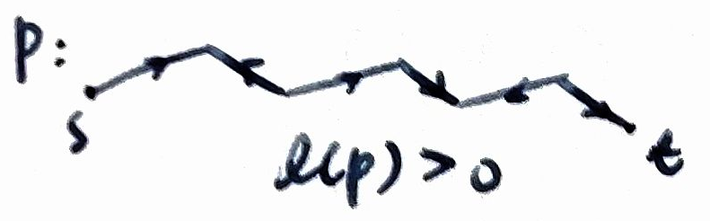

**定义 $N$ 上的新流 $\hat{f}: E \to \mathbb{R}^+$：**
$$
\hat{f}(a) =
\begin{cases}
f(a)+l(P), & \text{当} \, a \text{为} \, P \text{的同向弧} \\
f(a)-l(P), & \text{当} \, a \text{为} \, P \text{的反向弧} \\
f(a), & \text{当} \, a \notin P
\end{cases}
$$
**则 $\hat{f}$ 也是 $N$ 的可行流，且流值满足  $V_{\hat{f}} = V_f + l(P)$**。

#### 😮例 2018 && 2025：验证 $\hat{f}$ 是可行流并计算流值

① **非负性**：对 $\forall a \in E, \hat{f}(a) \ge 0$
当 $a$ 为 $P$ 的反向弧时，$\hat{f}(a) = f(a)-l(P)$。
因为 $l(P) = \min_{a \in P} l(a)$，反向弧的 $l(a)=f(a)$，故 $\hat{f}(a) \ge f(a)-l(a) = 0$。

② **容量约束条件**
- 当 $a$ 为 $P$ 的同向弧时：$\hat{f}(a) = f(a)+l(P) \le f(a)+l(a) = f(a)+(c(a)-f(a)) = c(a)$；
- 当 $a$ 为 $P$ 的反向弧时：$\hat{f}(a) = f(a)-l(P) \le f(a) \le c(a)$。

③ **平衡条件**
对任意中间点 $k$：
- 若 $k \notin P$，则 $k$ 的流入/流出无变化；
- 若 $k \in P$：
  1. 若 $k$ 关联的两条弧同向：$f(a)=f(b)$，仍有 $\hat{f}(a)=\hat{f}(b)$；
  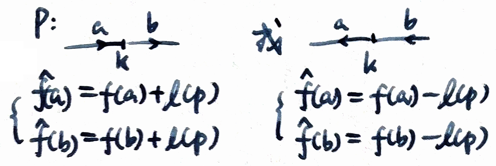
  2. 若 $k$ 关联的两条弧反向：$f(a)+f(b)=0$，仍有 $\hat{f}(a)+\hat{f}(b)=0$。
  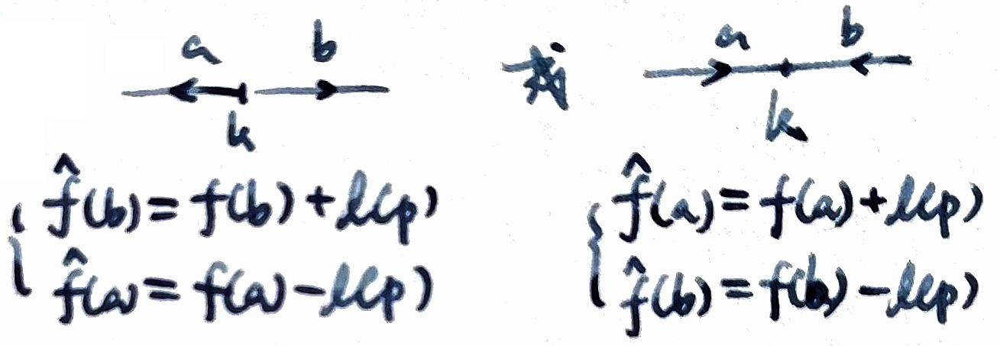

因此 $\hat{f}$ 满足平衡条件。

④ **流值**
设 $a$ 为增广路 $P$ **与 $s$ 相连**的弧：
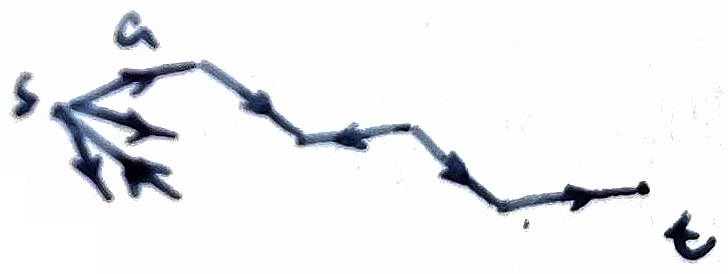
- 若 $a$ 是 $P$ 的同向弧：$\hat{f}(a)=f(a)+l(P)$，则 $V_{\hat{f}} = \hat{f}^+(s)-\hat{f}^-(s) = V_f + l(P)$；
- 若 $a$ 是 $P$ 的反向弧：$\hat{f}(a)=f(a)-l(P)$，则 $V_{\hat{f}} = \hat{f}^+(s)-\hat{f}^-(s) = V_f + l(P)$。

**结论：若 $f$ 有增广路，可通过上述修改得到流值更大的可行流 $\hat{f}$。**

### 最大流最小割定理

定理11.4告诉我们，网络 $N$ 中任何可行流 $f$ 流的值小于或等于任一割的容量，显然最大流的值小于或等于最小割的容量。如果能找到一个可行流 $f$ 和一个割 $(P, \overline{P})$，使得 $V_f = C(P, \overline{P})$，则 $f$ 是最大流。下面介绍 Ford-Fulkerson 于1956年给出的最大流最小割定理。

<!-- ？？？ -->

> 一句话总结：把网络想成一张“水管网”，最大流把网络“撑满”后，正好在某个最窄的瓶颈处被卡住，这个瓶颈就是最小割。

#### 定理11.5（略，最大流最小割定理）

**在任一网络 $N$ 中，从 $s$ 到 $t$ 的最大流的值等于分离 $s$ 和 $t$ 的最小割的容量。**

**证明：**
设 $f$ 是一个最大流，用以下方法定义 $P$。

令 $s \in P$。如果 $i \in P$ 且 $f_{ij}<c_{ij}$，则 $j \in P$；如果 $i \in P$ 且 $f_{ji}>0$，则 $j \in P$。任何不在 $P$ 中的顶点在 $\overline{P}$ 中。

> 从 $s$ 出发，凡是**还有剩余容量的正向边**，或**可以回退流量的反向边**，都可以继续“走”，所有能走到的点组成集合 $P$。

现在证明 $t \notin P$。假设 $t \in P$，则得到一条从 $s$ 到 $t$ 的路 $\mu$。定义路的方向是从 $s$ 到 $t$，如果 $\mu$ 上弧的方向与路的方向一致，称该弧为**向前弧**；如果 $\mu$ 上弧的方向与路的方向相反，称该弧为**向后弧**。由 $P$ 的定义可知，在向前弧 $(i, j)$ 上必有 $f_{ij}<c_{ij}$，在向后弧 $(j, i)$ 上必有 $f_{ji}>0$。路 $\mu$ 称为从 $s$ 到 $t$ 的**增广路**。

设 $\delta_1$ 是路 $\mu$ 上所有向前弧上 $c_{i,i+1}-f_{i,i+1}$ 的最小值，$\delta_2$ 是所有向后弧上 $f_{i+1,i}$ 的最小值，设 $\delta = \min(\delta_1, \delta_2)$，$\delta>0$，在向前弧上可增加流量 $\delta$，在向后弧上可减少流量 $\delta$，使得流 $f$ 修改后得到的流 $f'$ 仍满足流的条件，并且流的值增加 $\delta$，这与 $f$ 是最大流矛盾。因此 $t \in P$，于是得到分离 $s$ 和 $t$ 的割 $(P, \overline{P})$。

由 $(P, \overline{P})$ 的构造可知，如果 $k \in P, i, j \in \overline{P}$，有 $f_{kj}=c_{kj}$ 以及 $f_{jk}=0$；又对任一割 $(P, \overline{P})$，定理11.4中式 (3) 成立，即 $\sum_{(i \in P, j \in \overline{P})} f_{ij} - \sum_{(i \in \overline{P}, j \in P)} f_{ji} = V_f$。所以，对上述构造的割 $(P, \overline{P})$，有
$$
V_f = \sum_{(i \in P, j \in \overline{P})} c_{ij} = C(P, \overline{P})
$$
因为 $f$ 是最大流，由定理11.4的结论可知，$(P, \overline{P})$ 是最小割，并且最小割的容量等于最大流的值。
$\square$

从定理11.5的证明可以知道寻求最大流的方法，就是寻找从 $s$ 到 $t$ 的关于 $f$ 的增广路。
容易得到下面的定理。

#### 定理11.6

😮 2018

**可行流 $f$ 是最大流当且仅当不存在从 $s$ 到 $t$ 的关于 $f$ 的增广路。**

$\Rightarrow$ 显然。

**证明（$\Leftarrow$）：**

设网络 $N$ 中关于可行流 $f$ 不存在从 $s$ 到 $t$ 的增广路。定义
$$
K=\left\{v\in V \mid \text{从 } s \text{ 到 } v \text{ 存在一条关于 } f \text{ 的非饱和路}\right\}.
$$
显然 $s\in K$。由于假设不存在增广路，从而 $t\notin K$，于是 $(K,\overline K)$ 构成一个分离 $s$ 与 $t$ 的割。

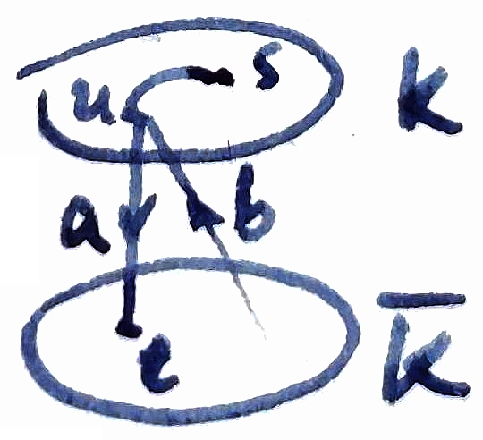

下面证明该割的容量等于流 $f$ 的值。

先证明对任一弧 $a=(u,v)$，若 $u\in K,\ v\in\overline K$，则必有
$$
f(a)=c(a).
$$
若不然，设 $f(a)<c(a)$。因为 $u\in K$，存在一条从 $s$ 到 $u$ 的关于 $f$ 的非饱和路，再接上弧 $a$，即可得到一条从 $s$ 到 $v$ 的非饱和路，这说明 $v\in K$，与 $v\in\overline K$ 矛盾。故必有 $f(a)=c(a)$。

再证明对任一弧 $b=(v,u)$，若 $v\in\overline K,\ u\in K$，则
$$
f(b)=0.
$$
否则若 $f(b)>0$，则该弧在反方向上仍有正的可回退流量。由于 $u\in K$，存在一条从 $s$ 到 $u$ 的非饱和路，再沿弧 $b$ 的反向即可到达 $v$，从而得到一条从 $s$ 到 $v$ 的非饱和路，这意味着 $v\in K$，与 $v\in\overline K$ 矛盾。因此必有 $f(b)=0$。

由此可知，所有从 $K$ 指向 $\overline K$ 的弧均被完全饱和，而所有从 $\overline K$ 指向 $K$ 的弧上流量为零。

根据流割关系式，
$$
V_f
= \sum_{\substack{u\in K, \\ v\in\overline K}} f(u,v)
- \sum_{\substack{u\in\overline K, \\ v\in K}} f(u,v),
$$
结合上述结论，得
$$
V_f=\sum_{\substack{u\in K, \\ v\in\overline K}} c(u,v)
= c(K,\overline K).
$$
因此，存在一个割 $(K,\overline K)$，其容量等于流 $f$ 的值。由最大流不超过任意割容量知，$f$ 必为最大流。
 □

> **没有增广路 ⇔ 残量网络中从 $s$ 走不到 $t$ ⇔ 可达点与不可达点之间形成一个被完全饱和的割 ⇔ 当前流已达到最大值。**

### 最大流的标号方法

标号方法分为两个过程：标号过程和增广过程。通过标号过程找一条增广路，再由增广过程确定网络流量的增量，并且去掉标号。

1. **标号过程**
   (1) 给定初始流，不妨设初始流的值为0；给发点标号 $(-, \Delta s)$，其中 $\Delta s=+\infty$。
   (2) 选择一个已标号的顶点 $p$，（广度优先）对于 $p$ 的所有未标号的相邻点 $q$，按下列规则标号：
      (a) 如果弧 $(p, q)$，$q$ 未标号，当 $c_{pq}>f_{pq}$ 时，则点 $q$ 标号 $(p^+, \Delta q)$，其中 $\Delta q=\min(\Delta p, c_{pq}-f_{pq})$；当 $c_{pq}=f_{pq}$ 时，则 $q$ 不标号。
      (b) 如果弧 $(q, p)$，$q$ 未标号，当 $f_{qp}>0$ 时，则点 $q$ 标号 $(p^-, \Delta q)$，其中 $\Delta q=\min(\Delta p, f_{qp})$；当 $f_{qp}=0$ 时，则 $q$ 不标号。
   (3) 重复第 (2) 步直到收点 $t$ 被标号为止，或不再有顶点可以标号为止。
      如果 $t$ 点给出标号，说明存在一条增广路，则转向增广过程。
      如果 $t$ 点未被标号，说明不存在增广路，则算法结束，所得的流为最大流。

2. **增广过程**
   如果在收点 $t$ 标号 $(q^+, \Delta t)$，已知其中 $\Delta t=\min(\Delta v, c_{vj}-f_{vj})$，则存在一条从 $s$ 到 $t$ 的增广路 $\mu$。
   (1) 修改流 $f$，使得沿增广路 $\mu$ 在向前弧上流量增加 $\Delta t$，在向后弧上流量减少 $\Delta t$，于是得到新的流 $f'$，且有 $V'_f=V_f+\Delta t$。然后去掉顶点上标号。
   (2) 对流 $f'$ 重新进行标号过程。
   如果在收点 $t$ 没有标号，标号算法结束，用 $P$ 表示所有已标号的顶点集，$\overline{P}$ 表示所有未标号的顶点集，于是得到的 $(P, \overline{P})$ 便是最小割，它的容量等于最大流的值。

从上述算法可见，我们不仅得到最大流，而且同时得到了最小割，要想提高总流量，只有增大最小割中弧的容量才行。

上述算法还要注意两点。
(1) 初始流量可以不为0。
(2) 每次标号时，可能有多种情况，任选一种即可。

#### 例11.2

<!-- 疑似答案有误？？？ -->

考虑图11.3 (a) 中的网络，(b) 到 (g) 表示求最大流的标号过程和增广过程。标号算法结束得到最大流的值为7，最小割 $(P, \overline{P})$，其中 $P=\{s, a, c, d\}$，$\overline{P}=\{b, t\}$，$C(P, \overline{P})=7$。

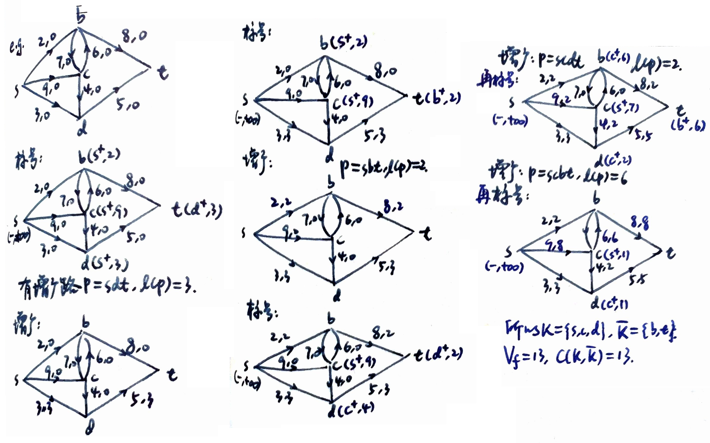

算法还构造性地证明了网络流理论中的一个重要定理。

#### 定理11.7（整数流定理）

任一网络中，若所有弧的容量是整数，则必存在整数最大流。

---

## 11.3 二分图的匹配

我们将在本章节介绍无向图中特殊的关系——匹配，然后将匹配和二分图两者结合起来，介绍二分图的最大匹配和最佳匹配的有效算法。

### 匹配的基本概念

我们来看一个实例：飞行大队有若干个来自各国的飞行员，专门驾驶一种型号的飞机，这种飞机每架要有两个飞行员驾驶。由于种种原因，例如语言不通或训练上的问题，有些飞行员不能在同一架飞机上飞行，问如何搭配飞行员，才能使出航的飞机最多。为简单起见，假设有10个飞行员，图11.4中的 $v_1, v_2, \dots, v_{10}$ 就代表这10个飞行员。

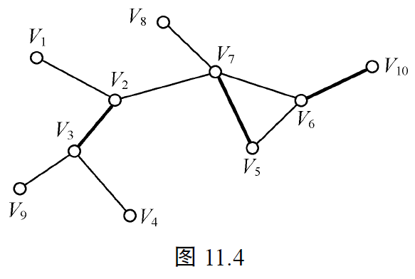

如果两个人可以同机飞行，就在代表他们两个之间连一条线；两个人不能同机飞行就连。例如：$v_1$ 和 $v_2$ 可以同机飞行，$v_1$ 和 $v_3$ 就不行。画了这个图后，就可以研究搭配飞行员的问题了。上图中画的三条粗线 $\{v_1, v_3\}$、$\{v_2, v_5\}$ 和 $\{v_6, v_{10}\}$ 就代表了一种搭配方案。由于一个飞行员不能同时派往两架飞机，因此任何两条粗线不能有公共的端点，我们把一个图中没有公共端点的一组边叫做一个“匹配”。这样，上面问题就成为：如何找一个包含最多条粗线的匹配？这个问题叫做图的最大匹配问题。请大家试试看，能不能从上图中找出一个包含四条边的匹配，再试试看能不能找到包含五条边的匹配。

#### 定义11.11（匹配 match）

设 $G (V, E)$，$M \subseteq E$，如果 $M$ 中的任意两条边都没有公共点，则称 $M$ 是 $G$ 的一个**匹配**（对集）。

设 $M$ 为 $G$ 的一个匹配，$v \in V$。若 $v$ 为匹配 $M$ 中某一条边的端点，称 $v$ 为 $M$ 的**饱和点**。

若 $M$ 饱和了 $V$ 的每个顶点，则称 $M$ 为 $G$ 的一个**完美匹配**。$\left| \frac{n}{2} \right| \geq |M|.$

若不存在 $G$ 的匹配 $M'$，使 $|M'| > |M|$，则称 $M$ 为**最大匹配**。

例如图11.5 (a) (b) 中的粗线组成的边集合 $M_1$ 与 $M_2$ 分别是图 $G_1$ 与 $G_2$ 的匹配。

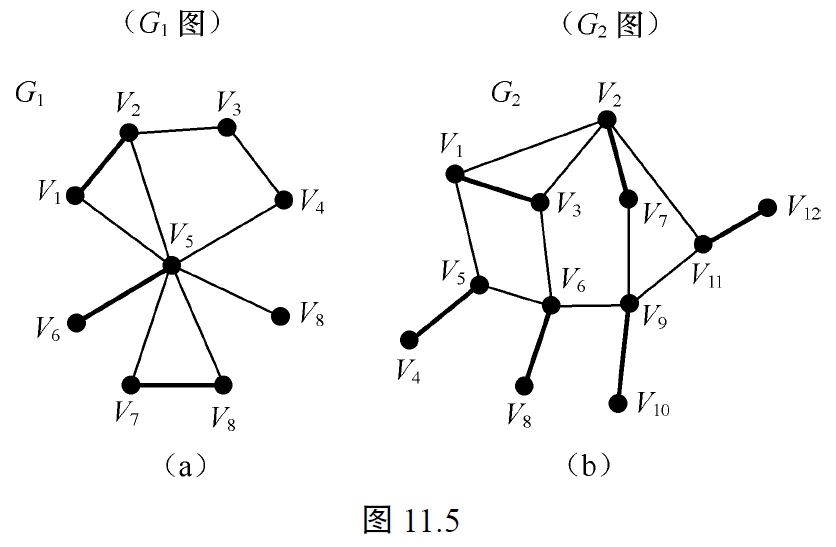

上述的飞行员匹配问题的数学模型是从给定的图 $G$ 的所有匹配中，找出包含边数最多的匹配。这种匹配即所谓的最大匹配问题。

根据图的类型不同，匹配问题可分为两种：任意图的最大匹配和二分图的最大匹配。

在上述的飞行员匹配问题中，如果把飞行员划分成两个部分：正驾驶员和副驾驶员。这样问题转换为如何搭配正副驾驶员才能使出航飞机最多的问题，这一问题也可以归结为一个二分图上的最大匹配问题。

### 判别二分图（略）

二分图的邻接矩阵一般可以具有如下形式
$$
A = \substack{\substack{X\\Y}\begin{pmatrix}
0 & A_{12} \\
A_{21} & 0
\end{pmatrix}\\\quad X\quad Y}
$$

对于较简单的图，可以直观地判断其是否为二分图。然而，对于一个较复杂的图来说，根据定义或用图示方法、相邻矩阵判定其是否为二分图，既不方便亦不可靠，因此有必要制定一个行之有效的判定规则。

> **定理8.13（非二分图的判断方法）**：$G$是二分图当且仅当$G$中没有奇回路。

#### 定理11.8

**图 $G$ 是一个二分图当且仅当 $G$ 的每一个回路的长度均为偶数（如果 $G$ 无回路，相当于任一回路的长度为0，0视为偶数）。**

**证明：**
**必要性：** 设 $G$ 是二分图，并没 $G$ 中任意一个长度为 $m$ 的回路 $C=v_0, v_1, v_2, \dots, v_{m-1}, v_0$。因为 $G$ 是二分图，因此可将 $V$ 分为两个互补顶点子集 $V_1$ 和 $V_2$。因 $v_0$ 和 $v_1$ 是邻接的，设 $v_0 \in V_1, v_1 \in V_2$，必有同理可得
$$
v_0, v_2, \dots, v_{m-2} \in V_1, \quad v_1, v_3, \dots, v_{m-1} \in V_2
$$
从顶点的下标可以看出，下标为偶数的顶点属于 $V_1$，而下标为奇数的顶点属于 $V_2$，今 $v_{m-1}$ 属于 $V_2$，故 $m-1$ 为奇数，即 $m$ 为偶数。所以 $G$ 的每一个回路的长度均为偶数。

**充分性：** 设 $G$ 的任一回路的长度为偶数。分两种情况进行讨论。
① $G$ 是连通集。
将图的顶点集合 $V$ 按下列定义分为两个子集：
$$
V_1 = \{v_j | v_j \text{ 与某一指定结点 } v_0 \text{ 的距离为偶数}\}, \quad V_2 = V - V_1
$$
下面证明 $V_1$ 和 $V_2$ 是 $V$ 的两个互补顶点子集。

任取图 $G$ 的一条边 $e=(v_i, v_j)$，如果 $e$ 的两个端点 $v_i$ 和 $v_j$ 都在 $V_1$ 中，如下图所示的那样得到一个回路 $C=v_0, \dots, v_i, v_j, \dots, v_0$。

因 $v_i, v_j \in V_1$，按定义 $v_i$ 和 $v_j$ 到 $v_0$ 的距离都是偶数，再加上边 $e$，故回路 $C$ 的长度为奇数，与题设矛盾，说明 $v_i$ 和 $v_j$ 不可能都处于 $V_1$ 中。

如果任意边 $e$ 的两个端点 $v_i$ 和 $v_j$ 都在 $V_2$ 中，则由定义 $v_i$ 和 $v_j$ 到 $v_0$ 的距离都是奇数，再加上边 $e$，故回路 $C$ 的长度仍为奇数，也与题设矛盾，说明 $v_i$ 和 $v_j$ 也不可能都处于 $V_2$ 中。因此只有唯一一种可能，即 $e$ 的两个端点，一个在 $V_1$ 中而另一个在 $V_2$ 中，由于 $e$ 是任意一条边，根据二分图的定义，$G$ 是二分图。

② $G$ 是非连通图。
此时可分片讨论，对 $G$ 的每个连通分量应用上面的证明，然后合并起来，即可得证。
$\square$

### 二分图的最大匹配

如果已知某图是二分图，那么如何计算边数最多的匹配方案，即这个二分图的最大匹配呢？

最简单的方法是系统地列举出二分图的所有匹配，然后从中选出边数最多者。由于这种方法所需要的时间高达 $2^{|E|}$，因此不得不摒弃。下面我们介绍一种利用增广路径求二分图最大匹配的有效算法。

#### 定义11.12

设 $M$ 是二分图 $G$ 的一个匹配，我们将 $M$ 中的边所关联的顶点称为**饱和点**（盖点），其余顶点称为**非饱和点**（未盖点）。若一条路上属于 $M$ 的边和不属于 $M$ 的边交替出现，则称该路为关于 $M$ 的**交错路**。若路 $p$ 是一条起点和结束点都是未盖点的交错路，则称 $p$ 为关于 $M$ 的**增广路**。

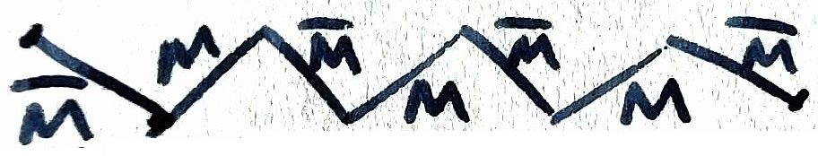

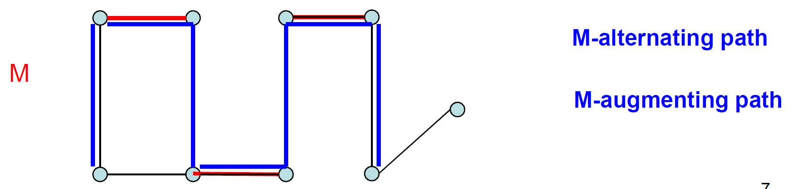

例如，从图11.7 (a) 中可找到一条增广路 $p=t_5c_1t_2c_5$，其中实线表示匹配 $M$ 中的边。由增广路 $p$ 的定义可知。

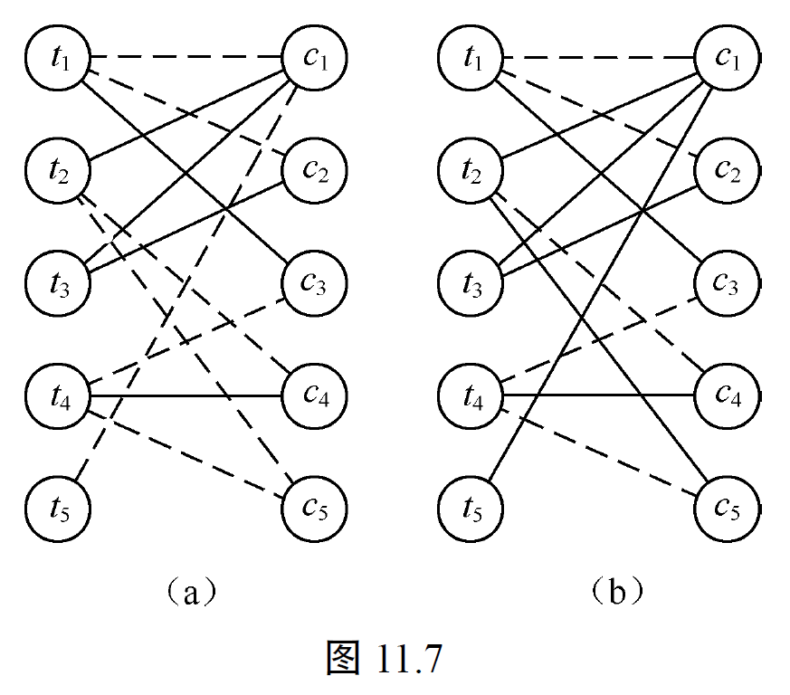

#### **性质 (1)** 

一条关于 $M$ 的增广路的长度必为奇数，且路上的第一条边和最后一条边都不属于 $M$。例如图11.7 (a) 的增广路 $p$ 的长度为3，且 $\{t_5, c_1\}$ 和 $\{t_2, c_5\}$ 非匹配边。

#### **性质 (2)** 

对于一条关于 $M$ 的增广路 $p$，将 $M$ 中属于 $p$ 的边删去，将 $p$ 中不属于 $M$ 的边添加到 $M$ 中，所得到的边集合记为 $M \oplus P$，则 $M \oplus P$ 比 $M$ **增加一条匹配边**。

例如，对图11.7 (a) 的增广路 $p$ 进行匹配边与非匹配边的对换，得到图11.7 (b)，原 $p$ 路径上的一条匹配边 $\{c_1, t_2\}$ 变为 $\{t_5, c_1\}$ 和 $\{t_2, c_5\}$ 两条匹配边，$p$ 路径外的匹配边不变，因此 $|M|$ 由原来的4条增加为5条。

$$M' = M - \{e_2, e_4, \cdots, e_{2m}\} + \{e_1, e_3, \cdots, e_{2m+1}\}$$

性质 (1) 和 (2) 是显而易见的。

#### **性质 (3)** 

$M$ 为 $G$ 的一个最大匹配当且仅当 $G$ 中不存在关于 $M$ 的增广路。例如图11.7 (b) 不存在关于 $M$ 的增广路径，$|M|=5$，是一个完全匹配。

$\Rightarrow:$ 当存在一条关于 $M$ 的增广路时，由性质 (2) 可知，$M$ 不是最大匹配。

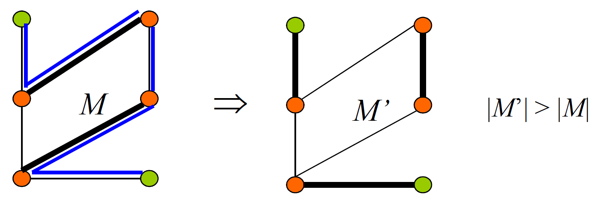

$\Leftarrow:$ 反之，若不存在关于 $M$ 的增广路时，则 $M$ 是最大匹配。我们可以用**反证法**证明：如果 $M$ 不是最大匹配，则一定存在一个匹配 $M_1$，$|M_1| > |M|$。作对称差 $$M_2=M \oplus M_1 = M\cup M_1 - M\cap M_1 = (M-M_1) \cup (M_1-M).$$

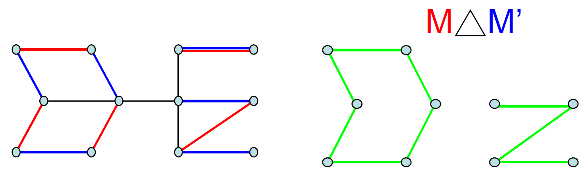

① $M_2$ 的各连通分支必定是关于 $M$ 和 $M_1$ 的**交错路**。因为 $M_2$ 是由 $M$ 和 $M_1$ 中非共同部分组成的，而 $M$ 和 $M_1$ 都是匹配边，各自边之间没有共同顶点，所以任何连通的道路都必然是交替出现 $M$ 和 $M_1$ 的边。（$M_2$ 包含路径和偶回路）

② 由于 $|M_1| > |M|$，所以在所有的交错轨中必有这样一条交错路：属于 $M_1$ 的边多于 $M$ 的边，这条路必然是以 $M_1$ 的边开始、且以 $M_1$ 的边结束的交错路，即为关于 $M$ 的**增广路**，这与 $M$ 是最大匹配的假设相矛盾。由此证明了 $M$ 是最大匹配的充分条件是不存在关于 $M$ 的增广路。

性质 (3) 的证明过程为我们提供了找最大匹配的基本思想。

初始时，置 $M$ 为空集。然后反复在二分图中找一条关于 $M$ 的增广路 $P$，并用 $M \oplus P$ 代替 $M$，直至二分图中不存在关于 $M$ 的增广路，最后得到的匹配 $M$ 就是 $G$ 的一个最大匹配。

Edmonds 于1965年提出了一种利用增广路求二分图最大匹配的有效算法——匈牙利算法。该算法提出的问题背景是任务安排：设有 $m$ 个人、$n$ 项任务，能不能适当地安排，使得每个人都有工作做？显然，可以将 $n$ 和 $m$ 作为两个互补的顶点集。当 $n < m$ 时，答案是否定的，即使 $n \geq m$ 也不一定。但经验告诉我们，当 $m$ 个人适应工作的能力愈强（即与 $m$ 个点邻接的点集 $p[m]$ 愈大）时，愈容易做到这一点。Hall 定理则定量地回答了这个问题。

#### ⭐定理 11.9（Hall 条件）

**设 $G=(X,Y)$ 是一个二分图。**
**则 $G$ 存在一个饱和 $X$ 的匹配，当且仅当对任意 $S\subseteq X$，都有**
$$
|N(S)|\ge |S|.
$$
其中 $N(S)$ 表示 $S$ 在 $Y$ 中的邻接点集合。
##### （$\Rightarrow$）

若存在 $S\subseteq X$ 使得 $|N(S)|<|S|$，
则任何匹配至多只能把 $S$ 中的 $|N(S)|$ 个顶点匹配到 $Y$ 中不同的顶点，
因此不可能有匹配饱和 $S$，从而不可能饱和 $X$。

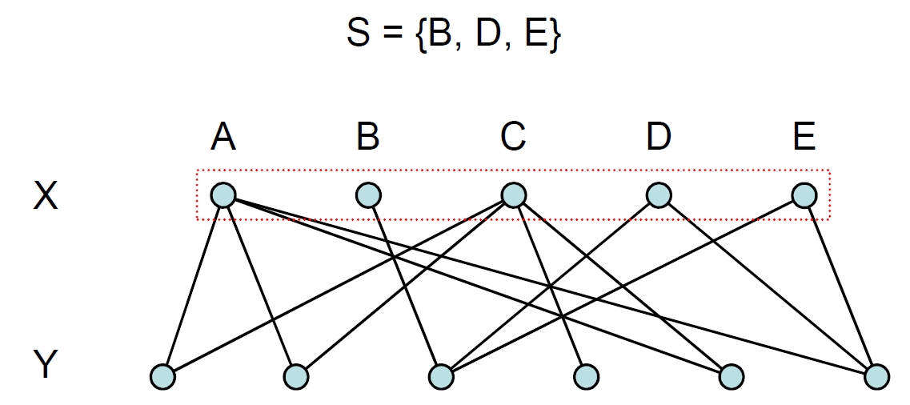

##### （$\Leftarrow$）

1. 设 $M$ 是 $G$ 的一个最大匹配，我们需证明在条件   $$
   |N(S)|\ge |S|\quad(\forall S\subseteq X)
   $$   下，不存在 $X$ 中未被 $M$ 饱和的顶点。
2. 假设存在顶点 $v\in X$，在匹配 $M$ 中未被饱和。
3. 以 $v$ 为起点，考虑所有**关于 $M$ 的交替路**的集合。
	记：
	- $X^*$：通过交替路从 $v$ 能到达的 $X$ 中顶点集合；    
	- $Y^*$：通过交替路从 $v$ 能到达的 $Y$ 中顶点集合。

4. 顶点 $v$ 至少有一个邻点 $v^*\in Y$。
5. 必有 $v^*\in Y^*$。否则，边 $vv^*$ 不是匹配边且未被饱和，可加入匹配 $M$，得到更大的匹配，与 $M$ 为最大匹配矛盾。

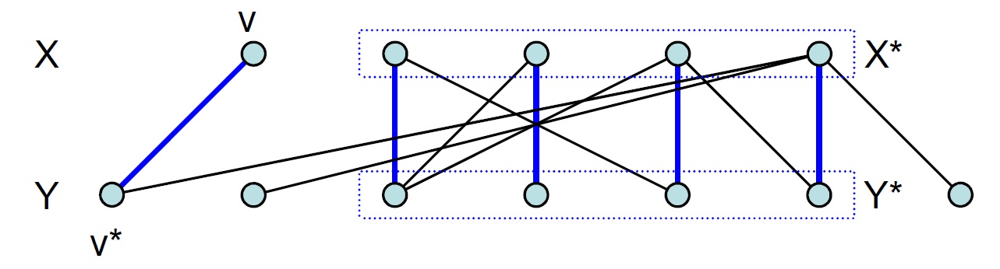

6. 由交替路的定义知：
$Y^*$ 中的每个顶点（除可能的起点对应情况外）都被 $M$ 饱和；
且每个 $y \in Y^*$ 都与唯一一个 $X^* \setminus \{v\}$ 中的顶点通过匹配边相连。

因此有
$$
|Y^*| = |X^*| - 1.
$$
又由于所有从 $X^*$ 出发的非匹配边都只能到达 $Y^*$，故
$$
N(X^*) = Y^*.
$$
从而
$$
|N(X^*)| = |Y^*| = |X^*| - 1 < |X^*|.
$$
这与 Hall 条件
$$
|N(S)| \geq |S| \quad (\forall S \subseteq X)
$$
在取 $S = X^*$ 时矛盾。因此假设不成立，$X$ 中不存在未被 $M$ 饱和的顶点。

故存在一个匹配饱和 $X$。

另一写法：
#### 定理11.9（Hall定理）

**对于二分图 $G(V_1, V_2)$，存在一匹配 $M$，使得 $V_1$ 的所有顶点关于 $M$ 饱和的充要条件是：对 $V_1$ 的任一子集 $A$，和 $A$ 邻接的点集为 $p[A]$ 恒有：**
$$
|p[A]| \ge |A|
$$

**证明：**
$\Rightarrow$ **必要性：** 存在一个匹配 $M$，使得 $V_1$ 关于 $M$ 饱和。$|p[A]| \ge |A|$ 的直观意义是显然的。例如安排工作，要使得每个人至少有一项彼此不同的工作可做，不论多少人，他们能做的工作数目必须不少于人数。

$\Leftarrow$ **充分性：** 若对于任何 $A \subseteq V_1$ 恒有 $|p[A]| \ge |A|$，则可以按下列方法作出匹配 $M$，使得 $V_1$ 关于 $M$ 饱和。

先作任意一初始匹配，若已使 $V_1$ 关于 $M$ 饱和，则定理已证。如若不然，则 $V_1$ 中至少有一点 $x_0$ 为未盖点，则从 $x_0$ 出发，检查从 $x_0$ 出发，终点在 $V_2$ 的交错路。可能有下列两种情况发生。

(1) 没有任何一条交错路可以到达 $V_2$ 的未盖点。这时由于从 $x_0$ 点开始的一切交错路终点还是在 $V_1$，故存在 $V_1$ 的子集 $A$：$|p[A]| < |A|$。这与假设相矛盾，所以这种情形是不可能的。

(2) 存在一条从 $x_0$ 出发的交错轨，终点为 $V_2$ 集合中的未盖点，则这条道路便是可增广路。因而可以改变一下匹配使 $x_0$ 点为盖点。

重复以上的过程，就可以找出匹配 $M$，使得 $V_1$ 关于 $M$ 饱和。定理的充分性得到证明。
$\square$

#### 😮例 2022

**证明或证伪：设 $k$ 为正整数。任何 $k$-正则的二分图一定存在完美匹配。**

**证明（利用 Hall 定理）**

设 $G=(X,Y,E)$ 是一个 $k$-正则二分图，其中 $k\ge1$。
“$k$-正则”指对任意顶点 $v\in V(G)$，都有
$$
\deg(v)=k.
$$

##### 第一步：说明 $k$-正则二分图 $|X|=|Y|$

由于图是二分的，所有边都连接 $X$ 与 $Y$。
从 $X$ 侧数边数：
$$
|E|=\sum_{x\in X}\deg(x)=k|X|.
$$
从 $Y$ 侧数边数：
$$
|E|=\sum_{y\in Y}\deg(y)=k|Y|.
$$
因此
$$
k|X|=k|Y| \implies |X|=|Y|.
$$

##### 第二步：验证 Hall 条件

取任意子集 $S\subseteq X$，设其邻集为 $N(S)\subseteq Y$。

* 从 $S$ 发出的边数为 $k|S|$（因为每个 $x\in S$ 的度都是 $k$）。
* 所有这些边都指向 $N(S)$，而每个 $y\in N(S)$ 的度最多为 $k$。

因此
$$
k|S| \le k|N(S)| \implies |N(S)| \ge |S|.
$$

Hall 条件对所有 $S\subseteq X$ 都成立。

##### 第三步：应用 Hall 定理

由 Hall 定理，二分图 $G$ 存在一个匹配饱和 $X$。
又由于 $|X|=|Y|$，该匹配同时饱和 $Y$，因此是一个**完美匹配**。

**结论**：任何 $k$-正则二分图（$k\ge1$）都存在完美匹配。

（以下略）

匈牙利算法就是根据充分性证明中的思想提出来的。具体实现方法是构造一棵树。

取 $G$ 的一个未盖点作为树根，它位于树的第1层。设已经构造好了树的第 $i$ 层，现在要构造第 $i+1$ 层。当 $i$ 为奇数时，将那些关联于第 $i-1$ 层中一个顶点且不属于 $M$ 的边，连同该边关联的另一个顶点一起添加到树上。当 $i$ 为偶数时，则添加那些关联于第 $i-1$ 层的一个顶点且属于 $M$ 的边，连同该边关联的另一个顶点。如果在上述构造树的过程中，发现一个未盖点被作为树的奇数层顶点，则这棵树上从树根到顶点 $v$ 的路径就是一条关于 $M$ 的增广路；如果在构造树的过程中，既没有找到增广路，又无法按要求往树上添加新的边和顶点，则可以在余下的顶点中再取一个未匹配顶点作树根，构造一棵新的树。这个过程一直进行下去，如果最终仍未得到任何增广路，就说明 $M$ 已经是一个最大匹配了。

例如，图11.7 (a) 中取未盖点 $t_5$ 作为树根，顶点 $c_1$ 是树上第一层中唯一的顶点，未匹配边 $(t_5, c_1)$ 是树上的一条边。顶点 $t_2$ 处于树的第二层，边 $(c_1, t_2)$ 属于 $M$ 且关联于 $c_1$，也是树上的又一条边。顶点 $c_5$ 是未盖点可以添加到第三层。至此我们找到了一条增广路 $p=t_5c_1t_2c_5$。由此增广路得到 $G$ 的一个更大的匹配 $M \oplus p$，如图 (b) 所示。此时，$M \oplus p$ 是一个完全匹配，从而也是 $G$ 的一个最大匹配。

---

## 11.4 独立集、覆盖

Independent Set, Cover.

设无自环图 $G=(V, E)$，考虑如下的 $V$ 的子集：

#### 定义11.13（独立集）

若 $V$ 的一个子集中任意两个顶点在 $G$ 中都不相邻，则称 $I$ 是 $G$ 的一个（点）**独立集**。
若 $G$ 中不含有满足 $|I'| > |I|$ 的独立集 $I'$，则称为 $G$ 的**最大独立集**。它的顶点数称为 $G$ 的**独立数**，记为 **$\beta_0(G)$**。

#### 定义11.14（点覆盖）

若 $V$ 的一个子集 $C$ 使得 $G$ 的每一条边至少有一个端点在 $C$ 中，则称 $C$ 是 $G$ 的一个**点覆盖**。
若 $G$ 中不含有满足 $|C'| < |C|$ 的点覆盖 $C'$，则称 $C$ 是 $G$ 的**最小点覆盖**。它的顶点数称为 $G$ 的**点覆盖数**，记为 **$\alpha_0(G)$**。

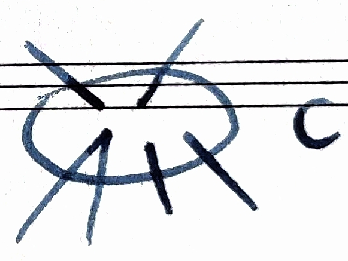

一个图的点覆盖数与独立点数之间有着密切而简单的联系。

#### ⭐定理11.10

**$V$ 的子集 $I$ 是 $G$ 的独立集当且仅当 $\overline{I} = V-I$ 是 $G$ 的点覆盖。**

**证明：**
由独立集的定义，$I$ 是 $G$ 的独立集当且仅当 $G$ 中每一条边至少有一个端点在 $V-I$ 中，即 $V-I$ 是 $G$ 的点覆盖。
$\square$

**$I$ 是 $G$ 的最大独立集 $\iff \overline{I} = V - I$ 是 $G$ 的最小点覆盖。**
$\Rightarrow$：若存在点覆盖 $C$，使得 $|C| < |\overline{I}|$，则 $|I| > |V - C|$，矛盾。

#### ⭐推论11.1

**对于 $n$ 个顶点的图 $G$，有 $\alpha_0(G)+\beta_0(G)=n$。**

**证明：**
设 $I$ 是 $G$ 的最大独立集，$C$ 是 $G$ 的最小点覆盖，则 $V-C$ 是 $G$ 的独立集，$V-I$ 是 $G$ 的点覆盖，所以 $n-\beta_0=|V-I| \ge \alpha_0$，$n-\alpha_0=|V-C| \le \beta_0$，因此 $\alpha_0+\beta_0=n$。
$\square$

**边独立集（匹配）**：$M$ 中的边互不相邻。**最大边独立集**：最大匹配。
设图 $G=(V, E)$，上一节讨论了 $E$ 的子集即匹配，称最大匹配的边数为 $G$ 的**边独立数**，记为 $\beta_1(G)$。

#### 定义11.15（边覆盖）

若 $E$ 的一个子集 $L$ 使得 $G$ 的每一个顶点至少与 $L$ 中一条边关联，称 $L$ 是 $G$ 的一个**边覆盖**。
若 $G$ 中不含有满足 $|L'| < |L|$ 的点覆盖 $L'$，则称 $L$ 是 $G$ 的**最小边覆盖**。
它的边数称为 $G$ 的**边覆盖数**，记为 $\alpha_1(G)$。

显然 $G$ 有边覆盖的充要条件是 $\delta>0$（没有孤立点）。

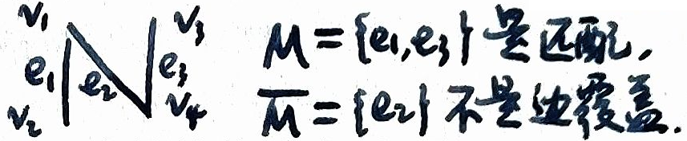

$\alpha_1(G)$ 和 $\beta_1(G)$ 也有类似于 $\alpha_0(G)$ 和 $\beta_0(G)$ 的一个简单关系式。但是匹配和边覆盖之间并没有定理11.10的互补关系。

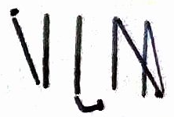

#### ⭐定理11.11

😮 2022B

**若图 $G$ 没有孤立顶点，则**
$$
\alpha'(G)+\beta'(G)=n(G),
$$
**其中 $\alpha'(G)$ 为最大匹配数（边独立数），$\beta'(G)$ 为最小边覆盖数，$n(G)$ 为顶点数。**

**第一步：证明 $\beta'(G)\le n(G)-\alpha'(G)$**

(1) 设 $M$ 是图 $G$ 的一个最大匹配，$|M|=\alpha'(G)$。

(2) 对于匹配 $M$ 中未被饱和的每一个顶点，由于 $G$ 没有孤立顶点，该顶点必与某条边相邻。向 $M$ 中为每个未饱和顶点加入一条与之关联的边，即可得到**一个边覆盖**。

由于匹配中的每条边覆盖两个顶点，而每个未饱和顶点需额外加入一条边，因此该边覆盖的边数为
$$
n(G)-|M| = n(G)-\alpha'(G).
$$
于是得到
$$
\beta'(G)\le n(G)-\alpha'(G).
$$

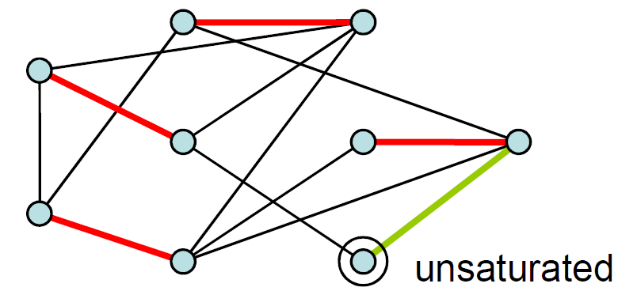

**第二步：证明 $\alpha'(G)\ge n(G)-\beta'(G)$**

(1) 设 $L$ 是图 $G$ 的一个最小边覆盖。

(2) 对任意一条边 $e\in L$，它至多只有一个端点与 $L$ 中其他边相邻。否则，若 $e$ 的两个端点都与 $L$ 中其他边相邻，则去掉 $e$ 后其两个端点仍被覆盖，从而 $L-\{e\}$ 仍是一个边覆盖，这与 $L$ 的最小性矛盾。

因此，$L$ 的每个连通分量都是**星型的 (star)**。

(3) 设 $L$ 中的连通分量数为 $k$。每个分量都是星型的，即 $e_i = v_i - 1$，求和得到
$$
|L|=n(G)-k.
$$
(4) 从每个星形分量中取一条边，这些边两两不相邻，从而构成**一个匹配** $M$，且
$$
|M|=k=n(G)-|L|.
$$
于是得到
$$
\alpha'(G)\ge n(G)-\beta'(G).
$$

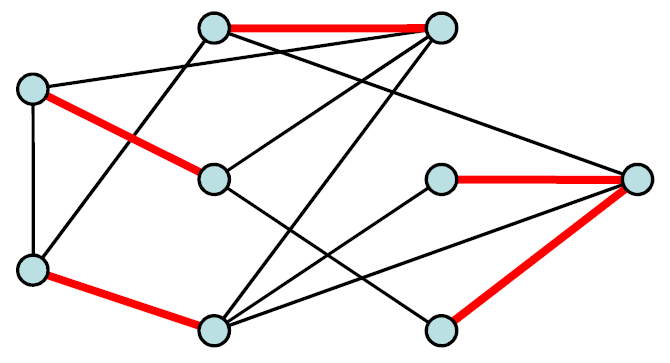

**第三步：合并不等式**

由第一步与第二步，得到
$$
\beta'(G)\le n(G)-\alpha'(G),\qquad
\alpha'(G)\ge n(G)-\beta'(G).
$$
故
$$
\alpha'(G)+\beta'(G)=n(G).
$$
证毕。 $\square$

另一写法：
#### 定理11.11

**对于 $n$ 个顶点图 $G$，且 $\delta(G)>0$，则 $\alpha_1(G)+\beta_1(G)=n$。**

**证明：**

**先证$\alpha_1(G)+\beta_1(G) \le n$**：

设 $M$ 是 $G$ 的最大匹配，$|M|=\beta_1(G)$。
设 $F$ 是关于 $M$ 的未饱和点集合，因为 $M$ 中的每条边饱和了两个顶点，有$|F|=n-2|M|$。
每个非饱和点至少关联一条边 $(E-M)$，且两个非饱和点之间无边。
又 $\delta>0$，对于 $U$ 中每个顶点 $v$，取一条与 $v$ 关联的边，这些边与 $M$ 构成边集合 $L$，显然 $L$ 是一个边覆盖。且 $|L|=|M|+|F|=|M|+(n-2|M|)=n-|M|$，又 $|L|\geq \alpha_1(G)$，$|M|=\beta_1(G)$，所以 $\alpha_1(G)+\beta_1(G) \le n$。

**再证$\alpha_1(G)+\beta_1(G) \ge n$**：
 
设 $L$ 是 $G$ 的最小边覆盖，$|L|=\alpha_1(G)$。
令 $H=G(L)$，$H$ 有 $n$ 个顶点（顶点集和 $G$ 一样）。
又设 $M$ 是 $H$ 的最大匹配，显然也是 $G$ 的匹配，且 $M \subseteq L$。
以 $U$ 表示 $H$ 中关于 $M$ 的未饱和点集合，且 $|U|=n-2|M|$。
因为 $M$ 是 $H$ 的最大匹配，所以 $H$ 中 $U$ 的顶点互不相邻（否则 $M$ 不是最大匹配），即 $U$ 中顶点关联的边在 $L-M$ 中。因此 $|L|-|M|=|L-M| \ge |U|=n-2|M|$。
$$|L| + |M| \ge n, \quad |M| \ge n - |L| = n - \alpha_1(G), \quad |\beta_1| \ge |M| \ge n - \alpha_1$$
于是 $\alpha_1(G)+\beta_1(G) \ge n$。

所以 $\alpha_1(G)+\beta_1(G)=n$。
$\square$

### 科尼格（König）定理

对于任一个点覆盖 $C$ 和任一个匹配 $M$，$C$ 中至少包含匹配 $M$ 中每一边的一个端点，所以总有 $|M| \le |C|$，显然 $\beta_1(G) \le \alpha_0(G)$。下面可以证明对于二分图 $G$，等式成立。这个结果是科尼格在1931年给出的，它与霍尔定理紧密相关。在给出它的证明之前，先证明引理。

#### 引理11.1

**设 $M$ 是一个匹配，$C$ 是点覆盖，且 $|M|=|C|$，则 $M$ 是最大匹配，$C$ 是最小点覆盖。**

**证明：**
若 $M^*$ 是 $G$ 的最大匹配，$C^*$ 是 $G$ 的最小点覆盖，$\beta_1(G)=|M^*|$，$\alpha_0(G)=|C^*|$，则 $|M| \le |M^*|=\beta_1(G) \le \alpha_0(G) =|C^*|\le |C|$。
由于 $|M|=|C|$，所以 $|M|=|M^*|=\beta_1(G)$，$|C|=|C^*|=\alpha_0(G)$。
$\square$

#### ⭐定理11.12（科尼格定理）

**在二分图 $G(V_1, V_2)$ 中，有 $\beta_1(G)=\alpha_0(G)$。**

**证明：**
设 $M^*$ 是 $G$ 的最大匹配，$U$ 是 $V_1$ 中关于 $M^*$ 未饱和点集合。又设 $Z$ 表示与 $U$ 中每一个顶点有关 $M^*$ 交错路相连的顶点集合，即
$$Z = \left\{ v \in V_1 \cup V_2 \mid \exists u \in U, u \text{ 到 } v \text{ 有一条交错路} \right\}.$$
因为 $M^*$ 是最大匹配，所以 $G$ 中不包含关于 $M^*$ 的增广路，由 $M$ 为 $G$ 的一个最大匹配当且仅当 $G$ 中不存在关于 $M$ 的增广路，$U$ 是 $Z$ 中仅有的未被 $M^*$ 饱和的顶点集合。令 $A=Z \cap V_1$，$T=Z \cap V_2$，由定理11.8的证明，可知 $T$ 中顶点关于 $M^*$ 是饱和的，并且 $N(A)=T$。

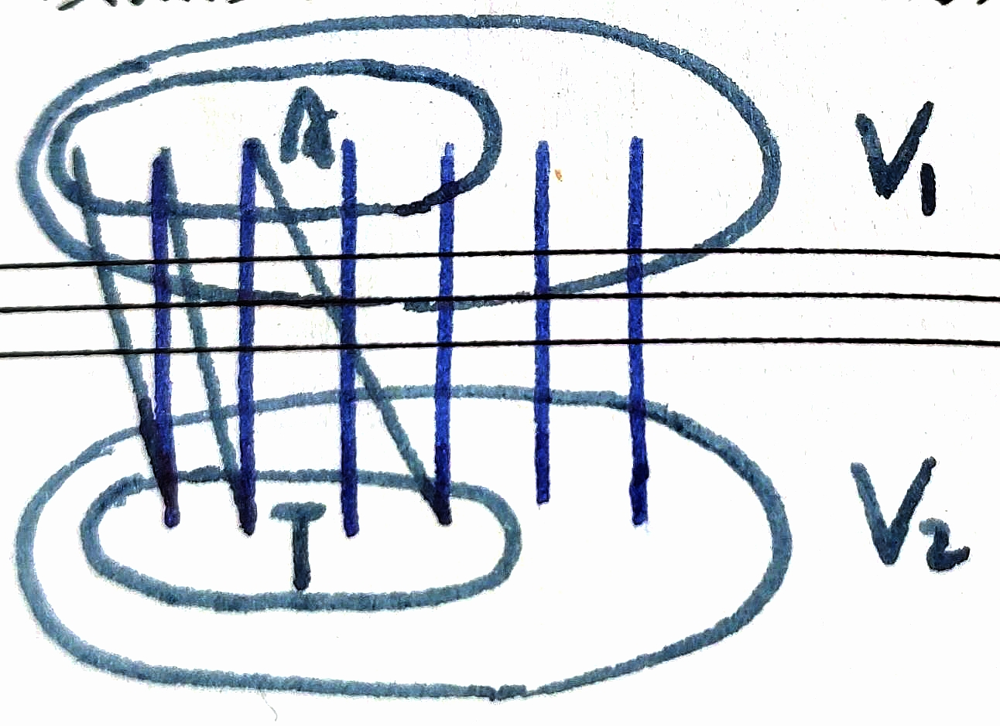

定义 $\hat{C}=(V_1-A)\cup T$，$G$ 中每一边至少有一个顶点在 $\hat{C}$ 中，因为否则至少有一边，其一端点在 $A$ 中，另一端点在 $V_2-T$ 中，这与 $\Gamma(A)=T$ 矛盾，所以 $\hat{C}$ 是 $G$ 的一个点覆盖。显然，$|\hat{C}|=|M^*|$。又由引理11.1，得 $\beta_1(G)=\alpha_0(G)$。
$\square$

#### 推论11.2

**在 $\delta>0$ 的二分图 $G(V_1, V_2)$ 中，有 $\beta_0(G)=\alpha_1(G)$。**

**证明：**
利用定理11.9的推论11.1以及定理11.10可知 $\alpha_1(G)+\beta_1(G)=\alpha_0(G)+\beta_0(G)$。再由定理11.11即得 $\beta_0(G)=\alpha_1(G)$。
$\square$