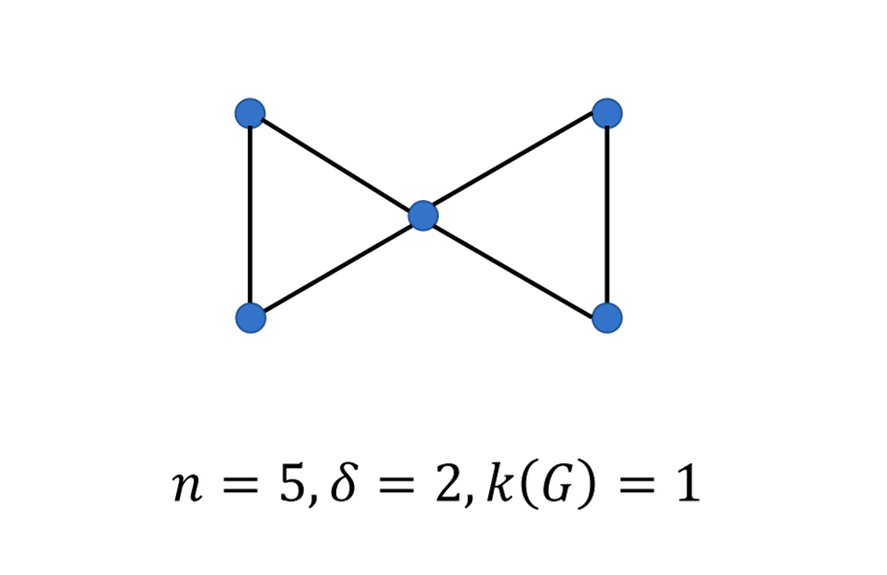
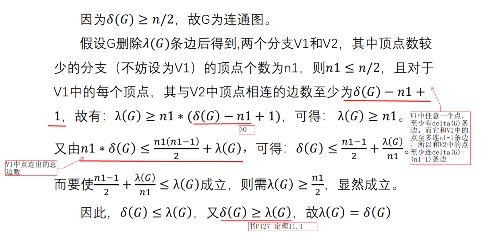
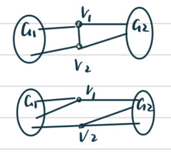
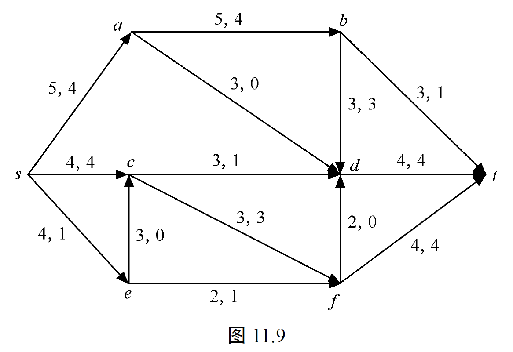
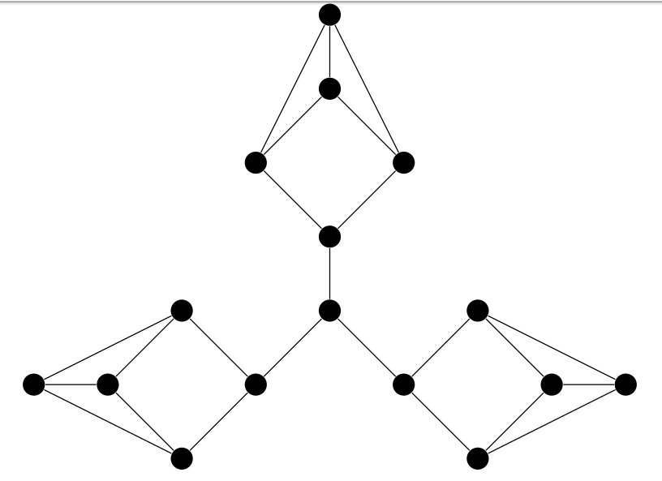

# 第 11 章 连通度、网络、匹配与 Petri 网

## 习题

### ✅11.1 证明：$n$个顶点$e$条边的简单图的顶点连通度不超过$\lfloor 2e/n \rfloor$。

记图 $G$ 的最小度为 $\delta(G)$。已知一般不等式 $\kappa(G)\le\delta(G)$（任一顶点割集合的大小至多不超过最小度），又由度和公式
$$
\sum_{v\in V} d(v)=2e,
$$

于是平均度为 $\frac{2e}{n}$。显然最小度不超过平均度，即 $\delta(G)\le\frac{2e}{n}$。由于 $\delta(G)$ 为整数，结合前面不等式得
$$
\kappa(G)\le\delta(G)\le\Big\lfloor\frac{2e}{n}\Big\rfloor,
$$
从而证明了结论。

---

### ✅11.2 证明：若$G=(V,E)$是$k$-边连通的，则$e \geq kn/2$。

$k$-边连通意味着每个顶点的度至少为 $k$，即对任意顶点 $v$ 有 $d(v)\ge k$。于是
$$
2e=\sum_{v\in V} d(v)\ge \sum_{v\in V} k = kn.
$$

两边除以2，得到 $e\ge \dfrac{kn}{2}$。

---

### 11.3 试举一例：对于连通图$G$，满足$\kappa(G)=\lambda(G)=\delta(G)$。

环 $C_n$（$n\ge3$）或完全图 $K_n$。

例如环 $C_n$（$n\ge3$）有每个顶点度为 2，$\kappa(G)=\lambda(G)=\delta(G)=2$。

完全图 $K_n$（$n\ge2$）也可：$\kappa(G)=\lambda(G)=\delta(G)=n-1$。

---

### 11.4 试举一例：对于一个连通图$G$，满足$\kappa(G)<\lambda(G)<\delta(G)$。

构造：取两块完全子图（团） $A$ 与 $B$，每块都是 $K_{t+1}$（大小为 $t+1$ 的团），把 $r$ 条跨边都从 $A$ 的**同一个顶点** $a^*$ 出发，连到 $B$ 中 $r$ 个不同顶点 $b_1,\dots,b_r$。也就是说，$a^*b_i$（$i=1,\dots,r$）是所有跨边。要求参数满足 $1<r<t$。

* **最小度 $\delta(G)$**：在 $A$ 内，除了 $a^*$ 外的每个顶点仍与本块其它 $t$ 个顶点相连（度为 $t$）；而 $a^*$ 的度为 $t$（在 $A$ 内）加上 $r$ 条跨边，共度 $t+r$。 在 $B$ 侧，被连的 $b_i$ 度为 $t+1$，其余顶点度为 $t$。 因此最小度 $\delta=t$（假设 $r\le t$，存在未连的顶点）。
* **边连通度 $\lambda$**：把 $A$ 与 $B$ 分开的最小边割仍是把所有跨边删掉——因为没有其它跨块边。所以必须删除这 $r$ 条边，且删除这 $r$ 条即可把图分成两个部分（没有其他边连两块）。因此 $\lambda=r$.
* **顶点连通度 $\kappa$**：注意仅仅删除单个顶点 $a^*$ 就能够把所有跨边“破坏掉”——因为所有跨边都依赖于 $a^*$。删除 $a^*$ 后没有任何跨块边，图分为两个独立的团（还有 $a^*$ 被删除后的残余），因此图变得不连通。所以存在顶点割大小为 $1$，即 $\kappa\le1$。显然图不是先前就不连通，所以 $\kappa=1$。

结论（star 情形）：
  $$
  \kappa = 1 < \lambda = r < \delta = t\quad(\text{当 }1<r<t).
  $$

---

### ✅11.5 找一个简单图$G$，使得$\delta=n-3$，$\kappa(G)<\delta$。

<!-- ？？？令 $G$ 为在 $n$ 个顶点上把一个顶点 $v$ 与其它所有顶点相连（即度 $n-1$），并在其余 $n-1$ 个顶点上构造一个 $K_{n-1}$ 减去一条边（即在剩余顶点中任选两顶点 $x,y$ 不相连，其余充分相连）。则：

* 对于除 $x,y$ 外的顶点度为 $n-2$（与 $v$ 相连并与剩余 $n-2$ 个顶点相连），而对于 $x$ 和 $y$，由于它们互不相连，它们的度为 $n-3$。因此最小度 $\delta(G)=n-3$。

* 但图中 $v$ 是“强连接”点，而 $x,y$ 的缺边可能造成顶点连通度小于 $n-3$。事实上通常可以找到一个较小的顶点割（例如删除与 $x$ 相连的若干顶点使 $x$ 与图其余部分分离），因此 $\kappa(G)<\delta(G)$。

更简单的特例：取 $n\ge4$，从 $K_n$ 中删去一条边，则两端顶点度变为 $n-2$（即 $\delta=n-2$）；如果需要 $\delta=n-3$，可以删去适当的边使得某些顶点度降至 $n-3$。关键点是：通过从完全图删去少数边可以使 $\delta$ 达到 $n-3$，而顶点连通度被局部结构影响可以小于最小度。若需要我可以给出具体顶点集合与边集的枚举。 -->

---

### ✅11.6 证明：若$G$是简单图，且$\delta(G) \geq n/2$，则$\lambda(G)=\delta(G)$。

先记 $n=|V(G)|$，$\delta=\delta(G)$，$\lambda=\lambda(G)$。已知对任意图总有 $\lambda\le\delta$。所以只需证 $\lambda\ge\delta$。

取一条**最小**的边割，也就是说取一个顶点子集 $S\subset V$（非空且不为全体），使通过 $S$ 与 $\bar S=V\setminus S$ 之间的边数
$$
e(S,\bar S)
$$

等于 $\lambda$。 设 $|S|=k$。 因为 $S$ 与 $\bar S$ 对换不会改变割的大小，我们可以并且只考虑 $k\le n/2$。

对任意顶点 $v\in S$，在原图 $G$ 中有 $d(v)\ge\delta$。在子集 $S$ 内，至多有 $k-1$ 个邻居（即与 $v$ 相连并属于 $S$ 的顶点不超过 $k-1$ 个），因此 $v$ 至少有
$$
\text{从 }v\text{ 指向 }\bar S\text{ 的边数} \ge \delta-(k-1)=\delta-k+1.
$$

把上式对所有 $v\in S$ 求和得到割边数下界：
$$
e(S,\bar S)=\sum_{v\in S} d_{S,\bar S}(v)\ge k(\delta-k+1).
$$

由于我们选择的 $S$ 使得 $e(S,\bar S)=\lambda$，所以
$$
\lambda \ge k(\delta-k+1).
$$

现在考察右端与 $\delta$ 的关系：
$$
k(\delta-k+1)-\delta
= k\delta - k^2 + k -\delta
= (k-1)\delta - k(k-1)
= (k-1)(\delta-k).
$$

因为我们取 $k\le n/2$ 且假设 $\delta\ge n/2$，所以 $\delta-k\ge0$，且显然 $k-1\ge0$。 因此
$$
k(\delta-k+1)-\delta=(k-1)(\delta-k)\ge0,
$$

即对任意 $1\le k\le n/2$ 都有 $k(\delta-k+1)\ge\delta$。于是从前面的不等式得
$$
\lambda \ge k(\delta-k+1)\ge\delta.
$$

结合已知的 $\lambda\le\delta$，我们得到
$$
\lambda=\delta.
$$

这完成了证明。

* 关键技巧是对割的一侧取顶点数 $k\le n/2$，并利用每个顶点在对侧至少有 $\delta-(k-1)$ 条边，从而得到割边数下界。
* 最后一处代数简化 $k(\delta-k+1)-\delta=(k-1)(\delta-k)$ 很巧妙且常见，用它可以直接看出该下界至少为 $\delta$。

---

### 11.7 证明：在树$T$中除树叶外所有顶点均为割点。

设 $T$ 是一棵树（连通且无圈）。取任一非叶顶点 $v$，则 $d_T(v)\ge2$。令 $N(v)=\{q_1,q_2,\dots,q_k\}$ 为 $v$ 的邻居（$k\ge2$）。

我们要证明：删除顶点 $v$（及其所有相连的边）后，图变为不连通 —— 即 $v$ 是割点。

采用**反证法**。假设删除 $v$ 后图仍连通。于是在 $T-v$ 中，对于任意 $i\neq j$，顶点 $q_i$ 与 $q_j$ 在 $T-v$ 中有一条连接路径 $P_{i,j}$（该路径不经过 $v$）。在原树 $T$ 中存在边 $q_i v$ 和边 $v q_j$。把这两条边与路径 $P_{i,j}$ 连在一起，就在 $T$ 中得到一条从 $q_i$ 到 $q_j$ 的环路：
$$
q_i \leftrightarrow v \leftrightarrow q_j \quad\text{与}\quad q_i \overset{P_{i,j}}{\longrightarrow} q_j
$$

合并得一个简单闭合回路，这与 $T$ 无圈的定义矛盾。故假设不成立，删除 $v$ 必须使图不连通，因此 $v$ 是割点。

因为 $v$ 是任意选择的非叶顶点，结论成立：在树中，除叶外的每个顶点都是割点。

---

### 11.8 证明：若树$T$中顶点$v$是割点，则$d(v)>1$。

树中度为 0 的顶点（孤立点）不出现，度为 1 的顶点（叶）删除后只使自己消失，但剩下的图仍连通（因为只去掉了叶），对树的连通度没有影响，所以叶不是割点。综上若是割点必须满足 $d(v)>1$。

---

### 11.9 证明：只有两个顶点不是割点的简单连通图是一条路。

设 $G$ 连通且恰有两个非割点，记为 $u$ 和 $v$，其余顶点均为割点。若该简单连通图不是路，则该简单连通图有两种可能：1.是树；2.是存在回路的连通图。

##### 情形 1：$G$ 是树（无圈）

树的非割点等价于叶（度为1的顶点）（见**习题11.7**证明：非叶顶点均为割点）。

若 $G$ 是树且恰有两个非割点，则树恰有两个叶。而**恰有两个叶的树必为路径**：
- 假设树有两个叶 $u$ 和 $v$，其余顶点均为内点（度≥2）。由于树无圈，任意两顶点间路径唯一，因此所有内点必在 $u$ 和 $v$ 之间的唯一路径上，构成简单路径 $u-v_1-v_2-\dots-v_k-v$，即 $G$ 是路径。

（或：若是树，且不是路，则至少有三个树叶，即至少有三个顶点不是割点，与已知矛盾。）

##### 情形 2：$G$ 含圈（有至少一个环）

若是存在回路的连通图，则可以找到其生成树，该树的树叶结点，就不是割点.

若该树不是一条路，则存在至少三个树叶结点，则该图中至少三个点不是割点。

若该树是一条路，则在回路上存在一个点不是割点。若回路上的所有点都是割点，则不可能其生成树为一条路。

所以只有两个顶点不是割点的简单图是一条路。

<!-- ？？？采用**块-割点分解**工具（核心逻辑：将图分解为“不可再分”的块，块间通过割点连接）：
1. 块的定义：极大的2-连通子图（删除任一顶点仍连通）或单条边（无法构成2-连通子图的边）；
2. 块-割点树：将每个块和每个割点视为节点，若割点属于某块，则连一条边，形成的结构是树（无圈且连通）；
3. 叶块：块-割点树中度为1的块（仅通过一个割点与其他部分连接）。

关键推导：
- 含圈的 $G$ 中，至少存在一个块是2-连通子图（而非单条边），记为 $B$（$B$ 含圈，顶点数≥3）；
- 块-割点树是树，因此至少有两个叶块（树的叶数≥2）；
  - 若叶块是2-连通子图 $B$：由于 $B$ 是2-连通的，其内部所有顶点都不是割点（删除 $B$ 中任一非割点，$B$ 仍连通，且仅通过一个割点与外界连接，不会导致整个图不连通）。因此 $B$ 中至少有2个非割点（2-连通子图顶点数≥3，且无割点）；
  - 另一个叶块（无论是否为2-连通子图）：若为单条边，则该边的两个端点中，非割点端（不与其他块连接的端点）是一个非割点；若为2-连通子图，则贡献至少2个非割点。
- 综上，含圈的 $G$ 中，非割点数量≥2（来自第一个2-连通叶块）+1（来自第二个叶块）=3，与“恰有两个非割点”矛盾。

因此，$G$ 不可能含圈，只能是树，且由情形1知树必为路径。

### 结论

综上，“连通图恰有两个非割点”与“图是简单路径”互为充要条件，命题得证。（$\square$）

### 关键要点提炼
1. 路径的内点必为割点、端点必为非割点，是结构自带的性质；
2. 树的非割点等价于叶，恰有两个叶的树只能是路径；
3. 含圈图的块-割点分解会产生至少3个非割点，与条件矛盾，因此排除含圈情形。 -->

---

### 11.10 

#### （1）证明：若图$G$的每个顶点都是偶顶点，则$G$无桥。

假设存在一条桥 $e=uv$。删除 $e$ 后图分成两部分 $X$ 和 $Y$，其中 $u\in X, v\in Y$。考虑集合 $X$ 内顶点的度之和：在原图中，$\sum_{x\in X} d(x)$ 为偶数（每个度为偶数相加仍为偶）。但这和也等于 $2\cdot$（内部边数）$+$（从 $X$ 指向 $Y$ 的边数）。因为 $e$ 是桥，从 $X$ 指向 $Y$ 的边数为 1（只有 $e$ 一条），所以右式为偶数内部和再加 1，得到奇数，这与左边为偶数矛盾。因此假设不成立，图中无桥。

#### （2）证明：若$G$是$k$则二分型，$k \geq 2$，则$G$无桥。

在 $k$-正则二分图中，任意顶点的度为 $k\ge2$，所以每个顶点至少有两条边相连，因此单删除一条边不会把图中的某一顶点与其它全部分离成独立分量，从而不存在桥。

---

### ✅11.11 证明：若$G$是3-正则图，则$\kappa(G)=\lambda(G)$。

😮 2022

* 由**定理11.1**：对于任意图 $G$，有
  $$
  \kappa(G) \le \lambda(G) \le \delta(G)
  $$
  其中 $\delta(G)$ 为图的最小度。这里 $\delta(G) = 3$。

根据上式，有
$$
\kappa(G) \le \lambda(G) \le 3.
$$

所以只需讨论 $\kappa(G) = 0,1,2,3$ 的可能情况，并说明此时 $\lambda(G) = \kappa(G)$。

1. **当 $\kappa(G) = 0$ 时**

   * 顶点连通度 0 表示图本身不连通。
   * 边连通度 $\lambda(G) = 0$（因为图已经不连通了，不需要删边）。
   * 因此 $\kappa(G) = \lambda(G) = 0$。

2. **当 $\kappa(G) = 1$ 时**

   * 删除一个顶点 $v_1$ 会使图不连通，产生两个连通分支。
   * $v_1$ 度数为3，和其中一个连通分支必仅有一条边相连，把这条边删去之后 $G$ 不连通。
   * 因此 $\lambda(G) = 1$， $\kappa(G) = \lambda(G) = 1$。

3.  **当 $\kappa(G) = 2$ 时**

   * 删除两个顶点 $v_1,v_2$ 会使图不连通。
   * 每个顶点的度为 3，总共删除 6 条边。
   * 可以在这 6 条边中选择两条关键边，使图断开。
   * 因此 $\lambda(G) = 2$， $\kappa(G) = \lambda(G) = 2$。

4. **当 $\kappa(G) = 3$ 时**

   * 由**定理11.1**，显然有 $\kappa(G) = \lambda(G) = 3$。

**结论**：对于 3-正则图 $G$，$\kappa(G) = \lambda(G)$ 成立。

---

### 11.12 在下图网络中已有如图11.9所示的初始流（这里$s$和$t$分别为发点和收点）。
请用标号法求该网络最大流（画出具体的标号和增广过程），求出最大流的值$\nu_f$，并写出标号结束时所得到的最小割$(\bar{P},P)$。

---

### ✅11.13 证明：一棵树最多只有一个完美匹配。

**证明按递归“剥叶”法。**

1.  若 $T$ 有 0 个顶点或 2 个顶点，结论显然（空图或单边只有一个完美匹配或无）。

2.  设 $T$ 至少有 2 个顶点且存在一个完美匹配 $M$。取树 $T$ 的任一叶 $u$，其唯一邻居记为 $v$。在任何覆盖全部顶点的匹配中，顶点 $u$ 必须被匹配（否则 $u$ 无法被覆盖），因此匹配必须包含边 $uv$。所以边 $uv$ 对所有可能的完美匹配都是必选的。

3.  把 $u$ 和 $v$ 及其相连的边从 $T$ 中删除，得到若干连通分支（实际上删除一条匹配边只会把树规模减小）。对于原来存在的任何完美匹配，除 $uv$ 外，剩下的边在每个残余连通分支上也构成完美匹配。对每个残余分支递归应用同样的论证：其叶与邻点的匹配是强制的。

4.  由此每一步删除的匹配边都是唯一可选的，递归结束后整个匹配被唯一确定。故若存在完美匹配必唯一；因此最多只有一个完美匹配。

---

### 11.14 对于$n=2,3,4,5$，分别找出一个没有完美匹配的$n$-正则简单图的例子。

* **$n=2$**：取任意**奇长周期** $C_{2k+1}$（例如 $C_3$，三角形）。这是 2-正则的简单图，但顶点数为奇数，因此不存在完美匹配。
  例：$C_3$（顶点集合 $\{1,2,3\}$，边 $\{12,23,31\}$），无完美匹配。

* **$n=3$**（立方图 / cubic）：
  经典事实（Petersen 定理变式）表明 **任何无桥的 3-正则图都至少含有一个完美匹配**；因此要找到无完美匹配的 3-正则图必须包含桥并满足 Tutte 的反例条件。这种图的构造思想是：在某个顶点处有多条桥，使得删除任何可能作为匹配边的东西都会在某一侧留下奇数个顶点，从而无法完成全匹配。

* **$n=4$**：取 **$K_5$**（完全图五顶点）。每顶点度为 $4$，但顶点数为 5（奇），因此不可能有完美匹配。于是 $K_5$ 是一个 4-正则的简单图且无完美匹配。

* **$n=5$**：%% ？？？ %%

---

### 11.15 证明：二分型$G$具有完美匹配当且仅当对任意$A \subseteq V$有$| \Gamma(A)| \geq A$成立。

（定理 11.9）**Hall 定理（对从 $V_1$ 到 $V_2$ 的完全匹配）。** 二分图 $G=(V_1\cup V_2,E)$ 中存在一个将 $V_1$ 完全匹配到 $V_2$ 的匹配（即匹配覆盖 $V_1$）当且仅当对任意 $A\subseteq V_1$，有 $|\Gamma(A)|\ge|A|$。

* **必要性。** 若存在把 $V_1$ 全部覆盖的匹配 $M$，则每个 $a\in A$ 都被 $M$ 匹配到不同的 $\Gamma(A)$ 中的顶点（匹配的端点互不相同），因此 $|\Gamma(A)|\ge|A|$。

* **充分性（归纳/增广路径法）。** 用归纳或匈牙利算法的证明都非常经典。这里给归纳式证明：对 $|V_1|=0$ 显然成立。设命题对少于 $m$ 个左顶点成立，考虑 $|V_1|=m$ 的情形。若对任意非空 $A\subset V_1$ 都满足 $|\Gamma(A)|\ge|A|$，两种情形：

  1.  若对任意非空 $A\subsetneq V_1$，均严格有 $|\Gamma(A)|\ge|A|+1$，则任选一条边 $uv$（$u\in V_1$，$v\in V_2$），把 $u,v$ 删除，剩余图仍满足 Hall 条件，从归纳得到在剩余图上存在覆盖剩余左顶点的匹配，把 $uv$ 加上得到覆盖整个 $V_1$ 的匹配。

  2.  否则存在非空 $A\subset V_1$（真子集）满足 $|\Gamma(A)|=|A|$。考虑子图 $G_1$ 由 $A\cup\Gamma(A)$ 诱导，和 $G_2$ 由 $(V_1\setminus A)\cup (V_2\setminus\Gamma(A))$ 诱导。对 $G_1$ 因为 $|\Gamma(A)|=|A|$ 且 Hall 条件对 $G$ 任一子集成立，$G_1$ 也满足对其左侧的 Hall 条件；对 $G_2$ 同理。按归纳，两个子图各自有把其左侧全部匹配的匹配。把两部分匹配合并得到覆盖 $V_1$ 的匹配。

<!-- ？？？ -->

---

### ✅11.16 

#### （1）证明$k$-立方有完美匹配（$k \geq 2$）。

* 顶点表示：$Q_k$ 的顶点可以用二进制串长度 $k$ 表示；两个顶点相邻当且仅当二进制串只在一位上不同。顶点总数 $2^k$。

* 构造匹配：把所有顶点按第 1 位分成两组（第 1 位为 0 的顶点与第 1 位为 1 的顶点）。对任一 0 开头的串 $0x_2x_3\ldots x_k$，将其与对应的 1 开头的串 $1x_2x_3\ldots x_k$ 配对。每对之间恰有一条边（仅第 1 位不同），这些对互不相交且覆盖所有顶点，因此构成一个完美匹配。故 $Q_k$ 存在完美匹配（实际上可用任意位做配对，且有许多不同匹配）。

#### （2）求$K_{2n}$，$K_{n,n}$中不同的完美匹配的个数。

* 对 **完全图 $K_{2n}$**：完美匹配就是把 $2n$ 个顶点划分为 $n$ 个无序的无序对（配对问题）。计数公式为
  $$
  \frac{(2n)!}{2^n n!}.
  $$
  证明：把 $2n$ 个顶点全排列有 $(2n)!$ 种；将排列按前两位为第一对、接下去两位为第二对，……，得到 $n$ 对，但每一对内部顺序不计（除以 $2^n$），且 $n$ 对之间的顺序也不计（再除以 $n!$）。

* 对 **完全二分图 $K_{n,n}$**（两侧均有 $n$ 个顶点）：把左侧 $n$ 个顶点映射到右侧的一个双射数即 $n!$。因此 $K_{n,n}$ 的不同完美匹配数为 $n!$。

---

### 11.17 
#### （1）试求$K_4$，$K_6$的所有不同的完美匹配。

用顶点集 $\{1,2,3,4\}$ 表示 $K_4$，$K_4$ 的完美匹配数为 $\dfrac{4!}{2^2 2!}=3$。三种分别是：

  1.  $\{(1,2),(3,4)\}$
  2.  $\{(1,3),(2,4)\}$
  3.  $\{(1,4),(2,3)\}$

$K_6$ 的完美匹配数为 $\dfrac{6!}{2^3 3!}=15$。设顶点为 $1,2,3,4,5,6$。

完美匹配由 **3 条不相交的边** 组成：

- 第一条边：从 6 个点中任选两个 → 15 种
- 剩 4 点配成两条边 → 完美匹配数为 3
- 但这样每种匹配被重复计数 3 次（因为三条边位置无序）

因此总数为：$\frac{15\times 3}{3} = 15$。

$$
\begin{aligned}
&\{12,34,56\},\ \{12,35,46\},\ \{12,36,45\},\\
&\{13,24,56\},\ \{13,25,46\},\ \{13,26,45\},\\
&\{14,23,56\},\ \{14,25,36\},\ \{14,26,35\},\\
&\{15,23,46\},\ \{15,24,36\},\ \{15,26,34\},\\
&\{16,23,45\},\ \{16,24,35\},\ \{16,25,34\}.
\end{aligned}
$$
#### （2）试求$K_{1,2}$，$K_{2,3}$中所有不同的从$V_1$到$V_2$的完美匹配。

* $K_{1,2}$：左侧只有 1 个顶点 $a$，右侧有 2 个顶点 $\{b_1,b_2\}$。覆盖左侧的匹配数等于右侧选一个顶点的方式数，即 $2$。

* $K_{2,3}$：若要把左侧 $V_1$（2 个顶点）完全匹配到右侧不同的两个顶点上，数目为排列数 $P(3,2)=3\cdot2=6$。

* 如果两侧必须同样多（即完美匹配覆盖全图），则$K_{1,2}$ 和  $K_{2,3}$ 两侧顶点数都不同，不存在覆盖全图的完美匹配。

---

### 11.18 证明：$G$是二分型的充要条件是对于$G$的任意子图$H$，且$\delta(H)>0$，有$\beta_1(H)=\alpha_1(H)$成立。

* **必要性（若 $G$ 是二分图，则对任一子图 $H$ 成立）。** 这是经典的 König 定理：在二分图上，最大匹配数等于最小顶点覆盖数。对子图 $H$ 仍为二分图 ，因此 König 定理适用，得到 $\beta_1(H)=\alpha_1(H)$。

* **充分性（若对任一满足 $\delta(H)>0$ 的子图 $H$ 有该等式，则 $G$ 必为二分图）。** 反证。若 $G$ 非二分图，则存在奇圈 $C_{2k+1}$ 为 $G$ 的子图；该圈 $H=C_{2k+1}$ 满足 $\delta(H)=2>0$。对奇圈 $C_{2k+1}$，最大匹配数为 $k$（最多覆盖 $2k$ 个顶点），而最小顶点覆盖数为 $k+1$（覆盖奇圈所需的最少顶点数），因此 $\beta_1(H)=k\ne k+1=\alpha_1(H)$。与假设矛盾。故 $G$ 无奇圈，即为二分图。

---

### 11.19 （1）给出一个安全的而不是活的标记的例子。（2）给出一个有界的而不是安全的标记的例子。

略。

---

### 11.20 哲学家就餐问题：五位哲学家围着一个圆桌坐下。每位哲学家不是在吃东西就是在思考。在圆桌上每人面前放着一把餐叉。吃东西需要左、右手各拿一把餐叉，因而如果每人拿起自己前面的一把餐叉，那么没有人能吃东西，即系统死锁。将此情况模拟为一个Petri网模型。如何使你的模型是活的，以致这个系统将无死锁，并且，因此在任何时候，任一哲学家不是在吃东西就是在思考。

略。