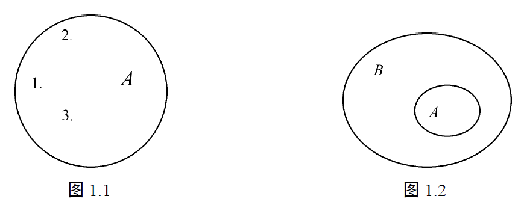
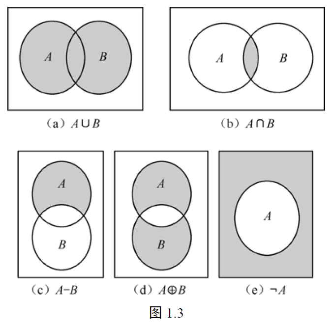

# 第1章 集合的基本概念

> 本章内容较为基础，笔记和习题的补充较少。

我们首先讨论一个问题：什么是集合？“一些教师”是不是集合？“复旦大学教师”又是不是集合？

所谓**集合**，就是具有共同性质的一些东西汇集成一个整体。复旦大学教师就是一个集合，组成这一集合的每个元素都具有共同性质：都是复旦大学教师。而“一些教师”就不是集合，因为我们无法确定其范围和性质。

本章并不是要讨论特定的集合，而是从抽象的角度讨论集合的基本概念：集合的表示、集合的子集、集合的运算，并简单地介绍集合论的悖论。

## 1.1 集合的表示

我们通常用大写字母表示集合，如 $S, A$ 等。构成一个集合中的那些对象称为该集合的元素，通常用小写字母或数字表示集合的元素。用 $a \in A$ 表示 $a$ 是集合 $A$ 的元素，读作 $a$ 属于 $A$。用 $a \notin A$ 表示 $a$ 不是集合 $A$ 的元素，读作 $a$ 不属于 $A$。

例如，所有整数全体构成的集合记为 $Z$，则 $3 \in Z, -8 \in Z, 6.5 \notin Z$。
集合中的元素可以是具体的事物，也可以是抽象的符号。集合有如下的**表示方法**。

#### （1）枚举法

通过列出集合中的所有元素来表示一个集合。例如，集合 $A$ 的元素为 $1, 3, 5, 7, 9$，则集合 $A$ 可表示为 $A=\{1, 3, 5, 7, 9\}$。

#### （2）特性刻画法（描述法）

通过描述集合中元素具有共同性质来表示一个集合。例如，集合 $A$ 的元素为 $x^2=1$ 的根，则集合 $A$ 表示为 $A=\{x \mid x^2-1=0\}$。一般来说，满足特性 $P$ 的元素组成的集合记为：$\{x|P(x)\}$，其中 $P(x)$ 是“$x$ 具有特性 $P$”的一个简写。

上述两种表示方法都是常用的，前者多用于元素个数较少的情况，后者多用于元素个数较多（或无限），并且各对象具有共同性质的情况。往往一个集合可以同时用上述两种方法表示，如 $\{x \mid x^2-1=0\}$ 也可以表示成 $\{1, -1\}$，$\{x \mid x \text{ 为小于或等于 } 7 \text{ 的质数}\}$ 也可以表示成 $\{1, 2, 3, 5, 7\}$。

#### （3）递归定义法

通过某规则的计算来定义集合中的元素，在此情况下，集合常称为递归定义的集合。我们将在**第4章4.1节**对这一方法做详细介绍。

不含有任何元素的集合称为**空集**，记为 $\varnothing$ 或 $\{\}$。如果在一个集合中元素个数有限，则称该集合为**有限集**，否则称该集合为**无限集**。有限集 $A$ 中的元素个数称为集合 $A$ 的**基数**（详见**第4章**），记为 $|A|$。例如，$A=\{x \mid x \text{ 是大于 } 1 \text{ 小于 } 6 \text{ 的质数}\}, |A|=3$。$A=\{x \mid x^2+1=0, x \text{ 为实数}\}$ 是空集 $\varnothing, |A|=|\varnothing|=0$。

集合中的元素是不能重复出现的（**互异性**）。由于一个集合完全由它的元素所确定，所以集合中的元素之间的次序是无关紧要的。例如，集合 $\{a, b, c\}$ 与 $\{b, a, c\}$ 是完全相同的集合。在特殊问题中，集合中元素可以重复出现，这种集合称为**多重集**，如 $\{a, b, a, b, c\}$ 和 $\{1, 2, 3, 1, 4\}$ 等。

一个集合也可以是其他集合的元素，以集合作为元素所组成的集合称为**集合族**。例如，$S=\{\{a, b\}, \{a, b, c\}, \{d, e\}\}$，$S$ 的元素 $\{a, b\}, \{a, b, c\}$ 和 $\{d, e\}$ 又都是集合，如集合 $\{a, b, c\}$，其元素是 $a, b$ 和 $c$，而 $a, b, c$ 都不是集合 $S$ 的元素。又如，$S=\{\varnothing, \{\varnothing\}\}$ 的元素是 $\varnothing$ 和 $\{\varnothing\}$。必须注意 $\varnothing$ 与 $\{\varnothing\}$ 是不同的，$\{\varnothing\}$ 表示以 $\varnothing$ 为元素的集合。

本书用 $I$ 或 $Z$ 表示整数集；$I^+$ 或 $Z^+$ 表示正整数集；$Q$ 表示有理数集；$Q^+$ 表示正有理数集；$Q^-$ 表示负有理数集；$R$ 表示实数集；$R^+$ 表示正实数集等。

---

## 1.2 集合的子集

我们可以用平面上封闭曲线包围点集的图形来表示集合，该图形称为文氏图（Venn Diagrams）。例如，集合 $A=\{1, 2, 3\}$ 的文氏图如图1.1所示。文氏图还能表示集合之间的相互关系，集合 $A$ 包含在集合 $B$ 中，如图1.2所示。

#### 定义1.1

设 $A$ 和 $B$ 是两个集合。$A$ 的每个元素都是 $B$ 的元素，则称 $A$ 是 $B$ 的**子集**，记为 $A \subseteq B$ 或 $B \supseteq A$，分别读作 **$A$ 包含在 $B$ 中或 $B$ 包含 $A$**。特别地，$A \subseteq A$。

**定义1.1**在给出子集定义的同时，还给出该定义的反面：若存在元素 $a \in A$，但 $a \notin B$，则 $A$ 不是 $B$ 的子集。

例如，$\{x \mid -1 < x < 2\}$，因 $0.5$ 是该集合的元素，而不是整数集的元素，所以集合 $\{x \mid -1 < x < 2\}$ 不是整数集 $Z$ 的子集。

#### 定义1.2

集合 $A$ 和 $B$ 的元素全相同，则称 $A$ 和 $B$ **相等**，记为 $A=B$；否则称 $A$ 和 $B$ 不相等，记为 $A \neq B$。

#### ⭐定理1.1（证明两个集合相等的基本方法）

**设 $A$ 和 $B$ 是两个集合，则 $A=B$ 当且仅当 $A \subseteq B$，并且 $B \subseteq A$。**

证明：$\Rightarrow$ 因为 $A = B$，由定义1.2，对任意的 $a \in A$，$a \in B$ 成立，因此有 $A \subseteq B$；同理，对任意的 $a \in B$，$a \in A$ 成立，因此 $B \subseteq A$。

$\Leftarrow$ 反之，若 $A \neq B$。因为集合 $A$ 和 $B$ 的元素不全相同，则 $A$ 中至少有一元素不在 $B$ 中，或者 $B$ 中至少有一元素不在 $A$ 中；如果 $A$ 中至少有一元素不在 $B$ 中，则与 $A \subseteq B$ 矛盾；如果 $B$ 中至少有一元素不在 $A$ 中，则与 $B \subseteq A$ 矛盾。所以 $A \neq B$ 不可能成立。

#### 定义1.3

若 $A \subseteq B$，且 $A \neq B$，则称集合 $A$ 是集合 $B$ 的**真子集**，记为 $A \subset B$。也可以说，$A$ 是 $B$ 的子集，并且 $B$ 中至少有一个元素不属于 $A$。

例如，$\{a\} \subset \{a, b\}$。

注意，$\in$ 与 $\subseteq$ 和 $\subset$ 是完全不同的概念，$\in$ 表示元素与集合的属于关系，而 $\subseteq$ 和 $\subset$ 表示集合与集合的包含关系。

例如，$S_1=\{a\}, S_2=\{\{a\}\}, S_3=\{a, \{a\}\}$。则 $a \in S_3, S_1 \subseteq S_3, \{a\} \in S_3, S_2 \subseteq S_3, S_1 \in S_3, S_1 \in S_2$。

#### 定义1.4

在取定一个集合 $U$ 以后，对于 $U$ 的任意子集而言，称 $U$ 为**全集**。

全集是一个相对的概念。例如，实数集对于整数集、有理数集而言是全集，而整数集对于偶数集、奇数集而言也是全集。

#### 定理1.2

**对于任何集合 $A$，必有（1）$\varnothing \subseteq A$，（2）$A \subseteq A$，（3）$A \subseteq U$。**

证明：（1）用反证法证明，假设空集 $\varnothing$ 不是集合 $A$ 的子集，则至少有一个元素 $x, x \in \varnothing$ 且 $x \notin A$。又根据空集的定义，$\varnothing$ 没有元素，所以对任何 $x$，必有 $x \notin \varnothing$，这样导致矛盾。因此空集是任何集合的子集，即 $\varnothing \subseteq A$。

（2）、（3）证明集合 $A$ 是集合 $B$ 的子集，则由定义1.1，对任何 $x \in A$，如果 $x \in B$，则 $A \subseteq B$ 成立。证明过程略。

对于集合 $A=\{1, 2, 3\}$，$\varnothing, \{1\}, \{2\}, \{3\}, \{1, 2\}, \{1, 3\}, \{2, 3\}$ 和 $\{1, 2, 3\}$ 都是集合 $A$ 的子集。这些子集全体构成集合称为 $\{1, 2, 3\}$ 的幂集。幂集定义如下。

#### 定义1.5

设 $A$ 是任意集合，$A$ 的所有子集所组成的集合称为集合 $A$ 的**幂集**，记为 $P(A)$，或记为 $2^A$，即 $P(A)=\{B \mid B \subseteq A\}$。

#### 例1.1

设 $A=\{a\}, P(A)=\{\varnothing, \{a\}\}$。
设 $A=\{a, b\}, P(A)=\{\varnothing, \{a\}, \{b\}, \{a, b\}\}$。
设 $A=\{a, b, c\}, P(A)=\{\varnothing, \{a\}, \{b\}, \{c\}, \{a, b\}, \{a, c\}, \{b, c\}, \{a, b, c\}\}$。

#### ⭐定理1.3

**设 $A$ 是有限集，则 $|P(A)|=2^{|A|}$。**

证明：对于有限集合 $A$，设 $|A|=n$。从 $n$ 个元素中选取 $i$ 个元素有 $C(n, i)$ 种取法。所以 $|P(A)|=C(n, 0)+C(n, 1)+C(n, 2)+\cdots+C(n, n)=(1+1)^n=2^n$，即 $|P(A)|=2^{|A|}$。

---

## 1.3 笛卡儿积

#### 定义1.6

两个对象 $a, b$ 按一定次序组成一对，称为**有序对**，记为 $(a, b)$。两个有序对相等记为 $(a, b)=(c, d)$，当且仅当 $a=c$ 和 $b=d$ 同时成立。

例如：$5 < 8$ 记为 $(5, 8)$；平面上的顶点坐标记为 $(x, y)$；教师 $a$ 和学生 $b$ 的师生关系记为 $(a, b)$。这些例子说明常用有序对来表示两个对象之间的关系。

当 $a \neq b$ 时，$(a, b) \neq (b, a)$，但集合 $\{a, b\}=\{b, a\}$，也就是说，有序对 $(a, b)$ 中 $a, b$ 是有次序的。$a, b$ 不一定来自同一集合。$a, b$ 可以相等，也可以不相等，$(a, a)$ 也是有意义的。有序对概念可以推广到 $n$ 个元素按一定次序组成有序 $n$ 元组，定义如下。

#### 定义1.7

设整数 $n>0$，$n$ 个对象的序列形如 $a_1, a_2, \cdots, a_n$ 组成一组称为**有序 $n$ 元组**，记为 $(a_1, a_2, \cdots, a_n)$，其中 $a_i$ 称为第 $i$ 个分量。两个有序 $n$ 元组相等当且仅当它们的每个对应分量相等。

#### 定义1.8

两个集合 $A$ 和 $B$，定义 $A$ 和 $B$ 的**笛卡儿积**为 $A \times B=\{ (a, b) \mid a \in A, b \in B \}$，又称 $A \times B$ 为 $A$ 和 $B$ 的直积。

#### 例1.2

设 $A=\{1, 2\}, B=\{x, y\}, C=\{a, b, c\}$，则
$A \times B=\{ (1, x), (1, y), (2, x), (2, y) \}$；
$B \times A=\{ (x, 1), (y, 1), (x, 2), (y, 2) \}$；
$A \times C=\{ (1, a), (1, b), (1, c), (2, a), (2, b), (2, c) \}$；
$A \times A=\{ (1, 1), (1, 2), (2, 1), (2, 2) \}$。

通常 $B \times A \neq A \times B$。

#### 定义1.9

设 $n$ 个集合 $A_1, A_2, \cdots, A_n$，$A_1, A_2, \cdots, A_n$ 的**笛卡儿积**为 $A_1 \times A_2 \times \cdots \times A_n=\{ (a_1, a_2, \cdots, a_n) \mid a_i \in A_i, i=1, \cdots, n \}$。

例1.2中集合 $A, B, C$ 的笛卡儿积 $A \times B \times C=\{ (1, x, a), (1, x, b), (1, x, c), (1, y, a), (1, y, b), (1, y, c), (2, x, a), (2, x, b), (2, x, c), (2, y, a), (2, y, b), (2, y, c) \}$。

若对所有 $i, A_i=A$，则 $A_1 \times A_2 \times \cdots \times A_n$ 记为 $A^n$。

---

## 1.4 集合的运算

设 $A$ 和 $B$ 是任意两个集合，通过下面的集合运算的定义可以得到新的集合。

#### 定义1.10

设 $A$ 和 $B$ 是两个集合，$U$ 是全集。
（1）$A$ 和 $B$ 的**并**，记为 $A \cup B$，它是由 $A$ 和 $B$ 中所有元素所组成的集合，即 $A \cup B=\{x \mid x \in A \text{ 或 } x \in B\}$。
（2）$A$ 和 $B$ 的**交**，记为 $A \cap B$，它是由 $A$ 和 $B$ 中公共元素所组成的集合，即 $A \cap B=\{x \mid x \in A \text{ 且 } x \in B\}$。
（3）$A$ 和 $B$ 的**差**，记为 $A-B$，它是由在 $A$ 中而不在 $B$ 中的元素所组成的集合，即 $A-B=\{x \mid x \in A \text{ 且 } x \notin B\}$。
（4）$A$ 和 $B$ 的**对称差**，记为 $A \oplus B$，$A \oplus B=(A-B) \cup (B-A)$。
（5）$A$ 的补，记为 $\bar{A}$ 或 $\neg A$，$\bar{A}=U-A$。

集合的并、交、差、对称差和补也分别称为集合的并运算、交运算、差运算、对称差运算和补运算。可用文氏图表示，如图1.3中的阴影部分。

#### 例1.3

设全集 $U=\{1,2,3,4,5,6,7,8,9,10\}$，$A=\{1, 2, 3, 4, 5\}, B=\{1, 2, 4, 6\}, C=\{7, 8\}$。则 $A \cup B=\{1,2,3,4,5,6\}, A \cap B=\{1,2,4\}, A \cap C=\varnothing$，$A-B=\{3,5\}, A-C=A, \bar{A}=\{6, 7, 8, 9, 10\}, \bar{B}=\{3, 5, 7, 8, 9, 10\}$。

若 $A \cap B=\varnothing$，则称 $A$ 和 $B$ 不相交。**由定义1.10，集合的差和交之间的关系为 $A-B=A \cap \bar{B}$**。

利用集合运算的性质和集合相等的概念，我们可以对集合运算表达式的相等进行验证。由定理1.1，两个集合相等的充要条件是这两个集合互为子集；即，左式 $\subseteq$ 右式，右式 $\subseteq$ 左式。所以**可以根据定义1.1，由对任意的 $x \in$ 左式推出 $x \in$ 右式，再由对任意的 $x \in$ 右式推出 $x \in$ 左式，来证明两个集合运算表达式相等**。下面先介绍几个例子。

#### 例1.4

证明 $A \cap (B \cup C)=(A \cap B) \cup (A \cap C)$。

证明：先证明左式 $\subseteq$ 右式，即 $A \cap (B \cup C) \subseteq (A \cap B) \cup (A \cap C)$。
对任意的 $x \in A \cap (B \cup C)$，根据定义1.4，则 $x \in A$ 并且 $x \in B \cup C$，即 $x \in A$，并且 $x \in B$ 或者 $x \in C$。如果 $x \in B$，则 $x \in A \cap B$；如果 $x \in C$，则 $x \in A \cap C$；所以 $x \in (A \cap B) \cup (A \cap C)$，则 $A \cap (B \cup C) \subseteq (A \cap B) \cup (A \cap C)$。

再证明 $(A \cap B) \cup (A \cap C) \subseteq A \cap (B \cup C)$。同理，对任意的 $x \in (A \cap B) \cup (A \cap C)$，根据定义1.4，$x \in A \cap B$ 或者 $x \in A \cap C$；则 $x \in A$ 并且 $x \in B$，或者 $x \in A$ 并且 $x \in C$；即 $x \in A$，并且 $x \in B$ 或者 $x \in C$，所以 $x \in A \cap (B \cup C)$，则 $(A \cap B) \cup (A \cap C) \subseteq A \cap (B \cup C)$。

所以，$A \cap (B \cup C)=(A \cap B) \cup (A \cap C)$。

#### 例1.5

若 $A \subseteq B$，则 $(A \cap B)=A, A \cup B=B$。

证明：若 $A \subseteq B$，对任意的 $x \in A$，有 $x \in B$，所以 $x \in A \cap B$；则 $A \subseteq A \cap B$；另一方面 $A \cap B \subseteq A$；因此 $(A \cap B)=A$。

对任意的 $x \in A \cup B$，则 $x \in A$ 或者 $x \in B$。若 $x \in A$，因为 $A \subseteq B$，则 $x \in B$，所以 $A \cup B \subseteq B$；另一方面 $B \subseteq A \cup B$；因此 $A \cup B=B$。

#### 例1.6

证明 $\overline{A \cap B}=\bar{A} \cup \bar{B}$。

证明：先证明 $\overline{A \cap B} \subseteq \bar{A} \cup \bar{B}$。
对任意 $x \in \overline{A \cap B}, x \notin A \cap B$，即 $x \notin A$ 或 $x \notin B$，故 $x \in \bar{A}$ 或 $x \in \bar{B}$，因此 $x \in \bar{A} \cup \bar{B}$。

再证明 $\bar{A} \cup \bar{B} \subseteq \overline{A \cap B}$。
对任意 $x \in \bar{A} \cup \bar{B}, x \in \bar{A}$ 或 $x \in \bar{B}$，如果 $x \notin \overline{A \cap B}$，则 $x \in A \cap B$，即 $x \in A$ 且 $x \in B$，与 $x \in \bar{A}$ 或 $x \in \bar{B}$ 矛盾，所以 $x \in \overline{A \cap B}$。

因此 $\overline{A \cap B}=\bar{A} \cup \bar{B}$。

集合的并、交、差和补运算的基本性质概括如下。

#### ⭐定理1.4

设 $A, B, C$ 是任意集合，$U$ 是全集，下列等式成立。
（1）幂等律 $A \cup A=A$；$A \cap A=A$
（2）交换律 $A \cup B=B \cup A$；$A \cap B=B \cap A$
（3）结合律 $A \cup (B \cup C)=(A \cup B) \cup C$；$A \cap (B \cap C)=(A \cap B) \cap C$
（4）分配律 $A \cup (B \cap C)=(A \cup B) \cap (A \cup C)$；$A \cap (B \cup C)=(A \cap B) \cup (A \cap C)$
（5）恒等律 $A \cup U=U$；$A \cap U=A$；$A \cup \varnothing=A$；$A \cap \varnothing=\varnothing$
（6）取补律 $\overline{\varnothing}=U, \overline{U}=\varnothing, A \cup \bar{A}=U, A \cap \bar{A}=\varnothing$
（7）双重补 $\overline{\bar{A}}=A$
（8）狄·摩根律 $\overline{A \cup B}=\bar{A} \cap \bar{B}, \overline{A \cap B}=\bar{A} \cup \bar{B}$

证明类似例1.5、例1.6的证明。

#### 例1.7（交对差分配）

证明 $(A \cap B) - (A \cap C) = A \cap (B - C)$。

证明：
$$
\begin{align*}
(A \cap B) - (A \cap C) &= (A \cap B) \cap \overline{A \cap C} \\
&= (A \cap B) \cap (\bar{A} \cup \bar{C}) = ((A \cap B) \cap \bar{A}) \cup ((A \cap B) \cap \bar{C}) \\
&= \varnothing \cup (A \cap (B \cap \bar{C})) \\
&= \varnothing \cup (A \cap (B - C)) \\
&= A \cap (B - C)
\end{align*}
$$

> 注意：$$A\cup(B-C) = (A\cup B) - (A\cup C) \Leftrightarrow A=\varnothing.$$

#### 例1.8（对称差的另一种定义）

证明 $A \oplus B = (A \cup B) - (A \cap B)$。

证明：
$$
\begin{align*}
A \oplus B &= (A - B) \cup (B - A) \\
&= (A \cap \bar{B}) \cup (B \cap \bar{A}) \\
&= ((A \cap \bar{B}) \cup B) \cap ((A \cap \bar{B}) \cup \bar{A}) \\
&= ((A \cup B) \cap (\bar{B} \cup B)) \cap ((A \cup \bar{A}) \cap (\bar{B} \cup \bar{A})) \\
&= (A \cup B) \cap (\bar{B} \cap \bar{A}) = (A - B) \cup (B - A)
\end{align*}
$$

集合并、交可以推广到多个集合中去（见习题）。

#### 定义1.11

设集合 $A_1, A_2, \cdots, A_n$，定义：
$A_1 \cup A_2 \cup \cdots \cup A_n=\{x \mid \text{至少有某个}i, 1 \leq i \leq n, x \in A_i\}$，称为 $A_1, A_2, \cdots, A_n$ 的并，记为 $\bigcup_{i=1}^{n} A_i$。
$A_1 \cap A_2 \cap \cdots \cap A_n=\{x \mid \text{对于所有的}i, 1 \leq i \leq n, x \in A_i\}$，称为 $A_1, A_2, \cdots, A_n$ 的交，记为 $\bigcap_{i=1}^{n} A_i$。

一般情况下，对于多个集合的运算，除对并（交）有结合律、交换律成立以外，还有如下定律。

设 $n$ 个集合 $A_1, A_2, \cdots, A_n$ 和集合 $B$，则有

（1）**分配律**
$B \cap (A_1 \cup A_2 \cup \cdots \cup A_n)=(B \cap A_1) \cup (B \cap A_2) \cup \cdots \cup (B \cap A_n)$
$B \cup (A_1 \cap A_2 \cap \cdots \cap A_n)=(B \cup A_1) \cap (B \cup A_2) \cap \cdots \cap (B \cup A_n)$

（2）**狄·摩根律**
$\overline{\bigcup_{i=1}^{n} A_i} = \bigcap_{i=1}^{n} \bar{A}_i$
$\overline{\bigcap_{i=1}^{n} A_i} = \bigcup_{i=1}^{n} \bar{A}_i$

---

## 1.5 罗素悖论

1874年康托尔发表了一篇题为《关于所有实代数所组成集合的一个性质》的论文，开创了现代集合论的研究。随后，康托尔以他一系列杰出的工作为集合论奠定了基础，使集合论成为现代数学的一个重要的分支。然而，从康托尔创立集合论的时候起，就有一个既基本又明显的问题一直困惑着数学家们：集合论研究的对象是集合，可是集合是什么呢？我们在前面所提到的集合的概念是“具有共同性质的一些东西汇集成一个整体”，这是凭直观经验建立起来的，一般称为朴素集合论。在朴素集合论中，似乎用不着为“集合”下一个严格的定义。但随着数学的发展，单凭直观经验建立起来的集合概念存在着问题，早在1895年康托尔就已经察觉到这一点，他和其他的一些数学家曾经举出不少例子指明朴素集合论将导致矛盾，其中最著名的例子是英国哲学家和数学家罗素（Russell, 1872—1970）在1901年给出的，在数学史上称为罗素悖论。

在讨论悖论和罗素悖论之前，首先给出**命题**的概念。所谓命题，是指能区别真假的陈述语句。例如，“我是学生”和“今天不下雨”是命题，因为它们是能判别真假的陈述语句。而“祝你一帆风顺！”和“你明天下午出去吗？”这类祈使句和疑问句就不是命题。

所谓**悖论**，是指对于命题 $Q$，如果从 $Q$ 为真，可以推导出 $Q$ 为假，又从 $Q$ 为假可以推导出 $Q$ 为真，我们就说命题 $Q$ 是一个悖论。显然，如果从命题 $P$ 可引出一个命题 $Q$，而 $Q$ 是一个悖论，那么 $P$ 也是一个悖论。

在介绍罗素悖论之前，我们先介绍两个悖论：说谎悖论和理发师悖论。它们都是通俗而有趣的，能够帮助我们理解罗素悖论。

**说谎悖论**是一个古代的通俗悖论。有一个人断言：“我正在说谎”。我们要问：这个人是在说谎还是在讲真话？

如果他在说谎，这表明他的断言“我正在说谎”是谎话，也就是说他在讲真话。所以我们得出这样一个结论，如果他是说谎，那么他是讲真话（即没有说谎）。

另一方面，如果他讲真话，这表明他的断言“我正在说谎”是真话，也就是说他正说谎话，所以我们得出如下结论：如果他是讲真话，那么他在说谎（即没有讲真话）。

通过以上分析我们看到，以命题出现的断言“我正在说谎”就是一个悖论，因为我们无法断言它的真假。

1918年罗素给出了**理发师悖论**：在一个村子里，有一个理发师宣布他给而且只给村子里所有自己不替自己理发的人理发。现在要问：谁给这个理发师理发？

如果理发师是由别人来给他理发，也就是说理发师自己不替自己理发，那么按照理发师自己所说的，这位理发师应该给他自己理发。

另一方面，如果理发师是由自己来给自己理发，那么按照理发师自己所说的，这个理发师不能给自己理发。

因此这也是一个悖论：理发师由别人来给他理发，不行；理发师由自己来给自己理发，也不行。

下面介绍**罗素悖论**。罗素悖论是相当简单的，一点也用不到集合论的专门知识。

罗素将集合分成两类：一类是集合 $A$ 本身是 $A$ 的一个元素，即 $A \in A$；如所有不是苹果的东西组成的集合，这个集合本身就不是苹果，所以它是这个集合自身的元素。另一类是集合 $A$ 本身不是 $A$ 的一个元素，即 $A \notin A$；如26个英语字母组成的集合，由于这个集合本身不是一个字母，所以这个集合不是它自身的元素。

由罗素的分类，我们构造一个集合 $S: S=\{A \mid A \notin A\}$。也就是说，$S$ 是由满足条件 $A \notin A$ 的那些集合 $A$ 组成的一个新的集合。我们要问：$S$ 是不是它自己的一个元素？即 $S \in S$，还是 $S \notin S$？

如果 $S \notin S$，因为集合 $S$ 由所有满足条件 $A \notin A$ 的集合组成，由于 $S \notin S$，所以 $S$ 满足对于集合 $S$ 中元素的定义，即 $S$ 是集合 $S$ 的元素，也就是说 $S \in S$。

如果 $S \in S$，因为 $S$ 中任一元素 $A$ 都有 $A \notin A$，又由于 $S \in S$，根据集合 $S$ 的规定，可知 $S$ 不是集合 $S$ 的元素，也就是说 $S \notin S$。

这样，便得到了矛盾：既不是 $S \in S$，也不是 $S \notin S$。这个悖论就是著名的罗素悖论。

罗素悖论的出现，说明朴素集合论有问题，从而使数学的基础发生了动摇，引起了一些著名数学家的极大重视。在现代数学中，为了防止这类悖论的出现，产生各种公理化的集合论和不同的学派，这里不做介绍了。

## 习题

1.1 设 $A, B, C$ 是集合，判断下列命题真假。如果为真，给出证明；如果为假，给出反例。
(1) $A \in B, B \in C \Rightarrow A \in C$。
(2) $A \in B, B \in C \Rightarrow A \notin C$。
(3) $A \in B, B \in C \Leftrightarrow A \notin C$。
(4) $A \subset B, B \in C \Rightarrow A \notin C$。
(5) $a \in A, A \subset B \Rightarrow a \in B$。

1.2 设 $A, B$ 是全集 $U$ 的子集，若 $A \subset B$，证明 $B - (B - A) = A$。

1.3 设 $A, B, C$ 是全集 $U$ 的任意子集。
(1) 若 $A \cap B = A \cap C, \bar{A} \cap B = \bar{A} \cap C$，证明 $B = C$。
(2) 若 $(A \cap C) \subseteq (B \cap C), (A \cap \bar{C}) \subseteq (B \cap \bar{C})$，证明 $A \subseteq B$。

1.4 (1) 设 $A \subset B, C \subset D$。
是否一定成立 $(A \cup C) \subseteq (B \cup D)$？
是否一定成立 $(A \cap C) \subseteq (B \cap D)$？
(2) $W \subset X, Y \subset Z$。
是否一定成立 $(W \cup Y) \subset (X \cup Z)$？
是否一定成立 $(W \cap Y) \subset (X \cap Z)$？

1.5 要使下列等式成立，集合 $A$ 和 $B$ 之间应满足什么条件？
(1) $\bar{B} \subseteq \bar{A}$。
(2) $\bar{A} \cap B = \varnothing$。
(3) $\bar{A} \cup B = \bar{B}$。
(4) $A - B = B$。
(5) $A - B = B - A$。
(6) $A \oplus B = B - A$。

1.6 证明：$A \times B = \varnothing$，当且仅当 $A$ 或 $B$ 为 $\varnothing$。

1.7 (1) 已知 $A \subseteq C, B \subseteq D$，求证 $A \times B \subseteq C \times D$。
(2) 已知 $A \times B \subseteq C \times D$，问是否有 $A \subseteq C, B \subseteq D$？

1.8 设 $A$ 是 $U$ 的子集，试求 $A \oplus A, A \oplus \bar{A}, U \oplus A$ 以及 $\varnothing \oplus A$。

1.9 对于下列命题，如果为真，则给出证明；否则给出反例。设 $A, B$ 和 $C$ 是全集 $U$ 的任意子集。
(1) $A \cap (B - C) = (A \cap B) - (A \cap C)$。
(2) $(A - B) \cap (B - A) = \varnothing$。
(3) $A - (B \cup C) = (A - B) \cup C$。
(4) $A - B = B - A$。
(5) $\bar{A} \cap \bar{B} \subseteq A$。
(6) $(A \cap B) \cup (B - A) = A$。
(7) $A \times (B \cup C) = (A \times B) \cup (A \times C)$。
(8) $\overline{A \times B} = \bar{A} \times \bar{B}$。
(9) $A \times (B - C) = (A \times B) - (A \times C)$。
(10) $A - (B \times C) = (A - B) \times (A - C)$。
(11) $A \cap (B \times C) = (A \cap B) \times (A \cap C)$。
(12) $A \times \varnothing = \varnothing$。

1.10 设 $A, B$ 和 $C$ 是任意集合，试给出等式 $(A - B) \cup C = A - (B - C)$ 成立的充要条件，并证明之。

1.11 设 $A, B$ 和 $C$ 是任意集合，试证明：
(1) $(A \cup B) - C = (A - C) \cup (B - C)$
(2) $A - (B \cup C) = (A - B) \cap (A - C)$
(3) $A - (B - C) = (A - C) - (B - C)$

1.12 设 $A = \{\varnothing\}, B = P(P(A))$，问：
(1) $\varnothing \in B$？ $\varnothing \subseteq B$？
(2) $\{\varnothing\} \in B$？ $\{\varnothing\} \subseteq B$？
(3) $\{\{\varnothing\}\} \in B$？ $\{\{\varnothing\}\} \subseteq B$？

1.13 设 $A = \{a, \{a\}\}$，问：
(1) $\{a\} \in P(A)$？ $\{a\} \subseteq P(A)$？
(2) $\{\{a\}\} \in P(A)$？ $\{\{a\}\} \subseteq P(A)$？
(3) 又设 $A = \{a, \{b\}\}$，重复 (1)、(2)。

1.14 证明下列两个等式是等价的：
(1) $A = B$；(2) $A \cup B = A \cap B$。

1.15 设集合 $A_1, A_2, \cdots, A_n$ 以及 $B$，试证明：
(1) 狄·摩根律：$\overline{\bigcup_{i=1}^{n} A_i} = \bigcap_{i=1}^{n} \bar{A}_i; \overline{\bigcap_{i=1}^{n} A_i} = \bigcup_{i=1}^{n} \bar{A}_i$
(2) 分配律：$B \cup (\bigcap_{i=1}^{n} A_i) = \bigcap_{i=1}^{n} (B \cup A_i); B \cap (\bigcup_{i=1}^{n} A_i) = \bigcup_{i=1}^{n} (B \cap A_i)$

1.16 设 $A$ 和 $B$ 为两个集合，试证明：
(1) $P(A) \cup P(B) \subseteq P(A \cup B)$。
(2) $P(A) \cap P(B) = P(A \cap B)$。
并举例说明 $P(A) \cup P(B) \neq P(A \cup B)$。

1.17 对于任意的集合 $A$ 和 $B$，试证明：
(1) $A \subseteq B$ 当且仅当 $P(A) \subseteq P(B)$。
(2) $A = B$ 当且仅当 $P(A) = P(B)$。