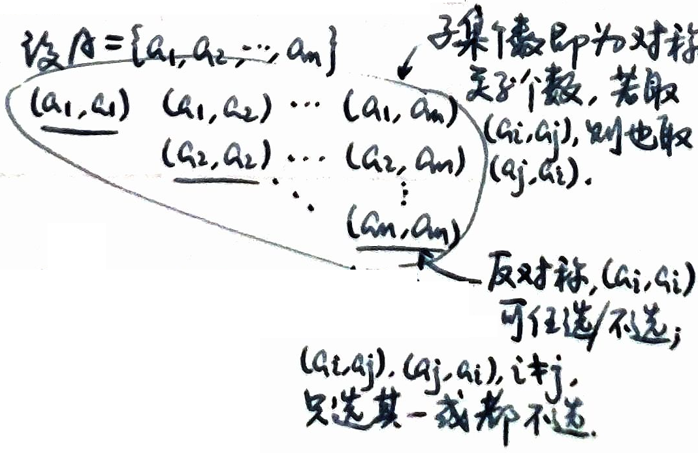
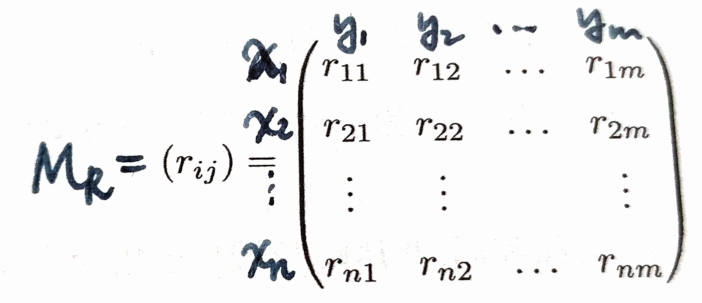
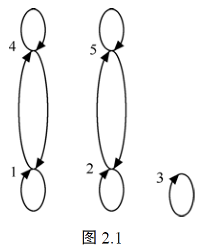
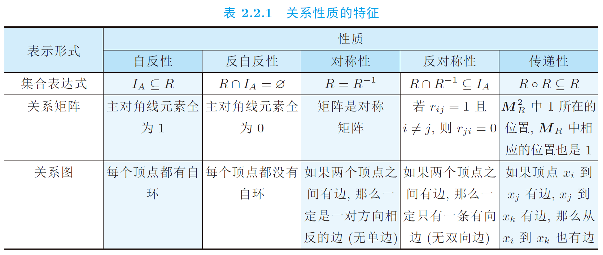

# 第2章 关系

## 2.1 二元关系

关系和集合都是现实生活中的概念,在集合与集合之间往往存在着某种关系。例如,在两个不同集合之间存在着诸如这样的关系: 教师集合和学生集合之间存在着师生关系, 学生集合和课程集合之间存在着学生选修课程的关系等; 在同一个集合中也可以存在着某种关系, 比如, 在学生集合中有同学关系, 有同桌关系等; 在多个集合之间也往往存在着多元的关系, 比如, 在学生集合, 课程集合和任课教师集合这3个集合之间存在着教学关系。

我们通常用表格来表示现实世界中这样的关系。例如, 表2.1表示在学生集合和课程集合之间存在着的学生选修课程的关系, 其中李洋选修程序设计和政治, 苏展选修数学等。用关系的术语, 我们可以说李洋与程序设计有关系, 也与政治有关系; 苏展与数学有关系。明显地, 表2.1可以用一个有序对集合表示。

**表2.1**

| 学 生 | 课 程  |
| --- | ---- |
| 李洋  | 程序设计 |
| 苏展  | 数学   |
| 王净晶 | 程序设计 |
| 李洋  | 政治   |
| 徐智婷 | 物理   |

我们可以抽象地把关系定义为一个有序对所组成的集合, 在每个有序对中, 第1个元素和第2个元素之间存在着关系。

#### 定义2.1

设A和B是任意两个集合，$A\times B$的子集R称为从A到B的**二元关系**。当$A=B$时，称R为A上的二元关系。
若$(a,b)\in R$，则称a与b有关系R，记为$aRb$。
若$(a,b)\notin R$，则称a与b没有关系R，记为 $a\overline{R}b$ 或 $x\cancel{R}y$。

- 若$R=\varnothing$，则称R为**空关系**。
- 若$R=A\times B$，则称R为**全域关系**（全关系）。

由定义2.1，我们知道，二元关系不仅是集合，而且是一种特殊的集合；组成二元关系的元素是有序对。

从$A$到$B$的二元关系的个数等于 $A \times B$ 的子集的个数，这依赖于$A$和$B$的元素个数，即，如果$|A|=n,|B|=m$，那么有$2^{mn}$个从$A$到$B$的二元关系。

#### 定义2.2

设R是从A到B的二元关系，A的一个子集$\{a|$存在b，使得$(a,b)\in R\}$称为R的**定义域**，记为$\text{Dom }R$。
B的一个子集$\{b|$存在a，使得$(a,b)\in R\}$称为R的**值域**，记为$\text{Ran }R$。
A称为R的**前域**，B称为R的**陪域**，并且$\text{Dom }R \subseteq A$，$\text{Ran }R \subseteq B$。

> 设 $R \subseteq A \times B$，$R$ 的**定义域** $\text{Dom}(R) = \{ a \in A \mid \exists b \in B, (a,b) \in R \}$.
> $R$ 的**值域** $\text{Ran}(R) = \{ b \in B \mid \exists a \in A, (a,b) \in R \}$.

给定关系 $R \subseteq A \times B$，对任意 $x \in A$ 和 $X \subseteq A$，分别定义**元素 $x$ 和子集 $X$ 在 $R$ 下的像**为
$$
R(x) = \{ y \in B \mid xRy \} = \{ y \in B \mid (x,y) \in R \},
$$

$$
R(X) = \{ y \in B \mid \exists x \in X, xRy \} = \bigcup_{x \in X} R(x).
$$

$\forall y\in B,\ R^{-1}(y)=\{ x\in A\mid (x,y)\in R\}$ 称为$y$在$R$下的**原像**.  
$Y\subseteq B,\ R^{-1}(Y)=\{ x\in A\mid \exists y\in Y,\text{使}(x,y)\in R\}$

> 函数是一种特殊的关系。

如果给定的二元关系如表2.1的形式所示, 以表格给出, 那么表格的第1列成员的全体构成关系的定义域, 第2列成员的全体构成关系的值域。

在表2.1中, 设集合$A=${李洋, 苏展, 王净晶, 徐智婷}, 集合$B=${程序设计, 数学, 政治, 物理}。从A到B的二元关系R可写为{ (李洋, 程序设计), (苏展, 数学), (王净晶, 程序设计), (李洋, 政治), (徐智婷, 物理) }。若 (李洋, 政治) $\in R$，也可以记为李洋R政治。

表2.1说明一个关系可以通过列出属于该关系的所有有序对来给出。下面的例2.1说明一个关系也可以通过给出关系中成员的规则来定义。

#### 例2.1（整除关系）

设$A=\{2,3,4\}$，$B=\{3,4,5,6,7\}$，定义从A到B的二元关系R：$(a,b)\in R$当且仅当a整除b（记为$a|b$），称R为从A到B的**整除关系**。则$R=\{(2,4),(2,6),(3,3),(3,6),(4,4)\}$。并且定义域$\text{Dom }R=\{2,3,4\}$，值域$\text{Ran }R=\{3,4,6\}$。$(4,3)\notin R$因为4不能整除3。如果R写成一个表格，如表2.2所示。

**表2.2**

| A | B |
| ---- | ---- |
| 2 | 4 |
| 2 | 6 |
| 3 | 3 |
| 3 | 6 |
| 4 | 4 |

#### 例

- 整数集上的小于等于关系：$R_1 = \{ (a,b) \mid a,b \in \mathbb{Z},\ a \leq b \} \subseteq \mathbb{Z} \times \mathbb{Z}$
- 例2.1（整除关系）：$R_2 = \{ (a,b) \mid a,b \in \mathbb{Z},\ a \neq 0,\ a \mid b \} \subseteq \mathbb{Z} \times \mathbb{Z}.$ （$a \mid b$：$\frac{b}{a}$ 为整数）
- 恒等关系：$I_A = \{ (a,a) \mid a \in A \}$
- 包含关系（$\mathcal{A}$ 为集族）：$R_\subseteq = \{ (X,Y) \mid X,Y \in \mathcal{A},\ X \subseteq Y \}$

#### 例2.2

设$A=\{1,2,3,4\}$。
- 定义A上的二元关系R：$(a,b)\in R$当且仅当$a<b$，称R为A上的**小于关系**；$R=\{(1,2),(1,3),(1,4),(2,3),(2,4),(3,4)\}$；并且$\text{Dom }R=\{1,2,3\}$，$\text{Ran }R=\{2,3,4\}$。
- 定义A上的二元关系$R'$：$(a,b)\in R'$当且仅当$a\leq b$，称$R'$为A上的**小于等于关系**；$R'=\{(1,1),(1,2),(1,3),(1,4),(2,2),(2,3),(2,4),(3,3),(3,4),(4,4)\}$；并且$\text{Dom }R'=\{1,2,3,4\}$，$\text{Ran }R'=\{1,2,3,4\}$。
- 定义A上的二元关系$R''$：$(a,b)\in R''$当且仅当$a≠b$，称$R''$为A上的**不等关系**；$R''=\{(1,2),(2,1),(1,3),(3,1),(1,4),(4,1),(2,3),(3,2),(2,4),(4,2),(3,4),(4,3)\}$；并且$\text{Dom }R''=\{1,2,3,4\}$，$\text{Ran }R''=\{1,2,3,4\}$。

#### 例2.3

$A=\{1,2,3,4\}$，定义A上的二元关系R：$(a,b)\in R$当且仅当$(a-b)/3$为整数。这称为**模3同余关系**。
$R=\{(a,b) | (a-b)/3\text{ 为整数}, a\in A, b\in A\}=\{(1,1),(2,2),(3,3),(4,4),(1,4),(4,1)\}$。
$\text{Dom }R=\text{Ran }R=A$。
进一步可定义整数集上的**模r同余关系**：$\{(a,b) | (a-b)/r\text{ 为整数}, a\in Z, b\in Z, r\in Z^+\}$

#### 例2.4

设$A=\{1,2,3,4,5\}$，A上共有多少个二元关系？
解：因为A上的二元关系R是$A\times A$的子集，所以A上的一个二元关系是$A\times A$的幂集中的一个元素。因为$|A\times A|=25$，$|\mathcal{P}(A\times A)|=2^{25}$，所以A上的二元关系的个数是$2^{25}$。

#### 定义2.3

设$A_1,A_2,\dots,A_n$是n个任意集合，定义$A_1\times A_2\times \dots\times A_n$的子集R为$A_1,A_2,\dots,A_n$的**n元关系**，当$A_1=A_2=\dots=A_n$时，R称为A上的n元关系。

关系这个概念在计算机科学和工程中很重要, 在数据库的关系模型中常用n元关系来描述数据间的关系。前面讲到的表格可以用来表示一个n元关系, 在2.4节中将做进一步介绍。

---

## 2.2 关系的性质

首先, 讨论集合A上二元关系的几个性质。

#### 定义2.4

设R是集合A上的二元关系。
1. 如果对任意$a\in A$，有$(a,a)\in R$，则称R是**自反的**。
2. 如果对任意$a\in A$，有$(a,a)\notin R$，则称R是**反自反的**。
3. 对任意$a,b\in A$，如果$(a,b)\in R$必有$(b,a)\in R$，则称R是**对称的**。
4. 对任意$a,b\in A$，如果$(a,b)\in R$且$(b,a)\in R$必有$a=b$，则称R是**反对称的**；或者如果$(a,b)\in R$并且$a≠b$，必有$(b,a)\notin R$，则称R是反对称的。
5. 对任意$a,b,c\in A$，如果$(a,b)\in R$且$(b,c)\in R$，必有$(a,c)\in R$，则称R是**传递的**。

#### 例2.5

对于例2.2，小于关系R是反自反的，反对称的和传递的；小于等于关系$R'$是自反的，反对称的和传递的；不等关系$R''$是反自反的，对称的，但不是传递的。

#### 例2.6

设$A=\{1,2,3,4\}$。
- 设A上的二元关系$R_1=\{(1,1),(1,2)\}$，则$R_1$既不是自反的，也不是反自反的；所以，在A上的二元关系中，**可以有既不是自反的，也不是反自反的关系**。
- 设A上的二元关系$R_2=\{(2,1),(1,2),(1,3)\}$，则$R_2$既不是对称的，也不是反对称的；所以，在A上的二元关系中，**可以有既不是对称的，也不是反对称的关系**。

对于在集合A上的二元关系R, **R或者是传递的, 或者不是传递的, 二者必居其一**。
设A上的二元关系$R_3=\{(1,2),(2,3),(1,3)\}$，$R_4=\{(1,2),(1,3)\}$和$R_5=\{(1,2)\}$，则$R_3$，$R_4$和$R_5$是传递的；而$R_6=\{(1,2),(2,3)\}$不是传递的。
根据定义2.4(5)，如果对于集合A上的二元关系R，如果有$(a,b)\in R$，$(b,c)\in R$，且$(a,c)\notin R$的情况存在，则R不是传递的；否则，R是传递的。

> 全关系是自反的。
> $\emptyset$ 和 $I_A$ 既是对称的，也是反对称的。

#### 💡关系的个数

设 $|A| = n$：
- $A$ 上的**自反关系**有 $2^{n^2 - n}$ 个（因为 $I_A \subseteq R \subseteq A \times A$）。
- $A$ 上的**反自反关系**有 $2^{n^2 - n}$ 个（因为 $|A \times A - I_A| = n^2 - n$）。
- $A$ 上的**对称关系**有 $2^{\frac{n(n+1)}{2}}$ 个，**反对称关系**有 $2^n \cdot 3^{\frac{n(n-1)}{2}}$ 个。

$$
\begin{array}{cccc}
(a_1,a_1) & (a_1,a_2) & (a_1,a_3) & \dots & \ (a_1,a_n) \\
& (a_2,a_2) & (a_2,a_3) & \dots & \ (a_2,a_n) \\
& & (a_3,a_3) & \dots & \ (a_3,a_n) \\
& & & \ddots & \vdots \\
& & & & (a_n,a_n)
\end{array}
$$

传递关系的个数？

以下定理分别给出这 5 种性质成立的充要条件。

### ⭐补充：定理2.2.1

**设 $R$ 为 $A$ 上的关系，则：**
1. **$R$ 为 $A$ 上的自反关系当且仅当 $I_A \subseteq R$。**
2. **$R$ 为 $A$ 上的反自反关系当且仅当 $R \cap I_A = \emptyset$。**
3. **$R$ 为 $A$ 上的对称关系当且仅当 $R = R^{-1}$。**
4. **$R$ 为 $A$ 上的反对称关系当且仅当 $R \cap R^{-1} \subseteq I_A$。**
5. **$R$ 为 $A$ 上的传递关系当且仅当 $R \circ R \subseteq R$。**

#### 证明

1. **自反关系的证明**
   - **必要性**：若 $R$ 是 $A$ 上的自反关系，由定义，对任意 $x \in A$，均有 $(x,x) \in R$，故 $I_A \subseteq R$。
   - **充分性**：对任意 $x \in A$，由 $(x,x) \in I_A \subseteq R$ 知 $(x,x) \in R$，因此 $R$ 在 $A$ 上是自反的。

2. **反自反关系的证明**
   - **必要性（反证法）**：假设 $R \cap I_A \neq \emptyset$，则存在 $(x,y) \in R \cap I_A$。因 $I_A$ 是恒等关系，故 $y = x \in A$ 且 $(x,x) \in R$，与 $R$ 是反自反关系矛盾。
   - **充分性（反证法）**：假设 $R$ 不是反自反的，则存在 $x \in A$ 使得 $(x,x) \in R$，故 $(x,x) \in R \cap I_A$，与 $R \cap I_A = \emptyset$ 矛盾。

3. **对称关系的证明**
   - **必要性**：对任意 $(x,y)$，因 $R$ 是对称关系，故 $(x,y) \in R \iff (y,x) \in R$，而 $(y,x) \in R \iff (x,y) \in R^{-1}$，因此 $R = R^{-1}$。
   - **充分性**：任取 $(x,y)$，由 $R = R^{-1}$ 知，若 $(x,y) \in R$，则 $(y,x) \in R^{-1} = R$，故 $R$ 是对称关系。

4. **反对称关系的证明**
   - **必要性**：对任意 $(x,y) \in R \cap R^{-1}$，有 $(x,y) \in R$ 且 $(y,x) \in R$。因 $R$ 是反对称关系，故 $x = y$，即 $(x,y) \in I_A$，因此 $R \cap R^{-1} \subseteq I_A$。
   - **充分性**：任取 $(x,y) \in R$ 且 $(y,x) \in R$，则 $(x,y) \in R \cap R^{-1} \subseteq I_A$，故 $x = y$，因此 $R$ 是反对称关系。

5. **传递关系的证明**
   - **必要性**：对任意 $(x,y) \in R \circ R$，存在 $z$ 使得 $(x,z) \in R$ 且 $(z,y) \in R$。因 $R$ 是传递关系，故 $(x,y) \in R$，因此 $R \circ R \subseteq R$。
   - **充分性**：若 $(x,y) \in R$ 且 $(y,z) \in R$，则 $(x,z) \in R \circ R \subseteq R$，故 $(x,z) \in R$，因此 $R$ 是传递关系。

定理2.2.1给出了关系性质的集合表达式刻画形式。

在上面中, 关系是用集合的枚举表示方法, 列出了关系中所有的有序对。关系的表示除了可以用集合的枚举表示方法之外, 为了使关系的表示更简洁明了, 对于有限集的情况, 还可以用矩阵或图形来表示关系。

### 关系的表示
#### 定义2.5

设A和B是两个有限集$A=\{a_1,a_2,\dots,a_m\}$，$B=\{b_1,b_2,\dots,b_n\}$，R是从A到B的二元关系，称$m\times n$阶矩阵$M_R=(m_{ij})$为R的**关系矩阵**，其中
$$
m_{ij}=
\begin{cases}
1, & (a_i,b_j)\in R \\
0, & (a_i,b_j)\notin R
\end{cases}
$$
当$A=B$时，A上的二元关系R可以用方阵来表示。

#### 例2.7

例2.1中的从A到B的整除关系R的关系矩阵（集合A的元素次序为2，3，4；集合B的元素次序为3，4，5，6，7）为
$$
M_R=
\begin{pmatrix}
0 & 1 & 0 & 1 & 0 \\
1 & 0 & 0 & 1 & 0 \\
0 & 1 & 0 & 0 & 0
\end{pmatrix}
$$
在矩阵$M_R$的上方和左方分别依次标记为B和A中的元素，这样便保证关系R对应唯一的关系矩阵$M_R$。显然，通过矩阵表示，A中的某个元素是否和B中的某个元素存在关系就很清晰明了了。

设R是A上的二元关系，若R是自反的，则$M_R$中的对角线元素均为1。若是反自反的，则$M_R$中的对角线元素均为0。若是对称的，则$M_R$是对称矩阵。若是反对称的，则在$M_R$中对于$i≠j$，由$m_{ij}=1$可推出$m_{ji}=0$。

有限集A上的二元关系除用方阵表示外，还可用**关系图**来表示。这样的图也被称为有向图，将在第8章中详细介绍。

设$A=\{a_1,a_2,\dots,a_n\}$，R是A上的二元关系。A中每个元素$a_i$用一个点表示，称该点为**顶点**$a_i$。如果$(a_i,a_j)\in R$，则画一条从顶点$a_i$到顶点$a_j$的带箭头的线，称该线为**弧**。如果$(a_i,a_i)\in R$，则画一条从顶点$a_i$到顶点$a_i$的带箭头的封闭弧，称该弧为**自环**。对于关系R中的每个有序对都可对应地画一条弧，从而得到表示关系R的图形，称为R的**关系图**。

#### 例2.8

设$A=\{1,2,3,4,5\}$，A上的模3同余关系$R=\{(1,1),(2,2),(3,3),(4,4),(5,5),(1,4),(4,1),(2,5),(5,2)\}$的关系图如图2.1所示。

#### ⭐小结

对有限集上的关系而言，关系的性质也明显地反映在它的关系矩阵和关系图上。表2.2.1列出了5种性质在关系矩阵和关系图中的特征。

---

## 2.3 关系的运算

从A到B的二元关系是$A\times B$的子集。因为关系也是一个集合，所以有关集合的并、交、差、补运算以及相应的性质同样适用于关系。定义二元关系的运算如下。

#### 定义2.6

设$R_1$和$R_2$是从A到B的两个二元关系，对于$\forall a\in A$，$b\in B$，定义：
- $R_1\cup R_2$：$(a,b)\in R_1\cup R_2$当且仅当$(a,b)\in R_1$或$(a,b)\in R_2$；
- $R_1∩R_2$：$(a,b)\in R_1∩R_2$当且仅当$(a,b)\in R_1$且$(a,b)\in R_2$；
- $R_1-R_2$：$(a,b)\in (R_1-R_2)$当且仅当$(a,b)\in R_1$且$(a,b)\notin R_2$；
- $\overline{R}$：$a\overline{R}b$当且仅当$(a,b)\notin R$（其中$\overline{R}=(A\times B)-R$）

然而，二元关系又是一种特殊的集合，构成关系的元素是有序对。所以下面又定义关系的另一些运算，通过这些运算可以由已知关系产生新的关系。

### 逆运算

对于表2.1，{ (李洋, 程序设计), (苏展, 数学), (王净晶, 程序设计), (李洋, 政治), (徐智婷, 物理) }反映了学生选课情况，而{ (程序设计, 李洋), (数学, 苏展), (程序设计, 王净晶), (政治, 李洋), (物理, 徐智婷) }则反映了课程被学生选修的情况。这样通过关系的逆运算，由给定关系产生其逆关系。

#### 定义2.7

设R是从A到B的二元关系，则从B到A的二元关系记为$R^{-1}$，定义为：$R^{-1}=\{(b,a)|(a,b)\in R\}$称为R的**逆关系**。

例如，$R=\{(1,2),(2,3),(1,3)\}$，则$R^{-1}=\{(2,1),(3,2),(3,1)\}$。

#### 定理2.1

设R，$R_1$，$R_2$是从A到B的二元关系，则
1. $(R^{-1})^{-1}=R$。
2. $(R_1\cup R_2)^{-1}=R_1^{-1}\cup R_2^{-1}$。
3. $(R_1∩R_2)^{-1}=R_1^{-1}∩R_2^{-1}$。
4. $(A\times B)^{-1}=B\times A$。
5. $\varnothing^{-1}=\varnothing$。
6. $\overline{R}^{-1}=\overline{R^{-1}}$。
7. $(R_1-R_2)^{-1}=R_1^{-1}-R_2^{-1}$。
8. 若$R_1 \subseteq R_2$则$R_1^{-1} \subseteq R_2^{-1}$。

**证明**：
1. $(a,b)\in R ⇔ (b,a)\in R^{-1} ⇔ (a,b)\in (R^{-1})^{-1}$，则$(R^{-1})^{-1}=R$。
2. $(b,a)\in (R_1\cup R_2)^{-1} ⇔ (a,b)\in R_1\cup R_2 ⇔ (a,b)\in R_1$或者$(a,b)\in R_2 ⇔ (b,a)\in R_1^{-1}$或者$(a,b)\in R_2^{-1} ⇔ (b,a)\in R_1^{-1}\cup R_2^{-1}$；因此$(R_1\cup R_2)^{-1}=R_1^{-1}\cup R_2^{-1}$。
7. 因为$R_1-R_2=R_1∩\overline{R_2}$，所以$(R_1-R_2)^{-1}=(R_1∩\overline{R_2})^{-1}=R_1^{-1}∩\overline{R_2}^{-1}=R_1^{-1}∩\overline{R_2^{-1}}=R_1^{-1}-R_2^{-1}$。

其他留给读者自行证明。
$\square$

由定理2.1的证明可知，因为关系是集合，所以证明关系运算表达式相等可以采用证明集合运算表达式的方法。**（证明两个集合相等的方法）通过证明左式 $\subseteq$ 右式以及右式 $\subseteq$ 左式，则可以推导出左式=右式**；或者通过运算的推导来进行证明。

#### 定理2.2

**设R是A上的二元关系，则R是对称的当且仅当$R=R^{-1}$。**

要证明R是对称的，就要根据对称的定义，对于任意的$(a,b)\in R$，证明$(b,a)\in R$成立。证明留作**习题2.3**。

### 复合运算

先举一个例子，兄妹关系为$R_1$，母子关系为$R_2$，如果$(a,b)\in R_1$，$(b,c)\in R_2$，也就是说a与b是兄妹关系，而b与c有母子关系，则a与c之间通过b可以建立一种新的关系：舅舅和外甥的关系，这样在$R_1$和$R_2$的基础上建立新的关系称为复合关系，记为$R_1\circ R_2$。a与c之间有舅甥关系，记为$(a,c)\in R_1\circ R_2$。从$R_1$和$R_2$得到$R_1\circ R_2$的运算称为**复合运算**。

#### 定义2.8

设$R_1$是从A到B的二元关系，$R_2$是从B到C的二元关系，则从A到C的二元关系记为$R_1\circ R_2$，定义为：$R_1\circ R_2=\{(a,c)|a\in A，c\in C，并且存在b\in B，使得(a,b)\in R_1，(b,c)\in R_2\}$，称为$R_1$和$R_2$的**复合关系**。

> 关系复合 $R \circ S = \{ (x,z) \mid \exists y \in B,\ (x,y) \in R,\ (y,z) \in S \} \subseteq A \times C$。
> 若 $\text{Ran}(R) \cap \text{Dom}(S) = \emptyset$，则 $R \circ S = \emptyset$。

#### 例2.9

设$A=\{p,q,r,s\}$，$B=\{a,b\}$，$C=\{1,2,3,4\}$，且从A到B的关系$R_1=\{(p,a),(p,b),(q,b),(r,a),(s,a)\}$，从B到C的关系$R_2=\{(a,1),(a,2),(b,4)\}$，则从A到C的复合关系$R_1\circ R_2=\{(p,1),(p,2),(p,4),(q,4),(r,1),(r,2),(s,1),(s,2)\}$。

显然，$R_1$和$R_2$复合的前提是$R_1$是从A到B的二元关系，$R_2$是从B到C的二元关系。如果$\text{Ran }R_1∩\text{Dom }R_2=\varnothing$，则$R_1\circ R_2$是空关系。

#### 例

设 $A = \{1,2,3\},\ B = \{a,b,c\},\ D = \{u,v,x,y,z\}$，
关系 $R = \{ (1,a), (2,a), (1,b), (3,b), (2,c), (3,c) \}$，
关系 $S = \{ (a,u), (a,x), (b,y), (b,z), (c,v), (c,x) \}$。

则 $R \circ S = \{ (1,u), (1,x), (2,u), (2,x),\ (1,y), (1,z), (3,y), (3,z),\ (2,v), (2,x), (3,v), (3,x) \} \subseteq A \times D$。

#### 定理2.3

设$R_1$是从A到B的二元关系，$R_2$是从B到C的二元关系，$R_3$是从C到D的二元关系，则有$R_1\circ (R_2\circ R_3)=(R_1\circ R_2)\circ R_3$（**结合律**）。

**证明**：
设$(a,d)\in R_1\circ (R_2\circ R_3)$，则存在c使$(a,c)\in R_2\circ R_3$，$(c,d)\in R_3$；因为$(a,c)\in R_2\circ R_3$，则存在b使$(a,b)\in R_1$，且$(b,c)\in R_2$；又由$(b,c)\in R_2$，$(c,d)\in R_3$，则$(b,d)\in R_2\circ R_3$；所以$(a,d)\in R_1\circ (R_2\circ R_3)$。同理可证$R_1\circ (R_2\circ R_3) \subseteq (R_1\circ R_2)\circ R_3$。
$\square$

复合运算不满足交换律，即，在一般情况下，$R_1\circ R_2≠R_2\circ R_1$。

#### 关系复合的结合律证明

设 $R_1 \subseteq A_1 \times A_2,\ R_2 \subseteq A_2 \times A_3,\ R_3 \subseteq A_3 \times A_4$，证明：$(R_1 \circ R_2) \circ R_3 = R_1 \circ (R_2 \circ R_3) \subseteq A_1 \times A_4$。

**先证左边 $\subseteq$ 右边**：
对任意 $(a_1,a_4) \in (R_1 \circ R_2) \circ R_3$，由定义，存在 $a_3 \in A_3$，使 $(a_1,a_3) \in R_1 \circ R_2$ 且 $(a_3,a_4) \in R_3$。
又因 $(a_1,a_3) \in R_1 \circ R_2$，故存在 $a_2 \in A_2$，使 $(a_1,a_2) \in R_1$ 且 $(a_2,a_3) \in R_2$。
由 $(a_2,a_3) \in R_2$ 且 $(a_3,a_4) \in R_3$，得 $(a_2,a_4) \in R_2 \circ R_3$；
再由 $(a_1,a_2) \in R_1$ 且 $(a_2,a_4) \in R_2 \circ R_3$，得 $(a_1,a_4) \in R_1 \circ (R_2 \circ R_3)$。
因此左边 $\subseteq$ 右边。

**同理可证右边 $\subseteq$ 左边**，故 $(R_1 \circ R_2) \circ R_3 = R_1 \circ (R_2 \circ R_3)$。

#### 广义结合律

设 $R_i \subseteq A_i \times A_{i+1},\ i=1,2,\dots,n$，则任意加括号方式的关系复合结果相等，记为 $R_1 \circ R_2 \circ \dots \circ R_n = (\dots((R_1 \circ R_2) \circ R_3) \circ \dots \circ R_{n-1}) \circ R_n$。

**加括号方式数（卡特兰数）**：
满足递推式 $a_n = \sum_{k=1}^{n-1} a_k a_{n-k}$（$a_1=a_2=1$），例如：
- 2个关系：$a_2=1$（仅 $R_1 \circ R_2$）
- 3个关系：$a_3=2$（$(R_1 \circ R_2) \circ R_3$、$R_1 \circ (R_2 \circ R_3)$）
- 4个关系：$a_4=5$：
	1. $((R_1 \circ R_2) \circ R_3) \circ R_4$
	2. $(R_1 \circ (R_2 \circ R_3)) \circ R_4$
	3. $R_1 \circ ((R_2 \circ R_3) \circ R_4)$
	4. $R_1 \circ (R_2 \circ (R_3 \circ R_4))$
	5. $(R_1 \circ R_2) \circ (R_3 \circ R_4)$

#### 💡广义结合律的归纳证明

**基例**：当 $n=1,2$ 时，$R_1=R_1$、$R_1 \circ R_2=R_1 \circ R_2$，结论显然成立。

**归纳假设**：设 $n \leq k$ 时，结论成立。

**归纳步骤**：当 $n=k+1$ 时，$R_1 \circ R_2 \circ \dots \circ R_{k+1}$ 可表示为 $(R_1 \circ \dots \circ R_s) \circ (R_{s+1} \circ \dots \circ R_{k+1})$（最外面一层的复合运算，拆分为两个关系复合）。
由归纳假设，对于 $\leq k$ 个关系的复合运算有 $R_{s+1} \circ \dots \circ R_{k+1} = (\dots((R_{s+1} \circ R_{s+2}) \circ R_{s+3}) \circ \dots \circ R_k) \circ R_{k+1}$；
再由关系复合的结合律，得：
$$
\begin{align*}
(R_1 \circ \dots \circ R_s) \circ (R_{s+1} \circ \dots \circ R_{k+1})
&= (R_1 \circ \dots \circ R_s) \circ [(\dots((R_{s+1} \circ R_{s+2}) \circ R_{s+3}) \circ \dots \circ R_k) \circ R_{k+1}] \\
&= [ (R_1 \circ \dots \circ R_s) \circ (\dots((R_{s+1} \circ R_{s+2}) \circ R_{s+3}) \circ \dots \circ R_k) ] \circ R_{k+1} \\
&= (\dots((R_1 \circ R_2) \circ R_3) \circ \dots \circ R_k) \circ R_{k+1}.
\end{align*}
$$

由此可得：关系幂的运算性质 $R^n \circ R^m = R^{n+m}$。

### 幂运算

设R是A上的一个二元关系，$R\circ R$记为$R^2$，$R\circ R\circ R$记为$R^3$等，于是我们可以定义R的**幂运算**。

#### 定义2.9

设R是A上的二元关系，$n\in N$，R的n次幂记为$R^n$，定义如下：
1. $R^0$是A上的恒等关系，即$R^0=\{(a,a)|a\in A\}$，记为$I_A$；$R^1=R$。
2. $R^{n+1}=R^n\circ R$。

#### 定理2.4

设R是A上的二元关系，$m,n\in N$，则
1. $R^m\circ R^n=R^{m+n}$
2. $(R^m)^n=R^{mn}$

**证明**留作习题，用归纳法证明。

以上所述由关系的并、交、逆和复合运算得到新的关系都可以用关系矩阵来表示。

设$A=\{a_1,a_2,\dots,a_n\}$，$B=\{b_1,b_2,\dots,b_m\}$，$R_1$和$R_2$都是A到B的二元关系，$n\times m$阶矩阵$M_{R_1}=(x_{ij})$和$M_{R_2}=(y_{ij})$分别是$R_1$和$R_2$的关系矩阵（关于A和B中元素次序），那么$M_{R_1\cup R_2}=(z_{ij})$，$M_{R_1∩R_2}=(w_{ij})$，其中$z_{ij}=x_{ij}∨y_{ij}$，$w_{ij}=x_{ij}∧y_{ij}$，运算规则如下所示。

| $\vee$ | 0 | 1 | $\wedge$ | 0 | 1 |
| ---- | ---- | ---- | ---- | ---- | ---- |
| 0 | 0 | 1 | 0 | 0 | 0 |
| 1 | 1 | 1 | 1 | 0 | 1 |

#### 例2.10

设$A=\{2,3,4\}$，$B=\{1,3,5,7\}$，$R_1=\{(2,3),(2,5),(2,7),(3,5),(3,7),(4,5),(4,7)\}$，$R_2=\{(2,5),(3,3),(4,1),(4,7)\}$。则$R_1$和$R_2$的关系矩阵以及$R_1$和$R_2$的并和交的关系矩阵如下。

$$
M_{R_1}=
\begin{pmatrix}
0 & 1 & 1 & 1 \\
0 & 0 & 1 & 1 \\
0 & 0 & 1 & 1
\end{pmatrix}
$$

$$
M_{R_2}=
\begin{pmatrix}
0 & 0 & 1 & 0 \\
0 & 1 & 0 & 0 \\
1 & 0 & 0 & 1
\end{pmatrix}
$$

$$
M_{R_1\cup R_2}=
\begin{pmatrix}
0 & 1 & 1 & 1 \\
0 & 1 & 1 & 1 \\
1 & 0 & 1 & 1
\end{pmatrix}
$$

$$
M_{R_1∩R_2}=
\begin{pmatrix}
0 & 0 & 1 & 0 \\
0 & 0 & 0 & 0 \\
0 & 0 & 0 & 1
\end{pmatrix}
$$

设$M_R$是从A到B的二元关系R的关系矩阵，那么逆关系$R^{-1}$的关系矩阵$M_{R^{-1}}=M_R^T$，其中$M_R^T$是$M_R$的**转置矩阵**。例2.10中$R_1$的逆关系$R_1^{-1}$的关系矩阵为

$$
M_{R_1^{-1}}=M_{R_1}^T=
\begin{pmatrix}
0 & 0 & 0 \\
1 & 0 & 0 \\
1 & 1 & 1 \\
1 & 1 & 1
\end{pmatrix}
$$

设$A=\{a_1,a_2,\dots,a_n\}$，$B=\{b_1,b_2,\dots,b_m\}$，$C=\{c_1,c_2,\dots,c_r\}$，$R_1$是A到B的二元关系，其关系矩阵$M_{R_1}=(x_{ik})$是$n\times m$阶矩阵，$R_2$是B到C的二元关系，其关系矩阵$M_{R_2}=(y_{kj})$是$m\times r$阶矩阵，则$R_1$和$R_2$的复合关系$R_1\circ R_2$的关系矩阵$M_{R_1\circ R_2}=(z_{ij})$是$n\times r$阶矩阵。其中
$$
z_{ij}=\bigvee_{k=1}^m (x_{ik}∧y_{kj}) \quad i=1,2,\dots,n,j=1,2,\dots,r
$$

#### 关系的$n$次幂$R^n$的计算方法

给定$A$上的关系$R$和$n \in \mathbb{N}$，$n=0$或$n=1$时结果显然；当$n \geq 2$时，分3种情形处理：

##### (i) 集合表示的$R$

根据定义，通过$n-1$次复合运算得到$R^n$。

##### (ii) 关系矩阵表示的$R$

$R^n$的关系矩阵是$M_R^n$（$n$个$M_R$的乘积），关系矩阵的乘法定义：
设$M_R = (r_{ij})$是$r \times s$阶矩阵，$M_S = (s_{ij})$是$s \times t$阶矩阵，则$M_R M_S = (t_{ij})$是$r \times t$阶矩阵，其中：
$$
t_{ij} = \max_{k=1}^s \min\{ r_{ik}, s_{kj} \}, \quad i=1,2,\dots,r;\ j=1,2,\dots,t
$$

> 按矩阵乘法类似，$M_R^k = M_R^{k-1} \cdot M_R$
> 实际是$(M_R第i行)·(M_S第j列)$中，若有一项使$\min\{r_{ik},s_{kj}\}=1$，则$t_{ij}=1$。

##### (iii) 关系图表示的$R$

$R^n$的关系图$G_R^n$与$G_R$顶点集相同；$G_R^n$中存在从$v_i$到$v_j$的边，当且仅当$G_R$中从$v_i$出发经$n$步路径可到达$v_j$。

### 投影运算（略）

下面介绍一种很有实际用途的关系运算——**投影运算**。

在关系数据库中，用关系来描述数据时还常常应用投影运算进行数据操作。

#### 定义2.10
设R是$A_1,A_2,\dots,A_n$的n元关系，定义R在$A_{i_1},A_{i_2},\dots,A_{i_m}$上的投影是一个m元关系，它是通过选取R中的每个有序n元组的第$i_1$，第$i_2$，…，第$i_m$个分量组成有序m元组作为m元关系中的元素，这个投影记为$\Pi_{A_{i_1},A_{i_2},\dots,A_{i_m}}(R)$。

#### 例2.11
设R定义如下。

| A | B | C |
| ---- | ---- | ---- |
| 1 | 2 | 3 |
| 4 | 1 | 6 |
| 3 | 2 | 4 |

则投影$\Pi_{A,C}(R)$如下。

| A | C |
| ---- | ---- |
| 1 | 3 |
| 4 | 6 |
| 3 | 4 |

---

## 2.4 关系数据库的一个实例（略）

---

## 2.5 关系的闭包（接下来两节的笔记待补充完整——20260102）

<!--  ？？？ -->

从给定关系R出发构造一个新关系$R'$，使得$R'$具有某种性质，并且$R'$又是具有该种性质并且包含R的所有关系中最小的关系。从关系R得到这样的新关系$R'$的运算称为**闭包运算**。现定义如下。

#### 定义2.11

设R是A上的二元关系，定义R的**自反（对称，传递）闭包**，记为$R'$，满足下列3个条件：
(1) $R'$是自反的（对称的，传递的）。
(2) $R \subseteq R'$。
(3) 对任一自反（对称，传递）关系$R''$，若$R \subseteq R''$，则$R' \subseteq R''$。

R的自反闭包，对称闭包和传递闭包分别记为$r(R)$，$s(R)$和$t(R)$，$r(R)$又可记为$R^r$。

由定义2.11，可以看出R的自反（对称，传递）闭包是包含R，且具有自反（对称，传递）性质的所有关系中的最小关系。

#### 例2.17

(1) 在例2.2中，对于A上的小于关系R，A上的小于等于关系$R'$是R的自反闭包，A上的不等关系$R''$是R的对称闭包，R的传递闭包还是R。
(2) 设R是$A=\{1,2,3\}$上的二元关系，且$R=\{(1,2),(1,3)\}$，则$r(R)=\{(1,1),(2,2),(3,3),(1,2),(1,3)\}$；$s(R)=\{(1,2),(1,3),(2,1),(3,1)\}$；$t(R)=R$。

由定义2.11，容易得到如下定理。

#### 定理2.5

设R是A上的二元关系，则
(1) R是自反的当且仅当$r(R)=R$。
(2) R是对称的当且仅当$s(R)=R$。
(3) R是传递的当且仅当$t(R)=R$。

并且$r(R)$，$s(R)$，$t(R)$具有单调性，如下述定理。

#### 定理2.6

设$R_1$和$R_2$是A上的二元关系，$R_1 \subseteq R_2$则
(1) $r(R_1) \subseteq r(R_2)$。
(2) $s(R_1) \subseteq s(R_2)$。
(3) $t(R_1) \subseteq t(R_2)$。

证明留作习题。

下面对自反闭包，对称闭包和传递闭包分别作进一步讨论，根据给出的关系，给出求闭包的一般表达式。

#### 定理2.7

设R是集合A上的二元关系，$I_A$是集合A上的恒等关系，则$r(R)=R\cup I_A$。

**证明**：令$R'=R\cup I_A$。要证明$R'$是R的自反闭包，就要根据定义2.11，证明$R'$满足自反闭包定义中的3个条件即可。
(1) 因为对任意$a\in A$，有$(a,a)\in I_A \subseteq R\cup I_A=R'$，所以$R'$自反。
(2) 又因为$R'=R\cup I_A$，所以$R \subseteq R'$。
(3) 假设有A上的二元关系$R''$，$R''$自反且$R \subseteq R''$，对任意的$(a,b)\in R'=R\cup I_A$，若$(a,b)\in R$，则因为$R \subseteq R''$，故$(a,b)\in R''$；若$(a,b)\in I_A$，即$b=a$，则因为$R''$自反，故$(a,b)\in R''$；所以总有$(a,b)\in R''$，因此$R' \subseteq R''$。
即$R'=R\cup I_A$是R的自反闭包。
$\square$

#### 定理2.8
设R是集合A上的二元关系，则$s(R)=R\cup R^{-1}$。

**证明**：令$R'=R\cup R^{-1}$。同理，要证明$R'$是R的对称闭包，就要根据定义2.11，验证$R'$满足闭包定义的3个条件。
因为$(R\cup R^{-1})^{-1}=R^{-1}\cup R=R\cup R^{-1}$，由定理2.2，可知$R\cup R^{-1}$是对称的，且$R \subseteq R'$。假设$R''$是A上的对称关系，并且$R \subseteq R''$。对于任意的$(a,b)\in R'$，则有$(a,b)\in R$或者$(a,b)\in R^{-1}$。如果$(a,b)\in R$，由于$R \subseteq R''$，那么$(a,b)\in R''$；如果$(a,b)\in R^{-1}$，则$(b,a)\in R$，所以$(b,a)\in R''$。因为$R''$是对称的，所以$(a,b)\in R''$。因此$R' \subseteq R''$。所以$R'=s(R)=R\cup R^{-1}$。
$\square$

#### 例2.18
(1) 在例2.2中，对于A上的小于关系R，A上的小于等于关系$R'$是R的自反闭包，$R'=R\cup I_A$；A上的不等关系$R''$是R的对称闭包，$R''=R\cup R^{-1}$。
(2) 整数集I上的恒等关系的自反闭包还是恒等关系；I上的空关系的自反闭包是恒等关系；I上的“≠”关系的自反闭包则是全关系。
(3) 整数集I上的“<”关系的对称闭包是“≠”关系；I上的“\leq ”关系的对称闭包则是全关系；I上的恒等关系的对称闭包还是恒等关系；I上的“≠”关系的对称闭包还是“≠”关系。

传递闭包是一个重要的概念，在计算机科学领域中有广泛的应用。

#### 定理2.9
设R是集合A上的二元关系，则$t(R)=\bigcup_{k=1}^\infty R^k=R\cup R^2\cup R^3\cup \dots$。

**证明**：令$R'=R\cup R^2\cup R^3\cup \dots$，由定义2.11，要验证$R'$满足传递闭包定义的3个条件。
(1) 首先证明$R'$是传递的，即如果$(a,b)\in R'$，$(b,c)\in R'$，则$(a,c)\in R'$。因为$(a,b)\in R'$，$(b,c)\in R'$，则必存在正整数i和k，使得$(a,b)\in R^i$，$(b,c)\in R^k$；又因为$R^i\circ R^k=R^{i+k}$，所以$(a,c)\in R^{i+k}$，则$(a,c)\in R'$。即$R'$是传递的。
(2) 因为$R \subseteq R\cup R^2\cup R^3\cup \dots$，所以$R \subseteq R'$。
(3) 假设有A上的二元关系$R''$，$R''$传递且$R \subseteq R''$，如果$(a,b)\in R'$，则存在k，使得$(a,b)\in R^k$，所以存在k-1个元素$c_1,c_2,\dots,c_{k-1}$，使得$(a,c_1)\in R$，$(c_1,c_2)\in R$，…，$(c_{k-1},b)\in R$；因为$R \subseteq R''$，所以$(a,c_1)\in R''$，$(c_1,c_2)\in R''$，…，$(c_{k-1},b)\in R''$。又因为$R''$是传递的，所以$(a,b)\in R''$，因此$R' \subseteq R''$。
所以$R'=t(R)=R\cup R^2\cup R^3\cup \dots$。
$\square$

在实际计算时，对于有限集A，其上的关系的传递闭包只要进行有限次计算即可。

#### 定理2.10
设R是有限集A上的二元关系，且$|A|=n$，则$t(R)=\bigcup_{k=1}^n R^k$。

**证明**：由定理2.9，$\bigcup_{k=1}^n R^k \subseteq t(R)$；现在证明$t(R) \subseteq \bigcup_{k=1}^n R^k$。
当$k\leq n$时，必有$R^k \subseteq R\cup R^2\cup R^3\cup \dots\cup R^n$。
当$k>n$时，若$(a,b)\in R^k$，则存在元素个数为$k+1$的元素序列$c_0,c_1,\dots,c_k$，$c_0=a$，$c_k=b$，并且对$1\leq i\leq k$，$(c_{i-1},c_i)\in R$。由于$k>n$，所以在元素序列中必有元素$c_i$不止出现一次，即$(a,c_i),(c_i,c_2),\dots,(c_{i-1},c_i),(c_i,c_p),\dots,(c_q,c_i),(c_i,c_{i+1}),\dots,(c_{k-1},b)\in R$，在删去$(c_i,c_p),\dots,(c_q,c_i)$这一段后，如果序列中元素个数仍大于n，则继续上述过程，直到序列中元素个数$k'\leq n$为止。此时有$(a,b)\in R^{k'}$，所以$(a,b)\in R\cup R^2\cup R^3\cup \dots\cup R^n$。
$\square$

#### 例2.19
$A=\{a,b,c,d\}$，$R=\{(a,b),(b,a),(b,c),(c,d)\}$，求$t(R)$。
解：$R^2=\{(a,a),(a,c),(b,b),(b,d)\}$，则$R^3=R^2\circ R=\{(a,b),(a,d),(b,a),(b,c)\}$，$R^4=R^3\circ R=\{(a,a),(a,c),(b,b),(b,d)\}=R^2$，因此$t(R)=R\cup R^2\cup R^3=\{(a,b),(b,a),(b,c),(c,d),(a,a),(a,c),(b,b),(b,d),(a,d)\}$。

闭包还有一些其他的性质。

#### 定理2.11

**设R是A上的二元关系。**
**(1) 若R是自反的，则$s(R)$和$t(R)$都是自反的。**
**(2) 若R是对称的，则$r(R)$和$t(R)$都是对称的。**
**(3) 若R是传递的，则$r(R)$是传递的。**

可以分别根据自反、对称和传递的定义进行证明定理2.11，具体证明留作**习题2.14**。

#### 定理2.12
设R是A上的二元关系，则
(1) $rs(R)=sr(R)$（这里$rs(R)$读作R的对称自反闭包）。
(2) $rt(R)=tr(R)$。
(3) $st(R) \subseteq ts(R)$。

**证明**：设$I_A$是A上的恒等关系。
(1) $sr(R)=s(R\cup I_A)=(R\cup I_A)\cup (R\cup I_A)^{-1}=(R\cup I_A)\cup (R^{-1}\cup I_A)=(R\cup R^{-1})\cup I_A=r(R\cup R^{-1})=r(s(R))=rs(R)$
(2) 利用复合运算性质以及定理2.4，对n进行归纳证明，得到
$$(R\cup I_A)^n=I_A\cup \bigcup_{k=1}^\infty R^k$$
$$tr(R)=t(R\cup I_A)=\bigcup_{k=1}^\infty (R\cup I_A)^k=(R\cup I_A)\cup (R\cup I_A)^2\cup (R\cup I_A)^3\cup \dots=I_A\cup t(R)=rt(R)$$
(3) 因为$R \subseteq t(R)$，基于定理2.6(3)，$t(R) \subseteq ts(R)$，$st(R) \subseteq sts(R)$；由定理2.11(2)，$ts(R)$是对称的；由定理2.5(2)，所以$sts(R)=ts(R)$。因此$st(R) \subseteq ts(R)$。
$\square$

$ts(R)$是否与$st(R)$不相等，请看下例。

#### 例2.20
设$R=\{(1,2)\}$，则$t(R)=\{(1,2)\}$，$sr(R)=\{(1,2),(2,1)\}$；而$s(R)=\{(1,2),(2,1)\}$，$t(s(R))=\{(1,1),(1,2),(2,1),(2,2)\}$；因此$ts(R)≠st(R)$。

## 2.6 等价关系与划分

等价关系用于表示在现实的集合中“物以类聚，人以群分”的关系，因此等价关系和集合的划分有密切联系。

#### 定义2.12
设A是任意一个集合。$A_i \subseteq A$，$A_i≠\varnothing$，$i=1,2,\dots,n$。若$\bigcup_{i=1}^n A_i=A$，且$A_i∩A_j=\varnothing$（$i,j=1,2,\dots,n$，$i≠j$），则称$\pi=\{A_1,A_2,\dots,A_n\}$是A的一个**划分**，其中每个$A_i$称为划分$\pi$的一个**块**。

#### 例2.21
设$A=\{a,b,c\}$，考察下列几个由A的子集所组成的集合是否是A的划分：$P=\{\{a,b\},\{c\}\}$，$S=\{\{a\},\{b\},\{c\}\}$，$T=\{\{a,b,c\}\}$，$U=\{\{a\},\{c\}\}$，$V=\{\{a,b\},\{b,c\}\}$，$W=\{\{a,b\},\{a,c\},\{c\}\}$。
解：因为$\{a\}\cup \{b\}\cup \{c\}=\{a,b,c\}$，$\{a\}∩\{b\}=\{a\}∩\{c\}=\{b\}∩\{c\}=\varnothing$，所以S是A的划分；T显然是A的划分；
由于$\{a\}\cup \{c\}≠\{a,b,c\}$，所以U不是A的划分；
尽管$\{a,b\}\cup \{b,c\}=\{a,b,c\}$，但$\{a,b\}∩\{b,c\}=\{b\}≠\varnothing$，所以V不是A的划分；
类似可知W也不是A的划分。

定义2.12中的划分的块数也可以是无限的。

#### 例2.22
整数的划分$\pi_1=\{E,O\}$，其中E为偶数集，O为奇数集；$\pi_2=\{\{0\},\{-1,1\},\{-2,2\},\{-3,3\},\dots\}$也是I的一个划分，其划分的块数是无限的。

#### 定义2.13
设R是集合A上的二元关系，若R是自反的、对称的和传递的，则称R是A上的**等价关系**。若$(a,b)\in R$，则称a与b**等价**。

如果给出了一个A上的等价关系R，怎样对A进行划分呢？

#### 例2.23
设A是一个学生集合，定义A上二元关系R：$(a,b)\in R$当且仅当a与b同年龄。则容易验证R是等价关系。A按年龄进行分类，如设$A_1$为18岁的学生集合，$A_1 \subseteq A$；设$A_2$为19岁的学生集合，$A_2 \subseteq A$；…这样的分类显然是A的划分，$A_1,A_2,\dots$则是A的块。类似A也可以按籍贯划分，也可以按专业划分等。

#### 例2.24
设整数集I上的模2同余关系为R，易验证R是I上的等价关系。把I分为两类：偶数集E和奇数集O。$E=\{m|m\in I, mR0\}$，$O=\{m|m\in I, mR1\}$。显然，E和O是I的一个划分。

从上述例子可以体会到在等价关系与划分之间存在着某种联系，下面就介绍这种联系。

#### 定义2.14
设R是A上的等价关系，对于每个$a\in A$，与a等价的元素全体所组成的集合称为由a生成的关于R的**等价类**，记为$[a]_R$，即$[a]_R=\{x|x\in A, (x,a)\in R\}$，a称为该等价类的**代表元**。

在不会引起误解的情况下，可把$[a]_R$简记为$[a]$。

#### 定义2.15
设R是A上的一个等价关系，关于R的等价类全体所组成的集合族称为A上关于R的**商集**，记为$A/R$，即$A/R=\{[a]|a\in A\}$。

#### 例2.25
(1) 对于例2.24中整数集I上的模2同余关系R，其等价类为$[0]$，$[1]$。其中$[0]=\{…,-4,-2,0,2,4,…\}=[2]=[4]=[-2]=[-4]=…$，$[1]=\{…,-3,-1,1,3,…\}=[3]=[-1]=[-3]=…$，因此$A/R=\{[0],[1]\}$。
(2) 整数集I上的模n同余关系R也是I上的等价关系。I上关于R的等价类为
$$[0]=\{…,-2n,-n,0,n,2n,…\}$$
$$[1]=\{…,-2n+1,-n+1,1,n+1,2n+1,…\}$$
$$\dots$$
$$[n-1]=\{…,-n+1,-1,n-1,2n-1,3n-1,…\}$$
这些类又称I上模n同余类。I上关于R的商集$I/R=\{[0],[1],…,[n-1]\}$。

现在进一步研究集合A上关于R的等价类具有什么性质，有下面定理。

#### 定理2.13
设R是A上的等价关系，则
(1) 对任一$a\in A$，有$a\in [a]$；
(2) 对$a,b\in A$，如果$(a,b)\in R$，则$[a]=[b]$；
(3) 对$a,b\in A$，如果$(a,b)\notin R$，则$[a]∩[b]=\varnothing$；
(4) $\bigcup_{a\in A}[a]=A$。

**证明**：
(1) 对任一$a\in A$，因为R是A上的等价关系，所以有$(a,a)\in R$，则$a\in [a]$。
(2) 对$a,b\in A$，如果$(a,b)\in R$，分别证明$[a] \subseteq [b]$，$[b] \subseteq [a]$。
对任意的$x\in [a]$，则有$(x,a)\in R$；因为$(a,b)\in R$，根据R是传递的，则有$(x,b)\in R$；即$x\in [b]$，由此得$[a] \subseteq [b]$。
对任意的$x\in [b]$，则有$(x,b)\in R$；因为$(a,b)\in R$，R是对称的和传递的，则有$(x,a)\in R$；即$x\in [a]$，由此得$[b] \subseteq [a]$。
所以以$[a]=[b]$。
(3) 用反证法证明。假设$[a]∩[b]≠\varnothing$，则存在$x\in [a]∩[b]$，因此$x\in [a]$且$x\in [b]$，即$(x,a)\in R$，$(x,b)\in R$；因为R是对称的和传递的，所以$(a,b)\in R$，则导致矛盾。所以$[a]∩[b]=\varnothing$。
(4) 对任意的$x\in \bigcup_{a\in A}[a]$，存在b使$x\in [b]$。而$[b] \subseteq A$，从而$x\in A$，所以$\bigcup_{a\in A}[a] \subseteq A$。
对任意的$a\in A$，则$a\in [a] \subseteq \bigcup_{a\in A}[a]$，所以$A \subseteq \bigcup_{a\in A}[a]$。
因此$\bigcup_{a\in A}[a]=A$。
$\square$

由定理2.13 (1) 可知：A中每个元素所产生的等价类是非空的。由定理2.13 (2)、(3)可知：互相等价的元素属于同一个等价类，而不等价的元素其所属的等价类之间没有公共元素。由定理2.13 (4) 可知：A上等价关系R的商集$A/R=\{[a]|a\in A\}$就是A的一个划分，$[a]$是该划分的一个块。

#### 例2.26
设$A=\{1,2,3,4\}$，$R=\{(1,1),(2,2),(3,3),(4,4),(1,3),(2,4),(3,1),(4,2)\}$为等价关系。其等价类为$[1]=\{1,3\}$，$[2]=\{2,4\}$，$[3]=\{1,3\}$，$[4]=\{2,4\}$；A的划分$\pi=\{[1],[2]\}$。

给定的等价关系可以唯一地确定划分，反过来，给定一个划分，也可以唯一地确定一个等价关系。由此我们有下面定理。

#### 定理2.14

集合A上的任一划分可以确定A上的一个等价关系R。

用构造方法进行证明。设集合A上的任一划分$\pi=\{A_1,A_2,\dots,A_n\}$，构造A上的二元关系R：$R=(A_1\times A_1)\cup (A_2\times A_2)\cup \dots\cup (A_n\times A_n)$，证明R是等价关系。证明留作**习题2.21**。

#### 例2.27
设$A=\{a,b,c\}$，$A$的一个划分$\pi=\{\{a,b\},\{c\}\}$，由$\pi$确定A上的一个等价关系R为
$$R=(\{a,b\}\times \{a,b\})\cup (\{c\}\times \{c\})=\{(a,a),(a,b),(b,a),(b,b),(c,c)\}$$

#### 定理2.15
设$R_1$和$R_2$是A上的等价关系，$R_1=R_2$当且仅当$A/R_1=A/R_2$。

证明留作习题。

定理2.13和定理2.15说明集合A上的任一等价关系可以唯一地确定A的一个划分。定理2.14和定理2.15说明集合A的任一划分可以唯一地确定A上的一个等价关系。总之，在集合A上给出一个划分$\pi=\pi_R$和给出一个等价关系$R=R_\pi$是没有什么实质区别的。

对于集合A上的等价关系$R_1$和$R_2$就有这样的问题：它们通过并和交运算而得到的关系是不是等价关系？若是，其对应的划分与$R_1$和$R_2$对应的划分又有何联系？

### 划分的积

#### 定理2.16
设$R_1$和$R_2$是A上的等价关系，则$R_1∩R_2$是A上的等价关系。

根据定义2.13进行证明，即证明$R_1∩R_2$是A上的自反关系、对称关系和传递关系。证明留作习题。

#### 定义2.16
设$R_1$和$R_2$是A上的等价关系，由$R_1$和$R_2$确定的A的划分分别为$\pi_1$和$\pi_2$，A上的等价关系$R_1∩R_2$所确定的A的划分称为$\pi_1$和$\pi_2$的**积**，记为$\pi_1·\pi_2$。

#### 定义2.17
设$\pi$和$\pi'$是A的划分，若$\pi'$的每一块包含在$\pi$的一块中，称$\pi'$**细分**$\pi$，或称$\pi'$**加细**$\pi$。

#### 例2.28
$\pi=\{\{1\},\{2\},\{3,4\}\}$，$\pi'=\{\{1,2\},\{3,4\}\}$。因为$\{1\} \subseteq \{1,2\}\in \pi'$，$\{2\} \subseteq \{1,2\}\in \pi'$，$\{3,4\} \subseteq \{3,4\}\in \pi'$，所以$\pi'$细分$\pi$。

如果$\pi'$细分$\pi$，定理2.17给出$\pi$和$\pi'$对应的二元关系R和$R'$之间的联系。

#### 定理2.17
设$\pi$，$\pi'$是A的划分，它们确定A上的等价关系分别为R，$R'$，则$\pi'$细分$\pi$当且仅当$R' \subseteq R$。

**证明**：如果$\pi'$细分$\pi$，则$R' \subseteq R$。对任意的$(a,b)\in R'$，存在$S'\in \pi'$，使得$a,b\in S'$。因为$\pi'$细分$\pi$，所以存在$S\in \pi$，使得$S' \subseteq S$。因此$a,b\in S$，从而$(a,b)\in R$。
再证明：如果$R' \subseteq R$，则$\pi'$细分$\pi$。对任意的$S'\in \pi'$，$S'$非空，所以存在$a\in S'$，使得$[a]_{R'}=S'$。对任意的$x\in S'$，必有$(x,a)\in R'$。因为$R' \subseteq R$，所以$(x,a)\in R$。即$x\in [a]_R\in \pi$。所以$S' \subseteq [a]_R$，即$\pi'$细分$\pi$。
$\square$

下面讨论$\pi_1$与$\pi_2$的积$\pi_1·\pi_2$与$\pi_1$和$\pi_2$的联系。

#### 定理2.18
设$\pi_1$，$\pi_2$是A的划分，则
(1) $\pi_1·\pi_2$细分$\pi_1$与$\pi_2$。
(2) 设$\pi$是A的划分，若$\pi$细分$\pi_1$与$\pi_2$，则$\pi$细分$\pi_1·\pi_2$。

**证明**：(1)设$\pi_1$和$\pi_2$分别对应的A上关系是$R_1$和$R_2$，则$\pi_1·\pi_2$对应的关系为$R_1∩R_2$。而$R_1∩R_2 \subseteq R_1$，$R_1∩R_2 \subseteq R_2$，由定理2.17，$\pi_1·\pi_2$细分$\pi_1$与$\pi_2$。
(2) 设$\pi$对应A上的关系是$R'$，$\pi_1$和$\pi_2$分别对应的A上的关系是$R_1$和$R_2$，则$\pi_1·\pi_2$对应的关系为$R_1∩R_2$。因为$\pi$细分$\pi_1$，$\pi$细分$\pi_2$，所以$R' \subseteq R_1$，$R' \subseteq R_2$。因此$R' \subseteq R_1∩R_2$。
$\square$

定理2.18告诉我们，$\pi_1·\pi_2$由$\pi_1$与$\pi_2$，并且是同时细分$\pi_1$与$\pi_2$的最小划分（即划块数最少）。显然，对于$a,b\in A$，$a,b$在划分$\pi_1·\pi_2$的同一块中当且仅当$a,b$在$\pi_1$的同一块中，以及$a,b$在$\pi_2$的同一块中。

#### 例2.29
设学生集合$A=\{a,b,c,d,e,f,g,h,i,j,k\}$，按同年龄分为一组，得到A的划分$\pi_1=\{\{a,b,c,d\},\{e,f,g\},\{h,i\},\{j,k\}\}$，按同班级分为一组，得到A的划分$\pi_2=\{\{a,b,c,h,i\},\{d,i\},\{e,f,j,k\},\{g\}\}$。那么$\pi_1·\pi_2=\{\{a,b,c\},\{d\},\{e,f\},\{g\},\{h,i\},\{j,k\}\}$。在$\pi_1·\pi_2$同一组中的任两个学生既在同一年龄组中又在同一班级中。而不在$\pi_1·\pi_2$同一组中的两个学生，还有可能在同一年龄组中或在同一班级中。

### 划分的和

设集合A上的等价关系为$R_1$和$R_2$，容易证明$R_1\cup R_2$是A上的自反和对称关系，但不是A上的等价关系；然而$R_1\cup R_2$的传递闭包是A上的等价关系。

#### 定理2.19
设$R_1$和$R_2$是集合A上的等价关系，则$(R_1\cup R_2)^*$是A上的等价关系。

证明留作习题。

#### 定义2.18
设$R_1$和$R_2$是集合A上的等价关系，$R_1$和$R_2$确定的A的划分分别为$\pi_1$和$\pi_2$。A上的等价关系$(R_1\cup R_2)^*$所确定的A的划分称为$\pi_1$与$\pi_2$划分的**和**，记为$\pi_1+\pi_2$。

#### 定理2.20
设$\pi_1$，$\pi_2$是A的划分，则
(1) $\pi_1$与$\pi_2$细分$\pi_1+\pi_2$。
(2) 设$\pi$是A的划分，若$\pi_1$与$\pi_2$细分$\pi$，则$\pi_1+\pi_2$细分$\pi$。

**证明**：(1) 设$\pi_1$和$\pi_2$分别对应的A上的等价关系是$R_1$和$R_2$，则$\pi_1+\pi_2$对应的关系为$(R_1\cup R_2)^*$。因为$R_1 \subseteq (R_1\cup R_2)^*$，$R_2 \subseteq (R_1\cup R_2)^*$，由定理2.17即得。
(2) 设$\pi$对应A上的等价关系是$R'$，$\pi_1$和$\pi_2$分别对应的A上的等价关系是$R_1$和$R_2$，则$\pi_1+\pi_2$对应的关系为$(R_1\cup R_2)^*$。因为$\pi_1$与$\pi_2$细分$\pi$，由定理2.17，$R_1 \subseteq R'$，$R_2 \subseteq R'$。因此$R_1\cup R_2 \subseteq R'$。又因为$R'$传递，所以由闭包定义的第3个条件知$(R_1\cup R_2)^* \subseteq R'$；即$(R_1\cup R_2)^*$是包含$R_1\cup R_2$的最小的等价关系。
$\square$

定理2.20说明$\pi_1+\pi_2$被$\pi_1$与$\pi_2$细分，并且是同时被$\pi_1$与$\pi_2$细分的最大划分（即划块数最多）。

#### 例2.30
在例2.28中，学生集合的划分为$\pi_1$，$\pi_2$，那么$\pi_1+\pi_2=\{\{a,b,c,d,h,i\},\{e,f,g,j,k\}\}$。在$\pi_1+\pi_2$同一组中的任两个学生弄不清他们分别在$\pi_1$，$\pi_2$的哪一组中，但是不在$\pi_1+\pi_2$同一组中的任两个学生必定不在同一年龄组中，也不在同一班级中。

划分$\pi_1+\pi_2$还有下述特性。

#### 定理2.21
设集合A，对于$a,b\in A$，$a,b$在$\pi_1+\pi_2$的同一块中，当且仅当在A中存在元素序列$c_1,c_2,\dots,c_k$，使得序列中每相邻两个元素在$\pi_1$的同一块中或在$\pi_2$的同一块中。

**证明**：由$\pi_1+\pi_2$的定义可知，$a,b$在$\pi_1+\pi_2$的同一块中，对应于$(a,b)\in (R_1\cup R_2)^*$，由定理2.9知，存在正整数$k+1$，使$(a,b)\in (R_1\cup R_2)^{k+1}$，即存在k个元素$c_1,\dots,c_k\in A$，使$(a,c_1)\in (R_1\cup R_2)$，…，$(c_k,b)\in (R_1\cup R_2)$。因为$R_1$，$R_2$是A上的等价关系，所以$a,c_1$在$\pi_1$或$\pi_2$的同一块中，…，$c_k,b$在$\pi_1$或$\pi_2$的同一块中，a和b是链接的。反之亦然。
$\square$

## 2.7 次序关系

集合中还有一种重要的关系：次序关系。它可用来比较集合中元素的次序，其中最常用的次序关系是偏序关系和全序关系。

#### 定义2.19
设R是集合A上的二元关系，若R是自反的、反对称的和传递的，则称R是A上的**偏序关系**。又记为$\leq$（注意，此符号在这里并不意味着小于等于）。

常见的偏序关系有：实数集R上的小于等于关系$\leq$；正整数集$Z^+$上的整除关系；集合A的幂集$P(A)$上的包含关系$\subseteq$等。

#### 定义2.20
若集合A具有偏序关系R，则称A为**偏序集**，记为$(A,R)$。

上述例子可用偏序集$(R,\leq )$，$(Z^+,|)$，$(P(A), \subseteq )$表示。

偏序集$(A,\leq )$可通过图形表示，这样的图叫**哈斯图**。哈斯图的画法如下：A中每个元素用结点表示。对于$a,b\in A$，若$a\leq b$则将结点a画在结点b之下；若a与b之间不存在其他元素c，使$a\leq c$，$c\leq b$，则在a与b之间用一条线相连，得到的图形称为哈斯图。

哈斯图是对关系图的简化：由于偏序关系是自反的，即对每个元素a，都有$aRa$，因此在图上省去自环；由于偏序关系是传递的，即若有$aRc$，$cRb$则必有$aRc$，因此省去a与c之间的连线；对于$aRb$，规定b在a的上方，则可省去箭头。

#### 例2.31
(1) 设集合$A=\{2,3,6,12,24,36\}$，$|$是A上的整除关系，偏序集$(A,|)$的哈斯图如图2.2(a)所示。(2) $A=\{1,2,3,4,5,6\}$，偏序集$(A,\leq )$的哈斯图如图2.2 (b) 所示。(3) 设集合$A=\{1,2\}$。则$P(A)=\{\varnothing ,\{1\},\{2\},\{1,2\}\}$，偏序集$(P(A), \subseteq )$的哈斯图如图2.2 (c) 所示。

#### 定义2.21
对于集合A上的偏序关系R，
如果A中两个元素a,b有$aRb$，则称a与b是**可比较的**。

在例2.30 (3) 中，$\varnothing$与$\varnothing$，$\{1\}$，$\{2\}$，$\{1,2\}$都是可以比较的，而$\{1\}$与$\{2\}$无包含关系，故不可比较。所以，在偏序集合中任意两个元素不一定是可比较的。

下面，介绍偏序集合中所具有的几个特殊元素。

#### 定义2.22
设$(A,\leq )$是一个偏序集合，$B \subseteq A$。则
(1) 如果存在一个元素$b\in B$，对所有$b'\in B$，都有$b'\leq b$，则称b是B的**最大元**；如果都有$b\leq b'$，则称b是B的**最小元**。
(2) 如果存在一个元素$b\in B$，且在B中不存在元素$b'$，使$b≠b'$，$b\leq b'$，则称b是B的**极大元**；如果在B中不存在元素$b'$，使$b≠b'$，$b'\leq b$，则称b是B的**极小元**。
(3) 如果存在一个元素$a\in A$，对所有$b'\in B$，都有$b'\leq a$，则称a是B的**上界**；如果对所有$b'\in B$，都有$a\leq b'$，则称a是B的**下界**。
(4) 如果$a\in A$是B的上界，且对B中每个上界$a'$，都有$a\leq a'$，则称a为B的**上确界**（或称最小上界）；如果$a\in A$是B的下界，且对B中每个下界$a'$，都有$a'\leq a$则称a为B的**下确界**（或称最大下界）。

这几个概念有明确区别，不能混淆。

容易证得如下结论。
(1) 如果在B中存在最大元(最小元)，则必唯一。
(2) B中最大元(最小元)必为极大元(极小元)，而极大元(极小元)不一定是最大元(最小元)。

#### 例2.32
以例2.30 (1) 为例。
(1) 设$B=\{2,3,6\}$，B的最大元为6，最小元不存在。B的极大元为6，极小元为2,3。B的上界是6,12,24,36，下界不存在。B的上确界是6，下确界不存在。
(2) 设$B=\{2,3\}$，B的最大元，最小元不存在。B的极大元，极小元均为2,3。B的上界是6,12,24,36，下界不存在。B的上确界是6，下确界不存在。

上面的例子说明偏序集或它的子集不一定存在最小上界(最大元)；上(下)界可以存在，也可以不存在；若存在，也不一定唯一；若上(下)确界存在，则必唯一。

极大元(极小元)不一定唯一，并且可以证明任意两个极大元(极小元)是不可比较的。证明留作习题。

#### 定理2.22
设偏序集$(A,\leq )$，$B \subseteq A$，如果B中存在最大元（最小元），则必唯一。

**证明**：用反证法证明。假设$b_1,b_2$是B的最大元，$b_1≠b_2$，由于$b_1$是最大元，可知$b_2\leq b_1$；又由于$b_2$是最大元，可知$b_1\leq b_2$；又因偏序关系$\leq$具有反对称性，所以$b_1=b_2$。
最小元性质的证明与此类似。
$\square$

#### 定理2.23
设偏序集$(A,\leq )$，$B \subseteq A$，B中最大元（最小元）必为极大元（极小元）。

证明留作习题。

在例2.30(2)中，任意两个元素是可以比较的。这样的偏序关系被称为全序关系。

#### 定义2.23
设$\leq$是集合A上的偏序关系，如果对于A中任意两个元素$a,b\in A$，必有$a\leq b$或$b\leq a$，则称$\leq$是A上的**全序关系**（或称线性次序关系）。如果集合A上具有全序关系，则称A为**全序集**或**线性次序集**，记为$(A,\leq )$。

例2.30 (1)，(3) 就不是全序关系。

应用上述概念，我们可以引入一个在计算机科学中常用的词典次序概念。

设R是集合A上的全序关系，令$P=A\cup A^2\cup …\cup A^n=\cup _{k=1}^n A^k$，也就是说P是由有序t元组$(t\leq n)$所组成的集合。在P上定义关系S为：
对P中任意两个元素$(a_1,a_2,…,a_t)$和$(b_1,b_2,…,b_r)$，$t\leq r\leq n$，$(a_1,a_2,…,a_t) R (b_1,b_2,…,b_r)$当且仅当下面3个条件之一成立。
(1) $(a_1,a_2,…,a_t)=(b_1,b_2,…,b_t)$；
(2) $a_1≠b_1$，且在A中$(a_1,b_1)\in R$；
(3) $a_i=b_i$，$i=1,2,…,k(k<t)$，且$a_{k+1}≠b_{k+1}$以及在A中$(a_{k+1},b_{k+1})\in R$。
又，如果$((a_1,a_2,…,a_t),(b_1,b_2,…,b_r))\notin S$，则$((b_1,b_2,…,b_r),(a_1,a_2,…,a_t))\in S$。

容易验证S是P上的全序关系（证明留作习题），并称S为P上的**词典序**。

通常的英文词典是词典序的特例，如设$A=\{a,b,c,…,z\}$，A上的全序关系记为$\leq$，使$a\leq b\leq c\leq …\leq z$，并设$P=A\cup A^2\cup A^3$，也就是说P是由小于或等于3个英文字母所构成的英文字全体。设S是P上的字典序，那么，me S men（条件1）；beg S men（条件2）；men S met（条件3）；get S go（最后规定）。

### 拟序关系

#### 定义2.24
集合A上的二元关系R是反自反的和传递的，称R为A上的**拟序关系**。称$(A,R)$为**拟序集**，或记为$(A,<)$（注意，此符号<在这里也不意味着小于）。

常见的拟序关系有：实数集R上的小于关系$<$；集合A的幂集$P(A)$上的真包含关系$⊂$。

对于拟序关系，有如下定理。

#### 定理2.24
集合A上的二元关系R是拟序的，则R必为反对称的。

**证明**：若R不是反对称的，则存在$a,b\in A$，使得$(a,b)\in R$，$(b,a)\in R$，因为R是拟序的，所以R是传递的，因此有$(a,a)\in R$，与R反自反矛盾。所以R反对称。
$\square$

由定理2.24，可知拟序关系实际上是满足反自反的、反对称的和传递的。同时也可以看出拟序关系和偏序关系之间有着一定的联系。拟序集$(A,<)$偏序集$(A,\leq )$有着同样的哈斯图。

由拟序关系，偏序关系的定义以及闭包的定义容易得到如下性质。

#### 定理2.25
设R是A上的二元关系，则
(1) 若R是A上的拟序关系，则$r(R)=R\cup I_A$是A上的偏序关系。
(2) 若R是A上的偏序关系，则$R-I_A$是A上的拟序关系。

证明留作习题。