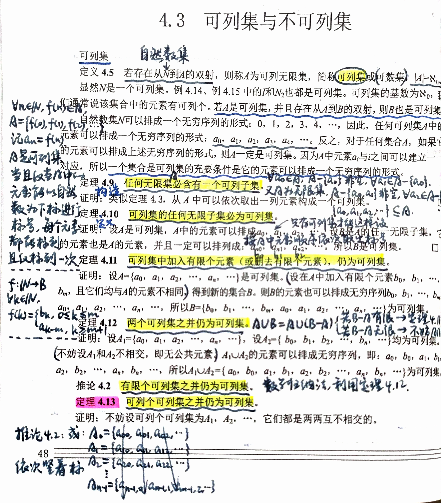

# 第 4 章 无限集

## 4.1 集合的递归定义与自然数集合（略）

### 数学归纳法

首先通过讨论自然数的有序性和最小性，来说明数学归纳法的合理性。

在讲到关系时，我们知道“小于等于关系”是自然数集$\mathbb{N}$上的全序关系，即对任意两个自然数$n_1、n_2$，或者$n_1 \leq n_2$，或者$n_2 \leq n_1$。依据该全序关系，自然数集$\mathbb{N}$可排成这样一个序列：$0, 1, 2, 3, 4, \cdots$，这一特性称为自然数的有序性。

自然数的另一基本性质是自然数的最小性。

#### 定理4.1

在自然数集$\mathbb{N}$的任一非空子集$S$中，必存在一个最小数（即在$S$中有不大于其他任意数的数）。

#### 定理4.2

设$S$是自然数集$\mathbb{N}$的非空子集，如果$0 \in S$，并且当$n \in S$时，必有$n + 1 \in S$，则$S = \mathbb{N}$。

#### 定理4.3

设$S$是自然数集$\mathbb{N}$的非空子集，如果$0 \in S$，并且当$1, 2, \cdots, n \in S$时，必有$n + 1 \in S$，则$S = \mathbb{N}$。

上述3个定理是数学归纳法的基础。证明留作作业。

对于数学归纳法，有第一数学归纳法和第二数学归纳法两种形式。

采用**第一数学归纳法**证明一个结论对所有自然数都为真，要做如下两件事。
① 当$n=0$时，证明结论成立。
② 若当$n=k$时结论成立，证明当$n=k+1$时结论也成立。

采用**第二数学归纳法**证明一个结论对所有自然数都真，则要做如下两件事。
① 当$n=0$时，证明结论成立。
② 若当$n \leq k$时结论成立，证明当$n=k+1$时结论也成立。

#### 例4.1

用第一归纳法来证明：当$n \in \mathbb{N}$，$4^{n+1} - 3n - 4$是9的倍数。

证明：当$n=0$时，因为$4^{0+1} - 3 \times 0 - 4 = 0$是9的倍数，所以命题为真。对于任意的$k \in \mathbb{N}$，假定当$n=k$时命题为真，即$4^{k+1} - 3k - 4$是9的倍数。因为$4^{(k+1)+1} - 3(k+1) - 4 = 4 \times 4^{k+1} - 3k - 3 - 4 = 4(4^{k+1} - 3k - 4) + 9(k+1)$，由归纳假设，$4^{k+1} - 3k - 4$是9的倍数，所以，$4^{(k+1)+1} - 3(k+1) - 4$也是9的倍数，即当$n=k+1$时命题也真。

#### 例4.2

设有两个口袋，一个口袋装有$m$个球，另一个口袋装有$n$个球，并且$m > n$。今有两人进行取球比赛，其比赛规则如下。
① 二人轮流从口袋里取球，每次只准一人取球。
② 每人每次只能从一个口袋里取，每次至少得取出一个，多取不限。
③ 最后取完口袋里的球者为胜利者。

用第二归纳法证明先取者总能取胜。

证明：当$n=0$时，仅一个口袋里有球，先取者全部取出即胜。设对任意自然数$k > 0$，假定对任意自然数$n \leq k$时命题为真。设$n = k+1$，因为$m > n$，所以先取者可以从有$m$个球的口袋里取出$(m - k - 1)$个球。因为两个口袋都剩下$k+1$个球，且后取者还必须从一个口袋里取出至少一个球。所以先取者再取时，一个口袋里有$k+1$个球，而另一个口袋里有小于等于$k$个球，根据归纳假定，先取者必能取胜。这表明当$n = k+1$时命题为真。

下面说明这两种形式的数学归纳法的合理性。

#### 定理4.4

设$P(n)$是一个与自然数$n$有关的结论。若对于自然数0，结论成立；并且当对自然数$k$结论成立时，对于自然数$k+1$结论也成立，则该结论对所有自然数都成立。

#### 定理4.5

设$P(n)$是一个与自然数$n$有关的结论。若对于自然数0，结论成立；并且当对自然数$1, 2, \cdots, k$结论成立时，对于自然数$k+1$结论也成立，则该结论对所有自然数都成立。

证明留作作业。

下面讨论集合的另一种表示方法——集合的递归（归纳）定义。

### 集合的递归定义

#### 例4.3

下面的定义给出的是怎样的集合？
(1) $3 \in S$。
(2) 如果$x, y \in S$，则$x + y \in S$。
(3) 除有限次应用(1)和(2)产生的整数外，再没有其他的整数在$S$中。

解：显然，集合$S$给出3的正整数倍的全体。

例4.3给出的是集合的又一种表示方法，这种方法称为集合的递归（归纳）定义。

#### ⭐定义4.1

集合$A$的**递归（归纳）定义**由3部分组成。

(1) **基础**：某些元素属于我们正在定义的集合$A$中，说明集合$A$是非空的。
(2) **归纳（递归）**：使用当前在集合$A$中的现有元素来产生包含在此集合中的更多元素，即建立产生$A$中新元素的一种方法。
(3) **闭合**：除了有限次应用(1)和(2)产生集合$A$的元素外，$A$中再没有其他元素。

关于闭合还有其他的叙述方式。
(1) 只有在集合$A$中的元素是通过有限次应用(1)和(2)得到的。
(2) 集合$A$是满足(1)和(2)的最小集合。
(3) 集合$A$是满足(1)和(2)，但不存在$A$的真子集满足(1)和(2)，即若存在$S \subseteq A$，且$S$满足(1)和(2)，则$S = A$。
(4) 集合$A$是满足(1)和(2)给定性质的所有集合之交。

以上4种闭合的叙述方式虽然形式上不同，但它们是等价的。证明从略。

下面我们再给出几个集合递归定义的例子。

#### 例4.4

设整数集$\mathbb{Z}$是全集，非负偶数整数集$E^+ = \{x | x \geq 0，且x=2y，y \in \mathbb{Z}\}$，它可以递归定义如下。
(1)（基础）$0 \in E^+$。
(2)（归纳）如果$n \in E^+$，则$n+2 \in E^+$。
(3)（闭合）除有限次应用(1)和(2)产生的整数外，再没有其他的整数在$E^+$中。

下面引进**字符串及字符串集合的定义**，它们在计算机科学中是常用的。

设$\Sigma$是一个有限非空字符集，称为字母表。从$\Sigma$中选取有限个字符组成的串称为$\Sigma$上的字符串或字。设$x$是$\Sigma$上的一个字，$x = a_1a_2\cdots a_n$，其中$a_i \in \Sigma$，$1 \leq i \leq n$，$n$是正整数，表示字的长度。长度为0的字称为空串，记为$\Lambda$。若$x, y$是$\Sigma$上的两个字，$x = a_1a_2\cdots a_n$，$y = b_1b_2\cdots b_m$，其中$a_i, b_j \in \Sigma(1 \leq i \leq n，1 \leq j \leq m)$，则由$x$和$y$毗连得到新的字记为$xy$。即$xy = a_1a_2\cdots a_n b_1b_2\cdots b_m$。

现在来定义字符串集合$\Sigma^+$和$\Sigma^*$。

#### ⭐例4.5

设$\Sigma$是一个字母表，$\Sigma$上所有的**有限非空字符串集合记为$\Sigma^+$**，递归定义如下。
(1)（基础）如果$a \in \Sigma$，则$a \in \Sigma^+$。
(2)（归纳）如果$x \in \Sigma^+$，且$a \in \Sigma$，则$ax \in \Sigma^+$（$ax$表示字符$a$与字$x$毗连得到的新的字）。
(3)（闭合）除有限次应用(1)和(2)产生$\Sigma^+$中的字外，$\Sigma^+$中再没有其他字。

集合$\Sigma^+$包含长度为1, 2, 3, $\cdots$的字，即$\Sigma^+$包含无限个字，但每个字的字符个数是有限的。例如，若$\Sigma = \{0, 1\}$，则$\Sigma^+ = \{0, 1, 00, 01, 10, 11, 000, 001, \cdots\}$。

#### ⭐例4.6

设$\Sigma$是一个字母表，$\Sigma$上所有的**有限字符串集合记为$\Sigma^*$**，$\Sigma^*$包含空串，即$\Sigma^* = \Sigma^+ \cup \{\Lambda\}$，可递归定义如下。
(1)（基础）$\Lambda \in \Sigma^*$。
(2)（归纳）如果$x \in \Sigma^*$，且$a \in \Sigma$，则$ax \in \Sigma^*$。
(3)（闭合）除有限次应用(1)和(2)产生$\Sigma^*$中的字外，$\Sigma^*$中再没有其他字。

例如，若$\Sigma = \{0, 1\}$，则$\Sigma^* = \{\Lambda, 0, 1, 00, 01, 10, 11, 000, 001\cdots\}$，是有限二进制序列的集合，其中包含空序列。

在一些数学论述中，常用递归定义来刻划表达式或公式的集合。在程序设计语言中有许多使用递归定义的例子。例如，用递归定义能描述赋值语句中出现的代数表达式类或条件语句中出现的逻辑表达式类。

算术表达式集合是包含整数，一元运算符$+, -$，以及二元运算符$+, -, *, /$的符号序列所组成的集合，其中包含如“$((3 + 5)/4)$”，“$(((-5) + 6)*3)$”等算术表达式。下面用递归定义的方法来描述算术表达式集合。

#### 例4.7

算术表达式集合的递归定义如下。
(1)（基础）如果$D = \{0, 1, 2, 3, 4, 5, 6, 7, 8, 9\}$和$x \in D^+$，则$x$是算术表达式。其中$D^+$是$D$上所有非空数字串的集合。
(2)（归纳）如果$x$和$y$都是算术表达式，则
$(+x)$是算术表达式；
$(-x)$是算术表达式；
$(x + y)$是算术表达式；
$(x - y)$是算术表达式；
$(x * y)$是算术表达式；
$(x/y)$是算术表达式。
(3)（闭合）一个符号序列是一个算术表达式当且仅当它能通过有限次应用(1)和(2)而得到。

用这一定义给出的算术表达式，如4589，$(-368)$，$((-93) * (172/5))$以及$(+ (-305))$等。

### 自然数集合

前面用到过自然数，但究竟什么是自然数和自然数集呢？由于自然数的加法定义必须建立在自然数集$\mathbb{N}$上，所以不能用加法运算来形式地定义自然数集$\mathbb{N}$，否则将会产生循环。为了避免这种定义上的循环，我们引进**后继集合**的概念：设$A$是任一给定集合，$A \cup \{A\}$称为$A$的后继集合，简称后继，记为$A^+$。于是自然数集$\mathbb{N}$定义如下。

#### 💡定义4.2

（Von Neumann 提出）设$\mathbb{N}$为**自然数集**，它的递归定义如下。
(1)（基础）$\varnothing \in \mathbb{N}$。
(2)（归纳）如果$n \in \mathbb{N}$，则$n^+ \in \mathbb{N}$（这里$n^+ = n \cup \{n\}$）。
(3)（闭合）如果$S \subseteq \mathbb{N}$，且$S$满足(1)、(2)，则$S = \mathbb{N}$。

按照这个定义，自然数集的元素为：$\varnothing, \varnothing^+, (\varnothing^+)^+, ((\varnothing^+)^+)^+, \cdots$，即为$\varnothing, \varnothing \cup \{\varnothing\}, \varnothing \cup \{\varnothing\} \cup \{\varnothing \cup \{\varnothing\}\}\cdots$可以简化为$\varnothing, \{\varnothing\}, \{\varnothing, \{\varnothing\}\}, \cdots$

这里用记号“:=”给这些集合命名，例如$\varnothing$命名为数0，记为$0:=\varnothing$。于是，
$0:=\varnothing$；
$1:=0^+ = \{\varnothing\} = \{0\}$；
$2:=1^+ = \{\varnothing, \{\varnothing\}\} = \{0, 1\}$；
$3:=2^+ = \{\varnothing, \{\varnothing\}, \{\varnothing, \{\varnothing\}\}\} = \{0, 1, 2\}$；
$\cdots$

一般地，若已给出$n$，则$n+1:=n^+ = \{0, 1, 2, \cdots, n\}$。于是得到自然数集$\mathbb{N} = \{0, 1, 2, 3, \cdots\}$，其中除0外每一个自然数是它前一个自然数的后继。

这样，可以得到自然数$n$的许多性质，包括下面的定理。

#### 定理4.6

(1) 0不是任何自然数的后继。
(2) 任何自然数的后继是唯一的。
(3) 如果$n^+ = m^+$，则$n = m$。

证明从略。

从以上叙述可以得到著名的关于自然数的贝安诺（Peano）公理。

#### 贝安诺（Peano）公理

(1) $0 \in \mathbb{N}$。
(2) 对每一个$n \in \mathbb{N}$，恰存在一个$n^+ \in \mathbb{N}$（称$n^+$为$n$的后继）。
(3) 不存在一个$n \in \mathbb{N}$，使$n^+ = 0$。
(4) 如果$n^+ = m^+$，则$n = m$。
(5) 如果$S \subseteq \mathbb{N}$，且①$0 \in S$，②如果$n \in S$，那么$n^+ \in S$，则$S = \mathbb{N}$。

贝安诺公理可以不用集合来刻划自然数，而给出自然数集的定义。

贝安诺公理(5)称为极小性，表示：如果自然数集$\mathbb{N}$的子集$S$包含0，并且$S$中每一个数$n$都有它的后继$n^+$，则$S$就是自然数全体。公理中$n^+$可理解为$n+1$，但是我们不一定把“+”作为$\mathbb{N}$上的一个运算。

贝安诺公理(5)是数学归纳法原理的基础。数学归纳法常用来证明各种数学命题，是一个重要的证明方法。

利用贝安诺公理(5)来推导第一数学归纳法。

设$P(n)$是与$n \in \mathbb{N}$有关的命题，如果能够证明
(1)（基础）$P(0)$为真。
(2)（归纳）对于任何$k \in \mathbb{N}$，如果$P(k)$为真，那么$P(k+1)$为真。
则对于任何$n \in \mathbb{N}$，$P(n)$为真。

证明：对于贝安诺公理(5)，设$S = \{k \in \mathbb{N} | P(k)为真\}$，$S \subseteq \mathbb{N}$。
(1) 因为$P(0)$为真，所以$0 \in S$。
(2) 因为对于任何$k \in \mathbb{N}$，如果$P(k)$为真，那么$P(k+1)$为真。所以可以推出：如果$k \in S$，那么$(k+1) \in S$。

由贝安诺公理(5)可知$S = \mathbb{N}$，因此对于所有$n \in \mathbb{N}$，$P(n)$为真。

注意，在数学归纳法原理的基础中不一定证明$P(0)$为真。可以证明对任一给定的自然数$k_0$，$P(k_0)$为真，而结论则是对$n \geq k_0$，$P(n)$为真。

#### 例4.8

对于$n \geq 4$，证明$2^n < n!$。

证明：设$P(n): 2^n < n!$。显然$P(1), P(2), P(3)$是假的，这与证明无关。
(1) $P(4): 2^4 < 4!$，即$16 < 24$，所以$P(4)$为真。
(2) 如果对任何$k \geq 4$，$P(k)$为真，有$2^k < k!$，两边乘以2，得到$2 \times 2^k = 2^{k+1} < 2 \times k! < (k+1) \times k! = (k+1)!$。所以$P(k+1)$为真。因此，对于所有$n \in \mathbb{N}$，且$n \geq 4$，$P(n)$均为真。

#### 例4.9

求证：任何由$3^n$个相同的数字所组成的数能被$3^n$整除。

例如，当$n=1$时，222，555和777可以被3整除；当$n=2$时，222222222和555555555能被$3^2$整除。

证明：设$P(n)$：任何由$3^n$个相同的数字所组成的数能被$3^n$整除。
(1) $P(0)$显然为真；$P(1)$：任一$a$，$aaa = a \times 10^2 + a \times 10 + a = 111 \times a$，可以被3整除，所以$P(1)$为真。
(2) 如果对任何$k$，$P(k)$为真，即$\underbrace{aa\cdots a}_{3^k位}$可被$3^k$整除。现在考察$P(k+1)$。

设$x = \underbrace{aa\cdots a}_{3^{k+1}位} = \underbrace{aa\cdots a}_{3^k位}\underbrace{aa\cdots a}_{2 \times 3^k位}$，$y = \underbrace{aa\cdots a}_{3^k位}$，于是
$$x = 10^{2 \times 3^k} y + 10^{3^k} y + y = (10^{2 \times 3^k} + 10^{3^k} + 1)y$$

又设
$$
\begin{align*}
z &= 10^{2 \times 3^k} + 10^{3^k} + 1 \\
&= \underbrace{10\cdots0}_{2 \times 3^k个0} + \underbrace{10\cdots0}_{3^k个0} + 1 \\
&= \underbrace{10\cdots0}_{3^{k+1}-1个0} \underbrace{10\cdots0}_{3^{k+1}-1个0} 1
\end{align*}
$$

$z$可被3整除，而由(2)归纳假设可知$y$可被$3^k$整除，所以$x$可被$3^{k+1}$整除。因此对于任何$n \in \mathbb{N}$，$P(n)$为真。

利用贝安诺公理(5)，可以证明第二数学归纳法是正确的。证明留作习题。

#### 例4.10

证明所有大于或等于2的整数能表示为若干质数之积。

证明：设$P(n)$是命题：整数$n$能表示为若干质数之积。对于$n=2$，显然$P(2)$为真。如果对于任何$k$，每一个$k$，$2 \leq j \leq k$，$P(j)$为真，那么可以证明$P(k+1)$为真，即$k+1$能表示为若干个质数之积。因为
(1) 如果$k+1$是质数，则$P(k+1)$为真。
(2) 如果$k+1$不是质数，那么$k+1=pq$，这里$2 \leq p, q \leq k$。

由归纳假设知，$p$和$q$都能表示为若干质数之积，所以$P(k+1)$也为真。

最后，利用第二数学归纳法来证明函数的递归定义是正确的。

假设(1) 前$q+1$个相继整数所组成的集合$A = \{0, 1, 2, \cdots, q\}$，对$A$中每个$i$，指定一个实数$r_i$。(2) 如果$n$是大于$q$的任何整数，那么有一规则$f$来确定一个实数$f(n)$，$f(n)$能通过集合$\{f(n-1), f(n-2), \cdots, f(n - q - 1)\}$中某些项或所有项唯一地表示出来。设$f(i)=r_i$，对所有$i \in A$，那么规则$f$是定义域为非负整数集合的一个函数，用这种方法定义的函数称为递归定义的函数。由前面$f(i)$值定义的$f(n)$的规则称为一个递推关系。$f(0), f(1), f(2), \cdots, f(q)$称为递推关系的初始值。下面利用第二数学归纳法来证明：对每个非负整数$n, f(n)$是唯一的。

#### 例4.11

证明如果$f$是递归定义的，则对所有的$n \in \mathbb{N}, f(n)$是唯一的。

证明：设$P(n)$是命题：对每个$n, f(n)$是唯一的。

由于$f(i)=r_i(i=0, 1, 2, \cdots, q)$是唯一的，因此$P(0), P(1), P(2), \cdots, P(q)$为真。如果对于任何$k \in \mathbb{N}, k \geq q, i \leq k, P(i)$为真。显然，由$f$的定义，对于$k+1(>q), f(k+1)$可按其前面至多$q+1$个$f$的值唯一地表示出来，所以$P(k+1)$为真。因此，对于所有$n \in \mathbb{N}, P(n)$为真，即$f(n)$是唯一的。

---

## 4.2 基数

### 基数概念

在研究集合时，我们往往要考虑**集合的“大小”**。对于给定的集合$A$和$B$，它们的“大小”是否相同？哪个集合的元素“较多”？

首先我们从在 64 个小方格组成的棋盘中放米的问题来讨论集合基数的概念。印度的舍罕王要重赏国际象棋的发明人达依尔，达依尔只要求：“在棋盘的第一个方格内放一粒米，以后每一小格内都比前一小格加一倍，最后摆满所有 64 格，然后将这些米赏给我”。国王认为他的要求不高，爽快地答应了。可结果却无法满足。因为米粒的总数是$1 + 2 + 2^2 + \cdots + 2^{63} = 2^{64} - 1$，约合 140 亿升，这显然是一个很大的数。

这个集合的基数虽然大，但总还是有限的，能把这个数写出来。然而还有一些集合的基数却是无法表述出来的。如所有整数集合的个数，一条线上所有几何点个数（即在区间$[a, b]$上的个数），就无法知道到底是什么，只能认为是**无穷大的数**。这样就有一个问题，即上面两个数哪个大些？这个问题最初是由 Cantor 提出的。

在古代原始部落中，不存在比 3 大的数，如果问他们当中的一个人有几个孩子，当孩子多于 3 个时，其回答是很多的。在比较一堆珠子和一堆铜币哪个多时，他们是通过把珠子和铜币逐个比较，最后看哪个堆有多余，若同时没有则两者相同。

对于无穷大数的比较，我们也面临类似于原始部落的问题。Cantor 的解决办法与原始部落的方法相同：**给两组元素无穷多的序列中的各个数一一配对，若最后这两组元素恰好配对完毕，则认为这两个无穷大数就是相等的；若有一组还没配完，则该组就比另一组大**。正是基于这一基本设想，我们可给出比较两个集合元素个数大小的方法。

#### **例 4.12（有限集之间的基数比较）** 

设$A = \{1, 2, 3\}$，$B = \{a, b, c\}$，$A$与$B$之间存在几种一一对应的方法，其一如$1 \to a$，$2 \to b$，$3 \to c$；另如$1 \to b$，$2 \to c$，$3 \to a$等，所以$A$与$B$“大小” 相同。

#### **例 4.13（无限集之间的基数比较）** 

$A = \{1, 3, 5, 7, 9, 11, \cdots\}$，$B = \{0, 2, 4, 6, 8, \cdots\}$，$A$与$B$之间建立如下的一一对应：$1 \to 0$，$3 \to 2$，$5 \to 4$，$7 \to 6$，$9 \to 8$，$\cdots$所以$A$与$B$“大小” 相同。

#### **定义 4.3** 

设$A$，$B$是任意两个集合，若存在一个双射$f: A \to B$，则称$A$和$B$**对等**（或**等势**），记为 **$A \sim B$**；或称$A$和$B$的**基数相同**。$A$的基数记为$\overline{\overline{A}}$，或者$|A|$；$A$和$B$的基数相同记为 **$\overline{\overline{A}} = \overline{\overline{B}}$** 或者$|A| = |B|$。

### 无限集

#### **定义 4.4** 

设$A$为一个集合，若$A$为空集或与集合$\{0, 1, 2, \cdots, n - 1\}$的基数相同，则称$A$为**有限集**，且$|A| = n \in \mathbb N$。若集合$A$不是有限集，则称$A$为**无限集**。

#### **定理 4.7**

**自然数集$\mathbb N$是无限集。**

**证明：**

> 由定义 4.4 可知，只要证明$\mathbb N$不是有限集即可，即证明对任何$n \in \mathbb N$，不存在从$\{0, 1, 2, \cdots, n - 1\}$到$\mathbb N$的双射。

设$n$是$\mathbb N$中任一自然数，$f$是从$\{0, 1, 2, \cdots, n - 1\}$到$\mathbb N$的任一函数，令$K = 1 + \max\{f(0), f(1), \cdots, f(n - 1)\}$。

则$K \in \mathbb N$，但对于$K$，对任意$x \in \{0, 1, 2, \cdots, n - 1\}$，$f(x) \neq K$，所以$f$不是满射，当然$f$也不是双射。由$n$和$f$的任意性可知$\mathbb N$是一个无限集。

没有一个自然数能作为$\mathbb N$的基数，因此今后我们将**记$|\mathbb N|$为$\aleph_0$**，读作**阿列夫零**。

下面再给出一些与$\mathbb N$对等的例子。

#### **例 4.14** 

$\mathbb N$与正整数集$\mathbb Z$之间有如下一一对应：

|$\mathbb N$| 0 | 1 | 2 | 3 | 4 | 5 | 6 |$\cdots$|
| ---- | ---- | ---- | ---- | ---- | ---- | ---- | ---- | ---- |
|$\mathbb Z$| 0 | 1 | -1 | 2 | -2 | 3 | -3 |$\cdots$|

即存在双射$f: \mathbb N \to I$，使对$n \in \mathbb N$，
$$
f(n) =
\begin{cases}
\frac{1}{2}n & n \text{ 为偶数} \\
-\frac{1}{2}(n + 1) & n \text{ 为奇数}
\end{cases}
$$
所以$|I| = \aleph_0$。

#### **例 4.15** 

设$\mathbb N_2 = \{0, 2, 4, \cdots\}$，则$\mathbb N \sim \mathbb N_2$。因为存在$f: \mathbb N \to \mathbb N_2$，对任何$n \in \mathbb N$有$f(n) = 2n$，显然$f$是$\mathbb N \to \mathbb N_2$的双射。

$\mathbb N$是$\mathbb Z$的真子集，而$\mathbb N_2$是$\mathbb N$的真子集，然而$|\mathbb Z| = |\mathbb N_2| = |\mathbb N| = \aleph_0$。这揭示了无限集的一个重要特征：**无限集可以与它的一个真子集对等**。对于有限集来说，这是不可能的。**无限集与有限集的本质区别也就在于此**。

#### 💡**定理 4.8** 

**无限集必与它的一个真子集对等。**

**证明**：设$A$是任意的无限集，从$A$中取一元素记为$a_1$，则$A - \{a_1\}$为非空无限集；然后在$A - \{a_1\}$中取一元素记为$a_2$，$A - \{a_1, a_2\}$还是非空无限集；取元素过程一直进行下去，从$A$中可取出一列元素$a_1, a_2, \cdots$，将$A - \{a_1, a_2, \cdots\}$记为$A'$，则$A = A' \cup \{a_1, a_2, \cdots\}$。

在$A$中取真子集$B = A' \cup \{a_2, a_4, \cdots\}$，那么存在双射$f: A \to B$，使
$$
f(x) =
\begin{cases}
a_{2i} & x = a_i \\
x & x \in A'
\end{cases}
$$
因此$A \sim B$。

**推论 4.1** 凡不能与自身的任一真子集对等的集合为有限集。

定理 4.8 给出了有限集和无限集的另一个定义，它与前述定义是等价的（证明从略）。即：凡能与自身的某一真子集对等的集合称为无限集，否则称为有限集。

---

## 4.3 可列集与不可列集

### 可列集
#### **定义 4.5** 

若存在从$\mathbb N$到$A$的双射，则称$A$为**可列无限集**，简称**可列集**或**可数集**，$|A| = \aleph_0$。

显然$\mathbb N$是一个可列集。例 4.14、例 4.15 中的$I$和$\mathbb N_2$也都是可列集。可列集的基数为$\aleph_0$，我们通常说该集合中的元素有可列个。若$A$是可列集，并且存在从$A$到$B$的双射，则$B$也是可列集。

自然数集$\mathbb N$可以排成一个无穷序列的形式：$0, 1, 2, 3, 4, \cdots$，因此，任何可列集$A$中的元素可以排成一个无穷序列的形式：$a_0, a_1, a_2, a_3, a_4, \cdots$。反之，对于任何集合$A$，如果它的元素可以排成上述无穷序列的形式，则$A$一定是可列集。因为$A$中元素$a_i$与$i$之间可以建立一一对应，所以一个集合是可列集的充要条件是它的元素可以排成一个无穷序列的形式。

#### ⭐**定理 4.9**

**任何无限集必含有一个可列子集。**

证明：类似定理 4.3，从$A$中可以依次取出一列元素构成一个可列集。

#### ⭐**定理 4.10**

**可列集的任何无限子集必为可列集。**

证明：设$A$是可列集，$A$中的元素可以排成$a_0, a_1, a_2, \cdots$。设$B$是$A$的任一无限子集，它的元素也是$A$的元素，并且一定可以排列成：$a_{n_0}, a_{n_1}, a_{n_2}, \cdots$。所以$B$是可列集。

#### ⭐**定理 4.11**

**可列集中加入有限个元素（或删去有限个元素），仍为可列集。**

证明：设$A = \{a_0, a_1, a_2, \cdots, a_n, \cdots\}$是可列集。设在$A$中加入有限个元素$b_0, b_1, \cdots, b_m$，且它们均与$A$的元素不相同，得到新的集合$B$。则$B$的元素也可以排成无穷序列$b_0, b_1, \cdots, b_m, a_0, a_1, a_2, \cdots, a_n, \cdots$，所以$B = \{b_0, b_1, \cdots, b_m, a_0, a_1, a_2, \cdots, a_n, \cdots\}$为可列集。

#### ⭐**定理 4.12**

**两个可列集之并仍为可列集。**

证明：设$A_1 = \{a_0, a_1, a_2, \cdots, a_n, \cdots\}$，设$A_2 = \{b_0, b_1, b_2, \cdots, b_n, \cdots\}$均为可列集。不妨设$A_1$和$A_2$不相交，即无公共元素。$A_1 \cup A_2$的元素可以排成无穷序列，即：$a_0, b_0, a_1, b_1, a_2, b_2, \cdots, a_n, b_n, \cdots$，所以$A_1 \cup A_2 = \{a_0, b_0, a_1, b_1, a_2, b_2, \cdots, a_n, b_n, \cdots\}$为可列集。

**推论 4.2** 有限个可列集之并仍为可列集。

#### ⭐**定理 4.13**

**可列个可列集之并仍为可列集。**

证明：不妨设可列个可列集为$A_1, A_2, \cdots$，它们都是两两互不相交的。

$$
\begin{align*}
A_1 &= \{a_{11}, a_{12}, a_{13}, \cdots, a_{1n}, \cdots\} \\
A_2 &= \{a_{21}, a_{22}, a_{23}, \cdots, a_{2n}, \cdots\} \\
&\cdots
\end{align*}
$$

设$A = \bigcup_{i=1}^{\infty} A_i = A_1 \cup A_2 \cup \cdots$，$A$中的元素排列次序按对角线方法，如图 4.1 中的箭头所示。

从左上端开始排，每一斜线上的每个元素的两下标之和都相同，依次为$2, 3, 4, 5, \cdots$，于是这一排列可以写为：$a_{11}, a_{12}, a_{21}, a_{13}, a_{22}, a_{31}, \cdots$，以$A$是可列集。

上述的排列方法称为对角线方法，它是常用的方法，在计算机科学的某些理论中发挥很大的作用。

定理 4.9～定理 4.13 可以直接用定义 4.5 来证明。例如，定理 4.12 中定义函数$f: \mathbb N \to A_1 \cup A_2$，使得
$$
f(n) =
\begin{cases}
a_{\frac{n}{2}} & n \text{ 为偶数，} n \in \mathbb N \\
b_{\frac{n - 1}{2}} & n \text{ 为奇数，} n \in \mathbb N
\end{cases}
$$
显然$f$是双射。因此$A_1 \cup A_2$是可列集。又如定理 4.12 中定义函数$f: A \to \mathbb N$，使
$$
\begin{align*}
f(a_{11}) &= 0 \\
f(a_{1j}) &= f(a_{1, j - 1}) + j - 1, j \neq 1 \\
f(a_{ij}) &= f(a_{i - 1, j + 1}) + 1, i \neq 1, j \neq 1
\end{align*}
$$
按递推关系求解得到：
$$
f(a_{ij}) = \frac{1}{2}(i + j - 1)(i + j - 2) + (i - 1) \quad i, j = 1, 2, 3, \cdots
$$
因此$A = \bigcup_{i=1}^{\infty} A_i$是可列集。

#### **例 4.16**

利用对角线方法证明$\mathbb N \times \mathbb N$是可列集。

证明：$\mathbb N \times \mathbb N$中元素可以排成如图 4.2 的形式。

（此处插入图 4.1 和图 4.2，因文本中无具体图内容，故省略图的插入，保留原文字描述逻辑）

类似定理 4.12，按对角线方法可以将这样的排列写为：
$(0, 0), (0, 1), (1, 0), (0, 2), (1, 1), (2, 0), (0, 3), (1, 2), (2, 1), (3, 0), \cdots$
所以$\mathbb N \times \mathbb N$是可列集。

也可以定义双射$f: \mathbb N \times \mathbb N \to \mathbb N$，使得
$$
f(i,j)=\frac{1}{2}(i + j)(i + j + 1)+i \quad i,j = 0,1,2,3,\cdots
$$
其中$f(i,j)$是$f(i,j)$的简写，从而可知$\mathbb N \times \mathbb N$是可列集。

#### **例 4.17**

证明有理数$Q$是可列集。

证明：先证明正有理数集$Q^{+}$是可列集。例 4.16 已证明$\mathbb N \times \mathbb N$是可列集，从$\mathbb N \times \mathbb N$中删去所有使$i$和$j$不是互质的有序对$(i,j)$，并删去所有有序对$(i,0)$，得到集合记为$S$，$S \subseteq \mathbb N \times \mathbb N$。因为$S$中包含$(1,1),(2,1),(3,1),\cdots$，显然$S$是$\mathbb N \times \mathbb N$的无限子集，因此可得$S$是可列集。定义函数$f: S \to Q^{+}$，$f(i,j)=i/j$，显然是双射，所以$S$与$Q^{+}$对等，因此$Q^{+}$是可列集。

设负有理数集为$Q^{-}$，同理$Q^{-}$是可列集。$Q = Q^{+} \cup Q^{-} \cup \{0\}$，所以$Q$是可列集。

#### **例 4.18**

设$\Sigma = \{a,b\}$，$\Sigma^{+}$上所有有限非空字符串的集合为$\Sigma^{+}$，则$\Sigma^{+}$为可列集。

证明：$\Sigma = \{a,b\}$，$\Sigma^{+} = \{a,b,aa,ab,ba,bb,aaa,\cdots\}$。

长度为 1 的字符串组成一个有限集；长度为 2 的字符串组成一个有限集；长度为 3 的字符串组成一个有限集；由于可列个有限集之并是可列集，所以$\Sigma^{+}$是可列集。

### 不可列集

上面讨论了无限集中的基数是$\aleph_0$的可列集，对于不是可列集的无限集是非常多的，如常见的区间$[0,1]$是不可列集，实数集$R$是不可列集等。下面给出证明。

#### 💡**定理 4.14**

**$[0,1]$是不可列集。**

证明：用反证法证明。假设$[0,1]$是可列集$\{a_1,a_2,a_3,\cdots\}$，且规定$[0,1]$中每个实数唯一地表示为一个尾数不全为 0 的十进制无限小数。于是
$$
\begin{align*}
a_1&: 0.a_{11}a_{12}a_{13}a_{14}\cdots\\
a_2&: 0.a_{21}a_{22}a_{23}a_{24}\cdots\\
a_3&: 0.a_{31}a_{32}a_{33}a_{34}\cdots\\
a_4&: 0.a_{41}a_{42}a_{43}a_{44}\cdots\\
&\cdots
\end{align*}
$$
其中所有$a_{ij}$都是$0,1,\cdots,9$，这十个数字中的一个。今作一个十进制小数$t: 0.t_1t_2t_3\cdots$，其中$t_i = \begin{cases}1&当a_{ii} \neq 1\\2&当a_{ii} = 1\end{cases}$

$t$满足：$t \neq 0$，$t \neq 9$，$i = 1,2,3,\cdots$，$t \in (0,1)$，并且$t_i \neq a_{ii}$，$i = 1,2,3,\cdots$，所以$t$与$\{a_1,a_2,a_3,\cdots\}$中任一个数都不相同，即$t \notin \{a_1,a_2,a_3,\cdots\} = [0,1]$，矛盾。因此$[0,1]$不是可列集。

$[0,1]$的基数记为$c$，也记为$\aleph$，读作阿列夫。$[0,1]$也称为连续统。

#### **例 4.19**

证明$(0,1) \sim [0,1] = c$。

证明：在$(0,1)$上取一点列，例如：$x_1 = \frac{1}{2}, x_2 = \frac{1}{3}, x_4 = \frac{1}{4},\cdots, x_n = \frac{1}{n + 1},\cdots$，建立下列对应：$[0,1]$中点$0$对应于$(0,1)$中点$x_1$；$[0,1]$中点$1$对应于$(0,1)$中点$x_2$；$[0,1]$中点$x_1$对应于$(0,1)$中点$x_3$；$[0,1]$中点$x_2$对应于$(0,1)$中点$x_4$；一般地，$[0,1]$中点$x_n$对应于$(0,1)$中点$x_{n + 2}$；其余各点$x \in [0,1]$对应于$(0,1)$中具有相同坐标的点。这样得到的对应是一一对应的，即$f: [0,1] \to (0,1)$是双射。所以$(0,1) \sim [0,1] = c$。

#### 💡**定理 4.15**

**设$A$是有限集或可列集，$B$是任一无限集，则$|A \cup B| = |B|$。**

> **定理 4.9** 任何无限集必含有一个可列子集。
> **定理 4.11** 可列集中加入有限个元素（或删去有限个元素），仍为可列集。
> **定理 4.12** 两个可列集之并仍为可列集。

证明：构造$A \cup B$到$B$的双射。
因为$B$是无限集，由**定理 4.9** 可知，$B$中一个可列子集$S \sim B$；再由**定理 4.11** 和**定理 4.12** 可知，$S \cup (A - B)$也是可列集，所以存在双射$f: S \to S \cup (A - B)$。

又$(B - S) \cap (S \cup (A - B)) = \varnothing$且$(B - S) \cup (S \cup (A - B)) = A \cup B$；
$(B - S) \cap S = \varnothing$且$(B - S) \cup S = B$。

现作函数$g: (B - S) \cup S \to (B - S) \cup (S \cup (A - B))$。
$$
g(x) = \begin{cases}
x & x \in B - S\\
f(x) & x \in S
\end{cases}
$$
由于$f$是双射，所以$g$也是双射。从而得到$|A \cup B| = |B|$。

此定理可得到：$(0,1),(0,1]$和$[0,1]$都是不可列集，且基数均为$c$。

#### **定理 4.16**

**设实数$a,b$且$a < b$，则$[a,b],[a,b),(a,b],(a,b)$的基数均为$c$。**

证明：构造$(0,1) \sim [a,b]$的双射$f(x) = a + (b - a)x$，对$x \in [0,1]$成立，于是得到$[a,b]$的基数为$c$。再由定理 4.15 得$[a,b],(a,b],[a,b),(a,b)$的基数均为$c$。

#### **例 4.20**

证明实数集$R$的基数为$c$。

证明：作双射$f: (0,1) \to R$，$f(x) = \tan\left(\pi x - \frac{\pi}{2}\right)$，即知$|R| = c$。

#### **例 4.21**

证明无理数集的基数为$c$。

证明：利用例 4.19 和例 4.20 及定理 4.15 即证得。

#### 例 2022

**证明或证伪：无理数集的基数小于复数集的基数。**

有理数集 $\mathbb{Q}$ 可数，
$$
\mathbb{R}=\mathbb{Q}\cup(\mathbb{R}\setminus\mathbb{Q}),
$$
由**定理4.15**，从无限集合中去掉一个可数子集不改变基数，故无理数集合的基数
$$
|\mathbb{R}\setminus\mathbb{Q}|=|\mathbb{R}|.
$$
又有复数集 $\mathbb{C}\cong\mathbb{R}^2$，且 $|\mathbb{R}^2|=|\mathbb{R}|$，因此
$$
|\mathbb{C}|=|\mathbb{R}|.
$$
综上，
$$
|\text{无理数集}|=|\mathbb{R}|=|\mathbb{C}|,
$$
所以“无理数集的基数小于复数集的基数”是**错误的**。

---

## 4.4 基数的比较

所谓两个集合基数相同是指这两个集合的“大小”相同。下面我们要进一步比较集合的“大小”，是否能说一个无限集比另一个无限集“更大”？直观告诉我们，基数为$c$的集合大于基数为$\aleph_0$的集合，基数为$\aleph_0$的集合又大于有限基数的集合。下面给出的定义与直观相符合，它提供了进行无限集合大小比较的基础。

#### **定义 4.6**

设$A$和$B$是两个集合，若存在从$A$到$B$的内射，则称$A$的基数**小于或等于**$B$的基数，记为$|A| \leq |B|$或$|B| \geq |A|$。若$|A| \leq |B|$且$|A| \neq |B|$，则称$A$的基数**小于**$B$的基数，记为$|A| < |B|$。

显然，这一定义是比较两个有限集的元素个数的推广。由定义 4.6 可以在基数集上引进次序关系$\leq$和$<$，并给出关系$\leq$的一些性质。

#### **定理 4.17**

**设$A,B,C$是任意集合，那么**
1. **若$A \subseteq B$，则$|A| \leq |B|$。**
2. **若$|A| \leq |B|$，$|B| \leq |C|$，则$|A| \leq |C|$。**

证明：
1. 可以由定义 4.6 直接得到。
2. 的证明可以利用（1），以及如果$A \subseteq B$，$B \subseteq C$则$A \subseteq C$，即得。

#### **推论 4.3**

**若$A$是无限集，则$|\mathbb N| \leq |A|$。**

证明：由定理 4.17 和定理 4.9 即可证得。

此推论说明可列集是无限集中基数最小的。由于$[0,1]$是无限集，且$|[0,1]| = c \neq \aleph_0$，所以$c > \aleph_0$。那么，对于任意两个集合，它们的基数是否总可以比较？

#### ⭐**定理 4.18（蔡梅罗（Zermelo）定理）**

**设$A$和$B$是任意两个集合，那么$|A| < |B|$，$|B| < |A|$，$|A| = |B|$三者中恰有一个成立。**

这个性质称三歧性，说明任意两个集合总可以通过关系$<$或者$=$进行比较。定理 4.18 的证明是相当困难的，这里从略。

#### ⭐**定理 4.19（伯恩斯坦（F. Bernstein）定理）**

**设$A$和$B$是两个集合，若$|A| \leq |B|$，又$|B| \leq |A|$，则$|A| = |B|$。**

证明从略。

定理 4.19 告诉我们：在从$A$到$B$和从$B$到$A$的两个内射的基础上，可以得出存在从$A$到$B$的双射。定理 4.19 常用来证明两个集合有相同的基数。由于找出两个内射往往比直接证明从$A$到$B$存在双射要容易。这样，**我们证明基数相同的方法有：构造双射；或构造内射$f: A \to B$，得到$|A| \leq |B|$，再作内射$g: B \to A$，得到$|B| \leq |A|$，从而得到$|A| = |B|$。**

#### **例 4.22**

利用伯恩斯坦定理证明$(0,1) \sim [0,1]$。

证明：作内射$f: (0,1) \to [0,1]$，$f(x) = x$。又作内射$g: [0,1] \to (0,1)$，$g(x) = \frac{x}{2} + \frac{1}{4}$。显然$|(0,1)| \leq |[0,1]|$，$|[0,1]| \leq |(0,1)|$。由定理 4.19 即证得。

#### **例 4.23**

证明实数序列所组成集合$E_{\infty}$的基数为$c$。

证明：由例 4.20 知，$f: (0,1) \to R$，$f(x) = \tan\left(\pi x - \frac{\pi}{2}\right)$是双射。

设$E_{\infty} = \{(x_1,x_2,\cdots,x_n,\cdots) | x_n \in R, n = 1,2,\cdots\}$，又设$B = \{(x_1,x_2,\cdots,x_n,\cdots) | x_n \in (0,1), n = 1,2,\cdots\}$。先证明$|E_{\infty}| = |B|$。

作$\varphi: B \to E_{\infty}$，$\varphi(x) = (f(x_1),f(x_2),\cdots,f(x_n),\cdots)$，对所有$x = (x_1,x_2,\cdots,x_n,\cdots) \in B$成立，显然$\varphi$是双射，所以$|E_{\infty}| = |B|$。

其次证明$|B| = c$。

作函数$f_1: (0,1) \to B$，$f_1(x) = (x,x,\cdots,x,\cdots) \in B$，对所有$x \in (0,1)$成立，显然$f_1$是内射，所以$|(0,1)| \leq |B|$。

又对任意$x = \{x_1,x_2,\cdots,x_n,\cdots\} \in B$，$x_n$用十进制无限小数唯一表示，有
$$
\begin{align*}
x_1&=0.x_{11}x_{12}x_{13}\cdots\\
x_2&=0.x_{21}x_{22}x_{23}\cdots\\
x_3&=0.x_{31}x_{32}x_{33}\cdots\\
x_n&=0.x_{n1}x_{n2}x_{n3}\cdots\\
&\cdots
\end{align*}
$$

作函数$f_2: B \to (0,1)$，$f_2(x) = 0.x_{11}x_{12}x_{21}x_{13}x_{22}x_{31}\cdots$，它是由上述$x_1,x_2,\cdots,x_n,\cdots$中小数部分按对角线方法排列而得的。$f_2(x) \in (0,1)$且$x \neq y$时$f_2(x) \neq f_2(y)$，所以$|B| \leq |(0,1)|$。

由定理 4.19 可知$|B| = |(0,1)|$，因此$|B| = c$。

有限集基数、可列集基数和连续统基数之间有如下关系。

#### **定理 4.20**

**设$A$是有限集，则$|A| < \aleph_0 < c$。**

证明留作习题。

是否有一个无限集，它的基数小于$\aleph_0$？由定理 4.9 易知$\aleph_0$是最小的无限基数。那么是否有基数大于$c$的集合？是否有最大基数的集合？下面介绍康托尔定理来回答这些问题。

#### 💡**定理 4.21（康托尔定理）**

**对于任何集合$A$，必有$|A| < |P(A)|$。**

证明：设$f: A \to P(A)$，对任意$x \in A$，$f(x) = \{x\}$，由于$x_1 \neq x_2$时$f(x_1) \neq f(x_2)$，所以$f$是$A \to P(A)$的一个内射，$|A| \leq |P(A)|$。

接下来证明$|A| \neq |P(A)|$。反设 $|A| = |P(A)|$，则存在双射$g: A \to P(A)$。如果$a \in g(a)$，则称$a$是$A$的“内部元素”；如果$a \notin g(a)$，则称$a$是$A$的“外部元素”。设$B$是由$A$的外部元素所组成的集合，也就是说$B = \{x \in A \text{ 且 } x \notin g(x)\}$。

显然$B \subseteq A$，因而$B \in P(A)$。因为$g$是双射，必存在一个元素（原像）$b \in A$，使$g(b) = B$。于是存在两种情况：
或者（1）$b \in B$且$b \notin g(b) = B$，即$b$是一个内部元素，与$B$的定义矛盾；
或者（2）$b \notin B$，因而$b \in g(b) = B$，这又是一个矛盾。
因此$g: A \to P(A)$不是双射，即$|A| \neq |P(A)|$。

康托尔定理告诉我们：任意给定一个集合$A$，总存在基数比$|A|$更大的集合，也就是不存在最大基数的集合。例如，我们能构造可列个无限基数的集合：
$\mathbb N, P(\mathbb N), P(P(\mathbb N)), \cdots$
且
$|\mathbb N| < |P(\mathbb N)| < |P(P(\mathbb N))|, \cdots$

其中左方最开始的不等式表示$\aleph_0 < |P(\mathbb N)|$，以后每一个都大于它前面的一个，而$|P(\mathbb N)|$是什么呢？当$A$是有限集时，$|A| = n$，则$|P(A)| = 2^n$，即$|P(A)| = 2^{|A|}$。当$A$是无限集时，也记$|P(A)|$为$2^{|A|}$。特别对于$A$是可列集，则有$|P(A)| = 2^{\aleph_0}$，显然$|P(\mathbb N)| = 2^{\aleph_0}$。

#### 😮例 2025

**可列集的所有子集组成的集合不是可列集**！利用康托尔定理显然。

康托尔定理还告诉我们：$\aleph_0 < |P(\mathbb N)|$，即$\aleph_0 < 2^{\aleph_0}$，又由定理 4.20 可知$\aleph_0 < c$。自然要问：$c$与$2^{\aleph_0}$之间有何关系？下面我们将要证明$2^{\aleph_0} = c$。在证明之前，我们先来介绍二进制小数以及$(0,1)$上实数的二进制表示。

在一个二进制小数$0.a_1a_2a_3\cdots$（$a_i = 0$或$1$）中，从某一项$a_i$以后全为$0$，该二进制小数称为二进制有限小数，否则称为二进制无限小数。二进制有限小数也可表示为二进制无限循环小数。例如，$0.101$又可表示为$0.101111\cdots$。为了表示唯一，我们规定：除数$0$表示为$0.000$外，$(0,1]$上任何实数唯一地表示为一个二进制无限小数，因而容易得到下面的引理。

#### **引理 4.1**

设$A$为二进制无限小数的集合，则
1. 存在从$(0,1]$到$A$的双射。
2. $|A| = c$。

#### ⭐**定理 4.22**

**$|P(\mathbb N)| = c$，即$2^{\aleph_0} = c$。**

证明：设二进制小数集合$B$，二进制有限小数的集合是可列集（留作习题），记为$A_1$，所以$A_1 \cup A = B$。由定理 4.15，即得$|A| = |B|$。又由引理 4.1，可知$|A| = |B| = c$。

作函数$f: P(\mathbb N) \to B$。对于$\mathbb N$的每个子集$S \in P(\mathbb N)$，$f(S) = 0.a_1a_2a_3\cdots$，其中$a_k = \begin{cases}1&k \in S\\0&k \notin S\end{cases}$。显然，$S = \varnothing$，$f(\varnothing) = 0.000\cdots$；$S = \mathbb N$，$f(\mathbb N) = 0.111\cdots$；$S = \{1,3,4,\cdots\}$，$f(S) = 0.010110\cdots$。

当$S$是$\mathbb N$的有限子集时，$\mathbb N$的所有有限子集所组成的集合与二进制有限小数集合$A_1$是一一对应的。例如$S = \{2,3,5\}$，$f(S) = 0.001101$；$S = \{0,2,4,6\}$，$f(S) = 0.1010101$。

当$S$是$\mathbb N$的无限子集时，$\mathbb N$的所有无限子集所组成的集合与二进制无限小数集合$A$是一一对应的。例如$S = \{1,4,5,\cdots\}$，$f(S) = 0.010011\cdots$；$S = \{2,3,4,\cdots\}$，$f(S) = 0.00111\cdots$。

容易知道：$P(\mathbb N) \to B$是双射，因此得$|P(\mathbb N)| = |B| = c$，即$2^{\aleph_0} = c$。

**定理 4.22** 说明自然数集$\mathbb N$有多少子集就是区间$[0,1]$上有多少个实数。

#### 💡**例 4.24**

$f:A \to B$ 函数全体构成集合记为$B^A$。证明$|\mathbb N^{\mathbb N}| = c$。

证明：
1. 先证明$|\mathbb N^{\mathbb N}| \leq |(0,1)|$，首先构造函数$g: \mathbb N^{\mathbb N} \to (0,1)$，对任意$f \in \mathbb N^{\mathbb N}$，$f: \mathbb N \to \mathbb N$，$f(i) = x_i$，$i \in \mathbb N$，$x_i$是二进制数。
	利用三进制小数表示数，$2$作间隔符，$g$定义为$g(f) = 0.x_{0}2x_{1}2x_{2}2\cdots$。$g(f)$是由$f$的值构成的三进制小数。
	例如，$f: \mathbb N \to \mathbb N$，$f(x) = 2x$，则$f \in \mathbb N^{\mathbb N}$，$g(f) = 0.02120100211021002\cdots$，显然$g$是$\mathbb N^{\mathbb N}$到$(0,1)$的内射函数，所以$|\mathbb N^{\mathbb N}| \leq |(0,1)|$。
2. 再证明$|(0,1)| \leq |\mathbb N^{\mathbb N}|$，构造函数$h: (0,1) \to \mathbb N^{\mathbb N}$，对任意$x \in (0,1)$，$x = 0.x_0x_1x_2\cdots$是十进制小数，$h$定义为：$h(x) = f \in \mathbb N^{\mathbb N}$，$f: \mathbb N \to \mathbb N$，$f(0) = x_0$，$f(1) = x_1$，$\cdots$，$f(i) = x_i$，$\cdots$，则$h: (0,1) \to \mathbb N^{\mathbb N}$是内射函数。所以$|(0,1)| \leq |\mathbb N^{\mathbb N}|$。

因而由（1）、（2）和定理 4.19 得$|\mathbb N^{\mathbb N}| = |(0,1)| = c$。

前面已经证明了$\aleph_0 < c$，$\aleph_0$是最小的无限基数，现在要问：$\aleph_0$和$c$之间有没有其他的基数呢？康托尔早在一百多年前就提出了一个猜想：在$\aleph_0$与$c$之间没有其他的基数，这就是著名的连续统假设。1900 年著名数学家希尔伯特（Hilbert,D）在巴黎数学大会上列举了 23 个未解决的数学问题，这 23 个问题通称希尔伯特问题，后来成为许多数学家力图攻克的难关，对现代数学的研究和发展产生了深刻的影响，并起了积极的推动作用。希尔伯特问题中有些现已得到圆满解决，有些至今仍未解决。其中第一个就是“康托尔的连续统基数问题”。

这个难题是数学中的一个很基本的问题，近百年来一直是数理逻辑中的中心问题之一，也是集合论中最难的问题之一。经过许多著名数学家不懈地努力，已取得了重大的进展。这个难题的目前研究状况是连续统假设和它的否定两者都与集合论公理系统相容。由这一问题所派生出来的许多课题仍在积极的研究之中。

**康托尔悖论**

在罗素发现悖论之前，康托尔在 1899 年就给出了悖论，现叙述如下。

集合是由具有某些性质的元素所组成，因此也可以假设集合$S$是由所有集合所组成。现在要问：$S$与$P(S)$的基数哪一个基数更大？

一方面由康托尔定理知道$|S| < |P(S)|$。但另一方面又因为$S$是所有集合所组成的集合，所以$P(S) \subseteq S$，从而$|P(S)| \leq |S|$，于是导致矛盾。这就构成了一个悖论，称为康托尔悖论。康托尔悖论涉及到基数的理论，当时康托尔希望与集合加以区分，借以排除他的悖论，但是他的悖论还未排除，罗素悖论就出现了。