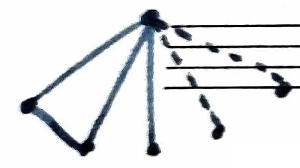

# 第5章 鸽笼原理

鸽笼原理是解决组合数学中一些存在性问题的基本工具。最早是由狄利克雷（Dirichlet）提出的，又称为抽屉原理、鞋盒原理。

## 5.1 鸽笼原理的简单形式

#### 定理5.1

**$n+1$只鸽子飞回$n$个笼子，至少有一个鸽笼含有不少于2只的鸽子。**

这个定理的证明是非常简单的，现抽去具体的“鸽子”、“鸽笼”等物理属性，从数学上看，就是把$s$个元素分成$t$个组，当不能均匀分放时，必有一个组的元素个数要超出“平均数”。形式地叙述为：

#### 补充

**$n$ 件东西放入 $m$ 个抽屉，一定有一个抽屉至少放了 $\left\lfloor \frac{n-1}{m} \right\rfloor + 1$ 件。**

**反证**：若每个抽屉放的个数 $< \left\lfloor \frac{n-1}{m} \right\rfloor + 1$，则个数 $\leq \left\lfloor \frac{n-1}{m} \right\rfloor \leq \frac{n-1}{m}$，总数 $\leq n-1$，矛盾。

#### 定理5.2

**$s(s≥1)$个元素分成$t$个组，那么必存在一个组至少含有$\lceil s/t \rceil$（这里$\lceil \rceil$为“上整数”记号）个元素。**

**证明**：用反证法证明。若每个组至多含有$(\lceil s/t \rceil - 1)$个元素，则$t$个组共有元素$t(\lceil s/t \rceil - 1)$，因为$s/t ≤ \lceil s/t \rceil < (s/t) + 1$，所以有$t(\lceil s/t \rceil - 1) < s$，这就导致矛盾。故必存在一个组至少含有$\lceil s/t \rceil$个元素。
$\square$

一些简单结论列举如下。
- 任意13个人中，至少有二人生日在同一个月。
- 任意50个人中，至少有$\lceil 50/12 \rceil = 5$人生日同月。

#### 例5.1

设$f$是从$D$到$R$的函数，这里 $D$ 和 $R$ 均为有限集，且$|D| > |R|$，令$t = \lceil |D|/|R| \rceil$，则$D$中存在$t$个元素$d_1, d_2, \dots, d_t$，使得$f(d_1) = f(d_2) = \dots = f(d_t)$。

**证明**：此问题相当于把$|D|$个元素分到$|R|$个组中去，因此由定理5.2得，在这$|R|$个组中有一个组至少含有$t = \lceil |D|/|R| \rceil$个元素。在同一个组中元素对应的函数值是相等的。所以在$D$中至少存在$t$个元素$d_1, d_2, \dots, d_t$，使得$f(d_1) = f(d_2) = \dots = f(d_t)$。
$\square$

#### 例5.2

在$n+1$个小于或等于$2n$的互不相等的正整数中，必存在两个互质的数。

**证明**：把$1, 2, \dots, 2n$这$2n$个数分成$n$个组：$\{1, 2\}, \{3, 4\}, \dots, \{2n-1, 2n\}$。则问题归结为从$n$个组中任取$n+1$个数，由定理5.1知，至少有2个数取自同一组，由于这两个数是相邻的正整数，故互质。
$\square$

#### 例5.3

在$1, 2, \dots, 2n$中任取$n+1$个互不相同的数中，必存在两个数，其中一个数是另一个数的倍数。

**证明**：因为任何正整数$n$都可表示成$n = 2^{a} \cdot b$（这里$a = 0, 1, 2, \dots$，且$b$为奇数）。设取出的$n+1$个数为$k_1, k_2, \dots, k_{n+1}$，则$k_i = 2^{a_i} b_i$。
由于$b_1, b_2, \dots, b_{n+1}$是奇数，共有$n+1$个，而在$\{1, 2, \dots, 2n\}$中只有$n$个不同的奇数，所以必存在$i, j$，使得$b_i = b_j$。
不妨设$k_i > k_j$，则有$k_i / k_j = 2^{a_i - a_j}$为正整数，因此$k_i$是$k_j$的倍数。
$\square$

#### 补充：拉姆齐数示例

**命题**：任意6个人，一定有3个人互相认识或相互不认识。

**证明思路**：任取一个人，和其余5个人之间，至少有3个人和他认识或不认识。
- 若这3人之间有两人认识，则这两人与他构成“互相认识的3人”；
- 若这3人都不认识，则这3人构成“相互不认识的3人”。

#### 例5.4（狄利克雷逼近定理）

假设$\alpha$是一个无理数，而$K$是一个正整数，则必定存在一个有理数$p/q$（$1≤q≤K$），满足
$$\left| \alpha - \frac{p}{q} \right| < \frac{1}{q(K+1)}$$

**证明**：将实数区间$[0, 1]$均分为$K+1$个子区间：
$$\left[0, \frac{1}{K+1}\right), \left[\frac{1}{K+1}, \frac{2}{K+1}\right), \dots, \left[\frac{K-1}{K+1}, \frac{K}{K+1}\right), \left[\frac{K}{K+1}, 1\right]$$

现在考察下列$K+2$个实数：$0, \alpha - \lfloor \alpha \rfloor, 2\alpha - \lfloor 2\alpha \rfloor, \dots, K\alpha - \lfloor K\alpha \rfloor, 1$。由于它们都位于区间$[0, 1]$之中，由定理5.2可知必有两个处于同一子区间，即存在
$$|(i\alpha - \lfloor i\alpha \rfloor) - (j\alpha - \lfloor j\alpha \rfloor)| = |(i - j)\alpha - (\lfloor i\alpha \rfloor - \lfloor j\alpha \rfloor)| < \frac{1}{K+1}$$

其中$i≠j$，不妨假设$K≥i > j≥0$，并且令$q = i - j$，令$p = \lfloor i\alpha \rfloor - \lfloor j\alpha \rfloor$，即得
$$|q\alpha - p| < \frac{1}{K+1}$$

将不等式两边同时除以$q$便可得证。
$\square$

#### 💡例5.5

一个国际象棋选手为参加国际比赛，突击练习77天，要求每天至少下一盘棋，每周至多下12盘棋。证明：无论如何安排，总可使他在这77天里有连续几天共下了21盘棋。

**证明**：用$a_i$表示从第1天到第$i$天下棋的总盘数（$i = 1, 2, \dots, 77$）。由于规定每天至少下一盘棋，且每周至多下12盘棋，故有
$$1 ≤ a_1 < a_2 < \dots < a_{77} < 12×(77/7) = 132$$

现构造一个新的序列
$$a_1 + 21, a_2 + 21, \dots, a_{77} + 21$$

可得这样的序列
$$a_1, \dots, a_{77}, a_1 + 21, a_2 + 21, \dots, a_{77} + 21$$
前后两部分都是严格递增的，所以不可能存在 $a_i = a_j$ 的情况。

共有154个整数，但每个皆不超过153，所以必存在$i, j$（$j < i$），使得
$$a_i = a_j + 21 (j < i)$$

则有$a_i - a_j = 21$，即在$j+1, j+2, \dots, j + (i - j)$的连续$i - j$天中共下了21盘棋。
$\square$

---

## 5.2 鸽笼原理的加强形式

#### 定理5.3

设$q_1, q_2, \dots, q_n$都是正整数，若把$q_1 + q_2 + \dots + q_n - n + 1$个元素分成$n$个组，则必然发生：或者第一组中至少有$q_1$个元素；或者第二组中至少有$q_2$个元素；…；或者第$n$组中至少有$q_n$个元素。

**证明**：用反证法证明。若结论不成立，则对于$i = 1, 2, \dots, n$，第$i$个组中至多有$q_i - 1$个元素，则$n$个组的元素个数的总和不超过
$$\sum_{i=1}^n (q_i - 1) = q_1 + q_2 + \dots + q_n - n$$

这就导致矛盾。
$\square$

由此定理立即可得$q_1 = q_2 = \dots = q_n = r$时的特殊情况。

#### 推论5.1

若将$n(r - 1) + 1$个元素分成$n$个组，则至少有一个组中含有$r$个或者更多的元素（这里$n$、$r$皆为正整数）。

#### 推论5.2

**若$n$个正整数$m_1, m_2, \dots, m_n$的平均数满足不等式：**
$$\frac{m_1 + m_2 + \dots + m_n}{n} > r - 1$$
> 或$$\frac{m_1 + m_2 + \dots + m_n}{n} \geq r$$

**则$m_1, m_2, \dots, m_n$中至少有一个不小于$r$。**

**证明**：因为$(m_1 + m_2 + \dots + m_n) > (r - 1)n$，故
$$(m_1 + m_2 + \dots + m_n) ≥ (r - 1)n + 1$$

这就相当于把不少于$n(r - 1) + 1$个元素分成$n$个组，而$m_i$就是第$i$个组中的元素个数。由推论5.1知，必存在$m_i$使得$m_i ≥ r$。
$\square$

#### 💡例5.6

两个同心圆盘，将其圆周都均分为200段，从大盘上任选100段涂上红色，其余涂上蓝色，而在小盘的每个小段上任意涂上红色或蓝色。证明在旋转小盘时可以找到某个位置，使得小盘上至少有100个小段与大盘上对应段颜色相同。

**证明**：固定大盘，对小盘上任一段，在它旋转过程中，都将经历大盘上所有的200个段，从而构成200种颜色组合，其中同色的恰有100组。
因小盘上共有200段，故小盘上的所有段在旋转一周后，与大盘对应段构成的同色组共有20 000个。而旋转一周，将移动200次。
设第$i$次移动时产生的同色组个数为$m_i$（这里$i = 1, 2, \dots, 200$），则总的同色组个数就是$m_1 + m_2 + \dots + m_{200} = 20 000$，因此200个整数$m_1, m_2, \dots, m_{200}$的平均数满足下述不等式：$20 000/200 = 100 > 100 - 1$。
平均数 $\frac{m_1 + m_2 + \dots + m_{200}}{200} = 100$，则存在 $i$，使得 $m_i \geq 100$。
由推论5.2得，必存在某个位置，使得小盘上至少有100个小段与大盘上对应段颜色相同。
$\square$

#### 💡例5.7

设$a_1, a_2, \dots, a_{n^2 + 1}$是$n^2 + 1$个不同实数的序列，则必可从此序列中选出$n + 1$个数的子序列，使这子序列为递增序列或递减序列。

**证明**：若存在长度为$n + 1$的递增序列，结论成立。

若不存在长度为$n + 1$的递增序列，则要证存在长度为 $n+1$ 的递减序列。
设$m_k$为从$a_k$开始的递增子序列的最大长度，则有$1 ≤ m_k ≤ n$。这样有$m_1, m_2, \dots, m_{n^2 + 1}$共$n^2 + 1$个数。又因$m_k$的取值为$1, 2, \dots, n$，这相当于把$n^2 + 1$个元素分成$n$个组，现在
$$\frac{n^2 + 1}{n} = n + \frac{1}{n} > n = (n + 1) - 1$$
或**依据抽屉原理**：设 $1 \leq m_1, m_2, \dots, m_{n^2+1} \leq n$，则
$$
\left\lfloor \frac{(n^2+1)-1}{n} \right\rfloor + 1 = n + 1
$$
由推论5.2知必存在$n + 1$个数是相同的，即：
$$m_{k_1} = m_{k_2} = \dots = m_{k_{n+1}} = l (1 ≤ k_1 < k_2 < \dots < k_{n+1} ≤ n^2 + 1)$$

这样即得到一个子序列
$$a_{k_1}, a_{k_2}, \dots, a_{k_{n+1}} (1 ≤ k_1 < k_2 < \dots < k_{n+1} ≤ n^2 + 1)$$

下面证明这是一个递减序列。

若不是递减序列，则存在$i$，使得$a_{k_i} < a_{k_{i+1}}$。因为$k_i < k_{i+1}$，故可在以$a_{k_{i+1}}$开始的最长递增子序列前边加上$a_{k_i}$，则得到一个长度为$l + 1$的以$a_{k_i}$开始的递增子序列，即$m_{k_i} ≥ l + 1$，与$m_{k_i} = l$矛盾，所以$a_{k_i} ≥ a_{k_{i+1}}$。

因为题目条件要求“不同实数”，所以 $a_{k_i} > a_{k_{i+1}}$，存在严格递减序列。
$\square$

推广见**习题5.8**。

