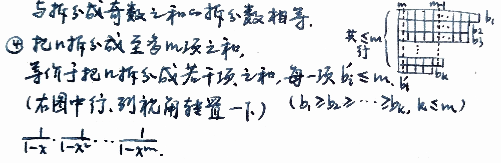

# 第 7 章 生成函数与递推关系

递推关系与生成函数都是组合数学中非常重要的工具，常用于求解组合计数问题。特别是在分析算法复杂性和设计动态规划以及递归算法时，具有强大的功效。由于在求解递推关系时经常需要用到生成函数，本章将先介绍生成函数的相关理论与应用。

## 7.1 幂级数型生成函数

> **形式幂级数**：不考虑收敛性、只作为代数对象处理的无穷级数。$x$ 只是一个符号，不代入数值。

#### 定义7.1（普通型母函数、普母函数）

设$a_1, a_2, \cdots, a_n\cdots$是一个数列，构造形式幂级数
$$f(x) = a_0 + a_1x + a_2x^2 + \cdots + a_nx^n + \cdots,$$

称$f(x)$是数列$a_1, a_2, \cdots, a_n, \cdots$的**生成函数**，且两个形式幂级数$\sum_{i=0}^\infty a_i x^i$和$\sum_{i=0}^\infty b_i x^i$**相等**，当且仅当对每个$i$有$a_i = b_i$。

对于有限序列，可看成自某项后全为0的无穷序列。

#### 定理7.1（习题7.1）

设数列$\{a_n\}, \{b_n\}, \{c_n\}$的生成函数分别是$f(x)$，$g(x)$和$h(x)$，$r$为常数。

> 幂级数型生成函数的运算法则与收敛幂级数的运算法则相同。

$f(x)=\sum_{n\ge0}a_nx^n$，$g(x)=\sum_{n\ge0}b_nx^n$，$h(x)=\sum_{n\ge0}c_nx^n$。

##### 1. （数乘）如果 $b_n = r a_n$，则 $g(x) = r f(x)$。

若 $b_n=ra_n$，则 $g(x)=\sum_{n\ge0}b_nx^n=\sum_{n\ge0}r a_n x^n=r\sum_{n\ge0}a_nx^n=r f(x)$。

##### 2. （加法）如果 $c_n = a_n + b_n$，则 $h(x) = f(x) + g(x)$。

若 $c_n=a_n+b_n$，则 $h(x)=\sum c_nx^n=\sum(a_n+b_n)x^n=\sum a_nx^n+\sum b_nx^n=f(x)+g(x)$。

##### 3. （乘法）如果 $c_n = \sum_{i = 0}^n a_i b_{n - i}$，则 $h(x) = f(x) \cdot g(x)$。

若 $c_n=\sum_{i=0}^n a_i b_{n-i}$，则
$$
h(x)=\sum_{n\ge0}c_nx^n=\sum_{n\ge0}\Big(\sum_{i=0}^n a_i b_{n-i}\Big)x^n.
$$

交换求和得
$$
h(x)=\sum_{i\ge0}\sum_{j\ge0} a_i b_j x^{i+j}=\Big(\sum_{i\ge0}a_i x^i\Big)\Big(\sum_{j\ge0}b_j x^j\Big)=f(x)g(x),
$$

即系数卷积对应乘法。

##### 4. 如果 $b_n = \begin{cases} 0 & n < l \\ a_{n - l} & n \geqslant l \end{cases}$ ，则 $g(x) = x^l \cdot f(x)$。

若 $b_n=0$ 当 $n<l$，且 $b_n=a_{n-l}$ 当 $n\ge l$，则
$$
g(x)=\sum_{n\ge0}b_nx^n=\sum_{n\ge l}a_{n-l}x^n=x^l\sum_{m\ge0}a_m x^m=x^l f(x).
$$

##### 5. 如果 $b_n = a_{n + l}$，则 $g(x) = \frac{f(x) - \sum_{n = 0}^{l - 1} a_n x^n}{x^l}$.

若 $b_n=a_{n+l}$，则
$$
g(x)=\sum_{n\ge0}a_{n+l}x^n=\frac{1}{x^l}\Big(\sum_{n\ge0}a_{n}x^{n}-\sum_{n=0}^{l-1}a_nx^n\Big)
=\frac{f(x)-\sum_{n=0}^{l-1}a_nx^n}{x^l}.
$$

##### $\star$ 6. 如果 $b_n = \sum_{i = 0}^n a_i$，则 $g(x) = \frac{f(x)}{1 - x}$.

当 $|x|\lt 1$ 时，已知几何级数公式：
$$
\frac{1}{1-x} = \sum_{i=0}^\infty x^i \quad (|x|<1)
$$

那么：
$$
\frac{f(x)}{1-x} = \left(\sum_{i=0}^\infty{x^i}\right)\cdot\left(\sum_{i=0}^\infty{a_ix^i}\right) = \sum_{i=0}^\infty{\left(\sum_{j=0}^{i}{a_j}\right)\cdot x^i} = g(x).
$$

第二个等号由观察两个幂级数相乘时，$x^n$ 的系数得到：
$$
\begin{matrix}
x^0 & x^1 & x^2 & x^3 & x^4 & \cdots \\
a_0 & a_1 & a_2 & a_3 & a_4 & \cdots \\
    & a_0 & a_1 & a_2 & a_3 & \cdots \\
    &     & a_0 & a_1 & a_2 & \cdots \\
    &     &     & a_0 & a_1 & \cdots \\
    &     &     &     & a_0 & \cdots \\
\end{matrix}
$$

每一列 $x^n$ 的系数是这一列从上到下所有项的和。

##### $\star$ 7. 如果 $b_n = \sum_{i = 0}^\infty a_i$，且 $f(1) = \sum_{n = 0}^\infty a_n$ 收敛，则 $g(x) = \frac{f(1) - x f(x)}{1 - x}$.

若 $b_n=\sum_{i=0}^\infty a_i$（与 $n$ 无关）并且 $S:=\sum_{n\ge0}a_n=f(1)$ 收敛，则对每一 $n$ 有 $b_n=S$。

$$
\begin{aligned}
\frac{f(1)-xf(x)}{1-x}
&= \frac{\sum\limits_{i=0}^\infty{a_i}-\sum\limits_{i=0}^\infty{a_ix^i}}{1-x^{i+1}}\\
&= \frac{\sum\limits_{i=0}^\infty{a_i(1-x^{i+1})}}{1-x}\\
&= \sum_{i=0}^\infty{a_i(1+x+x^2+\cdots+x^i)}\\
&= \sum_{i=0}^\infty{\left(\sum_{j=i}^\infty{a_j}\right)x^i}\\
&= \sum_{i=0}^\infty{b_ix^i} = g(x).
\end{aligned}
$$

<!-- 我们从下面这个恒等式出发：
$$f(1) - x f(x) = \sum_{n \ge 0} a_n - x \sum_{n \ge 0} a_n x^n = \sum_{n \ge 0} a_n (1 - x^{n+1}).$$
把它写成：
$$f(1) - x f(x) = (1 - x) \sum_{n \ge 0} (a_0 + a_1 + \cdots + a_n) x^n.$$
两边除以 $(1 - x)$，得：
$$\frac{f(1) - x f(x)}{1 - x} = \sum_{n \ge 0} (a_0 + a_1 + \cdots + a_n) x^n.$$
这表示的是当 $b_n = \sum_{i = 0}^{n} a_i$ 时的生成函数（即定理 7.1 第 6 条）。
而如果 $\sum_{i = 0}^{\infty} a_i = S$ 收敛，则当 $n \to \infty$，部分和 $\sum_{i = 0}^n a_i \to S$，所以极限情形（即第 7 条）变成：
$$g(x) = \frac{f(1) - x f(x)}{1 - x}.$$ -->

##### 8. 如果 $b_n = r^n a_n$，则 $g(x) = f(r x).$

若 $b_n=r^n a_n$，则
$$
   g(x)=\sum_{n\ge0} r^n a_n x^n=\sum_{n\ge0} a_n (r x)^n=f(r x).
$$

##### 9. 如果 $b_n = n a_n$，则 $g(x) = x f'(x) .$

若 $b_n=n a_n$，则
$$
   g(x)=\sum_{n\ge0} n a_n x^n = x\frac{d}{dx}\sum_{n\ge0} a_n x^n = x f'(x).
$$

> 形式求导：$\displaystyle \left(\sum_{n=0}^{\infty} a_n x^n\right)' = \sum_{n=1}^{\infty} na_n x^{n-1}$。

##### 10.  如果 $b_n = \frac{a_n}{n + 1}$，则 $g(x) = \frac{1}{x} \int_0^x f(x) \, dx$。

计算右边积分：
$$\int_0^x f(t)dt = \int_0^x \sum_{n=0}^\infty a_n t^n dt = \sum_{n=0}^\infty a_n \int_0^x t^n dt
= \sum_{n=0}^\infty a_n \frac{x^{n+1}}{n+1}.$$

两边同时除以 $x$：
$$\frac{1}{x}\int_0^x f(t)dt = \sum_{n=0}^\infty \frac{a_n}{n+1} x^n = \sum_{n=0}^\infty b_n x^n = g(x).$$

 

#### 例7.1

(1) 设有质量分别为$n_1$，$n_2$克，$\cdots$，$n_k$克的$k$个砝码。现要用天平称$i$克的物体，物体放在左边，砝码放在右边，共有多少种不同称法？

(2) 用质量分别为1克，2克，4克，8克，16克的5个砝码，在天平上能称几种质量的物体？每种质量的物体有几种不同的称法？

(3) 用2个质量为1克，3个质量为2克，2个质量为5克的砝码在天平上能称几种质量的物体？且每种质量的物体有几种不同的称法？

**解**：
(1) 设有$a_i$种方法称$i$克物体。下面研究$k$个形式幂级数的积
$$(1 + x^{n_1})(1 + x^{n_2}) \cdots (1 + x^{n_k})$$

它的展开式中$x^i$幂来源于
$$x^{m_1} x^{m_2} \cdots x^{m_k} = x^i, \quad m_1 + m_2 + \cdots + m_k = i, \quad m_j \in \{0, n_j\}$$

其中第一个括弧提供$m_1$次幂，第二个括弧提供$m_2$次幂，$\cdots$，第$k$个括弧提供$m_k$次幂，$m_j = 0$表示$n_j$克砝码没有用上，$m_j = n_j$表示$n_j$克砝码用上了，因此展开式中$x^i$的系数恰好是称$i$克物体的方法数，故有
$$(1 + x^{n_1})(1 + x^{n_2}) \cdots (1 + x^{n_k}) = \sum_{i=0}^\infty a_i x^i$$

(2) 设质量$r$克物体有$a_r$种称法，则数列$\{a_r\}$的生成函数是
$$f(x) = (1 + x)(1 + x^2)(1 + x^4)(1 + x^8)(1 + x^{16})$$

$$(1 - x)f(x) = (1 - x)(1 + x)(1 + x^2)(1 + x^4)(1 + x^8)(1 + x^{16}) = 1 - x^{32}$$

所以
$$f(x) = \frac{1 - x^{32}}{1 - x} = 1 + x + x^2 + \cdots + x^{31}$$

这表明凡是不超过31克的物体都能用给定的5个砝码称出，且每个恰有一种称法。

(3) 设质量$r$克物体有$a_r$种称法，则数列$\{a_r\}$的生成函数是
$$\begin{align*}
f(x) &= (1 + x + x^2)(1 + x^2 + (x^2)^2 + (x^2)^3)(1 + x^5 + (x^5)^2) \\
&= 1 + x + 2x^2 + x^3 + 2x^4 + 2x^5 + 3x^6 + 3x^7 + 2x^8 + 2x^9 + 2x^{10} + 3x^{11} + 3x^{12} \\
&+ 2x^{13} + 2x^{14} + x^{15} + 2x^{16} + x^{17} + x^{18}
\end{align*}$$

这表明凡是质量不超过18克的物体都能用给定的砝码称出。其中质量为1，3，15，17，18克的只有一种称法，质量为2，4，5，8，9，10，13，14，16克的物体有2种称法，而质量为6，7，11，12克的物体有3种称法。

从上例中看出用生成函数可比较容易地解决一些计数问题。下面用生成函数来求**多重集的$r$-组合数**。

> **方法**：先求收敛幂级数的和函数，再展开后得到系数。

#### ⭐例7.2

##### **(1)** 设多重集$S = \{\infty \cdot x_1, \infty \cdot x_2, \cdots, \infty \cdot x_k\}$，$S$的$r$-组合数是$a_r = C(r + k - 1, r)$，它也是方程$x_1 + x_2 + \cdots + x_k = r$的非负整数解的个数。

现用生成函数的方法求$a_r$。设$\{a_r\}$的生成函数为$f(y)$，构造幂级数$$(1 + y + y^2 + \cdots)^k,$$把这个式子展开后，$y^r$幂来源于
$$y^{x_1} y^{x_2} \cdots y^{x_k} = y^{x_1 + x_2 + \cdots + x_k}, \quad x_1 + x_2 + \cdots + x_k = r$$

其中$y^{x_1}$来自第一个因式$(1 + y + y^2 + \cdots)$，$y^{x_2}$来自第二个因式$(1 + y + y^2 + \cdots)$，$\cdots$，$y^{x_k}$来自第$k$个因式$(1 + y + y^2 + \cdots)$，且$x_1 + x_2 + \cdots + x_k$为非负整数。因此展开式中$y^r$的系数对应了不定方程$x_1 + x_2 + \cdots + x_k = r$的非负整数解的个数。

故所构造的幂级数就是$\{a_r\}$的生成函数$f(y)$。由推论6.4可得
$$f(y) = \frac{1}{(1 - y)^k} = \sum_{r=0}^\infty C(k + r - 1, r) y^r$$

所以$a_r = C(k + r - 1, r)$。

##### **(2)** 设多重集$S = \{n_1 \cdot a_1, n_2 \cdot a_2, \cdots, n_k \cdot a_k\}$，$S$的$r$-组合数$a_r$就相当于方程$x_1 + x_2 + \cdots + x_k = r$，$x_1 \leq n_1, x_2 \leq n_2, \cdots, x_k \leq n_k$的非负整数解的组数。

设$\{a_r\}$的生成函数$f(y)$，类似可以得到$$f(y) = (1 + y + y^2 + \cdots + y^{n_1})(1 + y + y^2 + \cdots + y^{n_2}) \cdots (1 + y + y^2 + \cdots + y^{n_k}),$$则$f(y)$的展开式中$x^r$的系数$a_r$就是所求的$r$-组合数。

#### 例7.3

设$S = \{\infty \cdot x_1, \infty \cdot x_2, \cdots, \infty \cdot x_k\}$，求$S$的每个元素只出现偶数次的$r$-组合数$a_r$。

**解**：令$\{a_r\}$的生成函数为$f(y)$，则
$$f(y) = (1 + y^2 + y^4 + \cdots)^k = \frac{1}{(1 + y^2)^k}\\
= 1 + k y^2 + C(k + 1, 2) y^4 + \cdots + C(k + n - 1, n) y^{2n} + \cdots$$

所以有
$$a_r = \begin{cases}
C\left(k + \frac{r}{2} - 1, \frac{r}{2}\right) & r = 2n (n = 0, 1, \cdots) \\
0 & r = 2n + 1 (n = 0, 1, \cdots)
\end{cases}$$

同样地，用生成函数的方法也可求解不定方程的整数解组数。

#### 例7.4
求$x_1 + x_2 + x_3 = 5(0 \leq x_1, 0 \leq x_2, 1 \leq x_3)$的整数解组数。

**解**：令$x_3' = x_3 - 1$，则原问题即为求在约束条件下，
$$0 \leq x_1, \quad 0 \leq x_2, \quad 1 \leq x_3'$$

$x_1 + x_2 + x_3' = 4$的非负整数解组数。设解的组数为$a_4$，$\{a_r\}$的生成函数是
$$f(y) = \frac{1}{(1 - y)^3} = \sum_{r=0}^\infty C(r + 2, r) y^r$$

所以有$a_4 = C(4 + 2, 4) = 15$。

---

## 7.2 指数型生成函数

#### 定义7.2（指母函数）

设$a_1, a_2, \cdots, a_n, \cdots$是一个数列，构造形式幂级数
$$f(x) = \sum_{r=0}^\infty \frac{a_r}{r!} x^r = a_0 + a_1 x + \frac{a_2}{2!} x^2 + \cdots + \frac{a_n}{n!} x^n + \cdots$$

称$f(x)$是数列$a_1, a_2, \cdots, a_n, \cdots$的**指数型生成函数**。

根据定义知，指数型生成函数与幂级数型生成函数的一般项仅相差一个因子$1/n!$。只要令$a_r' = a_r / r!$，则$\{a_r'\}$的幂级数型生成函数就是$\{a_r\}$的指数型生成函数，因此由定理7.1易得指数型生成函数的性质。

#### 定理7.2（习题7.6）

**设$\{a_n\}, \{b_n\}$的指数生成函数分别为$f_e(x)$和$g_e(x)$，则**
$$f_e(x) g_e(x) = \sum_{n=0}^\infty C_n \frac{x^n}{n!}$$

**其中**
$$C_n = \sum_{k=0}^n C(n, k) a_k b_{n-k}$$

##### 证明：

定义指数生成函数
$$
f_e(x)=\sum_{k\ge0} a_k\frac{x^k}{k!},\qquad
g_e(x)=\sum_{j\ge0} b_j\frac{x^j}{j!}.
$$

两式相乘：
$$
f_e(x)g_e(x) = \sum_{k\ge0}\sum_{j\ge0} a_k b_{j} \frac{x^{k+j}}{k!j!}.
$$

把双和按总指数 $n=k+j$ 合并：
$$
f_e(x)g_e(x)=\sum_{n\ge0}\left(\sum_{k=0}^n a_k b_{n-k}\frac{1}{k!(n-k)!}\right)x^n.
$$

把每一项写成 $\dfrac{C_n}{n!}x^n$ 的形式，比较系数得
$$
\frac{C_n}{n!}=\sum_{k=0}^n \frac{a_k b_{n-k}}{k!(n-k)!},
$$

因此
$$
C_n=n!\sum_{k=0}^n \frac{a_k b_{n-k}}{k!(n-k)!}
=\sum_{k=0}^n \binom{n}{k} a_k b_{n-k}.
$$

代入回去就得到
$$
f_e(x)g_e(x)=\sum_{n\ge0}C_n\frac{x^n}{n!},
$$

正是定理要证明的结论。

对于$a_n = 1$的数列$\{1\}$，它的指数型生成函数为
$$e^x = \sum_{n=0}^\infty \frac{x^n}{n!} = 1 + x + \frac{x^2}{2!} + \cdots + \frac{x^n}{n!} + \cdots$$

⭐在上节中，**用幂级数型生成函数求解多重集的组合问题，而用指数型生成函数则可解决多重集的排列问题**。

#### 定理7.3

**设有限多重集$S = \{n_1 \cdot a_1, n_2 \cdot a_2, \cdots, n_k \cdot a_k\}$，且$n = n_1 + n_2 + \cdots + n_k$，对任意的非负整数$r$，令$a_r$为$S$的$r$-排列数，则数列$\{a_r\}$的指数型生成函数为**
$$g(x) = g_{n_1}(x) g_{n_2}(x) \cdots g_{n_k}(x)$$

**其中**
$$g_{n_i}(x) = 1 + x + \frac{x^2}{2!} + \cdots + \frac{x^{n_i}}{n_i!}, \quad i = 1, 2, \cdots, k$$

**证明**：考察$g(x)$的展开式中$x^r$的项，它必是下述项之和。
$$\frac{x^{m_1}}{m_1!} \frac{x^{m_2}}{m_2!} \cdots \frac{x^{m_k}}{m_k!}$$

其中$m_1 + m_2 + \cdots + m_k = r, 0 \leq m_i \leq n_i, i = 1, 2, \cdots, k$，而这类项又可写成
$$\frac{x^{m_1 + m_2 + \cdots + m_k}}{m_1! m_2! \cdots m_k!} = \frac{r!}{m_1! m_2! \cdots m_k!} \cdot \frac{x^r}{r!}$$

所以在$g(x)$的展开式中$\frac{x^r}{r!}$的系数是
$$a_r = \sum \frac{r!}{m_1! m_2! \cdots m_k!}$$

这里求和是对方程
$$m_1 + m_2 + \cdots + m_k = r, 0 \leq m_i \leq n_i (i = 1, 2, \cdots, k)$$

的一切非负整数解进行求和的。又因为对固定的$m_1, m_2, \cdots, m_k$，$\frac{r!}{m_1! m_2! \cdots m_k!}$就是$S$的$r$-子集$\{m_1 \cdot x_1, m_2 \cdot x_2, \cdots, m_k \cdot x_k\}$的全排列数。故$a_r$就是$S$的所有$r$-元子集的全排列数之和，即$S$的$r$-排列数。所以$g(x)$的展开式中$\frac{x^r}{r!}$的系数$a_r$就是多重集$S$的$r$-排列数。
$\square$

#### 例7.5

设有6个数字，其中有3个1、2个6和1个8，问能组成多少个四位数？

**解**：这实际上是求$S = \{3 \cdot x_1, 2 \cdot x_2, 1 \cdot x_3\}$中取4个的多重集排列数问题。其指数型生成函数为
$$
\begin{align*}
g(x) &= \left(1 + x + \frac{x^2}{2!} + \frac{x^3}{3!}\right)\left(1 + x + \frac{x^2}{2!}\right)(1 + x)\\
&= 1 + 3x + 8\frac{x^2}{2!} + 19\frac{x^3}{3!} + 38\frac{x^4}{4!} + 60\frac{x^5}{5!} + 60\frac{x^6}{6!}
\end{align*}
$$

由此可得$a_4 = 38$，即可组成38个四位数。

 

#### ⭐补充：整数的拆分问题

##### 1. 普通拆分（无限制拆分）

- 问题：正整数 $n$ 拆成若干正整数之和的方案数记作 $a_n$。
- 生成函数：
$$
\begin{align*}
A(x) &= (1+x+x^2+\cdots)(1+x^2+x^4+\cdots)\cdots(1+x^n+x^{2n}+\cdots) \\
&= \frac{1}{(1-x)(1-x^2)(1-x^3)\cdots(1-x^n)}\\
&= \prod_{k=1}^\infty \frac{1}{1-x^k}
\end{align*}
$$
- $a_n$ 是 $x^n$ 的系数。

##### 2. 拆分成**互不相同的部分**

$$
\begin{align*}
D(x) &= (1+x)(1+x^2)(1+x^3)\cdots (1+x^n)\\ 
&= \frac{1-x^2}{1-x}\cdot \frac{1-x^4}{1-x^2} \cdot \frac{1-x^6}{1-x^3} \cdot \frac{1-x^8}{1-x^4}\cdots \frac{1-x^{2n}}{1-x^{n}}\cdot\\
&= \frac{1}{(1-x)(1-x^3)(1-x^5)\cdots(1-x^{n})}
\end{align*}
$$

##### 3. 拆分成**奇数部分**

- 所有部分都是奇数。
- 生成函数：
$$
O(x) = \frac{1}{(1-x)(1-x^3)(1-x^5)\cdots} = \prod_{j=0}^\infty \frac{1}{1-x^{2j+1}}
$$

##### 4. 拆分成**偶数部分**

- 所有部分都是偶数。
- 生成函数：
$$
E(x) = \frac{1}{(1-x^2)(1-x^4)(1-x^6)\cdots} = \prod_{k=1}^\infty \frac{1}{1-x^{2k}}
$$

##### 5. 重要恒等式（欧拉）

- **不同部分拆分** 与 **奇数部分拆分** 的数量相等：
$$
\prod_{k=1}^\infty (1+x^k) = \prod_{j=0}^\infty \frac{1}{1-x^{2j+1}}
$$
- 证明可通过 $(1+x^k) = \frac{1-x^{2k}}{1-x^k}$ 将左边化为右边。

##### 6. 拆分成**至多 $m$ 个部分**

- 等价于拆分成**每个部分 $\le m$**（通过 Ferrers 图转置）。
- 生成函数：
$$
\frac{1}{(1-x)(1-x^2)\cdots(1-x^m)}
$$

##### 7. 拆分成**恰好 $m$ 个部分**

- **思路一**：“拆分成**至多 $m$ 项**”与“拆分成**至多 $m-1$ 项**”相减得到“拆分成**恰好 $m$ 项**”
$$
\frac{1}{(1-x)(1-x^2)\cdots(1-x^m)} - \frac{1}{(1-x)(1-x^2)\cdots(1-x^{m-1})}
$$

- **思路二**：因为每个部分至少为 1，先给每个部分分配 1（共 $m$），剩余 $n-m$ 拆分成至多 $ m $ 部分。
$$
\frac{x^m}{(1-x)(1-x^2)\cdots(1-x^m)}
$$

---

## 7.3 递推关系

递推关系是离散变量之间变化规律中常见的一种方式，与生成函数一样是解决计数问题的有力工具。一般地，对数列$\{u_n\}$，$n = 1, 2, \cdots$，如从某项开始，根据$u_n$之前的$k$项可推出$u_n$的普遍规律，就称为递推关系。利用递推关系和初值在某些情况下可以求出序列的通项表达式$u_n$，称为该递推关系的解。当然，并不是所有的递推关系都可求出其解，只是某些特殊类型有成熟解法。这里主要介绍解递推关系的几种常用方法。

下面先看两个递推关系的例子。

#### 例7.6

13世纪初意大利数学家Fibonacci研究过著名的兔子繁殖数目问题。设一对雌雄小兔刚满2个月时，便可繁殖出一雌一雄一对小兔。以后每隔1个月生一对一雌一雄小兔。由一对刚出生的小兔开始饲养到第$n$个月，有多少对兔子？

**解**：设第$n$个月有$F_n$对兔子，它由两部分组成：

(1) 新生出的小兔，其数目等于能生小兔的大兔对数目，由于小兔满两个月才能繁殖，故数目为第$(n-2)$个月时的兔对数目，即为$F_{n-2}$。

(2) 原有小兔，其数目等于上月（即第$n-1$个月）的兔对数目，即为$F_{n-1}$。

因此可建立如下的递推关系：
$$F_n = F_{n-2} + F_{n-1}$$
并有初始条件：$F_1 = F_2 = 1$。即这是一个带有初值的递推关系。满足这种递推关系的数列称为Fibonacci数列。

#### 例7.7

设多重集$S = \{\infty \cdot a, \infty \cdot b, \infty \cdot c\}$，求其中$a$不相邻的$n$-排列数。

**解**：设$a$不相邻的$n$-排列数为$a_n$，则$a_1 = 3$，$a_2 = 3^2 - 1 = 8$，当$n \geq 3$时，$a$不相邻的所有$n$-排列可分为互不相容的两类：

(1) 第一个位置排$b$或$c$，剩下的$n-1$个位置$a$不相邻，由$a_n$的定义知，$a$不相邻的$(n-1)$-排列数为$a_{n-1}$，根据乘法原则，这类排列数为$2a_{n-1}$。

(2) 第一个位置排$a$，则第二个位置只能排$b$或$c$，而剩下的$n-2$个位置$a$不相邻，由$a_n$的定义知，$a$不相邻的$(n-2)$-排列数为$2a_{n-2}$，根据乘法原则，这类排列数为$2a_{n-2}$。

由加法原则知，$a$不相邻的$n$-排列数为：$a_n = 2a_{n-1} + 2a_{n-2}$。并有初始条件：$a_1 = 3$，$a_2 = 8$，即这是一个带有初值的递推关系。

 

### 求解常系数线性递推关系的特征根方法

#### 定义7.3

数列$\{a_n\}$满足递推关系
$$a_n = h_1 a_{n-1} + h_2 a_{n-2} + \cdots + h_k a_{n-k}$$

$h_i$为常数，$i = 1, 2, \cdots, k, n \geq k, h_k \neq 0$
称该递推关系为$a_n$的**k阶常系数线性齐次递推关系**。形如
$$a_n = h_1 a_{n-1} + h_2 a_{n-2} + \cdots + h_k a_{n-k} + f(n)$$

$h_i$为常数，$i = 1, 2, \cdots, k, n \geq k, h_k \neq 0$
的一类递推关系，称为$a_n$的**k阶常系数线性非齐次递推关系**。

k阶常系数线性齐次递推关系与微分方程
$$y^{(k)} = h_1 y^{(k-1)} + h_2 y^{(k-2)} + \cdots + h_k y$$

$h_i$为常数，$i = 1, 2, \cdots, k$
在结构上类似，而k阶常系数线性非齐次递推关系与微分方程
$$y^{(k)} = h_1 y^{(k-1)} + h_2 y^{(k-2)} + \cdots + h_k y + f(n)$$

$h_i$为常数，$i = 1, 2, \cdots, k$
在结构上也类似，事实上求解方法也与相应的微分方程类似。下面不加证明地给出求解方法。

#### 定义7.4

方程
$$x^k - c_1 x^{k-1} - c_2 x^{k-2} - \cdots - a_k = 0$$

称为k阶常系数线性齐次递推关系的**特征方程**，它的k个根$q_1, q_2, \cdots, q_k$称为该递推关系的**特征根**。其中$q_i(i = 1, 2, \cdots, k)$是复数。

#### 定理7.4

$a_n = q^n, q \neq 0$是常系数线性齐次递推关系的解的充要条件是：$q$是该递推关系的特征根。

#### ⭐定理7.5（特征方程的根皆为单根的情形）

若k阶常系数线性齐次递推关系的特征方程有**k个互异的特征根**：$q_1, q_2, \cdots, q_k$，则该递推关系的通解为
$$a_n = c_1 q_1^n + c_2 q_2^n + \cdots + c_k q_k^n$$

其中$c_1, c_2, \cdots, c_k$为任意常数（由初始项决定）。

#### 例7.8

求例7.7的带初值递推关系的解。

**解**：例7.7的递推关系的特征方程为
$$x^2 - 2x - 2 = 0$$

其根是：$q_1 = 1 + \sqrt{3}$，$q_2 = 1 - \sqrt{3}$。由定理7.5知，递推关系的通解为
$$a_n = (1 + \sqrt{3})^n c_1 + (1 - \sqrt{3})^n c_2$$

要满足初值条件，故有
$$\begin{cases}
(1 + \sqrt{3}) c_1 + (1 - \sqrt{3}) c_2 = 3 \\
(1 + \sqrt{3})^2 c_1 + (1 - \sqrt{3})^2 c_2 = 8
\end{cases}$$

解方程组得
$$c_1 = \frac{5\sqrt{3} - 1}{6\sqrt{3}}, \quad c_2 = \frac{5\sqrt{3} + 1}{6\sqrt{3}}$$

所以$a$不相邻的$n$-排列数为
$$a_n = \frac{5\sqrt{3} - 1}{6\sqrt{3}} (2 + \sqrt{3})^n + \frac{5\sqrt{3} + 1}{6\sqrt{3}} (2 - \sqrt{3})^n$$

 

定理7.5解决了特征方程的根皆为单根的情况。对于特征根为重根的情况，有下述结论。

#### ⭐定理7.6（特征根为重根的情形）

若k阶常系数线性齐次递推关系的特征方程有**t个互异的特征根：$q_1, q_2, \cdots, q_t, m_1, m_2, \cdots, m_t$为相应根的重数**，且$\sum_{i=1}^t m_i = k$，则该递推关系的通解为
$$
\begin{align*}
u_n &= \sum_{i=1}^t \sum_{j=1}^{m_i} c_{ij} n^{j-1} q_i^n \\
&= (c_{11}q_1^n + c_{12}nq_1^n + \cdots + c_{1,m_1}n^{m_1-1}q_1^n)\\
&+ (c_{21}q_2^n + c_{22}nq_2^n + \cdots + c_{2,m_2}n^{m_2-1}q_2^n)\\
&+ \cdots \\
&+ (c_{t1}q_t^n + c_{t2}nq_t^n + \cdots + c_{t,m_t}n^{m_t-1}q_t^n)
\end{align*}
$$

其中$c_{ij}(1 \leq j \leq m_i, 1 \leq i \leq t)$为任意常数。

#### 例7.9

求解递推关系
$$a_n + a_{n-1} - 3a_{n-2} - 5a_{n-3} - 2a_{n-4} = 0, n \geq 4\\
a_0 = 1, a_1 = a_2 = 1, a_3 = 2$$

**解**：该递推关系的特征方程是
$$x^4 + x^3 - 3x^2 - 5x - 2 = 0$$

其特征根是$-1, -1, -1, 2$。由定理7.6得
$$a_n = c_{11}(-1)^n + c_{12}n(-1)^n + c_{13}n^2(-1)^n + c_{21}2^n$$

代入初值得到以下方程组
$$\begin{cases}
c_{11} + c_{21} = 1 \\
-c_{11} - c_{12} - c_{13} + 2c_{21} = 0 \\
c_{11} + 2c_{12} + 4c_{13} + 4c_{21} = 0 \\
-c_{11} - 3c_{12} - 9c_{13} + 8c_{21} = 2
\end{cases}$$

解此方程组得
$$c_1 = \frac{7}{8}, c_{12} = -\frac{13}{16}, c_{13} = \frac{1}{16}, c_{21} = \frac{1}{8}$$

故递推关系的解是
$$a_n = \frac{7}{8}(-1)^n - \frac{13}{16}n(-1)^n + \frac{1}{16}n^2(-1)^n + \frac{1}{8}2^n$$

 

k阶常系数线性非齐次递推关系的通解与k阶常系数线性非齐次微分方程的通解类似，也是齐次通解与特解之和，即
$$a_n = a_n' + a_n^*$$

其中$a_n'$是k阶常系数线性非齐次递推关系所对应的k阶常系数线性齐次递推关系
$$a_n - h_1 a_{n-1} - \cdots - h_k a_{n-k} = 0$$

的通解，而$a_n^*$是k阶常系数线性非齐次递推关系的特解。对于$a_n'$由定理7.6即得，故关键是$a_n^*$的求解。对于一般的$f(n)$没有普遍的解法，在某些简单的情况下可用待定系数法求出$a_n^*$。

一般地，(1) 当$f(n)$是n的t次多项式时，对应的特解形式为
$$a_n^* = P_1 n^t + P_2 n^{t-1} + \cdots + P_t n + P_{t+1}$$

其中$P_1, P_2, \cdots, P_{t+1}$为待定系数。
(2) 当$f(n)$是$\beta^n$的形式时，若$\beta$不是对应的齐次递推关系的特征根，则对应的特解是$P \cdot \beta^n$，其中$P$为待定系数；若$\beta$是对应的齐次递推关系的m重特征根，则对应的特解是$P \cdot n^m \cdot \beta^n$，其中$P$为待定系数。

#### ⭐补充：非齐次线性递推关系式的求解方法

非齐次线性递推关系式：

**(1)** $$a_0t_n^n + a_1t_{n-1}^{n-1} + \cdots + a_kt_{n-k}^{n-k} = b^n p(n)$$

其中， $p(n)$ 是关于 $n$ 的 $d$ 次多项式。

特征方程：
$$(a_0x^k + a_1x^{k-1} + \cdots + a_k)(x-b)^{d+1} = 0$$

**(2)** $$a_0t_n^n + a_1t_{n-1}^{n-1} + \cdots + a_kt_{n-k}^{n-k} = b_1^n p_1(n) + b_2^n p_2(n)$$

其中， $p_i(n)$ 是关于 $n$ 的 $d_i$ 次多项式。

特征方程：
$$(a_0x^k + a_1x^{k-1} + \cdots + a_k)(x-b_1)^{d_1+1}(x-b_2)^{d_2+1} = 0$$

 

#### 例7.10
求解递推关系
$$a_n + 2a_{n-1} = n + 1, \quad n \geq 1, a_0 = 2$$

**解**：该递推关系导出的齐次线性递推关系
$$a_n + 2a_{n-1} = 0$$
的特征方程是
$$x + 2 = 0$$
其特征根是$-2$。由定理7.5知其通解为
$$a_n = c(-2)^n$$
又因$f(n) = n + 1$，故它的特解具有形式
$$a_n^* = P_1 n + P_2$$
其中$P_1, P_2$为待定系数。将其代入原递推关系
$$P_1 n + P_2 + 2(P_1 (n - 1) + P_2) = n + 1$$
即
$$3P_1 n + 3P_2 - 2P_1 = n + 1$$
比较上式两端n的同次幂的系数，得
$$P_1 = \frac{1}{3}, P_2 = \frac{5}{9}$$
因此
$$a_n^* = \frac{n}{3} + \frac{5}{9}$$
是原递推关系的特解。而它的通解是
$$a_n = c(-2)^n + \frac{n}{3} + \frac{5}{9}$$
要它满足初值，只须$c = \frac{13}{9}$。所以带初值的递推关系的解为
$$a_n = \frac{13}{9}(-2)^n + \frac{n}{3} + \frac{5}{9}$$

### 求解递推关系的生成函数法

<!--  ⭐补充

齐次线性递推关系式：
$$f(n) = a_1f(n-1) + a_2f(n-2) + \cdots + a_kf(n-k),\quad n\geq k,\ a_k \neq 0,\ f(i) = b_i, 0\leq i \leq k-1.$$

$\{f(n)\}_{n\geq 0}$ 的普母函数为 $$F(x) = f(0) + f(1)x + \cdots + f(n)x^n + \cdots = \sum_{n=0}^{\infty} f(n)x^n.$$

特征多项式
$$p(x) = x^k - a_1x^{k-1} - \cdots \ a_k$$

令 $$g(x) = x^k p(\frac{1}{x}) = 1 - a_1 x - a_2 x^2 - \cdots - a_k x^k,$$

则 
$$
\begin{align*}
F(x)g(x) &= \left(f(0) + f(1)x + \cdots + f(k)x^k + \cdots\right)\left(1 - a_1 x - a_2 x^2 - \cdots - a_k x^k\right)\\
&= f(0) + (f(1)-a_1f(0))x + (f(2)-a_1f(1)-a_2f(0))x^2 + \cdots \\
& + (f(k-1) - a_1 f(k-2) - \cdots - a_{k-1} f(0)) x^{k-1}\\
& + (f(k) - a_1 f(k-1) - \cdots - a_k f(0)) x^k + \cdots\\
&= f(0) + (f(1)-a_1f(0))x + (f(2)-a_1f(1)-a_2f(0))x^2 + \cdots \\
& + (f(k-1) - a_1 f(k-2) - \cdots - a_{k-1} f(0)) x^{k-1} =: \phi(x)\\
\end{align*}
$$
-->

<!-- ？？？没有打完 -->

#### ⭐补充：递推数列的生成函数解法

齐次线性递推关系式：
$$f(n) = a_1f(n-1) + a_2f(n-2) + \cdots + a_kf(n-k),\quad n\geq k,\ a_k \neq 0,\ f(i) = b_i, 0\leq i \leq k-1.$$
设 $\{f(n)\}_{n \geq 0}$ 是递推数列，其**生成函数**定义为：
$$ F(x) = f(0) + f(1)x + f(2)x^2 + \dots + f(n)x^n + \dots = \sum_{n=0}^\infty f(n)x^n $$

##### 核心步骤：结合特征多项式化简生成函数

设递推关系对应的**特征多项式**为 $p(x) = x^k - a_1x^{k-1} - \dots - a_k$，构造多项式：
$$ g(x) = x^k p\left(\frac{1}{x}\right) = 1 - a_1x - a_2x^2 - \dots - a_kx^k $$

将生成函数与 $g(x)$ 相乘，利用递推关系化简：
$$
\begin{align*}
F(x) \cdot g(x) &= \left(\sum_{n=0}^\infty f(n)x^n\right)\left(1 - a_1x - \dots - a_kx^k\right) \\
&= f(0) + \left(f(1)-a_1f(0)\right)x + \left(f(2)-a_1f(1)-a_2f(0)\right)x^2 + \dots \\
&\quad + \left(f(k)-a_1f(k-1)-\dots -a_kf(0)\right)x^k + \dots
\end{align*}
$$

由递推关系，$x^k$ 及更高次项的系数为0，因此 $F(x) \cdot g(x)$ 是次数不超过 $k-1$ 的多项式（记为 $q(x)$），即：
$$ F(x) = \frac{q(x)}{g(x)} $$

##### 进一步分解：部分分式法

将 $p(x)$ 因式分解为 $p(x) = (x-\alpha_1)^{\lambda_1}(x-\alpha_2)^{\lambda_2}\dots(x-\alpha_t)^{\lambda_t}$（其中 $\lambda_1+\lambda_2+\dots+\lambda_t=k$），则 $g(x)$ 可分解为：
$$ g(x) = (1-\alpha_1x)^{\lambda_1}(1-\alpha_2x)^{\lambda_2}\dots(1-\alpha_tx)^{\lambda_t} $$

对 $\frac{q(x)}{g(x)}$ 做**部分分式分解**（形如 $\sum_{i=1}^t \sum_{j=1}^{\lambda_i} \frac{\beta_{ij}}{(1-\alpha_ix)^j}$），再利用幂级数展开：
当 $|\alpha_i x| < 1$ 时，有
$$ \frac{1}{(1-\alpha_i x)^j} = \sum_{n=0}^\infty \mathrm{C}_{j+n-1}^n (\alpha_i x)^n $$

最终将 $F(x)$ 展开为幂级数，即可得到 $f(n)$ 的通项（即 $x^n$ 的系数）：
$$
F(x) = \sum_{n=0}^\infty \left( \sum_{i=1}^t \sum_{j=1}^{\lambda_i} \beta_{ij} \mathrm{C}_{j+n-1}^n \alpha_i^n \right) x^n
$$

#### 示例：斐波那契数列

斐波那契数列的递推关系为：
$$ u_n = u_{n-1} + u_{n-2} \quad (n \geq 2), \quad u_0 = u_1 = 1 $$

1. 构造生成函数：$F(x) = \sum_{n=0}^\infty u_n x^n$
2. 对应特征多项式：$p(x) = x^2 - x - 1$，故 $g(x) = 1 - x - x^2$
3. 化简生成函数：
$$
F(x) \cdot (1 - x - x^2) = u_0 + (u_1 - u_0)x = 1 \implies F(x) = \frac{1}{1 - x - x^2}
$$

4. 部分分式分解（利用特征根 $\alpha = \frac{1+\sqrt{5}}{2}, \beta = \frac{1-\sqrt{5}}{2}$，满足 $p(x) = (x-\alpha)(x-\beta)$）：
$$
F(x) = \frac{1}{(1-\alpha x)(1-\beta x)} = \frac{1}{\beta-\alpha} \left( \frac{1}{1-\alpha x} - \frac{1}{1-\beta x} \right)
$$

5. 幂级数展开后提取 $x^n$ 系数，得到通项：
$$
u_n = \frac{1}{\sqrt{5}} \left( \alpha^{n+1} - \beta^{n+1} \right)
$$

在求解递推关系时，生成函数法也是一个有力的工具。用生成函数法求解递推关系的关键是用$f(x)$表示$\{a_n\}$的生成函数，即
$$f(x) = \sum_{n=0}^\infty a_n x^n$$

然后将$\{a_n\}$的递推关系代入右边，便得到一个关于$f(x)$的方程，解此方程，并将所得的解展开成幂级数，就可得到$a_n$的表达式。

#### 例7.11

用生成函数法求解递推关系
$$a_n = a_{n-1} + 9a_{n-2} - 9a_{n-3}, \quad n \geq 3$$
$$a_0 = 0, a_1 = 1, a_2 = 2$$

**解**：设$\{a_n\}$的生成函数为
$$f(x) = a_0 + a_1 x + a_2 x^2 + \cdots + a_n x^n + \cdots$$
则
$$-x f(x) = -a_0 x - a_1 x^2 - a_2 x^3 - \cdots - a_{n-1} x^n - \cdots$$
$$-9x^2 f(x) = -9a_0 x^2 - 9a_1 x^3 - 9a_2 x^4 - \cdots - 9a_{n-2} x^n - \cdots$$
$$9x^3 f(x) = 9a_0 x^3 + 9a_1 x^4 + \cdots + 9a_{n-3} x^n + \cdots$$
以上四式相加得
$$\begin{align*}
&(1 - x - 9x^2 + 9x^3)f(x) \\
&= a_0 + (a_1 - a_0)x + (a_2 - a_1 - 9a_0)x^2 \\
&+(a_3 - a_2 - 9a_1 + 9a_0)x^3 + \cdots + (a_n - a_{n-1} - 9a_{n-2} + 9a_{n-3})x^n + \cdots
\end{align*}$$
因为$a_0 = 0, a_1 = 1, a_2 = 2$，且当$n \geq 3$时，$a_n - a_{n-1} - 9a_{n-2} + 9a_{n-3} = 0$，所以有
$$(1 - x - 9x^2 + 9x^3)f(x) = x + x^2$$
即
$$\begin{align*}
f(x) &= \frac{x + x^2}{1 - x - 9x^2 + 9x^3} = \frac{x + x^2}{(1 - x)(1 + x)(1 - 3x)} \\
&= -\frac{1}{4} \cdot \frac{1}{1 - x} - \frac{1}{12} \cdot \frac{1}{1 + 3x} + \frac{1}{3} \cdot \frac{1}{1 - 3x}
\end{align*}$$
而
$$\frac{1}{1 - x} = 1 + x + x^2 + \cdots + x^n + \cdots$$
$$\frac{1}{1 + 3x} = 1 - 3x + 3^2 x^2 - \cdots + (-1)^n 3^n x^n + \cdots$$
$$\frac{1}{1 - 3x} = 1 + 3x + 3^2 x^2 + \cdots + 3^n x^n + \cdots$$
因此有
$$a_n = -\frac{1}{4} \cdot \frac{1}{12} \cdot (-1)^n 3^n + \frac{1}{3} 3^n = -\frac{1}{4} - \frac{1}{4}(-1)^n 3^{n+1} + 3^{n-1}$$

#### 例7.12

用生成函数法求解双参数的递推关系
$$a_{k,n} = a_{k-1,n} + a_{k,n-1}, \quad n \geq 1, k \geq 1$$
$$a_{k,0} = 1, \quad a_{0,n} = 0$$

**解**：固定$k$，令$\{a_{k,n}\}$的生成函数为
$$G_k(x) = 1 + a_{k,1} x + a_{k,2} x^2 + a_{k,3} x^3 + \cdots$$
则
$$x G_k(x) = x + a_{k,1} x^2 + a_{k,2} x^3 + \cdots$$
$$G_{k-1}(x) = 1 + a_{k-1,1} x + a_{k-1,2} x^2 + a_{k-1,3} x^3 + \cdots$$
以上两式相加得
$$x G_k(x) + G_{k-1}(x)$$
$$= 1 + (1 + a_{k-1,1})x + (a_{k,1} + a_{k-1,2})x^2 + (a_{k,2} + a_{k-1,3})x^3 + \cdots$$
$$= 1 + a_{k,1} x + a_{k,2} x^2 + a_{k,3} x^3 + \cdots = G_k(x)$$
故有$G_k(x) = \frac{1}{1 - x} G_{k-1}(x)$。由此可得
$$G_k(x) = \frac{1}{(1 - x)^k} G_1(x)$$
而
$$\begin{align*}
G_1(x) &= 1 + a_{1,1} x + a_{1,2} x^2 + a_{1,3} x^3 + \cdots + a_{1,n} x^n + \cdots \\
&= 1 + x + x^2 + x^3 + \cdots + x^n + \cdots = \frac{1}{1 - x}
\end{align*}$$
所以有
$$G_k(x) = \frac{1}{(1 - x)^k} = 1 + kx + \frac{k(k + 1)}{2!} x^2 + \frac{k(k + 1)(k + 2)}{3!} x^3 + \cdots + \frac{k(k + 1) \cdots (k + n - 1)}{n!} x^n + \cdots$$
从而有
$$a_{k,n} = \frac{k(k + 1) \cdots (k + n - 1)}{n!} = C(k + n - 1, n)$$