# 第8章 图的基本概念

图是由一些顶点和连接这些顶点的边所组成的集合。我们可以用图表示哥尼斯堡：顶点表示岛屿和河的两岸，边表示桥，如图8.1所示。

本章首先讨论图的基本概念和术语，然后讨论欧拉图、哈密顿图和最短路，最后对如何利用图论来解决实际问题作了简单介绍。

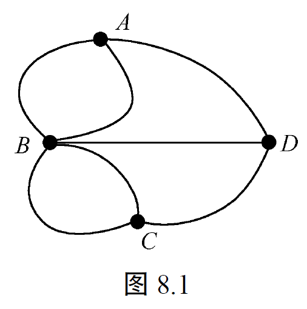

## 8.1 引言

### 有向图

在第2章中，集合论中离散对象之间的关系可以用关系图来描述，这就是图论中的有向图，定义如下。

#### 定义8.1（有向图）

设$V$是一个非空集，$E$是$V$上的二元关系，称有序对$(V, E)$为有向图，记为$G=(V, E)$或$G(V, E)$。 $V$中元素称为顶点（或点），$V$称顶点集。 $E$是$V \times V$的子集，$E$中的元素是有序对，称为**弧**，$E$称为**弧集**。

为了描述有向图的顶点与弧的连接关系，我们定义如下术语。

#### 定义8.2

顶点$a$和$b$称为弧$(a, b)$的端点，$a$为起点，$b$为终点。称$a$和$b$与弧$(a, b)$关联。 若顶点$a$和$b$相同，则对应的弧$(a, b)$称为**自环**。 若$V$中某顶点与$E$中任何弧都不关联，则该顶点称为**孤立点**。 与一条弧相关联的两个顶点称为**邻接的**或**相邻的**。 一个顶点关联于几条弧，称这些弧是**弧邻接**或**弧相邻**。

#### 例

例如图8.2中的有向图$G(V, E)$，$V=\{a, b, c, d\}$，$E=\{(a, b), (b, a), (b, d), (d, a), (c, c), (d, d)\}$，其中$(c, c)$，$(d, d)$均为自环。$a$与$b$相邻；$b$与$d$相邻；$(a, b)$与$(b, d)$相邻。

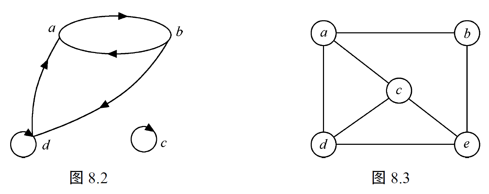

在研究有向图时，只考察它的顶点与弧的连接关系以及整个图所具有的性质。至于各个顶点之间的相对位置及弧的长短曲直都是无关紧要的。

 

### 无向图

#### 定义8.3（无向图）

设$V$是一个非空集，$E$是$V$中两个元素组成的多重集为元素的集合，称有序对$(V, E)$为无向图，记为$G=(V, E)$或$G(V, E)$。 

$V$中元素称为顶点（或点），$V$称**顶点集**。$E$中的元素称为**边**，$E$称为**边集**。

#### 例

例如图8.3中的无向图$G(V, E)$，$V=\{a, b, c, d, e\}$，$E=\{\{a, b\}, \{b, e\}, \{d, a\}, \{a, c\}, \{c, d\}, \{d, e\}, \{c, e\}\}$。

为了叙述方便，简称无向图为图，如果在有向图中顶点标以名称，如图8.2中顶点标$a, b, c, d$，这样的有向图称为**标定图**（有向标定图），否则称为**非标定图**（有向非标定图）。

如果一个图的顶点集和边集是有限的，则称该图为**有限图**。类似地定义有限有向图。本书中的图和有向图是指有限图和有限有向图。

#### 定义8.4

若在图$G=(V, E)$中，连接两个顶点之间的边不止一条（这些边称为**多重边**），则图$G$称为**多重图**。 

无自环的非多重图称为**简单图**。边集为空集的图称为**零图**。只有一个顶点的图称为**平凡图**。 

若图$G$中每两个顶点之间恰有一条边，则图$G$称为**完全图**。$n$个顶点的完全图记为$K_n$。

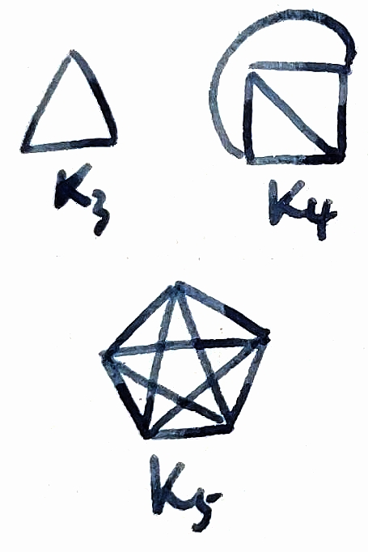

#### 定理8.1

**$n$个顶点的完全图$K_n$的边数为$n(n-1)/2$。**

**证明**：在$K_n$中，任意两个顶点都有边相连，$n$个顶点中任意两个点的组合数为$n(n-1)/2$，故$K_n$的边数为$n(n-1)/2$。 $\square$

从实际问题中抽象出来的图往往在顶点上和边上带有信息，用**带权图**定义。

#### 定义8.5（带权图）

设$V$是顶点集，$E$是边集，$f$是$V$到实数集的函数（点带权图），$g$是$E$到实数集的函数（边带权图）。称有序三元组$G=(V, E, f)$或$G=(V, E, g)$以及有序四元组$G=(V, E, f, g)$为**带权图**。

在有向图中类似地可以定义带权有向图。

 

### 顶点度数

从以上叙述可知图（有向图）的最本质的内容就是顶点与边（弧）的关系。为了描述这一关系，我们介绍顶点度数这样一个重要的概念。

#### 定义8.6

设$G=(V, E)$是一个图，顶点$v$所关联的边数（自环计算两次）称为顶点$v$的**度数**，记为$d(v)$。 

度数为1的顶点称为**悬挂点**。度数为奇（偶）数的顶点称为**奇（偶）顶点**。 

图$G$中顶点的最小度数记为$\delta(G)$，即$\delta(G)=\min\{d(v) | v \in V\}$，简记为$\delta$。

设图$G$有$n$个顶点$v_1, v_2, \dots, v_n$，$e$条边。有如下定理。

#### 定理8.2（握手定理）

**图$G$的所有顶点度数之和为边数的两倍，即$\sum_{i=1}^{n} d(v_i) = 2e$。**

**证明**：因为每条边必定关联两个顶点，而一条边给予其关联的每个顶点的度数为1。因此在一个图中，顶点度数的总和等于边数的两倍。 $\square$

#### 定理8.3

**在图$G$中奇顶点有偶数个。**

**证明**：因为$\sum_{\text{偶顶点}v_j} d(v_j) + \sum_{\text{奇顶点}v_k} d(v_k) = \sum_{i=1}^{n} d(v_i)$为偶数，又因$\sum_{\text{偶顶点}v_j} d(v_j)$为偶数，所以$\sum_{\text{奇顶点}v_k} d(v_k)$为偶数。由于$d(v_k)$是奇数，因此奇顶点$v_k$偶数个。 $\square$

#### 定义8.7（可图化与可简单图化）

设图$G=(V, E)$，$V=\{v_1, v_2, \dots, v_n\}$，称$(d(v_1), d(v_2), \dots, d(v_n))$为$G$的**度数列**。

> 若 $d(v_1) \geq d(v_2) \geq \dots \geq d(v_n))$，称$(d(v_1), d(v_2), \dots, d(v_n))$为$G$的***度序列***。

给出非负整数列$d=(d(v_1), d(v_2), \dots, d(v_n))$，若存在以$V=\{v_1, v_2, \dots, v_n\}$为顶点集的图，以$d$为度数列，则称$d$是**可图化的**。

若存在以$V=\{v_1, v_2, \dots, v_n\}$为顶点集的简单图，以$d=(d(v_1), d(v_2), \dots, d(v_n))$为度数列，则称$d$是**可简单图化的**。

#### 定理8.4

**$d=(d_1, d_2, \dots, d_n)$（$d_i \geq 0, i=1, 2, \dots, n$）是可图化的当且仅当$\sum_{i=1}^{n} d_i$为偶数。**

**证明**：

$\Rightarrow:$ 由定理8.2可知，必要性是显然的。

$\Leftarrow:$ 采用构造性方法进行充分性证明。

因为$\sum_{i=1}^{n} d_i$为偶数，所以$d=(d_1, d_2, \dots, d_n)$中有偶数个奇数，设奇数个数为$2k(0 \leq k \leq \lfloor n/2 \rfloor)$，奇数分别为$d_{i_1}, d_{i_2}, \dots, d_{i_k}, d_{i_{k+1}}, \dots, d_{i_{2k}}$，用如下方法构造图$G(V, E)$：

- 顶点集$V=\{v_1, v_2, \dots, v_n\}$；首先在顶点$v_{i_r}$和$v_{i_{r+k}}$之间连边$\{v_{i_r}, v_{i_{r+k}}\}$，$r=1, 2, \dots, k$。
- 若$d_i$为偶数，令$d_i'=d_i$；若$d_i$为奇数，令$d_i'=d_i-1$；得$d'=(d_1', d_2', \dots, d_n')$。
- 则$d_i' \geq 0$且为偶数，$i=1, 2, \dots, n$；再在$v_i$处作$d_i'/2$条**自环**，所得边构成图$G$的边集$E$，则$G(V, E)$的度数列为$d$。

所以$d=(d_1, d_2, \dots, d_n)$是可图化的。 $\square$

#### 定理8.5

设非负整数列$d=(d_1, d_2, \dots, d_n)$，$(n-1) \geq d_1 \geq d_2 \geq \dots \geq d_n \geq 0$，则$d$可简单图化当且仅当对于每个整数$r$，$1 \leq r \leq (n-1)$，$\sum_{i=1}^{r} d_i \leq r(r-1) + \sum_{i=r+1}^{n} \min\{d_i, r\}$并且$\sum_{i=1}^{n} d_i$为偶数。

#### 💡定理8.6

**设非负整数列$d=(d_1, d_2, \dots, d_n)$，$\sum_{i=1}^{n} d_i$为偶数且$(n-1) \geq d_1 \geq d_2 \geq \dots \geq d_n \geq 0$，则$d$可简单图化当且仅当$d'=(d_2-1, d_3-1, \dots, d_{d_1+1}-1, d_{d_1+2}, \dots, d_n)$（此处不要求按照递减顺序排列）是可简单图化的。**

**证明**：

##### $\Leftarrow:$ 若 $d'$ 可简单图化，则 $d$ 可简单图化。

显然。

设 $H$ 是 $d'$ 的一个实现。

将 $d'$ 对应的顶点按度降序排列为 $u_1, u_2, \dots, u_{n-1}$，度分别为 $d'_1 \ge d'_2 \ge \dots \ge d'_{n-1}$。

**构造 $G$**：添加一个新顶点 $v_1$，让 $v_1$ 与 $u_1, u_2, \dots, u_{d_1}$ 相连，剩下的图结构同 $H$。

**验证度数列**：$u_1, \dots, u_{d_1}$ 在 $H$ 中的度，对应于 $d_2, \dots, d_n$ 中某些顶点度减 1 之后的值。当我们把 $v_1$ 与它们相连后，它们的度各 +1，就恢复成原来 $d_2, \dots, d_n$ 中对应顶点的度。同时 $v_1$ 的度为 $d_1$。因此 $G$ 的度数列正好是 $d$。

 

##### $\Rightarrow:$ 若 $d$ 可简单图化，则 $d'$ 可简单图化。

假设 $G$ 是以 $d$ 为度序列的简单图，$\deg(v_i) = d_i$。我们要构造一个度序列为 $d'$ 的简单图。

设 $v_1$ 是度为 $d_1$ 的顶点。  

###### 情况1：$v_1$ 的邻点集合 $N(v_1)$ 是 $\{v_2, v_3, \dots, v_{d_1+1}\}$

在图 $G$ 中，删除顶点 $v_1$ 及其所有连边，则：
- 顶点 $v_2, \dots, v_{d_1+1}$ 的度各减少 1，
- 其余顶点度不变。

删除 $v_1$ 后剩下的图的度序列正好是 $d'$（可能顺序需重排）。

###### 情况2：$v_1$ 的邻点集合 $N(v_1)$ 不是 $\{v_2, v_3, \dots, v_{d_1+1}\}$，即存在边 $v_1v_j, j>d_1+1$

我们可以通过 **交换邻接关系** 来调整。

**引理**：存在一个简单图 $G$ 实现 $d$，使得 $v_1$ 与 $v_2, v_3, \dots, v_{d_1+1}$ 相邻。

令 
$$
j_0 = \max\{j | v_1v_j \in E(G)\} > d_1+1\quad
i_0 = \min\{i | v_1v_i \notin E(G)\} \leq d_1+1
$$

则 $i_0 \leq d_1+1 < j_0$，由于度序列降序，$d_{i_0} \ge d_{j_0}$，$v_{i_0}$ 的所有 $d_{i_0}$ 个邻点中至少有一个邻点 $v_k,(v_k,v_{j_0}) \notin E(G)$。

否则，若 $v_{i_0}$ 的所有 $d_{i_0}$ 个邻点都与 $v_k$ 相邻，再加上 $v_1$，有 $d_{i_0}+1 \leq d_{j_0}$，与度序列降序矛盾。  

作如下替换：

- 去掉边 $(v_1, v_{j_0})$ 和 $(v_{i_0}, v_k)$，
- 改为边 $(v_1, v_{i_0})$ 和 $(v_k, v_{j_0})$，
- 这样保持度序列不变，且不产生重边。

这样，与 $v_1$ 相邻的顶点的下标就变小了。反复进行这种调整，最终可使 $v_1$ 的邻点为 $v_2, \dots, v_{d_1+1}$，转换为**情况1**。

 

#### 例

判断是否是简单图的度序列，若是，则构造出来：$3,3,3,3,3,2,2,1$。

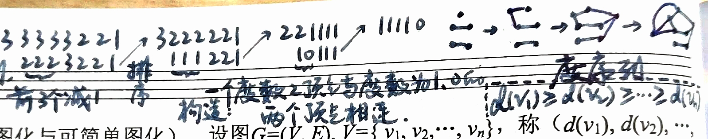

 

#### 定义8.8（出度/入度）

设$G$是一个有向图，以顶点$v$为起点的弧数称为$v$的**出度**，记为$d^+(v)$；

以顶点$v$为终点的弧数称为$v$的**入度**，记为$d^-(v)$。

#### 定理8.7

**在有向图中，所有顶点的入度之和等于所有顶点的出度之和。**

$$\sum_{v_i \in V} d^+(v_i) = \sum_{v_i \in V} d^-(v_i) = |E|.$$

 

### 同构概念

一个图的边的长度，边以及边关联的顶点位置变动后，同一个图可以画出不同形状。如图8.4中（a）和（b）就是同一个图。

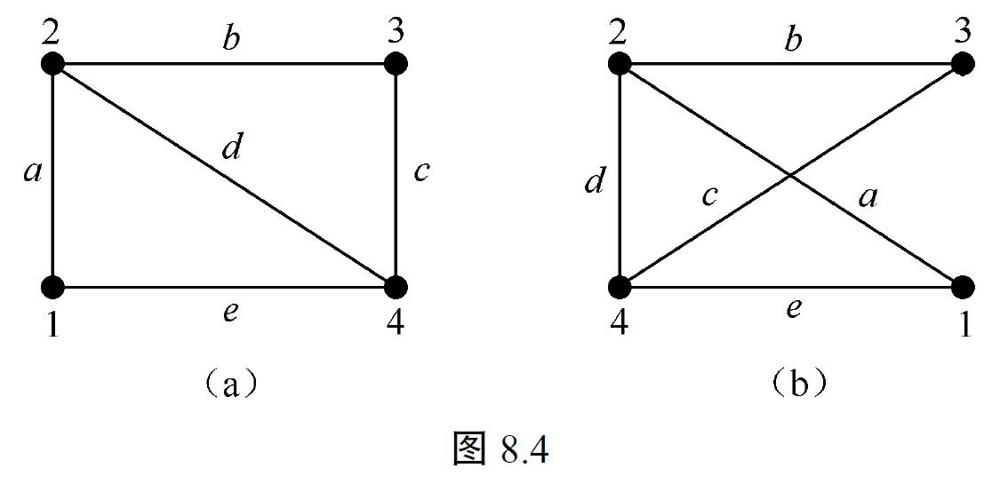

> 相当于把顶点重新标号。

#### 定义8.9（图的同构）

图$G=(V, E)$和$G'=(V', E')$是同构的，如果存在一个从顶点集$V$到顶点集$V'$的双射函数$f$，和一个从边集$E$到边集$E'$的双射函数$g$，使得$G$中的边$e$与顶点$v$和$w$相关联当且仅当$G'$中的边$g(e)$与顶点$f(v)$和$f(w)$相关联，则称$G$和$G'$是同构的，记为$G \cong G'$。函数$f$和$g$称为$G$到$G'$的同构函数。

#### 定理8.8

**图$G$和$G'$同构当且仅当对某一顶点的顺序，它们的邻接矩阵是一样的。**

**证明**：$\Rightarrow$假设图$G$和$G'$同构，则存在一个从$G$的顶点集到$G'$的顶点集的双射函数$f$，和一个从$G$的边集到$G'$的边集的双射函数$g$，使得$G$中的边$e$与顶点$v$和$w$相关联当且仅当$G'$中的边$g(e)$与顶点$f(v)$和$f(w)$相关联。令$v_1, \dots, v_n$是$G$中顶点的排序，令$A_1$是$G$依这个顺序建立起来的邻接矩阵，并且$A_2$是依$f(v_1), \dots, f(v_n)$这个顺序建立起来的$G'$的邻接矩阵。则$A_1 = A_2$。

$\Leftarrow$：证明类似。 $\square$

#### 推论8.1

令$G$和$G'$是简单图，下列命题是等价的。 

(1) $G$和$G'$是同构的。 

(2) 存在一个从$G$的顶点集到$G'$的顶点集上的双射函数$f$，$G$的顶点$v$和$w$相邻接当且仅当$G'$中的顶点$f(v)$和$f(w)$相邻接。

**证明**：(1) $\Rightarrow$ (2)，同构定义。

(2) $\Rightarrow$ (1) 假设有一个从$G$的顶点集到$G'$的顶点集上的双射函数$f$，$G$的顶点$v$和$w$相邻接当且仅当$G'$中的顶点$f(v)$和$f(w)$相邻接。令$v_1, \dots, v_n$是$G$中顶点的排序，令$A_1$是$G$依$v_1, \dots, v_n$这个顺序建立起来的邻接矩阵，$A_2$是$G'$依$f(v_1), \dots, f(v_n)$这个顺序建立起来的邻接矩阵。则$A_1 = A_2$。由定理8.8，命题成立。 $\square$

有关图的同构，还有一个在1929年提出、但还没有解决的Ulam猜想：设$G_1$和$G_2$是两个图，$|V(G_1)|=|V(G_2)|=n$，$V(G_1)=\{v_{11}, v_{12}, \dots, v_{1n}\}$，$V(G_2)=\{v_{21}, v_{22}, \dots, v_{2n}\}$，且$G_1 - v_{1i} \cong G_2 - v_{2i}$，$i, j=1, 2, \dots, n$，则$G_1 \cong G_2$。

有向图同构的定义类似。

#### 定义8.10（有向图的同构）

设$G=(V, E)$和$G'=(V', E')$是两个有向图，若存在双射$\varnothing: V \to V'$以及双射$\psi: E \to E'$，使得对任何$u, v \in V$，$(u, v) \in E$，有$$\psi((u, v))=(\varnothing(u), \varnothing(v)),$$称$G$和$G'$是同构的，记为$G \cong G'$。

 

### 正则图

一般，若图中的每个顶点度数均为 $r$，则称为$r$**-正则图**。如图8.5给出3-正则图。

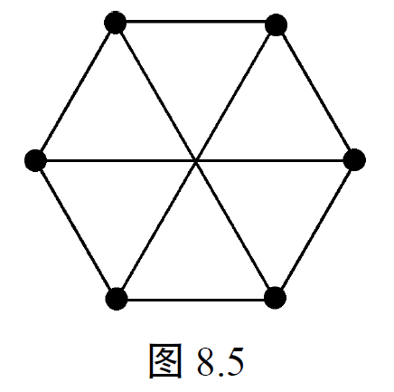
完全图 $K_n$ 为 $(n-1)$-正则图。

#### 定理8.9

**对于每一个大于2的偶数$n$，存在$n$个顶点的3-正则图。**

**证明**：设$n$是大于2的偶数，构造图$G=(V, E)$，$G$的顶点集$V=\{v_1, \dots, v_n\}$，边集$E=\{\{v_i, v_{i+1}\} | 1 \leq i \leq n-1\} \cup \{\{v_n, v_1\}\} \cup \{\{v_i, v_{i+n/2}\} | 1 \leq i \leq n/2\}$，则$G$的每一个顶点的度数为3。 $\square$

 

### 子图

在进一步讨论图的性质时，研究图的局部结构是相当重要的，现在介绍子图的概念。

#### 定义8.11（子图）

设图$G=(V, E)$，若在图$G'=(V', E')$中，$V' \subseteq V$，$E' \subseteq E$且$E'$中边所关联的顶点在$V'$中，则称$G'$为$G$的**子图**。

若$V'=V$，$E' \subseteq E$，则子图$G'=(V', E')$称为图$G$的一个**生成子图**。

#### 定义8.12（导出子图）

设图$G=(V, E)$，$E' \subseteq E$，以$E'$为边集，$E'$中边的端点全体为顶点集，构成的子图称为由$E'$导出的$G$的子图，记为$G(E')$，又称为$G$的**边导出子图**。

设$V' \subseteq V$，以$V'$为顶点集，端点均在$V'$中的**所有边**的全体为边集，构成的子图称为由$V'$导出的$G$的子图，记为$G(V')$，又称为$G$的**导出子图**。

如对于图8.6中的（a），（b）是（a）的子图，图8.6中的（c）是（a）的导出子图。

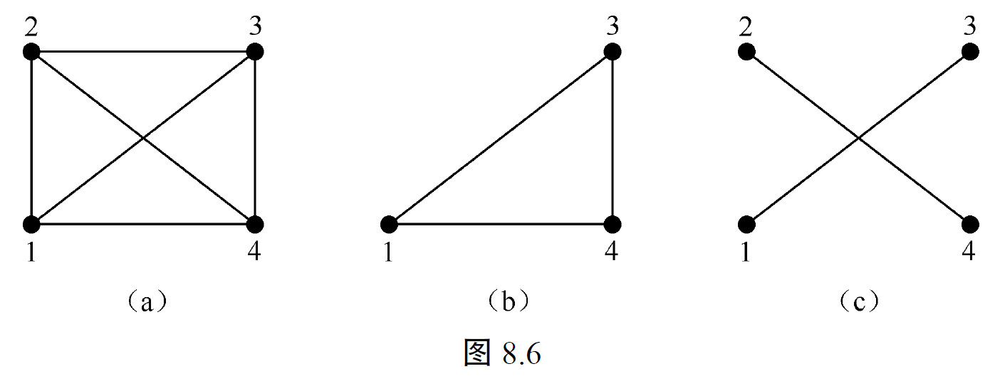

#### 定义8.13（补图）

设图$G=(V, E)$是$n$个顶点的任意简单图，从完全图$K_n$中删去$G$的所有边，但保留顶点集$V$所得到的图称为$G$的**补图**，记为$\overline{G}$，简称为$G$的补。

如图8.7中的（a）和（b）互为补图。

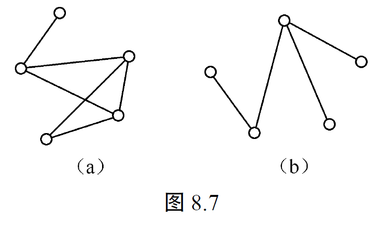

一般来说，简单图$G=(V, E)$的补图$\overline{G}$是一个以$V$为顶点集的简单图，$\overline{G}$中两个顶点相邻当且仅当这两个顶点在$G$中不相邻。从图$G$中删去一个顶点$v$及其关联的边得到的子图，记为$G-v$，或$G-\{v\}$。从图$G$中删去一条边$e$得到的子图记为$G-e$（**不删去顶点**）。

---

## 8.2 路与回路

### 路径、链、路

#### 定义8.14（路径、链、路）

图$G$的一个有限点边交替序列$(v_0, e_1, v_1, e_2, \dots, e_m, v_m)$，使得对$1 \leq i \leq m$，$e_i$的端点是$v_{i-1}$和$v_i$，称该序列为一条**路径(path)**。

边$e_1, e_2, \dots, e_m$互不相同的路径称为**链(link)**，$m$被称为链的长度。

顶点都不相同的链称为**路(simple path)**，$m$被称为路的长度。

$v_0 = v_m$的路径（或链）被称为**闭路径**（或**闭链**）。

除首尾两点外其余顶点都不相同的闭链称为**回路（环）**。长度为偶（奇）数的路或者回路称为**偶（奇）路**或**偶（奇）回路**。

#### 例

例如在图8.8中有：

* 路径：$1a2b3c4d2b3$；
* 链：$1a2b3c4d2$；
* 路：$1a2b3c4$；
* 回路：$1a2b3c4e1$。

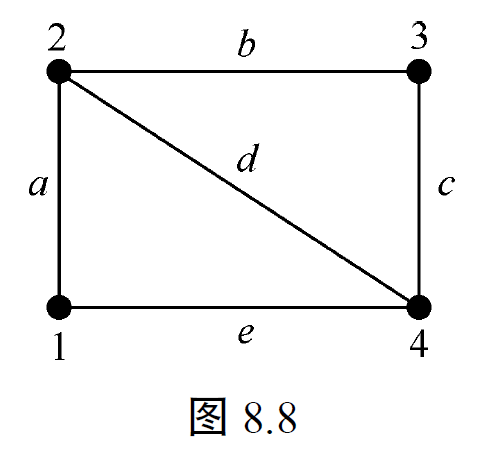

有时点边交替序列可用边序列或点序列代替。

显然，一条路也是一条链，一条回路也是一条闭链，并且自环和两条多重边都自成一条回路。一条回路上每个顶点度数为2，一条路除了起点和终点外，每个顶点的度数也为2。

一个图在什么条件下有回路呢？有如下定理。

#### 定理8.10

**若图$G$中每个顶点度数至少为2，则$G$包含一条回路。**

**证明**：

若$G$包含自环或多重边，则定理结论显然成立。

若图$G$是简单图，在$G$中任意选取一个顶点$v_0$，从$v_0$出发，构造一个顶点序列，从$v_0$的相邻点中任取一个顶点$v_1$，由于每个顶点度数至少为2，$v_1$的相邻点除$v_0$外还有另外顶点，因此必定可以任意选另一个顶点$v_2$。同理，对于$v_i(i \geq 2)$的相邻点除$v_{i-1}$外必可选另一个顶点$v_{i+1}$。因为$G$中只有有限个顶点，所以必定选到一个顶点$v_k$，它是第一个以前被选过的顶点，于是得到$(v_0, v_1, \dots, v_k, v_{k+1}, \dots, v_k)$，其中从$v_k$到$v_k$这一顶点序列$(v_k, v_{k+1}, \dots, v_k)$是$G$中的一条回路。 $\square$

对于有向图，可以类似地定义有向路径、有向链和有向路。

#### 定义8.15（有向路径、有向链、有向路）

有向图$G$的一个有限点弧交替序列$(v_0, e_1, v_1, e_2, \dots, e_m, v_m)$，使得$1 \leq i \leq m$，$e_i=(v_{i-1}, v_i)$，称该序列为一条**有向路径**。若$e_1, e_2, \dots, e_m$互不相同，称该序列为一条**有向链**；$m$被称为有向链的长度。顶点都不相同的有向链称为**有向路**；$m$被称为有向路的长度。

类似地可以定义有向闭路径，有向闭链和有向回路。

### 连通

由路（有向路）的概念可以引进图（有向图）的连通概念。

#### 定义8.16（连通图）

设$u$和$v$是图$G$的两个不同的顶点，若$u$和$v$之间存在一条路，则称顶点$u$和$v$是**连通的**。若图$G$中任何两个不同顶点之间存在一条路，则称$G$为**连通图**，否则称$G$为**非连通图**。

在顶点集$V$上定义一个二元关系$R$：对于$u, v \in V$，$uRv$当且仅当$u$和$v$是连通的，$R$称为**连通关系**。容易验证连通关系是$V$上的一个**等价关系**（孤立点 $u$ 是一条长度为 0 的路，故有自反性）。这一等价关系便确定了$V$的一个划分：把$V$划分为非空子集$V_1, V_2, \dots, V_\omega$，使得$u$和$v$属于同一子集$V_i$当且仅当$u$和$v$是连通的。

每个顶点子集$V_i$的导出子图$G(V_i)$称为$G$的一个**连通分支**（极大的连通子图），简称**分支**。根据连通关系$R$可以划分为$V_1, V_2, \dots, V_\omega$，则$G$有$\omega$个连通分支：$G_1, G_2, \dots, G_\omega$。当$\omega=1$时，$G$是连通图。

下面给出有关连通的两个例子。

#### 例8.1

**若图$G$中恰有两个顶点的度数为奇数，则这两个顶点之间必有一条路。**

**证明**：如果$G$是连通图，结论显然成立。如果$G$不连通，有连通分支：$G_1, G_2, \dots, G_\omega$，则可分两种情况：度数为奇数的两个顶点$v_1$和$v_2$同属于一个分支$G_i$，结论成立；当$v_1$和$v_2$不属于同一个分支，设$v_1 \in G_i$，$v_2 \in G_j$，因为$G_i$和$G_j$是图，在$G_i$和$G_j$中奇顶点都是偶数个，所以这是不可能的。因此$v_1$和$v_2$必属于同一个分支，结论成立。 $\square$

#### 例8.2

**设$G$是$n$个顶点的简单图，若$G$有$e$条边，$\omega$个分支，则$n-\omega \leq e \leq (n-\omega)(n-\omega+1)/2$。**

**证明**：

**1）首先证明 $e \geq n-\omega$，即$G$的边数最少有$n-\omega$条边。**

对于 $G$ 的每个连通分支 $G_i$，有 $e_i \geq n_i - 1$，求和得到：
$$e = e_1 + e_2 + \cdots + e_n \geq (n_1-1) + (n_2-1) + \cdots + (n_\omega-1) = n - \omega.$$
等号成立当且仅当 $e_i = n_i - 1, i = 1, 2, \cdots, \omega$。

或：以$G$的边数为归纳变量，用归纳法进行证明。设$e=0$，即$G$是零图，$n=\omega$，结论成立。假设对$e=e_0-1$的简单图，结论成立；对于$e=e_0$的简单图$G$，从$G$中删去任一条边，得到图$G'$，有两种情况： (1)$G'$有$n$个顶点，$\omega$个分支，$e_0-1$条边，由归纳假设可知$n-\omega \leq e_0-1$，显然$n-\omega \leq e_0$； (2)$G'$有$n$个顶点，$\omega+1$个分支，$e_0-1$条边，由归纳假设可知$n-(\omega+1) \leq e_0-1$，即$n-\omega \leq e_0$。

因此在$G$中$n-\omega \leq e_0$。

**2）然后要求$e \leq (n-\omega)(n-\omega+1)/2$，即$G$的边数最多有$(n-\omega)(n-\omega+1)/2$条。**

要求$G$的边数最多，则首先要求$G$的每个分支是一个**完全图**。现在假设其中两个完全图的分支为$G_i$和$G_j$，其顶点数分别为$n_i$和$n_j$，则边数分别为$n_i(n_i-1)/2$和$n_j(n_j-1)/2$，并**设$n_i \geq n_j >1$，若在$G_i$中增加一个顶点，$G_j$中减少一个顶点**，则图$G$的顶点总数不变，分支数不变，而边数增加量为：$n_i(n_i+1)/2 - n_i(n_i-1)/2 - n_j(n_j-1)/2 + (n_j-1)(n_j-2)/2 = n_i - n_j +1 >0$。

所以，要使$n$个顶点、$\omega$个分支的图$G$的边数最多，$G$必须是由**一个$n-\omega+1$个顶点的完全图和$\omega-1$个孤立点**组成，$n-\omega+1$个顶点的完全图的边数为$(n-\omega)(n-\omega+1)/2$。因此$e \leq (n-\omega)(n-\omega+1)/2$。 $\square$

由例8.2可推导出：当$\omega=1$时，$e \geq n-1$；即**$n$个顶点的连通图至少有$n-1$条边**。$n$个顶点且边数为$n-1$的连通图称为**最小连通图**，又称为**树**，第10章将系统地论述树及其性质。

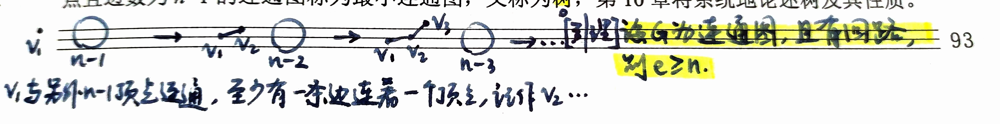

对于有向图，有三种不同的连通概念。现给出有关的定义。

#### 定义8.17（可达的）

设$u$和$v$是有向图$G$的两个顶点，若从$u$到$v$存在一条有向路，则称顶点$v$是从$u$可达的，或称**从$u$可达$v$**。

#### 定义8.18（强连通图/单向连通图/弱连通图）

设有向图$G$，若$G$中任何两个顶点是互相可达的，则称$G$为**强连通图**。
若$G$中任何两个顶点至少有一个顶点从另一个顶点可达，则称$G$为**单向连通图**。
若$G$中弧的方向不考虑时，任何两个顶点之间存在一条路，则称$G$为**弱连通图**。

显然，每一个强连通图是单向连通的，而每个单向连通图是弱连通的，但不一定是强连通的。

每个顶点子集$V_i$导出的子图$G(V_i)$是强连通的，称为$G$的一个**强连通分支**（“相互可达”关系是等价关系，但是没有单向连通的连通分支的概念）。
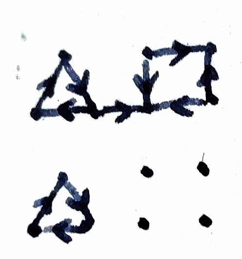
### 邻接矩阵和路径矩阵

在第2章中叙述了用关系图和关系矩阵表示关系，关系图相当于有向图，而关系矩阵就是我们将要介绍的邻接矩阵，对于图也可以用邻接矩阵来表示。

#### 定义8.19（邻接矩阵）

设$G$是$n$个顶点，无多重边的图。$n \times n$矩阵$M=(m_{ij})$（依顶点次序$v_1, v_2, \dots, v_n$标记在矩阵的行和列上），也记为$M(G)$，其中

$$
m_{ij} =
\begin{cases}
1 & \text{若} \ v_i \text{与} v_j \text{相邻} \\
0 & \text{若} \ v_i \text{与} v_j \text{不相邻}
\end{cases}
$$

称$M(G)$为$G$的**邻接矩阵**。

#### 例8.3

如图8.9所示，按顶点次序1，2，3，4标记在矩阵的行和列上，其邻接矩阵为：

$$
M(G) = \begin{pmatrix}
0 & 1 & 0 & 1 \\
1 & 0 & 1 & 1 \\
0 & 1 & 0 & 1 \\
1 & 1 & 1 & 0
\end{pmatrix}
$$

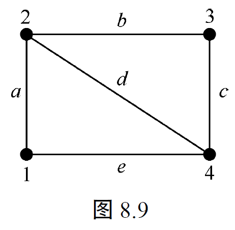

邻接矩阵$M$是布尔矩阵，它的幂$M^2 = M \times M$，其中矩阵乘法按普通加和乘运算。设$M^2=(m_{ij}^{(2)})$，$(m_{ij}^{(2)}) = \sum_{k=1}^{n} m_{ik} \cdot m_{kj}$，如图的$M^2$为

$$
M^2 = \begin{pmatrix}
2 & 1 & 2 & 1 \\
1 & 3 & 1 & 2 \\
2 & 1 & 2 & 1 \\
1 & 2 & 1 & 3
\end{pmatrix}
$$

$M^2$中的$m_{ij}^{(2)} (i \neq j)$等于顶点$v_i$和$v_j$之间长度为2的路径的数目。$m_{ii}^{(2)}$等于顶点$v_i$的度数。显然$M$是对称矩阵，$M^2$也是对称矩阵。

一般地，对于正整数$k$，$M$的$k$次幂为：$M^k = M^{k-1} \times M$，它有如下特性。

#### 定理8.11

**设$M$是$n$个顶点的简单图$G$的邻接矩阵，$M^k=(m_{ij}^{(k)})$，则$M^k$中$m_{ij}^{(k)}$的等于顶点$v_i$和$v_j$之间长度为$k$的路径数目。**

**证明**：用数学归纳法，以$k$为归纳变量。

当$k=2$时，命题成立；

设$k=l$时，命题成立；由$M^{l+1} = M^l \times M$，故$m_{ij}^{(l+1)} = \sum_{k=1}^{n} m_{ik}^{(l)} \cdot m_{kj}^{(1)}$

根据邻接矩阵的定义$m_{ik}^{(1)}$表示联接$v_i$与$v_k$的长度为1的路的数目，根据归纳假设$m_{kj}^{(l)}$表示联接$v_k$与$v_j$的长度为$l$的路的数目。所以上式右边不为零的每一项表示$v_i$经过一条边到$v_k$，再由$v_k$经过一条长度为$l$的路到$v_j$。所以对$k$求和，即得$m_{ij}^{(l+1)}$是所有从$v_i$到$v_j$的总长度为$l+1$的路的数目，所以命题对$l+1$成立。 $\square$

#### 定义8.20（路径矩阵）

设$G$是$n$个顶点，无多重边的图。$N \times n$矩阵$P=(p_{ij})$（依顶点次序$v_1, \dots, v_n$标记在矩阵的行和列上），也记为$P(G)$，其中

$$
p_{ij} =
\begin{cases}
1 & \text{若} \ v_i \text{与} v_j \text{之间至少存在一条路径} \\
0 & \text{若} \ v_i \text{与} v_j \text{之间不存在路径}
\end{cases}
$$

称$P(G)$为图$G$的**路径矩阵**。

$P(G)$是布尔矩阵，具有如下性质。

$G$是连通图当且仅当$P(G)$中元素全为1。

可以证明：对$n$个顶点的$G$，若从$v_i$到$v_j$之间存在一条路径，则从$v_i$到$v_j$必有一条长度不超过$n-1$的路径（证明留作习题）。同理，若$G$中有一条闭路径，则必有一条长度不超过$n$的闭路径。利用这一特性，我们可以从图$G$的邻接矩阵$M(G)$来求得路径矩阵$P(G)$。为此，只要设$B_n = M + M^2 + \dots + M^n$，从$B_n$中将非零元素改为1，零元素不变，便得到路径矩阵$P(G)$。由于$P(G)$是一个布尔矩阵，其中$p_{ij}=1$表示在$v_i$到$v_j$之间存在路径，但不需要知道有多少条路径。我们所关心的是两个顶点之间是否存在路径，为此我们将$M^k(1 \leq k \leq n)$改为$M^{(k)}(1 \leq k \leq n)$，得到$P = M^{(1)} \vee M^{(2)} \vee \dots \vee M^{(n)}$，其中$M^{(1)}=M$，$M$是布尔矩阵，$\vee$是逻辑运算，$M^{(k)}$是$M$在布尔矩阵意义下的$k$次幂，也是布尔矩阵。

在有向图中经常用到邻接矩阵和路径矩阵，其性质类似于无向图。

有向图实质上就是顶点集上二元关系的关系图，因而我们可以用关系矩阵也就是有向图的矩阵来表示它。

#### 定义8.21（邻接矩阵）

设$G$是$n$个顶点，无多重边的有向图。$n \times n$矩阵$M=(m_{ij})$（依顶点次序$v_1, \dots, v_n$标记在矩阵的行和列上），也记为$M(G)$，其中
$$
m_{ij} =
\begin{cases}
1 & \text{若从} v_i \text{到} v_j \text{有一条弧} \\
0 & \text{若从} v_i \text{到} v_j \text{没有弧}
\end{cases}
$$
称$M(G)$为$G$的**邻接矩阵**。

类似定理8.11有如下定理。

#### 定理8.12

**设$M$是$n$个顶点的简单有向图$G$的邻接矩阵，$M^k=(m_{ij}^{(k)})$等于从顶点$v_i$到$v_j$之间长度为$k$的有向路径数目。**

**证明**：类似定理8.11的证明，此处从略。

> $$P = E_n \cup M \cup M^2 \cup \cdots \cup M^{k-1}$$
#### 定义8.22（路径矩阵）

设有向图$G$有$n$个顶点，无多重弧。$n \times n$矩阵$P=(p_{ij})$，也记为$P(G)$，其中
$$
p_{ij} =
\begin{cases}
1 & \text{若从} v_i \text{到} v_j \text{至少存在一条有向路径} \\
0 & \text{若从} v_i \text{到} v_j \text{不存在有向路径}
\end{cases}
$$
称$P(G)$为有向图$G$的**路径矩阵**，或**可达性矩阵**。

$P(G)$具有如下性质：有向图$G$是强连通图当且仅当$P(G)$中元素全为1。

完全类似于无向图的情况，我们可以从有向图$G$的邻接矩阵$M(G)$来求得路径矩阵$P(G)$。

### 二分图

最后，我们将给出一种有用的图，称为二分图，它的特征可以用回路来描述。

#### 定义8.23（二分图）

若图$G$的顶点集$V$能划分为两个子集$V_1$和$V_2$，并且每条边的一个端点在$V_1$中，另一个端点在$V_2$中，则称$G$为**二分图**，记为$G(V_1, V_2)$。$V$划分为$V_1$和$V_2$，称为$G$的一个**二划分**。记为$(V_1, V_2)$。
若简单图$G$具有二划分$(V_1, V_2)$，并且$V_1$中每个顶点与$V_2$中每个顶点恰有一条边相连，称$G$为**完全二分图**。若$|V_1|=m$，$|V_2|=n$，则这样的完全二分图记为$K_{m, n}$。

> 正方形□是二分图，但是三角形△不是二分图。
#### 例

例如，图8.10给出完全二分图记为$K_{3, 3}$。
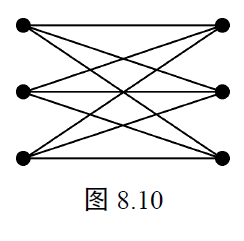

利用回路的概念，可以给出二分图的性质。

#### 💡定理8.13（非二分图的判断方法）

**$G$是二分图当且仅当$G$中没有奇回路。**

**证明**：
$\Rightarrow$：设$G$是具有二划分$(V_1, V_2)$的二分图，并且$G$具有一条回路$C: (v_0, v_1, \dots, v_k, v_0)$。不失一般性，设$v_0 \in V_1$，因为$\{v_0, v_1\} \in E$，且$G$是二分图，所以$v_1 \in V_2$，同理$v_2 \in V_1$，$v_3 \in V_2$。则可以推导出$v_k \in V_1$，$v_{k+1} \in V_2$。因为$v_0 \in V_1$，所以$v_k \in V_2$。
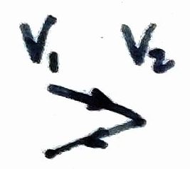
因而存在$k$使$k=2k+1$，即回路$C$是偶回路。

$\Leftarrow$：设$G$是连通图，否则对$G$的每个分支进行证明。又设$G$中没有奇回路。任取一个顶点$u \in V$，且令$$V_1=\{x | 从u到x有一条偶路\}，V_2=\{y | 从u到y有一条奇路\}.$$下面证明$(V_1, V_2)$是$G$的一个**二划分**。

因为$G$是连通图，所以$V_1 \cup V_2 = V$。通过反证法证明$V_1 \cap V_2 = \varnothing$。
> 二分图**定义8.23**中的条件1：顶点集$V$能划分为两个子集$V_1$和$V_2$。

假设存在一个顶点$v \in V_1 \cap V_2$，则从$u$到$v$有一条偶路$p_1$和一条奇路$p_2$。

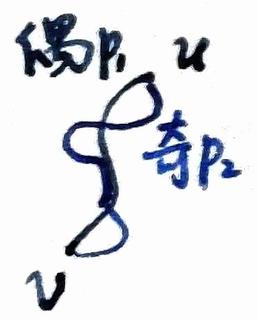

$l_{p_1} +l_{p_2} = \text{奇数}$，去掉路径 $p_1, p_2$ 上的重复部分之后，因为每个顶点在重复的路径中算了两次，剩余若干条回路的长度之和仍为奇数，其中必有一条奇回路。

所以$G$中*必*有一条奇路，它的边集是$p_1 \cup p_2$的子集，与$G$中没有奇回路矛盾。因此$V_1 \cap V_2 = \varnothing$。

再证明$G$中每一边的一个端点在$V_1$中，另一个端点在$V_2$中，用反证法证明之。
> 二分图**定义8.23**中的条件2：每条边的一个端点在$V_1$中，另一个端点在$V_2$中。

若有一边连接$V_2$中的两个顶点$v_1$和$v_2$，则$v_1 \in V_2$，$v_2 \in V_2$。因为从$u$到$v_1$有一条奇路，则必有一条从$u$到$v_2$的偶路，这与$v_2 \in V_2$矛盾。所以任意一边的两个端点不能同在$V_2$中。同理，任意一边的两个端点也不能同在$V_1$中。
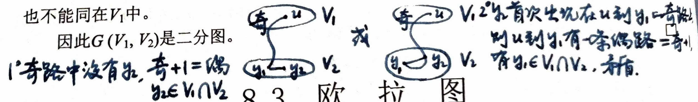

因此$(V_1, V_2)$是二分图。 $\square$

---
## 8.3 欧拉图

### 欧拉图和半欧拉图

图论起源于哥尼斯堡七桥问题。哥尼斯堡七桥问题的论述是“从任意一地点出发，通过每座桥一次且仅仅一次，最后回到原地，这是否可能？”此前我们已经用图表示哥尼斯堡：顶点表示岛屿和河的两岸，边表示桥，如前面的图8.1所示。

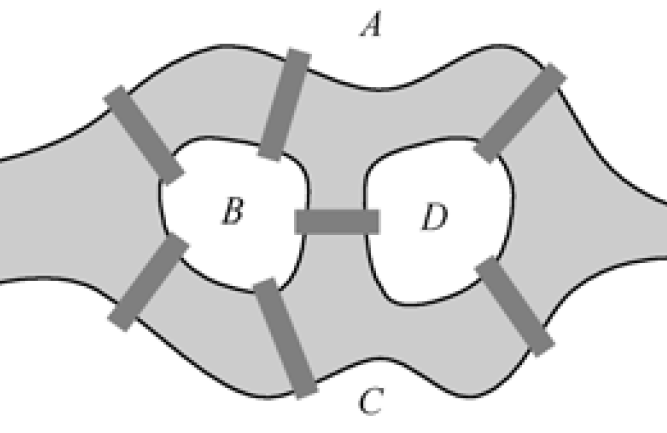 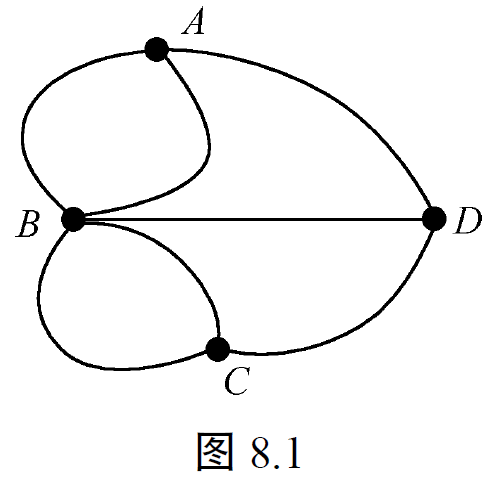

这样，哥尼斯堡七桥问题的论述就改为“从图8.1中任意一顶点出发，通过每条边一次且仅仅一次，最后回到原出发顶点，这是否可能？”这也就是如何一笔画的问题。由此，我们引出欧拉图的定义。

#### 定义8.24（欧拉图）

若图$G$中具有一条包含$G$中**所有边一次且仅一次**的闭链（闭路径），则称它为**欧拉闭链**，简称为**欧拉链**，称$G$为**欧拉图**。
若图$G$中具有一条包含$G$中**所有边一次且仅一次**的开链（路径），则称它为**欧拉开链**，称$G$为**半欧拉图**。

显然，欧拉图除孤立点以外是连通的，而孤立点的有无并不影响对欧拉图的讨论，因此以后不妨设欧拉图是连通的。

#### 💡定理8.14

**$G$是连通图，则$G$是欧拉图当且仅当$G$的所有顶点都是偶顶点。**

**证明**：$\Rightarrow$：因为$G$是欧拉图，所以$G$有欧拉链$(v_0, e_1, v_1, e_2, \dots, e_k, v_k, e_{k+1}, \dots, e_m, v_m)$，$v_0=v_m$，其中顶点可以重复出现，而边不重复出现。所以**对于任意$v_i$，每当出现$v_i$，它关联两条边，而$v_i$可以重复出现**，所以$d(v_i)$是偶数。
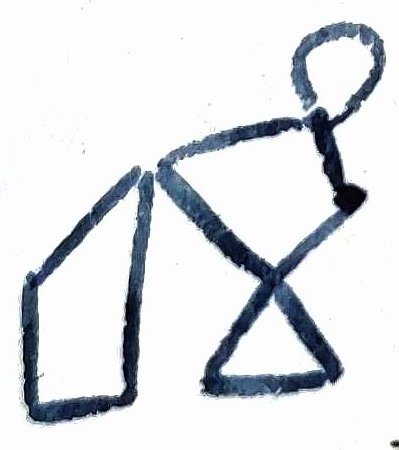

$\Leftarrow$：若图$G$是连通的，则可以构造一条欧拉链。 

(1) 从任意一顶点$v_0$开始，取关联于$v_0$的边$e_1$到$v_1$，每边仅取一次。因为所有顶点为偶数度，并且$G$是连通的，所以可以继续取关联与$v_1$的边$e_2$到$v_2$，…，直到回到顶点$v_0$，得到一条闭链$h$:$(v_0, e_1, v_1, \dots, v_0)$。 

(2) 若$h=G$，则$G$即为欧拉图；否则$G-h=h'$不是空集，$h'$中顶点度数均为偶数，又$G$是连通的，$h'$与$h$必有一个顶点$v_i$重合。在$h'$中从$v_i$出发重复（1），得到一条闭链$h2$:$(v_i, e_1', v_1', \dots, v_i)$。 

(3) 若$h \cup h'=G$，则$G$即为欧拉图：$(v_0, e_1, v_1, \dots, v_i, e_1', v_1', \dots, v_i, \dots, v_0)$；否则，重复（2）直至构成一条包含$G$中所有边的闭链。 $\square$

#### 定理8.15

**$G$是连通图，则$G$是半欧拉图当且仅当$G$中有且仅有两个奇顶点。**

**证明**：证法类似定理8.14的证明，仅步骤（1）从一个奇顶点$v_0$开始，取关联于$v_0$的边$e_1$到$v_1$，…，直到另一个奇顶点$v_l$为止，得到一条开链$h_1$。其他步骤类同定理8.14的证明。最后构造一条包含$G$中所有边的开链为止，此开链即为欧拉开链，$G$就是半欧拉图。

对于哥尼斯堡七桥问题，由于4个顶点的度数都是奇数的，不可能有欧拉链，不可能是半欧拉图。 $\square$

#### 定理8.16

$G$是连通图，则$G$是欧拉图当且仅当$G$是若干条边不相重的回路之并。

**证明**：**习题8.24**。

### 欧拉有向图

在讨论有向图时，我们也给出类似于欧拉图和半欧拉图的充要条件。

#### 定义8.25（欧拉有向图）

若连通有向图$G$中具有一条包含$G$中所有弧的有向闭链，则称该闭链为**欧拉有向链**，称$G$为**欧拉有向图**。
若图$G$中具有一条包含$G$中所有弧的有向开链，则称该开链为**欧拉有向开链**，称$G$为**半欧拉有向图**。

类似定理8.14和定理8.15的证明，可以证明下面的定理。

#### 定理8.17

**$G$是连通有向图，则$G$是欧拉有向图当且仅当$G$的每个顶点$v$，有$d^+(v)=d^-(v)$。**

#### 定理8.18

**$G$是连通有向图，则$G$是半欧拉有向图当且仅当$G$中恰有两个奇顶点，其中一个奇顶点的入度比出度大1，另一个奇顶点的出度比入度大1，而其他顶点的出度等于入度。**

由上述讨论可知，欧拉图等价于一笔画的问题：从一点出发，在一笔内画尽所有的边，且每条边只画一次，最后回到出发点。

我们可以推出，**如果在一个图中奇顶点个数为$2k$个，则该图是$k$笔画的**。证明留作**习题8.41**。

---

# 8.4 哈密顿图

### 哈密顿图与半哈密顿图

1859年，哈密顿（Hamilton）爵士发明了一个关于十二面体的一个数学游戏，如图8.11所示，一位旅行者沿着顶点标有城市名称的正十二面体的棱线行走，他要找一条通过每个顶点（城市）恰好一次的回路。这样就引出了一个问题：能不能在图中找到一条回路，使它含有这个图的所有顶点？哈密顿爵士把这个问题称为周游世界问题。

这一游戏抽象出图论中一个概念——哈密顿（Hamilton）图，并派生出货郎担（Traveling Salesman）问题。

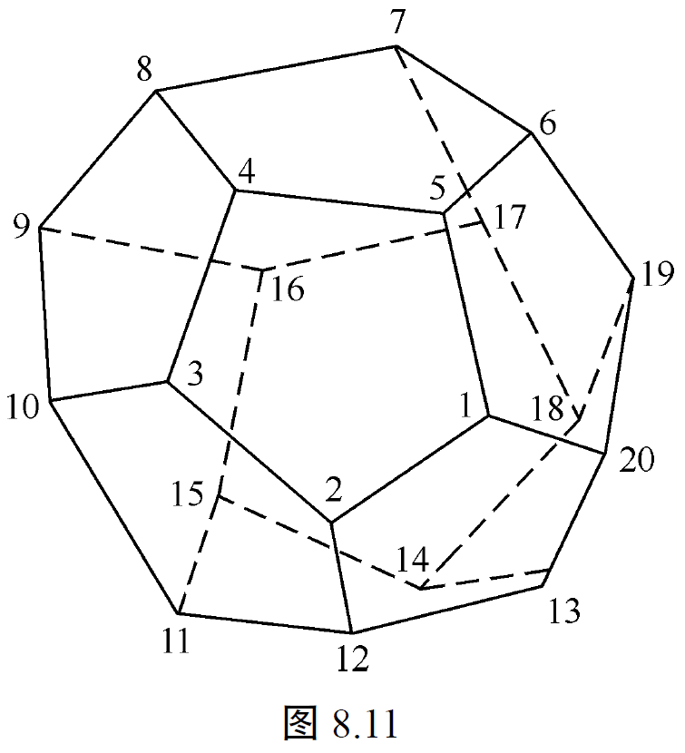

#### 定义8.26（哈密顿图）

若图$G$具有一条包含$G$中**所有顶点一次仅一次**的回路，则称该回路为**哈密顿回路**，称$G$为**哈密顿图**。
若图$G$具有一条包含$G$中**所有顶点一次仅一次**的路，则称该路为**哈密顿路**，称$G$为**半哈密顿图**。

显然哈密顿路包含图中每个顶点一次且仅一次，哈密顿回路则是从图中的一个顶点出发，通过每个顶点一次且仅一次，最后回到出发点的回路。

对于哈密顿图的性质，首先要说明的是有关哈密顿图性质的研究成果与欧拉图性质的研究成果不同，哈密顿图的充要条件至今仍然是图论中尚未解决的主要问题之一。我们只能分别给出哈密顿图的充分条件和必要条件。首先我们给出哈密顿图的必要条件。

#### 💡定理8.19（必要条件）

**若图$G$是哈密顿图，则对于顶点集$V$的每一个非空真子集$S$，$\omega(G-S) \leq |S|$均成立，其中$|S|$表示$S$中的顶点数，$G-S$表示$G$中删去顶点子集$S$后得到的图。**

**证明**：设$C$是图$G$的一个哈密顿回路，则 $C$ 是 $G$ 的生成子图，$C-S$ 是 $G-S$ 的生成子图（两者顶点数相同，边数前者比后者可能少一些，所以前者的连通分支数可能多一些）。
> 生成子图的**定义8.11**：$V'=V$，$E' \subseteq E$。

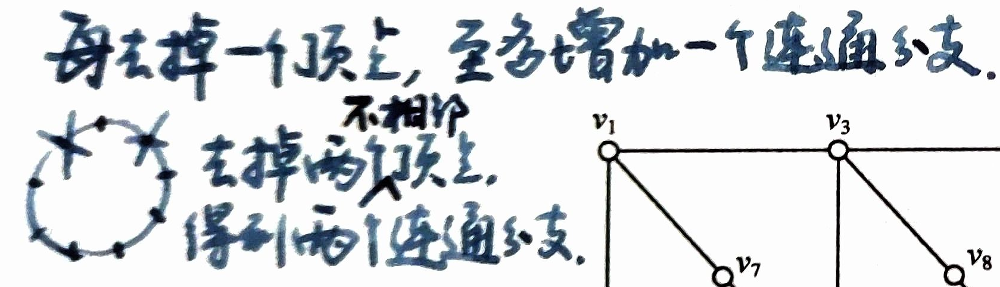

如上图，对$V$的每一个非空真子集$S$，$\omega(C-S) \leq |S|$；则 $\omega(G-S) \leq \omega(C-S) \leq |S|$。 $\square$

利用定理8.19，可以判定某些图不是哈密顿图。如图8.12（a）中，令$S=\{v_1, v_4\}$，则$\omega(G-S)=3 > |S|$，所以该图不是哈密顿图。

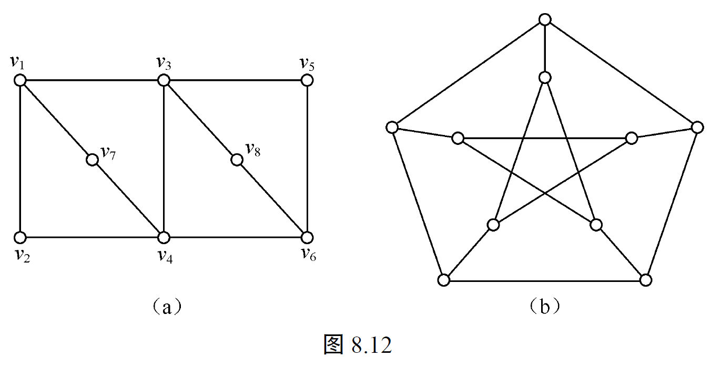

必须特别注意定理8.19是必要条件。例如，著名的**彼得森（Petersen）图**。
如图8.12（b）所示，在图中删去任意一个顶点或任意两个顶点，彼得森图是连通图；删去3个顶点，最多只能得到有两个连通分支的子图；删去4个顶点，最多只能得到有3个连通分支的子图；删去5个或5个以上的顶点，余下的顶点数都不大于5，故必不能有5个以上的连通分支数。

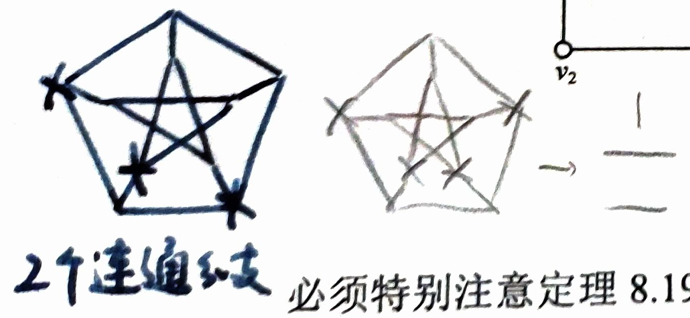

所以该图满足$\omega(G-S) \leq |S|$，但是可以证明彼得森图不是哈密顿图（证明留作**习题8.32**）。

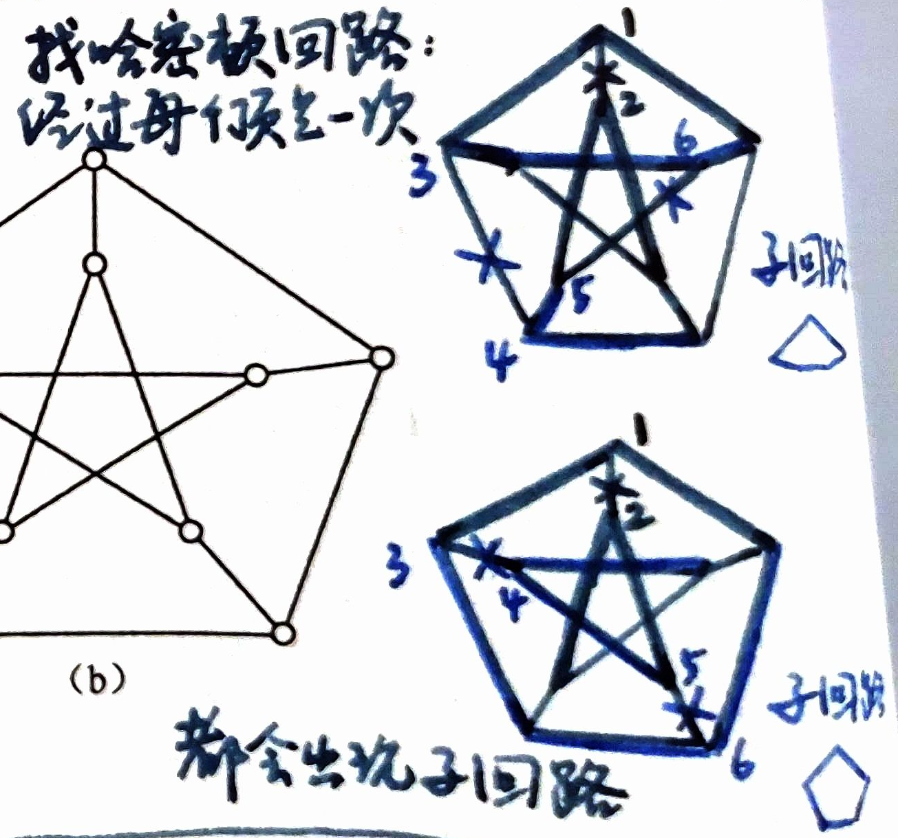

下面介绍哈密顿图的充分条件。

#### 💡定理8.20（充分条件）

**若$G$是$n(\geq 3)$个顶点的简单图，对于每一对不相邻的顶点$u, v$，$d(u)+d(v) \geq n$成立，则$G$是哈密顿图。**

**证明**：假设存在满足条件的$n(\geq 3)$个顶点的非哈密顿图$G$。

对$G$中的两个不相邻的顶点$u,v$，若$G+(u,v)$不是Hamilton图， 则把$(u,v)$连接起来，否则不连接$(u,v)$，不断地这样下去，直到不能连接任意两个不相邻的顶点，$G'$成为满足条件的**极大非Hamilton图**。即对于任意两个不相邻的顶点$u,v$，$G'+(u,v)$为Hamilton图。

将边$\{u, v\}$加入$G'$，得一条包含$G'$中每一个顶点的路$(v_1, v_2, \dots, v_n)$，$v_1=u$，$v_n=v$。但因为$G'$是非哈密顿图，$v_1$与$v_n$不相邻，并且$d(v_1)+d(v_n) \geq n$。

断言：**必存在某顶点$v_i$，使$v_i$与$v_1$相邻，$v_{i-1}$与$v_n$不相邻**。

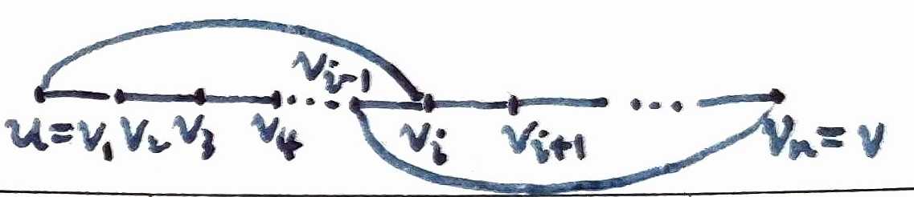

否则，若$v_1$与$v_{i_2}, v_{i_3}, \dots, v_{i_k}$相邻（$2 \leq i_1 \leq i_2 \leq \dots \leq i_k \leq n-1$），$d(v_1)=k$；而$v_n$与$v_{i_2-1}, v_{i_3-1}, \dots, v_{i_k-1}$都不相邻，$d(v_n) \leq n-k-1$，$d(v_1)+d(v_n) \leq k+n-k-1=n-1 < n$，这是不可能的。

所以，必存在顶点$v_i$，使$v_i$与$v_1$相邻，$v_{i-1}$与$v_n$相邻。从而在$G'$中得到一条哈密顿回路$(v_1, v_2, \dots, v_{i-1}, v_n, v_{n-1}, \dots, v_i, v_1)$，这与假设$G'$是非哈密顿图相矛盾。 $\square$

#### 推论8.2

若$G$是$n(\geq 3)$个顶点的简单图，对于每一个顶点$v$，满足$d(v) \geq n/2$，则$G$是哈密顿图。

**证明**：利用定理8.20即证得。 $\square$

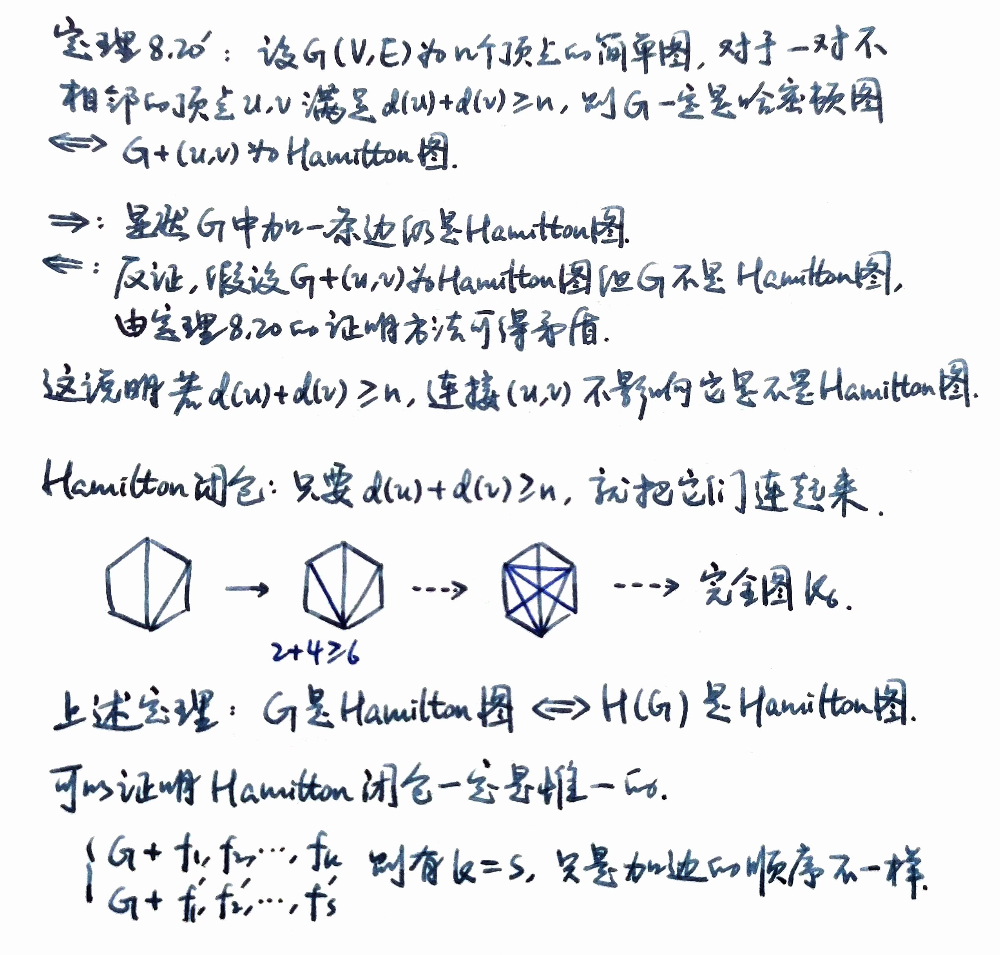

#### 定理8.21

**若$G$是$n$个顶点的简单图，对于每一对不相邻的顶点$u, v$，满足$d(u)+d(v) \geq n-1$，则$G$是半哈密顿图。**

**证明**：留作**习题8.35**。

> 增加一个顶点 $u$ 与 $G$ 中每个顶点相连，得 $G'=G+u$ 有$n+1$个顶点，原来的每个顶点度数 $+1$，则 $d'(u)+d'(v)=d(u)+d(v)+2\ge n+1$，满足**定理8.20**条件，因此有哈密顿回路，去掉 $u$ 得到哈密顿路。 

注意定理8.20和定理8.21的条件不是必要的，可以举例说明（留作**习题8.31**）。

> 取 $C_5$（5-环）。它显然是哈密顿的（自身即为哈密顿圈），但对任意一对不相邻顶点 $u,v$ 有 $d(u)=d(v)=2$，所以 $d(u)+d(v)=4<5=n$。
> 仍以 $C_5$ 为例，它是半哈密顿（实际上哈密顿），但不满足 $d(u)+d(v)\ge n-1$ 的限制（同上），所以定理 8.21 给出的下界也不是必要条件。

容易推导出二分图$G(V_1, V_2)$是哈密顿图的必要条件是$|V_1|=|V_2|$，是半哈密顿图的必要条件是$|V_1|$与$|V_2|$至多差1。显然，具有奇数个顶点的二分图必定没有哈密顿回路。

### $n$-立方

下面给出并行计算的一种模型，称为$n$-立方或超立方。一般地，$n$-立方定义如下。

**$n$-立方**（超立方）是一个具有$2^n$个顶点的图，它的每个顶点标以字长为$n$的一个二进制数，并且两个顶点的标号恰有一位数字不同，当且仅当这两个顶点间连一边。

可以证明：**当$n \geq 2$时，$n$-立方是一个哈密顿图**（证明留作**习题8.36**）。

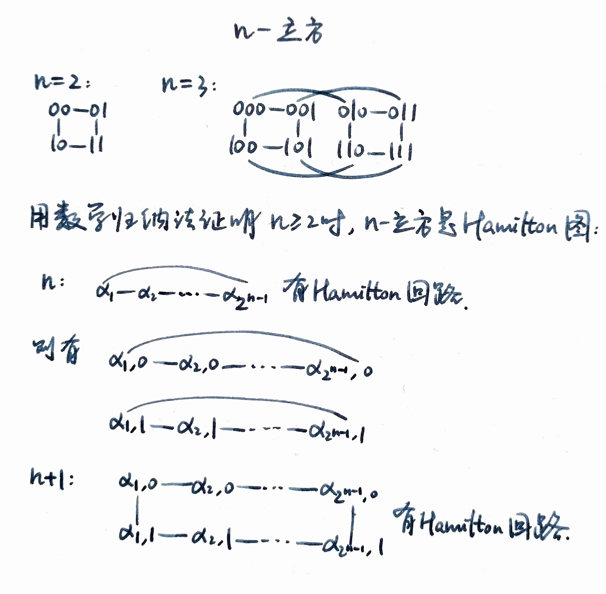

在$2^n$个字长为$n$的二进制数所组成的序列中，每两个相邻的二进制数恰有一位数字不同，则称该序列为**格雷码**（Gray Code）。

随着计算机硬件价格的下降，建造带有多个处理机的并行计算机已成为可行的，$n$-立方就是并行计算的一种模型，详述可见有关并行计算的文献和书籍。

### 竞赛图

$n$位网球选手进行单循环比赛，即在每两个选手之间都要比赛一场，显然，网球比赛没有平局。用有向图表示$n$位网球选手的单循环比赛：$n$位网球选手组成有向图的顶点集合，每个选手对应一个顶点；当甲选手胜了乙选手时，有一条以甲为尾以乙为头的弧。这样表示竞赛的有向图，在任何两个顶点之间，有且仅有一条弧。下面给出竞赛图的定义。

#### 定义8.27（竞赛图）

若有向图$G$中每两个顶点之间恰有一条弧，则称$G$为**竞赛图**。
因此竞赛图也可以说是**有向化的完全图**。

#### 定义8.28（哈密顿有向图）

若有向图$G$具有一条包含$G$中所有顶点的有向回路，则称该有向回路为**哈密顿回路**，称$G$为**哈密顿有向图**。若有向图$G$具有一条包含$G$中所有顶点的有向路，则称该路为**哈密顿有向路**，称$G$为**半哈密顿有向图**。

显然哈密顿有向图是包含$G$中每个顶点一次且仅一次的有向回路，所以哈密顿有向图必定是强连通图。在这里我们仅考虑一种比较简单的情况，给出哈密顿有向图的充分条件。

#### 💡定理8.22

**任何一个竞赛图是半哈密顿有向图。**

**证明**：若竞赛图的顶点数 $\leq 3$，显然有一条哈密顿有向路。

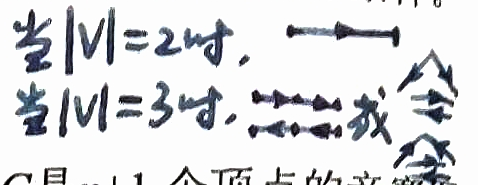

归纳步骤：假设$n$个顶点的任一竞赛图是半哈密顿有向图。设 $G$ 是 $n+1$ 个顶点的竞赛图，从$G$中删去顶点$v$及其关联边，得到的有向图 $G'$ 是 $n$ 个顶点的竞赛图，由归纳假设，$G'$有哈密顿有向路$(v_1, v_2, \dots, v_n)$，$G$有3种情况。 

(1) 在$G$中有一条弧$(v, v_1)$，则有哈密顿有向路$(v, v_1, v_2, \dots, v_n)$； 

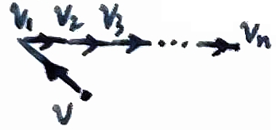

(2) 在$G$中没有弧$(v, v_1)$，则必有弧$(v_1, v)$。若存在$v_i$是$v$之后第一个碰到并且有弧$(v, v_i)$的顶点，则显然得到一条哈密顿有向路$(v_1, v_2, \dots, v_{i-1}, v, v_i, \dots, v_n)$； 

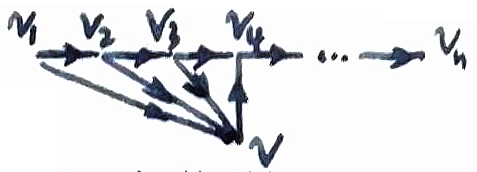

(3) 在$G$中没有弧$(v, v_i)$，而对所有$v_i$，均有弧$(v_i, v)$，$i=1, 2, \dots, n$，则得一条哈密顿有向路$(v_1, v_2, \dots, v_n, v)$。 $\square$

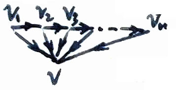

所以，由定理8.22，$n$位网球选手进行单循环比赛，这$n$位选手一定能依次排出一个优胜次序，然而这种次序可能有几种。进一步，我们可以得到一个更强的结果。

#### 💡定理8.23

😮 2018

**任何一个强连通的竞赛图 $G$ 必是哈密顿有向图。**

**证明**：$n=2$ 的有向图不是强连通的。下面证明一个$n$个顶点的强连通竞赛图$G$包含长度为$3, 4, \dots, n$的有向回路。

首先证明$G$包含长度为3的有向回路。设$v$是$G$的任何顶点，$G$中所有弧$(v, w)$的顶点$w$全体记为$W$，所有弧$(z, v)$的顶点$z$全体记为$Z$，因为$G$是强连通的，$W$和$Z$全是非空集，所以在$G$中必有顶点$w \in W$以及$z \in Z$的弧$(z, w)$，于是得到长度为3的有向回路$(v, w, z, v)$。

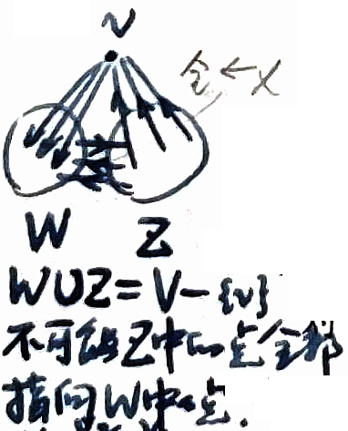

对归纳证明，假设有长度为$k$的有向回路$(k \leq n-1)$，则必有长度为$k+1$的有向回路。假设$(v_1, v_2, \dots, v_k, v_1)$是一条长度为$k$的有向回路，现在考察长度为$k+1$，分两种情况： 

(1) 如果有一个不在这条有向回路上的顶点$v$，由于$G$是强连通竞赛图，那么，$v$有这样的性质，**在$G$中既有弧$(v, v_i)$，又有弧$(v_j, v)$**，所以必存在$v_i$，使$(v_{i-1}, v)$和$(v, v_i)$都是$G$中的弧，于是得到长度为$k+1$的有向回路$(v_1, v_2, \dots, v_{i-1}, v, v_i, \dots, v_k, v_1)$； 

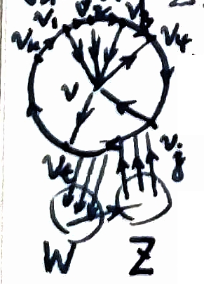

(2) 如果不存在（1）所述性质的$v$，那么$v$有这样的性质，或者只有弧$(v_i, v)$，或者只有弧$(v, v_i)$，也就是说，**不属于有向回路上的顶点集可以分为两个不相交集$W$和$Z$**，其中$W$是对于有向回路上每个顶点$v_i$，使得$(v_i, w)$是一条弧的顶点$w$全体，$Z$是对于有向回路上每个顶点$v_i$，使得$(z, v_i)$是一条弧的顶点$z$的全体。由于$G$是强连通竞赛图，$W$和$Z$均为非空集，且$W$中每个顶点与$Z$中每个顶点之间有弧，所以在$G$中必有$w' \in W$和$z' \in Z$的弧$(w', z')$，于是得到一条长度为$k+1$的有向回路$(v_1, w', z', v_3, \dots, v_k, v_1)$。 $\square$

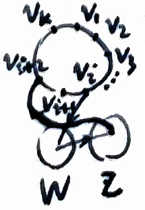

#### 定理8.24（King—Chicken定理）

**在任何竞赛图中，存在最大出度顶点到其他任何顶点的、长度不超过2的有向路。**

**证明**：假设命题不成立，即对于具有最大出度的顶点$u$，存在一个顶点$v$，从$u$到$v$的有向路长度大于等于3。则存在从$v$到$u$以及$u$的所有邻接点的弧，所以$v$的出度大于$u$的出度，导致矛盾。 $\square$

### 货郎担问题/最邻近方法（略）

设有$n$个城镇，已知每两个城镇之间的距离。一个货郎从某一城镇出发巡回售货，问这个货郎应该如何选择路线，使每个城镇经过一次且仅一次，并且总的行程最短。这个问题称为**货郎担（Traveling Salesman）问题**。

如果用$n$个顶点表示$n$个城镇，用连接两点的边上的权值表示对应的两个城镇之间的距离；这样货郎担问题就转化为一个图论的问题：在一个带权的完全图中，找一个总的权最小的哈密顿回路。

货郎担问题的解决可以用穷举的方法，在$n$个顶点的带权的完全图中，所有不同的哈密顿回路（包括有公共边的情况）是$(n-1)!/2$。因为从任意一点开始，第一点可选$n-1$条边，第二点可选$n-2$条边，……，所有可能的选取总数为$(n-1)!$，而每一条哈密顿回路被计算2次，所以哈密顿回路的总数是$(n-1)!/2$。在这么多的哈密顿回路中求一个总的权最小的哈密顿回路，它的计算量是相当大的。

求最优解的有效算法至今尚未找到，下面给出一个较好的近似算法——**最邻近方法**。

设$G=(V, E, \omega)$是$n$个顶点的带权完全图，$\omega$是从$E$到正实数集的函数，对$V$中任何3个顶点$i, j, k$满足：$\omega(i, j)+\omega(j, k) \geq \omega(i, k)$。求最小权的哈密顿回路的最邻近方法步骤如下。 
(1) 任选一点$v_0$作起点，找一个与$v_0$最近的相邻点$x$，得到一边构成的路。 
(2) 设$x$是新加到这条路中的一点，从不在路中的所有点中，选一个与$x$最近的相邻点，将它与$x$连成一边。构成一条新的路，重复此过程，直到$G$中所有顶点都在所构成的路中。 
(3) 连接$v_0$和最后加到路中的顶点，构成一条回路，它就是带权的哈密顿回路。

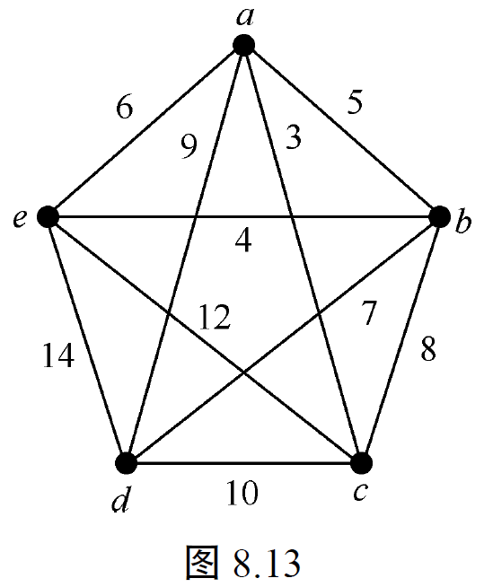

#### 例8.4

图8.13以点$a$为起点，根据最邻近法逐点构造一条哈密顿回路，这条回路为$a, c, b, e, d, a$，总长度为38。而最小权的哈密顿回路为$a, c, d, b, e, a$，总长度为30。

---

# 8.5 最短路

设$G=(V, E, \omega)$是一个带权连通简单图，$\omega$是从$E$到正实数集的函数。边$\{i, j\}$带的权记为$\omega(i, j)$，当无边$\{i, j\}$时，令$\omega(i, j)=+\infty$。

#### 定义8.29（长度/距离）

在$G=(V, E, \omega)$中，路$p$上所有边带的权之和称为路$p$的长度，记为$\omega(p)$。顶点$u$和$v$之间的最短路长度称为$u$和$v$之间的**距离**，记为$d(u, v)$，即：
$$
d(u, v) =
\begin{cases}
0 & u = v \\
\min_p \{\omega(p) | u\text{和}v\text{之间的路}p\} & u\text{与}v\text{连通}
\end{cases}
$$
本节主要讨论的问题是在带权连通简单图$G=(V, E, \omega)$中找一条从顶点$v_1$到另一个顶点之间的最短路及其距离。

下面介绍**得克特拉（E.W. Dijkstra）** 在1959年提出的一个算法，这一算法称为**Dijkstra算法**，至今仍是解这个问题的最好算法，对于带权连通简单图，它可以逐点求出顶点$v_1$到其他各点的最短路及其距离。对于没有回路的带权连通简单有向图也可用Dijkstra算法。

设图$G=(V, E, \omega)$，$V=\{v_1, v_2, \dots, v_n\}$，$\omega>0$，若$\{v_i, v_j\}$不是$G$中的边，则$w(v_i, v_j)=+\infty$。令$S$表示已求出最短路径的顶点集合，$v_1 \in S$，$T=V-S$。Dijkstra算法基于最短路的任一子路也是最短路这一思想，构造顶点子集$S$，使得从$v_1$到$S$中任何顶点的最短路上的顶点都在$S$中。

Dijkstra算法过程如下。

$$
\begin{align*}
&L(v_1)=0; \\
&\text{for } (i=2; i \leq n; i++) L(v_i)=w(v_1, v_i); \\
&S=\{v_1\}; T=\{v_2, \cdots, v_n\}; \\
&\text{for } (k=2; k \leq n; k++) \{ \\
&\quad \text{设} \ u \ \text{是} \ T \ \text{中} \ L(u) \ \text{最小的一个顶点}; \\
&\quad S=S \cup \{u\}; T=T-\{u\}; \\
&\quad \text{for } T \ \text{中所有顶点} \ v \\
&\quad \quad L(v)=\min\{L(v), L(u)+\omega(u, v)\}; \\
&\}
\end{align*}
$$

**$L(v)$的意义**：
- 对$\forall v_i \in S$，$L(v_i)$就是$v_1$到$v_i$的距离 （最短路的长度），且$v$到$v_i$的最短路只经过$S$上的顶点。
- 对$\forall v_i \in T$，$L(v_i)$就是$v_1$到$v_i$但不包含 $T$中其他顶点的最短路的长度。

Dijkstra算法结束时，数组$L$给出$v_1$到其他顶点的距离。

#### 定理8.25

**若$\min_{v \in T} L(v)=L(v')$，则从$v_1$到$v'$的最短路长度（即距离）为$L(v')$。**

**证明**：假设从$v_1$到$v'$存在一条路$p$，它的长度 $L(p)<L(v')$，则路$p$必定经过$T-\{v'\}$中的其他顶点，沿着从$v_1$到$v'$的路$p$行走，首先遇到$T-\{v'\}$中的顶点$v''$，在 $v_1$ 到 $v''$ 的这段路 $p$ 的子路 $p'$ 上不包含$T$中其他任何顶点，由此得出$L(v'') < L(v')$，与假设矛盾。 $\square$

从右往左推导以下不等式
$$L(v') \underset{\substack{\text{由题中}v'\text{的选择满足}\\\min_{v \in T} L(v)=L(v')}}{\leq} L(v'') \underset{\text{由定义，是最短值}}{\leq} L(p') \underset{\substack{p'\text{是一条除了最后的}v''\\\text{其他都是}S\text{中顶点的路}}}{<} L(p) \underset{\text{由反证假设}}{<} L(v')$$
出现矛盾。

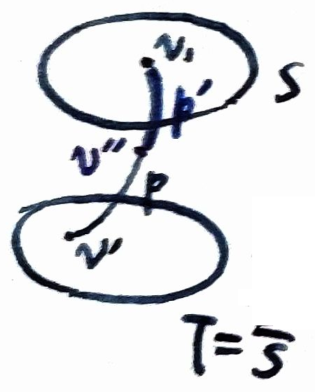

#### 定理8.26

证明Dijkstra算法中的步骤。
$$
\text{for } T \ \text{中所有顶点} \ v,\quad L(v)=\min\{L(v), L(u)+\omega(u, v)\};
$$

**证明**：分3种情况。 

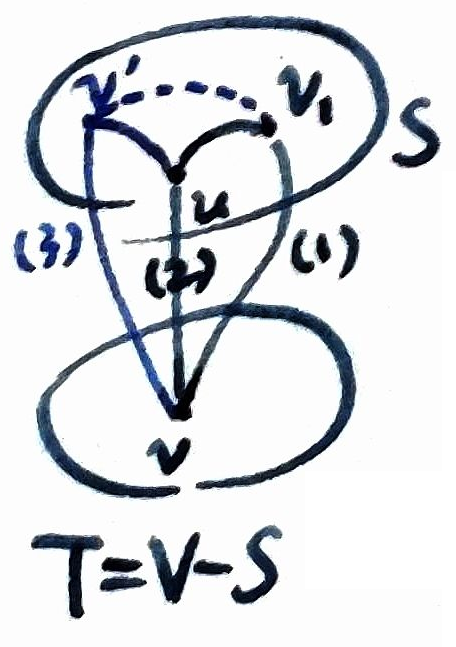

(1) 从$v_1$到$v$有一条路不包含$T$中其他的顶点，也不包含$u$，此时$L(v)=L(v)$； 

(2) 从$v_1$到$v$有一条路是先从$v_1$到$u$，但不包含$T$中其他的顶点，再按一边$\{u, v\}$所构成的路，此时$L(v)=L(u)+\omega(u, v)$； 

(3) 从$v_1$到$v$有一条路是先从$v_1$到$u$再到$v'$（$v' \in S$），然后从$v'$到$v$，但不包含$T$中其他的顶点所构成的路。这种情况可以不必考虑。（从$v_1$到$v'$有一条仅包含$S$中顶点的最短路，不必经过$u$，因为**S是已确定最短路的顶点集合**，而 $u$ 是刚加入 $S$ 的顶点。则为情况(1)，$L(v)=L(v)$）。

所以，$L(v)=\min\{L(v), L(u)+\omega(u, v)\}$，命题成立。 $\square$

#### 例8.5

对于带权连通图，应用Dijkstra算法求解$v_1$到各个顶点的距离。

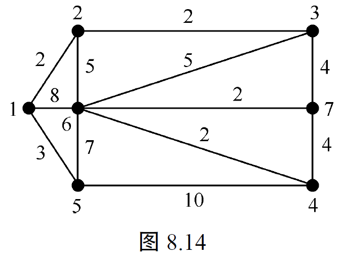

Dijkstra算法逐步求解过程。

* 初始化：$S=\{v_1\}$；$L(v_1)=0$，$L(v_2)=2$，$L(v_3)=+\infty$，$L(v_4)=+\infty$，$L(v_5)=3$，$L(v_6)=8$，$L(v_7)=+\infty$；

* 循环1：$S=\{v_1, v_2\}$；$L(v_3)=\min\{L(v_3), L(v_2)+\omega(v_2, v_3)\}=4$；$L(v_4)=\min\{L(v_4), L(v_2)+\omega(v_2, v_4)\}=+\infty$；$L(v_5)=\min\{L(v_5), L(v_2)+\omega(v_2, v_5)\}=3$；$L(v_6)=\min\{L(v_6), L(v_2)+\omega(v_2, v_6)\}=7$；$L(v_7)=\min\{L(v_7), L(v_2)+\omega(v_2, v_7)\}=+\infty$；

* 循环2：$S=\{v_1, v_2, v_5\}$；$L(v_3)=\min\{L(v_3), L(v_5)+\omega(v_5, v_3)\}=4$；$L(v_4)=\min\{L(v_4), L(v_5)+\omega(v_5, v_4)\}=13$；$L(v_6)=\min\{L(v_6), L(v_5)+\omega(v_5, v_6)\}=7$；$L(v_7)=\min\{L(v_7), L(v_5)+\omega(v_5, v_7)\}=+\infty$；

* 循环3：$S=\{v_1, v_2, v_5, v_3\}$；$L(v_4)=\min\{L(v_4), L(v_3)+\omega(v_3, v_4)\}=13$；$L(v_6)=\min\{L(v_6), L(v_3)+\omega(v_3, v_6)\}=7$；$L(v_7)=\min\{L(v_7), L(v_3)+\omega(v_3, v_7)\}=8$；

* 循环4：$S=\{v_1, v_2, v_5, v_3, v_6\}$；$L(v_4)=\min\{L(v_4), L(v_6)+\omega(v_6, v_4)\}=9$；$L(v_7)=\min\{L(v_7), L(v_6)+\omega(v_6, v_7)\}=8$；

* 循环5：$S=\{v_1, v_2, v_5, v_3, v_6, v_7\}$；$L(v_4)=\min\{L(v_4), L(v_7)+\omega(v_7, v_4)\}=9$；

* 输出：$L(v_1)=0$，$L(v_2)=2$，$L(v_3)=4$，$L(v_4)=9$，$L(v_5)=3$，$L(v_6)=7$，$L(v_7)=8$。

#### 例

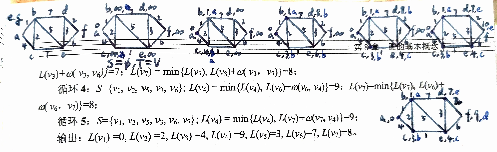

---

# 8.6 图论模型初步（略）

我们可以用数学模型来抽象和简化现实世界，将一个现实世界中的问题A对应到一个便于思考或有求解方法的数学模型B。

图论模型是数学模型的一个分支。在图论模型中，顶点可以代表任何事物，如人、城市等；边表示顶点间的关系；因此图是关系的数学表示。而图论建模就是对一些客观事物进行抽象、化简，并用图来描述事物特征及内在联系的过程。

在前几节中已经给出了几个通过图论模型解决问题的实例。在本节中，将通过一些实例来初步说明如何利用图论模型求解问题。

#### 例8.6

一个部门有25人，对于某个问题，这25人存在着各自的看法，那么是否存在这样的情况：在这25个人中，每个人恰与另外5个人对该问题的看法一致？

利用图论模型求解问题，首先就要明确在建立一个图论模型时，这个图是什么？即什么是顶点？什么是边？

图是关系的数学表示，在本例中，顶点表示人，边表示两个顶点之间“意见一致”的关系，因此在两个“意见一致”的人对应的顶点之间有一条边。所以本例的图论模型由25个顶点组成，如果要求“每个人恰与另外5个人对该问题的看法一致”，则要求每个顶点的度数为5。由定理8.3可知，这样的图不存在，所以不存在这样的情况：“在这25个人中，每个人恰与另外5个人对该问题的看法一致”。

#### 例8.7

$n$支篮球队（$n \geq 4$）进行比赛，比赛已经进行了$n+1$场，则存在一个球队，它至少参加过3场比赛。

**证明**：首先，用图论模型表示这一问题：$n$个球队用$n$个顶点表示；两个球队之间进行了一场比赛，则在相应的两个顶点之间有一条边相连。这样，原问题就转化为：图$G$有$n$个顶点（$n \geq 4$），$n+1$条边，要求证明在图$G$中存在顶点$v$，$d(v) \geq 3$。

如果在图$G$中不存在这样顶点$v$，即在图$G$中所有的顶点度数都是小于等于2，因为图$G$有$n$个顶点，所以图$G$的所有顶点度数之和小于或等于$2n$，又因图$G$有$n+1$条边，由定理8.2可知，图$G$的所有顶点度数之和为$2(n+1)$。因此导致矛盾，所以命题成立。 $\square$

#### 例8.8

今有$a, b, c, d, e, f, g$7人，其中$a$会讲英语；$b$会讲英语和汉语；$c$会讲英语、意大利语和俄语；$d$会讲日语和汉语；$e$会讲意大利语和西班牙语；$f$会讲法语、日语和俄语；$g$会讲法语和西班牙语；问这7个人应该如何安排圆桌座位，才能使每个人都能与他身边的人用同一种语言进行交谈？

也通过建立一个图论模型来表示这一问题：图$G=(V, E)$，其中$V=\{a, b, c, d, e, f, g\}$，$E=\{\{u, v\} | u, v \in V \text{且} u, v \text{有共同语言}\}$。这样，原问题就转化为在图$G$中是否存在哈密顿回路的问题。

由上述三例，我们可以给出图问题分析与求解的技术小结：对现实的问题建立一个图论模型，首先需要决定顶点和边分别代表什么？在一个图论模型中，顶点通常用于表示对象，边通常表示对象之间的关系。通过对现实的问题建立一个图论模型，把现实的问题对应为一个便于思考和有求解方法的图论问题，从而解决问题。

下面，我们讨论比较复杂的图论模型问题。

#### 例8.9 过河问题

某人携带一只羊，一只狼和一捆草过河。主人不在时，羊要吃草，狼要吃羊。船很小，每次摆渡主人只能带一个“乘客”。问：主人应如何将它们摆渡到彼岸，共有几种方案？

也可以建立一个图论模型表示这一问题：分别用$M, S, W, G$表示主人，羊，狼和草。原岸所有的允许状态用点表示：原岸的原始状态为$v_0=\{M, S, W, G\}$，原岸其余允许状态分别为$v_1=\{M, S, W\}$，$v_2=\{M, S, G\}$，$v_3=\{M, W, G\}$，$v_4=\{M, S\}$，$v_5=\{W, G\}$，$v_6=\{G\}$，$v_7=\{W\}$，$v_8=\{S\}$，原岸的最终状态$v_9=\varnothing$。过河问题就用带权有向图$G=(V, E, g)$表示，其中$V=\{v_0, v_1, v_2, \dots, v_9\}$，$E=\{\{u, v\} | u, v \in V \text{且} u \text{一步可达} v\}$，$g$表示每条弧上的权为1。这样，过河问题就转化为用Dijkstra算法在带权有向图$G$中寻找$v_0$到$v_9$的最短路问题。

#### 例8.10 彩色珠子项链问题

有一种用彩色珠子做的漂亮项链。每个珠子由两种颜色组成，相继的两个珠子在邻接处共享一种颜色，如（green|red）（red|white）（white|green）（green|blue）。有一天，项链线断了，珠子撒了一地。我们收集了地上的珠子，但我们无法确定是否收齐。例如，如果我们收集了5颗珠子，珠子的情况是（green|red），（red|white），（white|blue），（blue|yellow）和（yellow|black），则我们可以判定一些珠子遗失了；如果我们收集了5颗珠子，珠子的情况是（red|green），（red|red），（white|blue），（white|green）和（red|blue），则这些珠子可以串接成（red|green）（green|white）（white|blue）（blue|red）（red|red）。

现在，我们想知道用目前收集的珠子是否能够联成项链？

建立图模型的首要问题是：在图中什么为顶点？什么为边？如果以珠子为顶点，珠子串接的可能为边，则无法将问题的内容表达完全。如3颗珠子（red|green），（red|white）和（red|red），则在图中可以给出回路（green|red）（red|white）（red|red），但得到的项链不符合题意。

设图$G=(V, E)$，每种颜色对应一个顶点$V=\{v_1, v_2, \dots, v_m\}$，每颗珠子对应一条有珠子$(c1, c2)$，就有无向边$\{v_{c1}, v_{c2}\}$。收集的珠子是否能够联成项链的问题就转化为在图$G$中是否存在欧拉链的问题。

#### 例8.11 国际象棋马的遍历问题

国际象棋棋盘是个正方形，由横纵各8格、颜色一黑一白交错排列的64个小方格组成，如图8.15所示。马的走法是先横走或直走一格，然后再斜走一格，即走法相似于字母“L”。现在的问题是：在国际象棋的棋盘上，马是否可以遍历，即它从任意一格出发，跳到每格一次且仅一次，最后又回到原来出发的那个格子？

首先考虑图的建模问题：以棋盘每格为顶点，仅当马从甲格能一步跳到乙格时，甲乙两格对应的顶点之间连一条边，这样构成的图称为“马图”。

所以国际象棋马的遍历问题就转化为马图是否为哈密顿图的问题。证明马图是哈密顿图留作习题。

图论在现实世界中还有许多的应用。比如超文本（Hypertexts），一个网页包含了到其他网页的超链接，这样整个网络就可以表示为一个图，页面对应顶点，页面间的链接对应于相应顶点间的弧，而设计一个搜索引擎就需要图处理算法。又比如，在大型软件系统中函数（模块）之间调用关系也可以表示为一个图，分析调用关系图可以确定如何最好分配资源才能使程序更有效率。
