# 第 8 章 图的基本概念

## 习题

### 8.1 设图 $G$ 有 $n$ 个顶点，$n+1$ 条边，证明 $G$ 中至少有一个顶点度数 $\geq 3$。

$$\sum d(v) = 2(n+1)$$
$$\therefore \exists v: d(v) \geq \bigg\lceil \frac{2(n+1)}{n} \bigg\rceil = \bigg\lceil 2+\frac{2}{n} \bigg\rceil \geq 3\quad (n\geq1)$$
##### 或用反证法：

若所有顶点度 $\le 2$，度和 $\le 2n$。实际度和为 $2e=2(n+1)=2n+2$，矛盾。故存在顶点度 $\ge 3$。

---

### 8.2 画一图，顶点度数是：

#### (1) $2, 2, 2, 2, 2, 2$

取环 $C_6$，每顶点与两邻接，度均为2。

#### (2) $2, 3, 4, 5, 6$

序列为 $(2,3,4,5,6)$，$n=5$ 而最大度不得超过 $n-1=4$，序列中有6，故不可能为简单图的度序列。

#### (3) $3, 3, 4, 5, 5, 6$

序列为 $(3,3,4,5,5,6)$，$n=6$ 而最大度不得超过 $5$，序列中有6，故不可能为简单图的度序列。

---

### ✅8.3 证明在任意一个竞赛图中，所有顶点的入度平方和等于所有顶点出度平方和。

##### 竞赛图的形式化定义

设 $T = (V, E)$，其中 $|V| = n$，边集 $E$ 满足：
- 对任意两个不同的顶点 $u, v \in V$，有且只有一条有向边：要么 $(u,v) \in E$，要么 $(v,u) \in E$，但不同时成立。
- 没有自环：$(u,u) \notin E$。

竞赛图就是有向化的完全图。

##### 竞赛图的性质

- 边数：$\binom{n}{2} = \frac{n(n-1)}{2}$。
- 每个顶点 $v$ 的出度 $\deg^+(v)$ 与入度 $\deg^-(v)$ 满足：
  $$
  \deg^+(v) + \deg^-(v) = n-1
  $$
- 所有顶点的出度之和 = 所有顶点的入度之和 = 总边数。

我们想证明：
$$
\sum_{i=1}^n \big(\deg^-(v_i)\big)^2 = \sum_{i=1}^n \big(\deg^+(v_i)\big)^2
$$
作差，用平方差公式：
$$
\sum_{i=1}^n \left[ (\deg^-)^2 - (\deg^+)^2 \right]
= \sum_{i=1}^n (\deg^- - \deg^+)(\deg^- + \deg^+)
= (n-1) \sum_{i=1}^n \left[ \deg^-(v_i) - \deg^+(v_i) \right]
$$
注意：
$$
\sum_{i=1}^n \deg^+(v_i) = \text{总出度} = \text{总边数} = \binom{n}{2} = \frac{n(n-1)}{2}
$$
$$
\sum_{i=1}^n \deg^-(v_i) = \text{总入度} = \text{总边数} = \frac{n(n-1)}{2}
$$
所以：
$$
\sum_{i=1}^n \deg^-(v_i) - \sum_{i=1}^n \deg^+(v_i) = 0\\
\sum_{i=1}^n \left[ (\deg^-)^2 - (\deg^+)^2 \right]
= (n-1) \sum_{i=1}^n [\deg^-(v_i) - \deg^+(v_i)] = 0
$$
即
$$
\boxed{\sum (\text{入度})^2 = \sum (\text{出度})^2}
$$
在任意竞赛图中成立。

---

### 8.4 图8.16（a）与（b），图8.16（c）与（d）是否同构？如果同构，请给出证明。

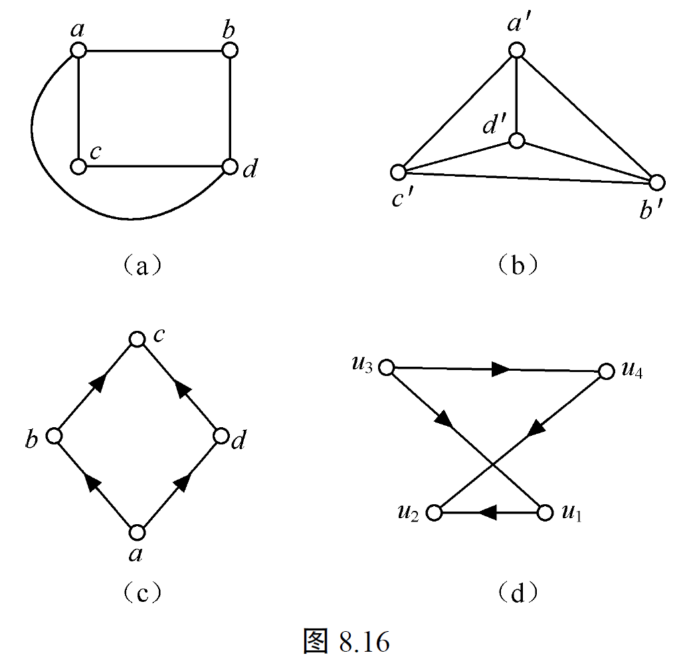

(a) 与 (b) 不同构，因为 (a) 中有度数为 2 的顶点 b 和 c，但是 (b) 中没有；
或者因为 $|E_a|=5$ 但是 $|E_b|=6\neq|E_a|$。

(c) 与 (d) 同构。
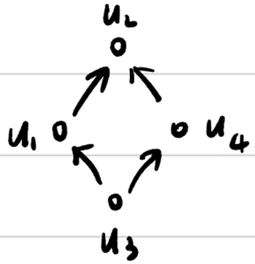

---

### 8.5 若一个图同构于它的补图，则称该图为自补图。

#### (1) 给出一个四个顶点的自补图。

路径 $P_4$（顶点排列成 $v_1-v_2-v_3-v_4$）的补图仍是 $P_4$，因此 $P_4$ 自补。

#### (2) 给出一个五个顶点的自补图。

5-环 $C_5$ 的补图也是 $C_5$，因此 $C_5$ 自补。

#### (3) 是否有三个或六个顶点的自补图？

3 或 6 顶点的自补图不存在，因为自补图的边数为总边数的一半，即
$$
e=\frac{1}{2}\binom{n}{2}=\frac{n(n-1)}{4}
$$
所以 $n(n-1)$ 必须被4整除，从同余角度得 $n\equiv 0$ 或 $1\pmod{4}$。而 $3\equiv 3$ 与 $6\equiv 2\pmod{4}$，不满足，故无自补图。

#### (4) 证明一个自补图的顶点数不是 $4k$ 就是 $4k+1$，其中 $k$ 是正整数。

上面已给出证明：自补图必须满足 $n(n-1)$ 可被4整除，即 $n\equiv 0$ 或 $1\pmod{4}$，故 $n=4k$ 或 $n=4k+1$。

---

### 8.6

#### (1) 证明完全图的每个导出子图是完全图。

若 $K_n$ 的一个导出子图（诱导子图）由顶点集 $S$ 给出，则诱导子图中任取两顶点在 $K_n$ 中相连，故在诱导子图中亦相连，因此诱导子图为完全图。

#### (2) 证明二分图的每个导出子图是二分图。

**已知**： $G$ 是二分图，设二部划分为 $V(G) = X \cup Y$，$X \cap Y = \varnothing$，且每条边的一个端点在 $X$，另一个端点在 $Y$。

**要证**：对任意 $S \subseteq V(G)$，导出子图 $G[S]$ 也是二分图。

**构造导出子图的二部划分**，令：
$$
X' = S \cap X, \quad Y' = S \cap Y
$$
显然：
$$
S = X' \cup Y', \quad X' \cap Y' = \varnothing
$$
**验证二分性**：考虑 $G[S]$ 中的任意一条边 $e = uv \in E(G[S])$。

- 因为 $e$ 在 $G$ 中，且 $G$ 是二分图，所以 $u$ 和 $v$ 必分别属于 $X$ 和 $Y$（一个在 $X$，一个在 $Y$）。
- 不可能 $u, v$ 同时属于 $X' \subset X$，否则 $e$ 在 $G$ 中两端点都在 $X$，与 $G$ 是二分图矛盾。
- 同理不可能 $u, v$ 同时属于 $Y' \subset Y$。
- 因此 $u$ 和 $v$ 必分别属于 $X'$ 和 $Y'$。

所以 $G[S]$ 是一个二分图，其二部划分为 $X'$ 和 $Y'$。

---

### 8.7 设边 $a$ 在图 $G$ 的某闭链中，证明 $a$ 在 $G$ 的某回路中。

设边 $a$ 在闭链（闭迹、允许重复顶点但不重复边的闭路径）$C$ 中。

若闭链中所有顶点互不重复，则它本身为回路，包含 $a$。

否则在闭链中沿方向从一端走到第一次重复出现的顶点，两个相同顶点之间的段构成一个回路；若该回路包含边 $a$ 则完成，否则把闭链删去回路段后仍有闭链包含 $a$，重复此过程直到得到包含 $a$ 的简单回路。

---

### 8.8 证明在 $n$ 个顶点的（有向）图 $G$ 中，若存在从 $v_1$ 到 $v_2$ 的（有向）路径，则从 $v_1$ 到 $v_2$ 有一条不多于 $n-1$ 条边的路径。

沿一条从 $v_1$ 到 $v_2$ 的有向路径若有重复顶点，则在重复顶点之间存在一个有向回路，可把回路删除得到更短的 $v_1-v_2$ 路径。重复此操作直到路径顶点互不重复，最多包含 $n$ 个顶点，从而边数 $\le n-1$。

---

### 8.9 已知具有 $n$ 个度数都为 $3$ 的顶点的简单图 $G$ 有 $e$ 条边。

#### (1) 若 $e=3n-6$，证明 $G$ 在同构意义下唯一，并求 $e, n$。

所有顶点度为 $3$，故 $2e=\sum d_i=3n$，即 $e=\frac{3n}{2}$，所以 $n$ 为偶数。

假定 $e=3n-6$，联立 $\frac{3n}{2}=3n-6$ 得 $3n=6n-12\Rightarrow 3n=12\Rightarrow n=4$。代回得 $e=6$。在4个顶点、每顶点度3的简单图唯有完全图 $K_4$，因此在同构意义下唯一。

#### (2) 若 $n=6$，证明 $G$ 在同构意义下不唯一。

若 $n=6$ 则 $e=\frac{3\cdot 6}{2}=9$。

要证明在同构意义下，这样的 $G$ 不唯一，即至少有两个不同构的 3-正则简单图，顶点数为 6。

##### 例 1：三棱柱图（Triangular prism graph）

**顶点**：$A_1, A_2, A_3, B_1, B_2, B_3$  
**边**：三角形 $A_1 A_2 A_3$；三角形 $B_1 B_2 B_3$；棱 $A_1 B_1, A_2 B_2, A_3 B_3$。
每个顶点度为 3，简单图，边数 $3 + 3 + 3 = 9$。
这个图是**平面图**（要求所有边都必须在一个**没有厚度**的平面上，且不能有交叉）。

**具体画法**：在三角形 $A_1 A_2 A_3$ 的**内部**画另一个三角形 $B_1 B_2 B_3$，确保 $B_1$ 靠近 $A_1$，$B_2$ 靠近 $A_2$，$B_3$ 靠近 $A_3$。

##### 例 2：完全二分图 $K_{3,3}$

顶点划分为 $X = \{1,2,3\}, Y=\{4,5,6\}$，所有 $X$ 与 $Y$ 之间的边都连接。
每个顶点度为 3，边数 $3 \times 3 = 9$，简单图。
这个图是**非平面图**（根据 Kuratowski 定理，$ K_{3,3} $ 是非平面图）。

##### 为什么它们不同构：

- **平面性**：三棱柱图是平面图，$K_{3,3}$ 是非平面图。
- **二部性**：$K_{3,3}$ 是二分图（不含奇圈），三棱柱图含有三角形 $A_1 A_2 A_3$（长度为 3 的圈），所以不是二分图。

---

### ✅8.10

#### (1) 证明 $(4, 3, 2, 2, 1)$ 可简单图化。

对度数列 $(4,3,2,2,1)$ 用 **Havel–Hakimi 算法**：

使用 **Havel–Hakimi 算法**：

**步骤 1**  
序列：$(4, 3, 2, 2, 1)$（已非递增排序）  
$d_1 = 4$，检查：$k = 4$，$n = 5$，$k < n$，继续。  
去掉 4，后面 4 个数各减 1： $(3-1, 2-1, 2-1, 1-1) = (2, 1, 1, 0)$
新序列（排序后）：$(2, 1, 1, 0)$

**步骤 2**  
取第一个 2，后面 2 个数各减 1：  $(1-1, 1-1, 0) = (0, 0, 0)$
新序列：$(0, 0, 0)$ 全 0，结束。

**结论**：序列 $(4, 3, 2, 2, 1)$ **可简单图化**。

#### (2) 证明 $(7, 6, 5, 4, 3, 3, 2)$ 和 $(6, 6, 5, 4, 3, 3, 1)$ 不可简单图化。

对 $(7,6,5,4,3,3,2)$ 与 $(6,6,5,4,3,3,1)$ 用 Havel–Hakimi 或 Erdős–Gallai 检验可得矛盾。

第一列顶点个数 $n=7$ 但首项度数 $7>n-1=6$，立即不可能。

第二列去掉首项度数6，并对前6项减1，得到不可继续进行的序列 $(5,4,3,2,2,0)$，因为剩下第 5 个数 0 无法减 1。

#### (3) 证明定理8.5：设非负整数列 $d=(d_1, d_2, \dots, d_n)$，$(n-1) \geq d_1 \geq d_2 \geq \dots \geq d_n \geq 0$，则 $d$ 可简单图化当且仅当对于每个整数 $r$，$1 \leq r \leq (n-1)$，$\sum_{i=1}^{r} d_i \leq r(r-1) + \sum_{i=r+1}^{n} \min\{d_i, r\}$ 并且 $\sum_{i=1}^{n} d_i$为偶数。

**必要性**：若 $d$ 是某个简单图的度序列，则握手引理保证和为偶数。  

  对任意 $r$，考虑前 $r$ 个顶点之间的边以及它们与后 $n-r$ 个顶点之间的边。 

  前 $r$ 个顶点的总度数 $\sum_{i=1}^r d_i$ 中，由前 $r$ 个顶点之间的边贡献最多 $r(r-1)$（因为简单图中每边贡献 2 度，但这里我们按顶点度数求和时，一条边若两端都在前 $r$ 个顶点中，它在总度数里被算 2 次，所以前 $r$ 个顶点之间的边最多有 $\binom{r}{2}$ 条，贡献最多 $2 \times \binom{r}{2} = r(r-1)$ 到前 $r$ 个顶点的度数和）。  

  另外，前 $r$ 个顶点与后 $n-r$ 个顶点之间的边：后 $n-r$ 个顶点 $v_j$ 的度数 $d_j$ 中，最多有 $\min(d_j, r)$ 条边连到前 $r$ 个顶点（因为前 $r$ 个顶点只有 $r$ 个）。  

  所以：
  $$
  \sum_{i=1}^r d_i \le r(r-1) + \sum_{i=r+1}^n \min(d_i, r).
  $$

**充分性**：*比较复杂*，通常用数学归纳法或构造性证明，可参见 Erdős–Gallai 原论文。

<!-- ？？？ -->

#### 💡(4) 证明定理8.6（**Havel–Hakimi 定理**）：设非负整数列 $d=(d_1, d_2, \dots, d_n)$，$\sum_{i=1}^{n} d_i$ 为偶数且 $(n-1) \geq d_1 \geq d_2 \geq \dots \geq d_n \geq 0$，则 $d$ 可简单图化当且仅当 $d'=(d_1-1, d_3-1, \dots, d_{d_1+1}-1, d_{d_1+2}, \dots, d_n)$ 是可简单图化的。

**证明**：

##### $\Leftarrow:$ 若 $d'$ 可简单图化，则 $d$ 可简单图化。

显然。

设 $H$ 是 $d'$ 的一个实现。

将 $d'$ 对应的顶点按度降序排列为 $u_1, u_2, \dots, u_{n-1}$，度分别为 $d'_1 \ge d'_2 \ge \dots \ge d'_{n-1}$。

**构造 $G$**：添加一个新顶点 $v_1$，让 $v_1$ 与 $u_1, u_2, \dots, u_{d_1}$ 相连，剩下的图结构同 $H$。

**验证度数列**：$u_1, \dots, u_{d_1}$ 在 $H$ 中的度，对应于 $d_2, \dots, d_n$ 中某些顶点度减 1 之后的值。当我们把 $v_1$ 与它们相连后，它们的度各 +1，就恢复成原来 $d_2, \dots, d_n$ 中对应顶点的度。同时 $v_1$ 的度为 $d_1$。因此 $G$ 的度数列正好是 $d$。

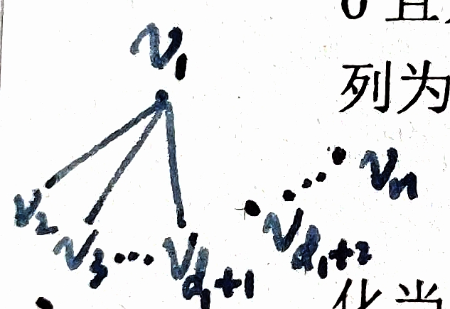

 

##### $\Rightarrow:$ 若 $d$ 可简单图化，则 $d'$ 可简单图化。

假设 $G$ 是以 $d$ 为度序列的简单图，$\deg(v_i) = d_i$。我们要构造一个度序列为 $d'$ 的简单图。
设 $v_1$ 是度为 $d_1$ 的顶点。  

###### 情况1：$v_1$ 的邻点集合 $N(v_1)$ 是 $\{v_2, v_3, \dots, v_{d_1+1}\}$

在图 $G$ 中，删除顶点 $v_1$ 及其所有连边，则：
- 顶点 $v_2, \dots, v_{d_1+1}$ 的度各减少 1，
- 其余顶点度不变。

删除 $v_1$ 后剩下的图的度序列正好是 $d'$（可能顺序需重排）。

###### 情况2：$v_1$ 的邻点集合 $N(v_1)$ 不是 $\{v_2, v_3, \dots, v_{d_1+1}\}$，即存在边 $v_1v_j, j>d_1+1$

我们可以通过 **交换邻接关系** 来调整。

**引理**：存在一个简单图 $G$ 实现 $d$，使得 $v_1$ 与 $v_2, v_3, \dots, v_{d_1+1}$ 相邻。

令 
$$
j_0 = \max\{j | v_1v_j \in E(G)\} > d_1+1\\
i_0 = \min\{i | v_1v_i \notin E(G)\} \leq d_1+1
$$
则 $i_0 \leq d_1+1 < j_0$，由于度序列降序，$d_{i_0} \ge d_{j_0}$，$v_{i_0}$ 的所有 $d_{i_0}$ 个邻点中至少有一个邻点 $v_k,(v_k,v_{j_0}) \notin E(G)$。

否则，若 $v_{i_0}$ 的所有 $d_{i_0}$ 个邻点都与 $v_k$ 相邻，再加上 $v_1$，有 $d_{i_0}+1 \leq d_{j_0}$，与度序列降序矛盾。  

作如下替换：

- 去掉边 $(v_1, v_{j_0})$ 和 $(v_{i_0}, v_k)$，
- 改为边 $(v_1, v_{i_0})$ 和 $(v_k, v_{j_0})$，
- 这样保持度序列不变，且不产生重边。

这样，与 $v_1$ 相邻的顶点的下标就变小了。反复进行这种调整，最终可使 $v_1$ 的邻点为 $v_2, \dots, v_{d_1+1}$，转换为**情况1**。

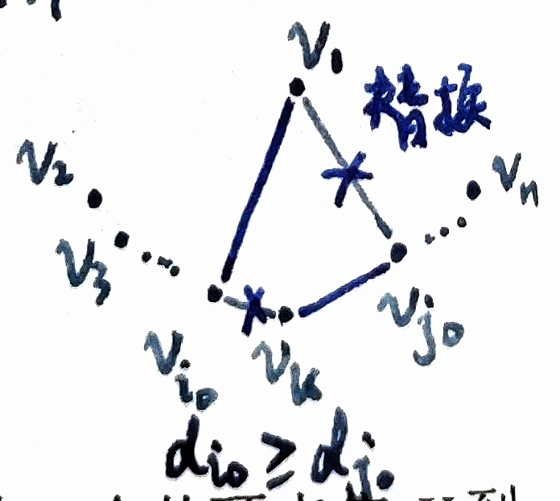

#### (5) 利用定理8.6，判定 $(5, 5, 3, 3, 2, 2, 2)$ 可简单图化。

**步骤 1**：取 $d_1 = 5$，构造新序列 $d'$：  
去掉第一个 5，后面 5 个数各减 1：  $(5-1, \ 3-1, \ 3-1, \ 2-1, \ 2-1, \ 2) = (4, 2, 2, 1, 1, 2)$  
排序：  $(4, 2, 2, 2, 1, 1)$

**步骤 2** ：取 $d_1 = 4$，构造 $d''$：  
去掉第一个 4，后面 4 个数各减 1：  $(2-1, \ 2-1, \ 2-1, \ 1-1, \ 1) = (1, 1, 1, 0, 1)$  
排序：  $(1, 1, 1, 1, 0)$

**步骤 3**：取 $d_1 = 1$，构造 $d'''$：  
去掉第一个 1，后面 1 个数减 1：  $(1-1, \ 1, \ 1, \ 0) = (0, 1, 1, 0)$  
排序：  $(1, 1, 0, 0)$

**步骤 4**：取 $d_1 = 1$，构造 $d''''$：  
去掉第一个 1，后面 1 个数减 1：  $(1-1, \ 0, \ 0) = (0, 0, 0)$

全 0，结束。因此原序列 **可简单图化**。

---

### ✅8.11 设 $G$ 是简单图，有 $n$ 个顶点，$\delta > \left\lfloor \frac{n}{2} \right\rfloor - 1$，证明 $G$ 是连通的。

记 $k = \left\lfloor \frac{n}{2} \right\rfloor$，则条件为  
$$
\delta(G) > k - 1 \quad\Rightarrow\quad \delta(G) \ge k
$$
因为度数是整数。

**反证法**：假设 $G$ 不连通，则至少有两个连通分支 $C_1$ 和 $C_2$，设 $|C_1| = a$，$|C_2| = b$，且 $a + b \le n$，$a \ge 1, b \ge 1$。

在分支 $C_1$ 中，每个顶点最多与同一分支的 $a-1$ 个顶点相邻，因此 $\delta(C_1) \le a-1$，同理 $\delta(C_2) \le b-1$。

由 $a + b \le n$ 得  $\min(a, b) \le \left\lfloor \frac{n}{2} \right\rfloor = k$，于是  
$$
\delta(G) \le \min(\delta(C_1),\delta(C_2)) \leq \min(a-1, b-1) \leq k-1
$$
这与条件 $\delta(G) \ge k$ 矛盾。所以 $G$ 是连通的。

##### 另一证法：

若$G$不连通，则$G$有$G_1,G_2,\cdots,G_w$分支（$w\geq2$）.
$\because \delta\geq\lfloor \frac{n}{2} \rfloor$ $\therefore \forall G_i: |V_i|\geq\lfloor \frac{n}{2} \rfloor+1$ 
$\therefore \sum|V_i| \geq w(\lfloor \frac{n}{2} \rfloor+1) \geq 2(\lfloor \frac{n}{2} \rfloor+1) > 2\cdot \frac{n}{2}=n$ 矛盾.
$\therefore G$连通. （以上不等式利用了$x-1<\lfloor x \rfloor\leq x\leq \lceil x \rceil <x+1$）

---

### 8.12 设图 $G=(V, E)$。

#### (1) 设 $e \in E$，证明 $\omega(G) \leq \omega(G-e) \leq \omega(G)+1$。

去掉一条边不会使连通分量减少，所以 $\omega(G)\le\omega(G-e)$。

若 $e$ 不是割边（桥），即去掉 $e$ 后其两个端点仍在同一连通分量内，则 $\omega(G-e)=\omega(G)$。
若 $e$ 是割边，则去掉 $e$ 会把某个连通分量分成两个，连通分量数增加 1，即 $\omega(G-e)=\omega(G)+1$。
因此 $\omega(G-e)\le\omega(G)+1$。

合并可得所求不等式。

#### (2) 若 $v \in V$，则上述不等式中 $G-e$ 换成 $G-v$ 一般是不成立的。

反例：令 $G$ 为星图 $K_{1,3}$（中心顶点 $v$ 与 3 个叶子相连）。

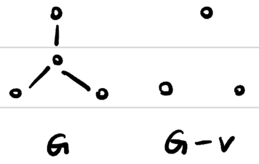

原图连通，$\omega(G)=1$。去掉中心顶点 $v$ 后剩下 3 个孤立顶点，$\omega(G-v)=3$。
所以 $\omega(G-v)$ 可以比 $\omega(G)$ 大得多，不能保证类似的不等式成立。

---

### 8.13 设图 $G$ 中的边满足 $\omega(G-e) > \omega(G)$，称 $e$ 为 $G$ 的**割边（或桥）**。证明：$e$ 是割边当且仅当 $e$ 不包含在 $G$ 的任一回路中。

（**必要**）若 $e$ 在某回路 $C$ 中，则回路中任意两顶点之间仍有不经过 $e$ 的路径，所以去掉 $e$ 后图仍保持原来回路其余边连通，不会增加连通分量。因此 $e$ 不是割边。

（**充分**）若 $e=uv$ 不在任何回路中，则在原图中 $u$ 与 $v$ 之间除了这条边外无其它路径。去掉 $e$ 后 $u$ 与 $v$ 不再连通，连通分量数增加，故 $e$ 是割边。

---

### 8.14

#### (1) 若简单图 $G$ 至多有 $2n$ 个顶点，每个顶点度数至少为 $n$，则 $G$ 是连通图。

（**反证法**）：设 $G$ 不连通，取两个连通分量 $A,B$（非空），设 $|A|=a,\ |B|=b$，则 $a+b\le2n$。

在分量 $A$ 内任一顶点的度数 $\le a-1$，但假设度数 $\ge n$，所以 $a-1\ge n\Rightarrow a\ge n+1$。同理 $b\ge n+1$。

所以 $a+b\ge 2n+2$，与 $a+b\le2n$ 矛盾。因此 $G$ 必连通。

#### (2) 若简单图 $G$ 至多有 $2n$ 个顶点，每个顶点度数至少为 $n-1$，那么 $G$ 是连通图吗？为什么？

**不一定**，构造反例：取两个互不相连的完全图 $K_n$ 的并（即两个分量，每个有 $n$ 个顶点）。整个图有 $2n$ 顶点，每个顶点在其所在的 $K_n$ 中度为 $n-1$，但图显然不连通。

---

### 8.15（定理8.13步骤） 设 $G$ 是连通图，从顶点 $u$ 到顶点 $v$ 有一条偶路 $p_1$ 和一条奇路 $p_2$，证明 $G$ 中有一条奇回路，它的边集合于 $p_1 \cup p_2$ 中。

把 $p_1$ 和 $p_2$ 首尾拼接为闭的轨迹：沿 $p_1$ 从 $u$ 到 $v$，再沿 $p_2$ 从 $v$ 回到 $u$（逆向走或直接拼接，长度为 $|p_1|+|p_2|$）。由于 $|p_1|$ 为偶，$|p_2|$ 为奇，和为奇，所以得到一个**奇长的闭迹**（closed walk），其所有边都在 $p_1\cup p_2$ 中。

若该闭迹本身为一简单回路，则完成。

若闭迹有重复顶点，则可把闭迹分解成若干圈（循环）和若干次重复的弧拼接。分解后的圈中至少有一个圈的长度为奇（因为总长度为奇，奇数个或至少一个奇圈必须存在）。该奇圈的边显然属于原闭迹，也属于 $p_1\cup p_2$。

因此存在一条奇回路，且边集包含于 $p_1\cup p_2$。

---

### 8.16 设 $G$ 是简单图，有 $n$ 个顶点，$e$ 条边。

#### 😮2024 (1) 设 $e > \frac{1}{2}(n-1)(n-2)$，证明 $G$ 是连通的。

**反证**：若 $G$ 不连通，分成若干分量，至少两个分量；设它们顶点数为 $a,b,\dots$，其中 $a\ge1,\ b\ge1,\ a+b\le n$。

边数最多为各分量内完全图的边数之和，取两部分 $a$ 与 $n-a$ 分割使边数最大化时为 $\binom{a}{2}+\binom{n-a}{2}$。

函数 $f(a) = \binom{a}{2}+\binom{n-a}{2} = \frac{a(a-1)}{2} + \frac{(n-a)(n-a-1)}{2}$ 在 $a = n-1$ 或 $a = 1$ 时取最大值，最大值为 $\binom{n-1}{2}=\tfrac12 (n-1)(n-2)$。

因此若 $G$ 不连通，则 $e\le \tfrac12 (n-1)(n-2)$。矛盾。故 $G$ 连通。

#### (2) $n>1$，画一个非连通简单图，使 $e = \frac{1}{2}(n-1)(n-2)$。

取 $K_{n-1}$ 与一个孤立点的并。此图非连通，边数为 $\binom{n-1}{2}=\tfrac12 (n-1)(n-2)$。符合要求。

---

### ✅8.17 证明：对于任何简单图 $G$，或者 $G$ 是连通的或者 $\overline{G}$ 是连通的。

若 $G$ 连通，命题成立。只需考虑 $G$ 不连通的情况。设 $G$ 的连通分量为 $C_1,\dots,C_k$，$k\ge2$。

不同连通分量间的任意两顶点在 $G$ 中没有边，因此在补图 $\overline{G}$ 中必有边连接。

取任一分量 $C_1$ 中的顶点 $x$。
对任意顶点 $y$（无论属于哪个分量），若 $y\notin C_1$ 则 $xy\in E(\overline{G})$；

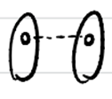

若 $y\in C_1$，选取某个 $z$ 来自 $C_2$（存在因为 $k\ge2$），则 $xz\in E(\overline{G})$ 且 $yz\in E(\overline{G})$。

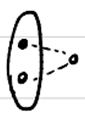

因此在 $\overline{G}$ 中 $x$ 与任意 $y$ 距离至多 2。所以 $\overline{G}$ 是连通的。
因此任一简单图要么自身连通要么其补图连通。

---

### ✅8.18 设 $G$ 是连通的简单图，每个顶点是偶顶点，证明 $\omega(G-v) \leq \frac{1}{2}d(v)$。

设 $d = d(v)$，删除 $v$ 后得到的分支数为 $k = \omega(G-v)$。

**反证假设**：假设 $\omega(G-v) > \frac{d}{2}$，即 $2\omega(G-v) > d$。
##### **分析 $G-v$ 的奇顶点个数**

- 在 $G$ 中，所有顶点度数为偶数。  
- 删除 $v$ 时，$v$ 的每个邻点的度数减少 1（由偶数变为奇数）。  
- 因此 $G-v$ 中，只有那些在 $G$ 中与 $v$ 相邻的顶点会变成奇顶点，其他顶点度数不变（仍为偶数）。

所以 $G-v$ 中奇顶点的个数正好等于 $d(v)$。
##### **奇顶点在分支中的分布**

设 $v$ 连到分支 $C_i$ 的边数为 $e_i$，则  
$$
\sum_{i=1}^k e_i = d(v)
$$
在 $G-v$ 中，分支 $C_i$ 里与 $v$ 相邻的那些顶点（共 $e_i$ 个）度数为奇数，其余顶点度数为偶数。
由**握手引理**：任何图的奇度顶点个数为偶数。因此**每个分支 $C_i$ 的奇顶点数 $e_i$ 必须是偶数**。

每个 $e_i$ 是偶数，且因为 $G$ 连通，每个分支 $C_i$ 在 $G$ 中必须与 $v$ 有边相连，所以 $e_i \ge 1$，结合 $e_i$ 为偶数，得 $e_i \ge 2$。于是：
$$
d = \sum_{i=1}^k e_i \ge 2k
$$
这与假设 $k > \frac{d}{2}$ 矛盾。

##### 另一描述方式：

记$v$的邻接节点集合$N(v)=\{v_1,v_2,\cdots,v_{2k}\}$，$k\in\mathbb{Z}^+$
若$v_i$在$G-v$的某个连通分支中，则必存在$v_j$和$v_i$在同一个连通分支中.
如若不然，$v_i$所在连通分支只有$v_i$这一个奇顶点，不可能构成连通分支.
$\because G$连通，$\therefore$最多可有$k$对组成$k$个连通分支，即$w(G-v) \leq \frac{1}{2}d(v)$.

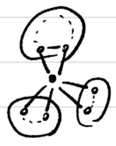

---

### ✅8.19 设 $G$ 是简单图，若 $\delta \geq k$，证明 $G$ 中有长度为 $k$ 的路。

取 $P=v_0v_1\cdots v_m$ 为 $G$ 中最长的简单路（不能再延长）。

考虑端点 $v_0$。由于 $P$ 最长，**$v_0$ 的所有邻点都属于这条路的顶点集合中**，否则可从 $v_0$ 出发延出新顶点，矛盾。因此 $\deg(v_0)\le m$（因为它最多与路径上的其它 $m$ 个顶点相邻）。

但 $\deg(v_0)\ge\delta\ge k$，所以 $m\ge k$。即存在长度至少 $k$ 的路。

---

### 8.20 证明连通图中任意两条最长的路有公共顶点。

设 $G$ 为连通图，假设存在两条最长的路 $P_1,P_2$，它们的长度均为 $k$，且没有公共顶点。

由于 $G$ 是连通图，必存在一条连接 $P_1$ 与 $P_2$ 的路径。在所有连接 $P_1$​ 与 $P_2$​ 的路径中，取长度最短的一条：
$$Q = u_0,u_1,\dots,u_t ,$$
其中 $u_0\in V(P_1)$，$u_t\in V(P_2)$，除端点外，其余顶点均不在 $P_1\cup P_2$ 中（否则可缩短路径，与 $Q$ 的最短性矛盾）。

于是路径 (Q) 的**第一条边** $u_0u_1$ 满足：$u_0\in V(P_1)$，$u_1\notin V(P_1)$。
同理，路径 (Q) 的**最后一条边**  $u_{t-1}u_t$ 满足：$u_t\in V(P_2)$，$u_{t-1}\notin V(P_2)$。

在路 $P_1$ 中，顶点 $u_0$ 将 $P_1$ 分成两段，长度分别为 $e_1,\; k-e_1$。
在路 $P_2$ 中，顶点 $u_t$ 将 $P_2$ 分成两段，长度分别为 $e_2,\; k-e_2$。

从 $P_1$ 中取较长的一段，从 $P_2$ 中也取较长的一段，并用 $Q$ 将它们连接，可得到一条新的路，其长度为 $\max\{e_1,k-e_1\}+\max\{e_2,k-e_2\}+\ell(Q)$。

注意到
$$\max\{e_1,k-e_1\}\ge \frac{k}{2},\qquad\max\{e_2,k-e_2\}\ge \frac{k}{2},$$
因此该新路的长度满足
$$\max\{e_1,k-e_1\}+\max\{e_2,k-e_2\}+\ell(Q) \ge k+1.$$
这与假设“$P_1,P_2$ 是长度为 $k$ 的最长路”矛盾。

因此假设不成立，结论是：**在连通图中，任意两条最长的路必有公共顶点。**

---

### 8.21 设 $G$ 是一个多于4个顶点的任意简单图，证明或者 $G$ 或者 $\overline{G}$ 包含一条回路。

已知：当简单图的顶点数 $n \ge 6$ 时，必有 $G$ 或 $\overline G$ 中存在一个三角形。
而三角形本身就是一条回路，因此当 $n \ge 6$ 时结论显然成立。

于是只需讨论 $n=5$ 的情形。

设 $G$ 是一个含 5 个顶点的简单图。若 $G$ 或 $\overline G$ 中存在一个三角形，则结论成立。下面假设二者都**不存在三角形**，并导出矛盾。

在这种情况下，$G$ 中任意顶点的度数都不可能 $\geq 3$；否则设某顶点 $v$ 的邻点为 $u_1,u_2,u_3$，则在补图 $\overline G$ 中，这三个顶点两两相邻，从而形成三角形，矛盾。
同理，$\overline G$ 中任意顶点的度数也不可能 $\geq 3$。

由于 $G$ 与 $\overline G$ 中每个顶点的度数之和为 $4$，可知 $G$ 中每个顶点的度数恰为 2，$\overline G$ 中亦然。

因此，$G$ 是一个 5 个顶点、每个顶点度数均为 2 的简单图。这样的图只能是若干个回路的并，而在 5 个顶点的连通情形下，只能是一个 5-回路。于是 $G$ 本身包含回路。

综上，无论哪种情况，$G$ 或 $\overline G$ 至少有一方包含回路，命题得证。

---

### 8.22 设 $M$ 是 $n$ 个顶点的简单图 $G$ 的邻接矩阵，证明 $M^3 = (m_{ij}^{(3)})$，其中 $m_{ij}^{(3)}$ 等于通过对应顶点 $v_i$，且长度为3的不同三角形数目的两倍。

<!-- 题目描述？？？ -->

设 $M=(m_{ij})$ 为图 $G$ 的邻接矩阵。根据邻接矩阵乘法的基本性质，矩阵 $M^k$ 的元素 $m_{ij}^{(k)}$ 表示从顶点 $v_i$ 到顶点 $v_j$ 的长度为 $k$ 的路的条数。
因此，$m_{ii}^{(3)}$ 表示从 $v_i$ 出发，经过 3 条边又回到 $v_i$ 的闭路条数。

在简单图中，长度为 3 的闭路恰好对应于包含顶点 $v_i$ 的三角形。设三角形为 $v_i v_j v_k v_i$。

由于路径是有方向顺序的，该三角形可产生两条不同的长度为 3 的闭路： 
$$v_i \to v_j \to v_k \to v_i,\quad v_i \to v_k \to v_j \to v_i.$$
因此，每一个包含顶点 $v_i$ 的三角形，在 $m_{ii}^{(3)}$ 中恰好被计算了 2 次；而除此之外不存在其他长度为 3 的闭路。

于是，$m_{ii}^{(3)}$ 等于通过顶点 $v_i$ 的不同三角形数目的两倍，结论得证。

---

### ✅8.23 设 $G$ 是二分图，证明 $G$ 的顶点可以适当标号，使得 $M(G)$ 表示为如下形式：$$ M(G) = \begin{pmatrix} 0 & A_{12} \\ A_{21} & 0 \end{pmatrix} $$ 其中 $A_{21} = A_{12}^T$。

$G$ 为二分图，顶点集合可分为两部分 $X,Y$，且所有边均连接 $X$ 与 $Y$。按先把 $X$ 的顶点编号置前、$Y$ 的顶点编号置后，则邻接矩阵按块写成
$$
M(G)=\begin{pmatrix} 0 & A_{12} \\ A_{21} & 0\end{pmatrix},
$$

其中左上与右下块均为零矩阵（内部无边），而 $A_{21}=A_{12}^T$ 因为图为无向图、邻接矩阵对称。

---

### ✅8.24 证明连通图 $G$ 是欧拉图当且仅当连通图 $G$ 是若干条边不相交的回路之并。

##### **(1) 必要性：若 $G$ 是连通欧拉图，则 $G$ 是若干边不相交的回路之并**

因为 $G$ 是欧拉图，所有顶点度数为偶数，且连通。

由**定理 8.10**（若图 $G$ 中每个顶点度数至少为 2，则 $G$ 包含一条回路），我们可以这样操作：
   - 从 $G$ 中找一个回路 $C_1$。
   - 从 $G$ 中删除 $C_1$ 的所有边，得到图 $G_1 = G - E(C_1)$。
   - 删除回路边时，每个顶点失去偶数度（回路中每个顶点度 2），所以 $G_1$ 中每个顶点度仍为偶数（可能为 0）。
   - $G_1$ 可能不连通，但每个连通分支都是偶度图。
对 $G_1$ 的每个非空连通分支重复此过程：找回路 $C_i$，删除它的边。

因为边有限，最终所有边被删除，而每次删除的是一个回路。这些回路边不相交（因为一旦删除，就不再出现）。

所以 $G = C_1 \cup C_2 \cup \dots \cup C_k$ 就是这些回路的边不交并。

##### **(2) 充分性：若 $G$ 是若干边不相交的回路之并，则 $G$ 是欧拉图**

设 $G = C_1 \cup C_2 \cup \dots \cup C_m$，其中 $C_i$ 是回路，且边不重复。

回路 $C_i$ 中每个顶点的度数为 2（一个顶点也可能在多个回路中重复出现）。

对任意顶点 $v$，它在 $G$ 中的度数：
$$
\deg_G(v) = \sum_{i=1}^m \deg_{C_i}(v)
$$
其中 $\deg_{C_i}(v)$ 是 $v$ 在回路 $C_i$ 中的度数，取值可能是 0（若 $v$ 不在 $C_i$ 中）或 2（若 $v$ 在 $C_i$ 中，回路中每个顶点度 2）。

因此 $\deg_G(v)$ 是若干个 0 或 2 的和，所以是偶数。

所以 $G$ 是连通的、所有顶点度为偶数的图，$G$ 是欧拉图。

##### 另一证法：

① $G$ 是欧拉图 $\Rightarrow G$ 是若干条边不相交回路之并。
$\because G$ 是欧拉图，$\exists p=(v_0, e_1, v_1, e_2, v_2, \dots, e_n, v_n)$（$e_i \neq e_j$），$p$ 包含 $G$ 所有边。
若 $\exists 0 < i < j < n$，s.t. $v_i = v_j$，则可提出 $p'=(v_i, e_{i+1}, \dots, e_j, v_j)$。
易知 $p'$ 为一回路，再从 $p$ 中减去 $(v_i, e_{i+1}, \dots, e_j)$ 这一段。
重复上述过程，直至 $p$ 中除首尾外无重复点。
此时得到的一序列 $p'$ 和 $p$ 就是回路之并。

② $G$ 是若干条边不相交回路之并 $\Rightarrow G$ 是欧拉图。
$\because G$ 连通，且 $G$ 可分为若干边不相交回路，$\therefore G$ 所有顶点都是偶顶点，$\therefore G$ 是欧拉图。
> **定理8.14**：$G$是连通图，则$G$是欧拉图当且仅当$G$的所有顶点都是偶顶点。

---

### ✅8.25

#### (1) 已知图 $G$ 至少要 $k$ 笔才能画成，删去一边后得到图 $G'$，问 $G'$ 至少需要几笔画成？

> 已有结论：如果在一个图中奇顶点个数为$2k$个，则该图是$k$笔画的。

设图 $G$ 至少需要 $k$ 笔画成，则 $G$ 含有至少 $2k$ 个奇顶点。

- **若删去的边的两个顶点都是奇顶点**，则删边后的图 $G'$ 含有至少 $2(k-1)$ 个奇顶点，$G'$ 至少需要 $k-1$ 笔画成。
- **若删去的边的两个顶点一个是奇顶点、一个是偶顶点**，则删边后的图 $G'$ 含有的奇顶点数与偶顶点数和原图 $G$ 相同，$G'$ 至少需要 $k$ 笔画成。
- **若删去的边的两个顶点都是偶顶点**，则删边后的图 $G'$ 含有至少 $2(k+1)$ 个奇顶点，$G'$ 至少需要 $k+1$ 笔画成。

#### (2) 设连通图 $G$ 具有 $2k$ 个奇顶点，证明 $G$ 中必有 $k$ 条没有公共边的链包含 $G$ 的所有边。

**思路**：$2k$ 个奇顶点两两配对加 $k$ 条边，得到欧拉图。于是有欧拉闭链。从欧拉闭链上去掉 $k$ 条边，剩下 $k$ 条链。
##### **奇顶点配对**  
设 $G$ 的奇顶点为 $v_1, v_2, \dots, v_{2k}$，将它们配对为 $(v_1, v_{k+1}), (v_2, v_{k+2}), \dots, (v_k, v_{2k})$。  

##### **构造欧拉图 $G'$**  
在 $G$ 中添加 $k$ 条新边：  对 $i = 1, 2, \dots, k$，添加边 $e_i = v_i v_{i+k}$（这些边是 $G$ 中原本没有的，或即使有，这里也是新增平行边，不影响理论构造）。  得到新图 $G'$。

- 在 $G'$ 中，每个奇顶点 $v_i$ 和 $v_{i+k}$ 的度数增加 1，由奇数变为偶数。
- $G$ 中原有的偶顶点度数不变，仍为偶数。

 $G'$ 所有顶点度数为偶数，$G'$ 仍连通（因为 $G$ 连通，加边后仍连通），所以 $G'$ 是 **欧拉图**。
 
##### **分解欧拉回路，从 $C$ 得到 $G$ 的链覆盖**  

$G'$ 存在一条 **欧拉回路** $C$（经过每条边恰好一次，回到起点）。在欧拉回路 $C$ 中，那 $k$ 条添加的边 $e_1, \dots, e_k$ 将回路 $C$ 分割成 $k$ 段。  

从 $C$ 中移除这些添加的边 $e_1, \dots, e_k$，剩下的路径（在 $G$ 中）就是 $k$ 条开放链 $P_1, P_2, \dots, P_k$，满足：
- 每条链 $P_i$ 的起点是 $v_i$，终点是 $v_{i+k}$（顺序可能互换，取决于回路方向）。
- 这些链的边集不相交（因为来自欧拉回路 $C$ 的边不相交）。
- 这些链的边合起来就是 $G$ 的所有边（因为 $C$ 包含 $G'$ 的所有边，去掉添加的 $k$ 条边后，剩下的边就是 $E(G)$）。

我们找到了 $k$ 条没有公共边的链 $P_1, \dots, P_k$，覆盖了 $G$ 的所有边。 

---

### 8.26 把28块不同的多米诺骨牌（长方形）排成一个圆圈，使得相邻的两块牌的相邻两个半面（正方形）相同。

**28 张多米诺骨牌**：

`0-0`, `0-1`, `0-2`, `0-3`, `0-4`, `0-5`, `0-6`, `1-1`, `1-2`, `1-3`, `1-4`, `1-5`, `1-6`, `2-2`, `2-3`, `2-4`, `2-5`, `2-6`, `3-3`, `3-4`, `3-5`, `3-6`, `4-4`, `4-5`, `4-6`, `5-5`, `5-6`, `6-6`.

每张牌可以左右翻转来匹配数字。例如牌 `2-5` 可以摆成 `2|5` 或 `5|2`，取决于需要匹配的数字。

构造一个 7 个顶点的完全图 $K_7$ ，每个顶点上再加上一个自环。那么每条边都对应一个多米诺骨牌，找一条欧拉回路就是找到了多米诺骨牌的排列顺序。

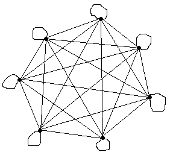

**在完全图 $K_7$ 中找一条欧拉回路**，每个顶点度数为 6（偶数），所以一定可以做到。

**例如**：

`0|0`, `0|1`, `1|1`, `1|2`, `2|2`, `2|3`, `3|3`, `3|4`, `4|4`, `4|5`, `5|5`, `5|6`, `6|6`, `6|0`, `0|2`, `2|4`, `4|6`, `6|1`, `1|3`, `3|5`, `5|0`, `0|3`, `3|6`, `6|2`, `2|5`, `5|1`, `1|4`, `4|0`

---

### ✅8.27

> **欧拉图和哈密顿图的判断条件**：
> **定理8.14**：$G$是连通图，则$G$是欧拉图当且仅当$G$的所有顶点都是偶顶点。
> **定理8.19（必要条件）**：若图$G$是哈密顿图，则对于顶点集$V$的每一个非空真子集$S$，$\omega(G-S) \leq |S|$均成立，其中$|S|$表示$S$中的顶点数，$G-S$表示$G$中删去顶点子集$S$后得到的图。
> **定理8.20（充分条件）**：若$G$是$n(\geq 3)$个顶点的简单图，对于每一对不相邻的顶点$u, v$，$d(u)+d(v) \geq n$成立，则$G$是哈密顿图。

#### (1) 完全图 $K_n$ 是欧拉图吗？是哈密顿图吗？

每顶点度 $=n-1$。欧拉图当且仅当**每个顶点度数为偶且连通**，于是 $K_n$ 为欧拉图当且仅当 $n-1$ 为偶，即 $n$ 为奇（并且 $n\ge3$）。

对于哈密顿性，完全图 $K_n$（$n\ge3$）显然含 Hamilton 回路（任选顶点顺序构成圈），故 $K_n$ 为哈密顿图（当 $n\ge3$）。
或：利用**定理8.20充分条件**， $n\geq3$时 $\forall$不相邻$v_1,v_2$：$d(v_1)+d(v_2)=2n-2\geq n$  $\therefore K_n$是哈密顿图.

#### (2) 完全二分图是欧拉图吗？是哈密顿图吗？

对完全二分图 $K_{m,n}$：每一侧的顶点度分别为 $n$ 与 $m$。

欧拉图需每个顶点度数为偶且图连通，因此 **$K_{m,n}$ 为欧拉图当且仅当 $m$ 与 $n$ 都为偶数**。

哈密顿性：**$K_{m,n}$（$m\le n$）有 Hamilton 回路的充分必要条件为 $m=n\ge2$**。

**$m\geq2,n=1$时**，去掉$V_m$中任一个点$v$,  $\therefore w(G-\{v\})=2>1$  $\therefore K_{m,1}$不是哈密顿图.

**$m=n\geq2$时**，利用**定理8.20充分条件**，$m+n>3$，$\forall$不相邻$v_1,v_2$
$1^\circ$若$v_1,v_2$同属一个划分：$d(v_1)+d(v_2)=2n\geq m+n$
$2^\circ$若$v_1,v_2$分属不同划分：$d(v_1)+d(v_2)=m+n\geq m+n$，$\implies K_{m,n}$是哈密顿图

**$m\neq n, m\geq2,n\geq2$时**，利用**定理8.19必要条件**，不妨$m>n$.
去掉二分图其中一个顶点划分集合 $V_n$，则得$m$个孤立点，$w(G-V_n)=m>n$  $\therefore K_{m,n}$不是哈密顿图.

综上：$K_{n,n}$ 是哈密顿图.

##### 另一描述方式：
###### 二部图 Hamilton 回路的必要条件

- $K_{m,n}$ 是二部图，顶点划分为两个集合 $X$ 和 $Y$，其中 $|X| = m$，$|Y| = n$，$m \le n$。
- Hamilton 回路必须经过所有顶点一次并回到起点，因此它会在 $X$ 和 $Y$ 之间交替访问。
- 因为起点和终点相同，回路中访问 $X$ 的次数必须等于访问 $Y$ 的次数。
- 所以 $|X| = |Y|$，即 $m = n$。
###### $m = n \ge 2$ 时 Hamilton 回路的存在性

  - 设 $X = \{x_1, \dots, x_m\}$，$Y = \{y_1, \dots, y_m\}$。
  - 回路：$x_1 \to y_1 \to x_2 \to y_2 \to \dots \to x_m \to y_m \to x_1$（或类似交替路径）。
  - 因为 $m \ge 2$，$K_{m,m}$ 是完全二部图，上述相邻顶点之间都有边，所以这是一个 Hamilton 回路。
###### $m=1$ 的情况

- $K_{1,n}$ 是星形图，从唯一 $X$ 中的顶点出发，必须两次访问该顶点才能回到起点，但 Hamilton 回路不允许重复顶点（除了起点=终点），所以不可能有 Hamilton 回路。

**结论**：$m=n\ge2$ 是 $K_{m,n}$ 有 Hamilton 回路的充要条件。

---

### ✅8.28

#### (1) 给出一个图既是欧拉图又是哈密顿图的例子。

**简单圈 $C_n$**（$n\ge3$）既是欧拉图（每顶点度为2）又是哈密顿图（自身即哈密顿圈）。
或：顶点数为奇数的完全图，例如 $K_3$。

#### (2) 给出一个图是欧拉图，但不是哈密顿图的例子。

取两个长度至少 3 的简单圈 $C_a,C_b$ 在同一顶点处相交（“8字形”），共有公共顶点但边集互不重叠。

此图连通且每顶点度为偶（交点度为4，其他为2），所以为欧拉图；但该图有割点（交点），任何哈密顿圈若要经两圈的全部顶点，必须重复经过割点两次，违背简单圈不重复顶点要求，因此不存在哈密顿圈，故非哈密顿。

或： $K_{4,2}.$

#### (3) 给出一个图是哈密顿图，但不是欧拉图的例子。

**$K_4$** 包含 Hamilton 回路，但每顶点度为3（奇），不满足欧拉图“每个顶点度数为偶”的充要条件，因此不是欧拉图。

或： $K_{3,3}.$

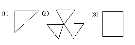

---

### 8.29 对于任何一个具有 6 个节点的简单图，要么它包含一个三角形，要么它的补图包含一个三角形。

> 任意 6 个人，一定有 3 个人互相认识或相互不认识。
> 这正是 Ramsey 数 $R(3,3)=6$ 的具体陈述。

任取一顶点 $v$。它与其他 5 个顶点相连或不连的边共有5条，于是 $v$ 在 $G$ 中的度 $d(v)$ 至少 3 或最多 2。

- 若 $d(v)\ge3$，在 $v$ 的某三个邻居中若存在一对相邻，则该对与 $v$ 形成三角形，完成。若那三个邻居互不相邻，则在补图中它们互相相连，形成补图中的三角形。

- 若 $d(v)\le2$，则在补图中 $v$ 的度至少 $3$，按刚才同样的论证（把 $G$ 与 $\overline G$ 互换）得到补图含三角形。

因此结论成立。

---

### 8.30 有 11 个学生打算几天都在一个圆桌上共进晚餐，并且希望每次晚餐时，每个学生两边邻座的人都不相同，按照这样一种要求，他们在一起共进晚餐最多几天？

11 个学生围圆桌就座，每次晚餐的座次对应 $K_{11}$ 上的一个 Hamilton 圈（顺时针邻边为“左右邻居”）。若要求每天每位学生两侧邻座的人都不重复，等价于每天采用的 Hamilton 圈在边集上互不相交（每对邻居只允许出现一次）。于是问题转化为：**把 $K_{11}$ 的边分解成互不相交的 Hamilton 圈**（每天用一圈）。

**对于奇数 $n$，完全图 $K_n$ 的边可以分解为 $\tfrac{n-1}{2}$ 条 Hamilton 圈**（Walecki 构造或 1-factorization 推出）。因此对 $n=11$ 可分解为 $\tfrac{11-1}{2}=5$ 条 Hamilton 圈，故最多可安排 **5 天**，且可以构造出具体的 5 个互不相交的座次循环。并且不能超过 5，因为 $K_{11}$ 的边数为 $55$，每个 Hamilton 圈用 11 条边，最多用 $55/11=5$ 圈。

一个常用的构造方法是 **旋转法**（Walecki 构造）。

- 将 $n$ 个顶点放在一个正 $n$ 边形的顶点上，标为 $0, 1, 2, \dots, n-1$。
- 先构造一个 Hamilton 圈 $C_0$：$$
  0 \to 1 \to (n-1) \to 2 \to (n-2) \to 3 \to (n-3) \to \dots \to \frac{n-1}{2} \to 0
  $$  这种“绕中间跳”的模式可以保证是一个 Hamilton 圈，这些边的长度分别是：$1, 2, 3, \dots, \frac{n-1}{2}$。
- 然后**旋转**这个圈：将每个顶点 $v$ 替换为 $v+k \pmod{n}$（$k=1,2,\dots,\frac{n-1}{2}-1$），就得到不同的 Hamilton 圈 $C_k$。
- 总边数：$\binom{n}{2} = \frac{n(n-1)}{2}$
- 每个 Hamilton 圈有 $n$ 条边。
- 若分解为 $t$ 个边不交的 Hamilton 圈，则 $t \cdot n = \frac{n(n-1)}{2} \implies t = \frac{n-1}{2}$。

旋转构造时，每个无向边 $\{i,j\}$ 恰好出现在某一个圈 $C_k$ 中，因为差 $j-i \pmod{n}$（取较小差，即 $\min(d, n-d)$）唯一确定了它在哪个圈里。

$n=11$ 时分解为 5 个 Hamilton 圈的顶点序列（旋转法）：

**C₀**:  
$$0 \to 1 \to 10 \to 2 \to 9 \to 3 \to 8 \to 4 \to 7 \to 5 \to 6 \to 0$$

**C₁**（C₀ 各顶点 +1 mod 11）:  
$$1 \to 2 \to 0 \to 3 \to 10 \to 4 \to 9 \to 5 \to 8 \to 6 \to 7 \to 1$$

**C₂**（C₀ 各顶点 +2 mod 11）:  
$$2 \to 3 \to 1 \to 4 \to 0 \to 5 \to 10 \to 6 \to 9 \to 7 \to 8 \to 2$$

**C₃**（C₀ 各顶点 +3 mod 11）:  
$$3 \to 4 \to 2 \to 5 \to 1 \to 6 \to 0 \to 7 \to 10 \to 8 \to 9 \to 3$$

**C₄**（C₀ 各顶点 +4 mod 11）:  
$$4 \to 5 \to 3 \to 6 \to 2 \to 7 \to 1 \to 8 \to 0 \to 9 \to 10 \to 4$$

---

### 8.31 举例说明定理 8.20 和定理 8.21 的条件不是必要的。

#### 定理8.20（充分条件）：若 $G$ 是 $n(\geq 3)$ 个顶点的简单图，对于每一对不相邻的顶点 $u, v$，$d(u)+d(v) \geq n$ 成立，则 $G$ 是哈密顿图。

取 $C_5$（5-环）。它显然是哈密顿的（自身即为哈密顿圈），但对任意一对不相邻顶点 $u,v$ 有 $d(u)=d(v)=2$，所以 $d(u)+d(v)=4<5=n$。

#### 定理8.21：若 $G$ 是 $n$ 个顶点的简单图，对于每一对不相邻的顶点 $u, v$，满足 $d(u)+d(v) \geq n-1$，则 $G$ 是半哈密顿图。

仍以 $C_5$ 为例，它是半哈密顿（实际上哈密顿），但不满足 $d(u)+d(v)\ge n-1$ 的限制（同上），所以定理 8.21 给出的下界也不是必要条件。

---

### 8.32 证明彼得森图是半哈密顿图，但不是哈密顿图；但如果任意删去一个顶点及其关联边就是哈密顿图。

<!-- ？？？
#### **彼得森图结构**

- 外五边形 $G_2$：顶点 $1,2,3,4,5$，边 $1-2,\ 2-3,\ 3-4,\ 4-5,\ 5-1$。  
- 内五角星 $G_1$：顶点 $6,7,8,9,10$，边 $6-8,\ 8-10,\ 10-7,\ 7-9,\ 9-6$。  
- 桥为：$1-9,\quad 2-8,\quad 3-7,\quad 4-6,\quad 5-10$。

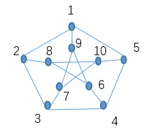

#### **证明没有哈密顿回路**

##### **桥的次数**

哈密顿回路是一个**圈**，每次从一个部分到另一个部分必须经过桥，并且最终要回到起点。
- 每次“进入”内部 $G_1$，必须用一条桥（从外到内）。
- 每次“离开”内部 $G_1$，必须用一条桥（从内到外）。
- 因为起点和终点都在外部 $G_2$（假设我们从外顶点出发，不失一般性，因为对称），**进入内部的次数 = 离开内部的次数**。

所以**使用的桥的总数为偶数**。

##### **情况 1：经过 $2$ 次桥**
结构：
$$
G_2 \text{（含 5 个外顶点）} \xrightarrow{\text{桥}} G_1 \text{（含 5 个内顶点）} \xrightarrow{\text{桥}} \text{回到 } G_2
$$

外部各点 $1,2,3,4,5$ 无论从哪一点出发都是等价的，假设从 $1$ 出发，$\langle 1,2 \rangle$ 作为第一条边，则最后一个结点要么是 $5$，要么是 $9$ 才能构成回路。

从 $G_1$ 中任意一个点开始经过所有内部点的路中，路径长度 4（5 个顶点），起始点与终止点都是不相邻的（这里的不相邻不是边的不相邻而是标号和位置上的不相邻）。

###### **(1) 若最后一个结点是 9**

需要先经过所有外部点后再进来，则要经过的两个桥是 $\langle 9,1 \rangle$ 和 $\langle 5,10 \rangle$。  

从 $10$ 开始要想遍历内部所有点，则终止点要么是 $8$ 要么是 $7$（因为它们与 $10$ 不相邻），而回不到 $9$。所以这种情况没有哈密尔顿回路。

###### **(2) 若最后一个结点是 5**

由对称性，与前一种情况等价，没有哈密尔顿回路。

##### **情况 2：经过 $4$ 次桥**

结构：回路交替经过 $G_2$ 与 $G_1$ 各 3 段路径，其中 $G_1$ 内两段路径分别含 3 个和 2 个内顶点。

同样要考虑最后结点是 $9$ 和 $5$ 两种情况。

###### **(1) 若最后一个结点是 9**

则有 4 个内部点需要在 $9$ 之前经过。第一次过桥后，经过内部点只能是 2 个。第一次过桥后显然不可能只经过 1 个内部点。若为 3 个点，则到达的外部点必定是已经经过的或是这三个点中有 $9$。

因为在第一次过桥后经过内部点是 2 个，则这两个内部点是位置上不相邻，则这两个点对应的外部点也不相邻。

$9$ 作为最后一个结点，其倒数第二个结点必定是 $6$ 或 $7$：
- 若是 $6$，则第三个桥要么是 $\langle 2,8 \rangle$，要么是 $\langle 6,4 \rangle$：
  - 前者不可能因为结点 $2$ 在第一条边 $\langle 1,2 \rangle$ 已经用过
  - 若是后者，$4$ 是外部结点最后一个顶点，则都不存在哈密尔顿回路

###### **(2) 若最后一个结点是 5**
则也与前面情况等价。

不失一般性，从外顶点 $1$ 出发，边 $1-2$。  
设最后一个顶点是 $9$（对应外 1 的桥），则倒数第二顶点是 6 或 7（与 9 在 $G_1$ 中相邻）。

###### **子情况 1：倒数第二顶点是 6**
则回路末尾：$\dots \to 6 \to 9 \to 1$。  
顶点 6 对应外顶点 4，所以进入 6 的桥来自外顶点 4。  
外顶点 4 在外圈的邻点是 3 和 5。  
若 4 与 1 相邻？不，1 与 4 在外圈不相邻，所以 4 到 1 不能直接在外圈走（因为 1 与 9 连接，9 与 6 连接，6 与 4 连接，形成 4-6-9-1 在回路上，则外圈上 4 到 1 必须经过 3 和 2 或经过 5，但 2 在第一步已用，矛盾出现）。  
更直接：若 4 在回路上要连接到 6（桥），则 4 在外圈的前一个顶点必须是 3 或 5，但 1 与 4 之间在外圈必须经过 5 或 3 和 2，而 2 已用，所以只能 1-5-4，但 5 对应内顶点 10，要进入 $G_1$ 必须用桥 5-10，这样内顶点 10 必须在某段路径中，但最后一段 $G_1$ 路径是 $6 \to 9$，不含 10，所以 10 必须在第一段 $G_1$ 路径中，但第一段 $G_1$ 路径含 3 个内顶点，包括 10、x、y，且起点或终点必须与 2 或 5 相邻（桥），这会破坏结构。  
实际上枚举会矛盾。

###### **子情况 2：倒数第二顶点是 7**
7 对应外顶点 3，则末尾：$\dots \to 7 \to 9 \to 1$。  
外顶点 3 的邻点是 2 和 4，但 2 已用，所以 3 必须与 4 相邻，但 4 对应内顶点 6，要进入 7 必须从 3 经桥 3-7，则 3 在外圈的前一个顶点是 4，4 对应内顶点 6，那么 4 到 3 在外圈边已用，但 4 与 3 相邻是外圈边，可以，但这样 4 必须与 6 相连（桥），则 6 在 $G_1$ 中与 7 相邻？不，6 与 7 在 $G_1$ 中不相邻（6 邻 8,9；7 邻 9,10），所以 $G_1$ 中路径 6 到 7 必须经过 8,10 或 9，但 9 是最后顶点，不可能。矛盾。

因此 **4 次桥** 也不可能。

---

#### **4. 结论**
所有可能的桥次数均导致矛盾，所以 **此版本的彼得森图也没有哈密顿回路**。 -->

---

### ✅8.33 若图 $G$ 中任意两点均存在一条哈密顿路相连，则称 $G$ 是哈密顿连通的。试证明：若 $G$ 是哈密顿连通的，且 $n \geq 4$，则边数 $e$ 满足 $e \geq \lfloor (3n+1)/2 \rfloor$。

要证 $e \ge \left\lceil \frac{3n+1}{2} \right\rceil \iff e \ge \frac{3n}{2} \iff 2e \ge 3n \iff \sum d(v) \ge 3n$
考虑证 **$\forall v: d(v) \ge 3$**：

① $\because G$ 连通，$\therefore \forall v: d(v) \neq 0.$

② 若 $\exists v: d(v)=1$，则 $v$ 必在路的端点处。则任取 $v_1 \neq v_2$，$v_1$ 到 $v_2$ 的路中没有 $v$，与 $G$ 是哈密顿连通矛盾。$\therefore \forall v: d(v) \neq 1.$

③ 若 $\exists v: d(v)=2$，$\quad \cdots \underset{v_1}{\circ} — \underset{v}{\circ} — \underset{v_2}{\circ}\cdots\quad$ 此时 $v_1$ 到 $v_2$ 的路中没有 $v$，或者有 $v$ 但没有其他顶点，均与 $G$ 是哈密顿连通矛盾。

$\therefore \forall v: d(v) \ge 3$，$\therefore \sum d(v) \ge 3n$。

<!-- ？？？-->
##### 另一证法：
###### 哈密顿连通 ⇒ 最小度条件

**引理**：若 $G$ 是哈密顿连通的，则 $\delta(G) \ge \frac{n+1}{2}$。
（标准论证是 Bondy–Chvátal 的哈密顿连通条件下的度条件和 Ore 型条件：若 $d(v)+d(u) \ge n+1$ 对所有非邻点 $u,v$ 成立，则 $G$ 是哈密顿连通的。）

**证明**： 取顶点 $v$，设 $d(v) = k$。要证 $k \ge \frac{n+1}{2}$。  

**反证**：若 $k \le \frac{n}{2}$，除了 $v$ 外有 $n-1$ 个其他顶点，其中 $k$ 个邻点，则 $v$ 有 $n-1-k \ge n-1 - \frac{n}{2} = \frac{n}{2}-1$ 个非邻点。

取一个非邻点 $u$，由哈密顿连通性，存在 $v-u$ 哈密顿路 $P$。  

设 $P: v = v_1, v_2, \dots, v_n = u$。若 $v$ 与 $v_i$ 相邻，则 $v_{i-1}$ 不能与 $u$ 相邻，否则可构造哈密顿回路再调整得到 $v-u$ 哈密顿路。对任意非邻点 $u,v$ 有 $d(v)+d(u) \ge n+1$。

###### 利用度和下界
$$
\sum_{v \in V} d(v) \ge n \cdot \frac{n+1}{2}.
$$
所以：
$$
2e \ge n \cdot \frac{n+1}{2} \quad\Rightarrow\quad e \ge \frac{n(n+1)}{4}.
$$
但我们要的是 $e \ge \lfloor \frac{3n+1}{2} \rfloor$，当 $n \ge 4$ 时，比较 $\frac{n(n+1)}{4}$ 和 $\frac{3n+1}{2}$ 的大小：
$$
\frac{n(n+1)}{4} - \frac{3n+1}{2} = \frac{n^2+n - 6n - 2}{4} = \frac{n^2 - 5n - 2}{4}.
$$
当 $n \ge 6$ 时，$n^2-5n-2 > 0$，所以 $\frac{n(n+1)}{4} \ge \frac{3n+1}{2}$ 对 $n\ge 6$ 成立。  
但 $n=4,5$ 要单独检查是否满足 $e \ge \lfloor (3n+1)/2 \rfloor$。
###### 证明思路（用更精细的度论证）

由 $\delta \ge (n+1)/2$，若 $n$ 奇数，$\delta \ge (n+1)/2$；若 $n$ 偶数，$\delta \ge n/2+1$。  
所以：
$$
2e \ge n \cdot \frac{n+1}{2} \ \text{（n 奇）}, \quad 2e \ge n\cdot\left(\frac{n}{2}+1\right) = \frac{n^2}{2}+n \ \text{（n 偶）}.
$$
- $n$ 奇：$e \ge n(n+1)/4$，与 $\lceil (3n+1)/2 \rceil$ 比较：  
  设 $n=2m+1$，则 $n(n+1)/4 = (2m+1)(m+1)/2$，而 $(3n+1)/2 = (6m+4)/2=3m+2$。  
  计算差：$(2m+1)(m+1)/2 - (3m+2) = \frac{2m^2+3m+1 - 6m - 4}{2} = \frac{2m^2 - 3m - 3}{2}$，对 $m\ge 2$（即 $n\ge 5$）为正。$n=3$ 不满足 $n\ge 4$。
- $n$ 偶：设 $n=2m$，则 $e \ge m^2+m$，而 $(3n+1)/2 = (6m+1)/2 = 3m+0.5$，差 $m^2+m - (3m+0.5) = m^2 - 2m - 0.5$，对 $m\ge 2$（即 $n\ge 4$）为正。

---

### 8.34 证明：若 $G$ 是半哈密顿图，则对于 $V$ 的每一个真子集 $S$ 有 $\omega(G-S) \leq |S|+1$。

设 $G$ 是半哈密顿图，即 $G$ 中存在一条经过所有顶点的哈密顿路。记这条哈密顿路为
$$
P=v_1v_2\cdots v_n .
$$
从图中删去顶点集 $S$，等价于从路径 $P$ 中删去这些顶点。

沿着路径 $P$ 从左到右排列顶点。每删去一个顶点，最多在路径上“切断”一次，使连通分支数增加 1。若删去 $|S|$ 个顶点，则路径 $P$ 在剩余顶点上至多被切成 $|S|+1$ 段。

而这些剩余顶点诱导出的子图 $G-S$ 的连通分支数不可能超过由这条路径产生的分支数，因此
$$
\omega(G-S)\le |S|+1 .
$$

---

### 8.35 （定理8.21）设 $G$ 是 $n$ 个顶点的简单图，对于每一对不相邻的顶点 $u, v$，$d(u)+d(v) \geq n-1$，证明：若 $G$ 是半哈密顿图。

增加一个顶点 $u$ 与 $G$ 中每个顶点相连，得 $G'=G+u$ 有$n+1$个顶点，原来的每个顶点度数 $+1$，则 $d'(u)+d'(v)=d(u)+d(v)+2\ge n+1$，满足**定理8.20**条件，因此有哈密顿回路，去掉 $u$ 得到哈密顿路。 

---

### 8.36

#### (1) 给出 $n$-立方的递归定义。

设 $G_n$ 为 $n$-立方，则$$M_{G_n} = \begin{bmatrix} M_{G_{n-1}} & I \\ I & M_{G_{n-1}} \end{bmatrix}$$
##### 递归定义的严格表述：

用图序列 $\{G_n\}_{n\ge 1}$ 来定义 $n$-立方。

**基础（Basis）**：当 $n=1$ 时，定义 $G_1$ 为只有两个顶点、且这两个顶点之间有一条边的简单图，即
$$
G_1 = K_2.
$$

**递归规则（Inductive step）**：设 $n\ge 2$，且 $G_{n-1}$ 已经定义。
取两份互不相交、且同构于 $G_{n-1}$ 的图，记为
$$
G_{n-1}^{(0)},\quad G_{n-1}^{(1)}.
$$
在这两份图中，对每一对对应的顶点 $v^{(0)}\in V(G_{n-1}^{(0)})$ 与 $v^{(1)}\in V(G_{n-1}^{(1)})$，添加一条边 $v^{(0)}v^{(1)}$。
所得图定义为 $G_n$，称为 $(n)$-立方。

**闭合性（Closure）**：$(n)$-立方被定义为通过上述基础和递归规则所能得到的全部图 $G_n$，且不存在其他图属于该定义范围。

这一定义等价于：$n$-立方的顶点为所有长度为 $n$ 的 0–1 串，两顶点相邻当且仅当它们恰好在一个位置上不同。

#### (2) $n$-立方有多少条边？

设 $e_n$ 为 $n$-立方的边数。

由递归定义，$G_n$ 包含两份 $G_{n-1}$，贡献 $2e_{n-1}$ 条边；
此外，两份 $G_{n-1}$ 的对应顶点之间共有 $2^{n-1}$ 条连接边。

因此
$$
e_n = 2e_{n-1}+2^{n-1}.
$$
由 $e_1=1$，可解得
$$
e_n = n\cdot 2^{n-1}.
$$

#### (3) $n \geq 2$ 时 $n$-立方是一个哈密顿图。

用数学归纳法证明。

当 $n=2$ 时，$G_2$ 是一个 4-回路，显然是哈密顿图。

设对某个 $n-1\ge 2$，$G_{n-1}$ 是哈密顿图，从而存在一条哈密顿路。

根据递归定义，$G_n$ 由两个 $G_{n-1}$ 构成。由于两个子图中对应顶点相连，我们可以在第一个 $G_{n-1}$ 中取一条哈密顿路，在第二个 $G_{n-1}$ 中取一条方向相反的哈密顿路，并利用对应顶点之间的连边将两条路首尾相接。

这样便在 $G_n$ 中构造出一条经过所有顶点一次且首尾相连的回路，即哈密顿回路。

因此，对所有 $n\ge 2$，$n$-立方都是哈密顿图。

---

### ✅8.37 若一个图中每一条边能给它定一个方向，使得到的有向图是强连通的，则这个图称为可定向的。

#### (1) 证明任意一个欧拉图是可定向的。

- 欧拉图有欧拉回路。
- 沿着欧拉回路给每条边定向（按回路方向），得到的有向图是强连通的（因为沿回路可从一个顶点到任何顶点）。

#### (2) 证明任意一个哈密顿图是可定向的。

- 哈密顿图有哈密顿回路 $C$。
- 将 $C$ 定向成一个有向环。
- 对于不在 $C$ 上的边，任意定向（比如全部与环的某一方向相同）。
- 因为有向环本身是强连通的，所以整个图强连通。

#### (3) 证明一个连通图是可定向的当且仅当图的每条边至少在一条回路上。

- ⇒：若可定向成强连通图，则对任意边 $uv$（定向为 $u\to v$），存在 $v\to u$ 的有向路径，这两条路径加上 $u\to v$ 边构成有向回路，去掉方向后是原图中的回路包含边 $uv$。
- ⇐：若每条边在某个回路上，可逐步给边定向保持强连通性（经典结论：无桥连通图可定向成强连通图，因为无桥等价于每条边在某个回路上）。

#### 另一证法：

(1)(2) 由(3)直接得到。

(3) 证：
① $G$ 可定向 $\Rightarrow \forall e: e$ 在某回路上。
设 $\exists e$，$e$ 不在任一回路上，不妨给定方向 $\underset{v_0}{\circ} \xrightarrow{e} \underset{v_1}{\circ}$。
$\because G$ 可定向（强连通），$\therefore \exists p=(v_1, e_1, \dots, v_0)$。此时 $(v_0, e, v_1, e_1, \dots, v_0)$ 构成一个回路，矛盾。
$\therefore \forall e: e$ 在某回路上。

② $\forall e: e$ 在某回路上 $\Rightarrow G$ 可定向。
任取 $e \in E$，给定一方向 $\underset{v_0}{\circ} \xrightarrow{e} \underset{v_1}{\circ}$，在其所在回路上均按这一方向相同。
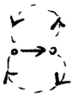
检查回路上的边，若有公共边在**新回路**上继续按此方向相同。
不断重复此步骤直至无公共边。对于只有公共点的回路任意标方向（只要一致）即可。
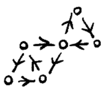
这样，$\forall u, v \in$ 同一回路，强连通是显然的。
$\forall u, v$ 不在同一回路，可通过公共边或公共点连通。

---

### 8.38 设 $x$ 和 $y$ 是有向图 $G$ 中两个顶点，且满足：(1) $d^+(x)-d^-(x)=k=d^-(y)-d^+(y)$； (2) $d^+(v)=d^-(v)$，且 $v \in V-\{x, y\}$ 成立。证明：存在 $k$ 条从 $x$ 到 $y$ 的有向路，使得它们的边集恰好覆盖 $G$ 的全部边，且互不重边。
> 原题目不完整，此处结论由 ChatGPT 推测。

设有向图 $G=(V,E)$ 满足题设条件。我们的目标是证明： $G$ 的全部边可以被分解成 $k$ 条**互不重边**的有向路，且每一条路都从顶点 $x$ 出发，终于顶点 $y$。 为此，考虑对 $G$ 作如下构造。 

在图 $G$ 中**新增 $k$ 条从 $y$ 指向 $x$ 的有向边**，得到新图 $G'$。我们先考察 $G'$ 中各顶点的入度与出度。 对于顶点 $x$，在原图中有 $$ d^+(x)-d^-(x)=k, $$ 加入 $k$ 条从 $y$ 到 $x$ 的边后，$x$ 的入度增加 $k$，于是 $$ d_{G'}^+(x)=d_{G'}^-(x). $$ 同理，对于顶点 $y$，原来有 $$ d^-(y)-d^+(y)=k, $$ 新增的 $k$ 条边使 $y$ 的出度增加 $k$，从而 $$ d_{G'}^+(y)=d_{G'}^-(y). $$ 而对任意其余顶点 $v\in V-\{x,y\}$，题设已给出 $$ d^+(v)=d^-(v), $$ 且在构造中并未改变这些顶点的度数。 因此，在新图 $G'$ 中，每一个顶点都满足 $$ d_{G'}^+(v)=d_{G'}^-(v). $$ 假定 $G$（从而 $G'$）是连通的（若不连通，可对每个强连通分量分别进行同样的论证），根据**有向欧拉图判定定理8.17**，图 $G'$ 存在一条**有向欧拉回路**，记为 $C$。这条回路恰好一次不重复地经过 $G'$ 的每一条边。
> **定理8.17**：$G$是连通有向图，则$G$是欧拉有向图当且仅当$G$的每个顶点$v$，有$d^+(v)=d^-(v)$。

现在从欧拉回路 $C$ 中**删去新加入的那 $k$ 条从 $y$ 到 $x$ 的有向边**。由于欧拉回路在每经过一条新增边 $y\to x$ 时，都会把原来的回路“切开”，删去这 $k$ 条边后，原回路被分解为 **$k$ 条有向路**。注意到： 

* 每一条被分解得到的有向路，都以 $x$ 为起点（因为新增边的终点是 $x$）； 
* 每一条有向路，都以 $y$ 为终点（因为新增边的起点是 $y$）； 
* 这些有向路互不重边； 
* 它们的边集恰好覆盖了原图 $G$ 的全部边。

因此，图 $G$ 的全部边可以被分解成 $k$ 条从 $x$ 到 $y$ 的有向路，且这些路径两两不重边。

---

### ✅8.39 证明：

#### (1) 在会议上大家握手，握过奇次手的人数是偶数。

令人为顶点，握手为边，即证 $G$ 中奇顶点个数为偶数，显然。
#### (2) 空间中不可能有这样的多面体存在，它的面数是奇数，而且每个面是奇数条线段围成的。

令面为顶点，围成面的线段为边，即证奇数个奇顶点不能构成 $G$，显然。

---

### ✅8.40 证明：

#### (1) 马图是哈密顿图。

构造法：
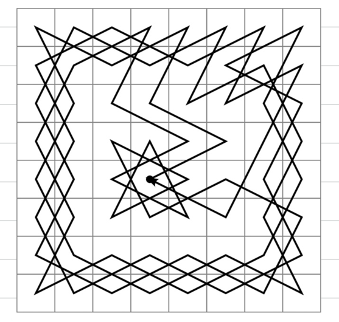

#### (2) $2 \times 2$，$3 \times 3$，$4 \times 4$ 和 $5 \times 5$ 的小棋盘不是哈密顿图。

寻找图中的孤立点，或利用判断哈密顿图的必要条件。

##### $2×2$

四个点都是孤立的，马无法走，显然不是哈密顿图。

##### $3×3$

中间的是孤立点。
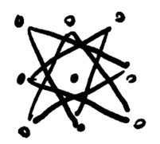
##### $4 × 4$ 和 $5 \times 5$

利用判断哈密顿图的必要条件：
-  $4 × 4$，左上角、左下角的点仅与圈出的两点相邻，删去圈出的两点后产生**至少 3 个**连通分支。
- $5 \times 5$，同理，删去圈出的 4 点后产生**至少 5 个**连通分支。

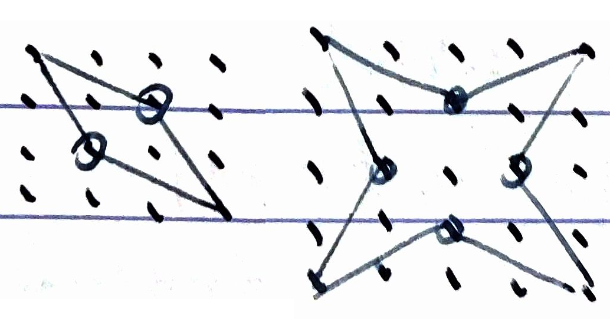

##### $5×5$ 另一证法：

1. **棋盘着色**：将 $5×5$ 棋盘按国际象棋盘方式黑白交替染色，使得相邻格子颜色不同。此时，骑士的移动规则决定了每一步都是从一种颜色的格子跳到另一种颜色的格子。

2. **封闭巡游的性质**：如果存在封闭的骑士巡游，则骑士从起点出发，经过所有25个格子恰好一次并回到起点。该路径包含25次移动（因为共有25个格子，每次移动到达一个新格子，最后一步回到起点，总移动次数等于格子数）。

3. **奇偶矛盾**：由于每一步移动都改变格子颜色，经过奇数次移动后，骑士所在格子的颜色与起点相反；经过偶数次移动后，颜色与起点相同。封闭巡游要求起点和终点相同，因此移动次数必须是偶数。但25是奇数，导致起点和终点颜色不同，与要求矛盾。

因此，$5×5$ 棋盘上不存在封闭的骑士巡游。

---

### ✅8.41 证明：在一个连通图中奇顶点个数为 $2K$ 个，则该图是 $K$ 笔画的。

不妨先去掉所有孤立点。孤立点既不含边，也不影响是否能够一笔画成，因此不会影响所需笔画数。

##### **第一步：证明至多需要 $K$ 笔**

设连通图 $G$ 中共有 $2K$ 个奇顶点。根据**习题 8.25 (2)** 的结论，可将 $G$ 的所有边分解为 $K$ 条两两不共边的链。

简要回顾其构造思想：
将这 $2K$ 个奇顶点两两配对，在每一对之间添加一条边，得到新图 $G'$。
在 $G'$ 中，每个原奇顶点的度数加 1 变为偶数，其余顶点度数保持偶数，因此 $G'$ 是欧拉图。
于是 $G'$ 存在一条欧拉回路。删去新增的 $K$ 条边后，这条欧拉回路被分解为 $K$ 条不重边的链，而它们的边集恰好覆盖 $G$ 的全部边。

因此，$G$ 至多可以用 $K$ 笔画成。

##### **第二步：证明至少需要 $K$ 笔**

假设 $G$ 可以用 $K' < K$ 笔画成。每一笔对应图中的一条链。注意到：
一条链最多只能有两个奇顶点，且只能出现在该链的两个端点处；链的内部顶点度数必为偶数。

因此，$K'$ 条链至多能容纳 $2K'$ 个奇顶点。由于 $K'<K$，有
$$
2K' < 2K,
$$
这与 $G$ 实际具有 $2K$ 个奇顶点相矛盾。

**结论**：综合以上两点，图 $G$ 至少需要 $K$ 笔，且至多需要 $K$ 笔，因此恰好需要 $K$ 笔画成。

##### 🔎 说明

这一定理是欧拉定理的自然推广：

* $K=0$：欧拉回路（1 笔）
* $K=1$：欧拉路（1 笔）
* 一般 $K$：最少笔画数 = 奇顶点数的一半

---