# 第 9 章 平面图与图的着色

## 9.1 平面图与欧拉公式

在现实生活中，常常要画一些图形，希望边与边之间尽量减少相交的情况，例如印刷线路板上的布线，交通道的设计等，由此引出了平面图的概念。

#### 定义9.1（平面图） 

若一个图画在平面上使它的边互不相交（除了在顶点处外），则称该图为**平面图**，或称该图为能嵌入平面的。

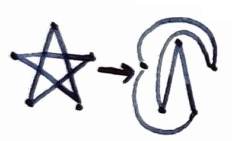

例如，图9.1（a）是平面图G，它能嵌入到平面上，如图9.1（b）所示，记为$\bar{G}$，$\bar{G}$是G的**平面嵌入**。

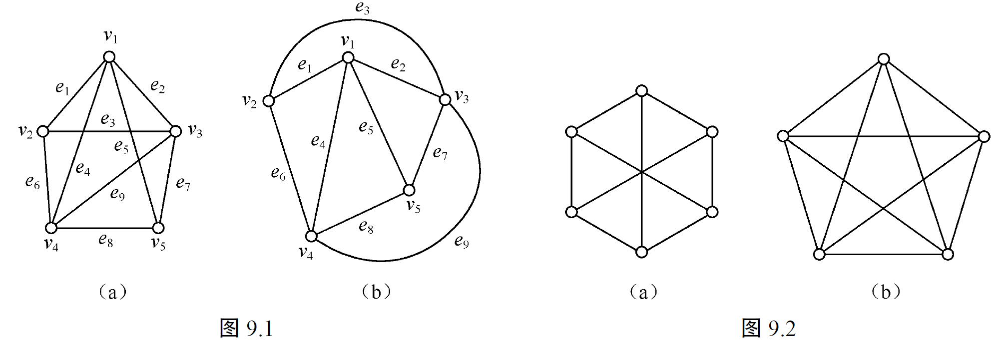

并不是所有的图都是平面图。如图9.2给出的（a）$K_{3,3}$和（b）$K_5$就不是平面图。

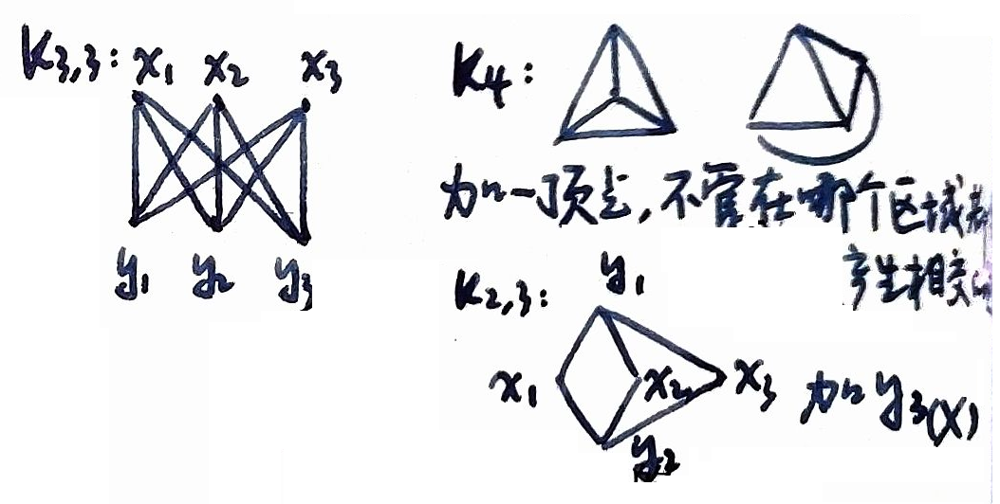

### 欧拉公式

在介绍关于连通平面图的欧拉公式之前，先给出平面图中面的概念。

#### 定义9.2（面/外部面/内部面） 

平面图G嵌入平面后将$\bar{G}$分成若干个连通闭区域，每一个连通闭区域称为G的一个**面**。
其中恰有一个无界的面，称为**外部面**；其余的面称为**内部面**。

图9.3是一个平面图的平面嵌入，它有5个面：$R_0, R_1, R_2, R_3, R_4$，其中$R_0$是外部面，$R_1, R_2, R_3, R_4$是内部面。

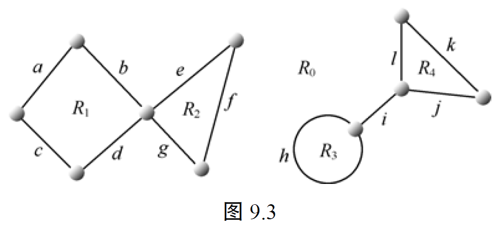

#### 补充概念
##### 割边、割点
- **割边**：去掉这条边后连通分支数+1；
- **割点**：去掉后连通分支数增加（若干）。
##### 面的边界
- 面的边界：闭路径（不一定是回路）。
- 面的边界的长度称为这个面的**度数**，记作$d(f)$。
- 示例：$b(f_1): v_1e_3v_2e_{10}v_3e_{10}v_2e_1v_4e_2v_1$，$d(f_1) = 5$；$d(f_2) = 3$。
##### 面的度数性质
对于$G$的所有面$f$，有
$$ \sum d(f) = 2|E| $$
##### 关联
- 若边在某个面的边界上，则称该面与这条边**关联（相邻）**。
- 示例：$f_1$与$e_2$是关联的；割边关联两个相同的面。

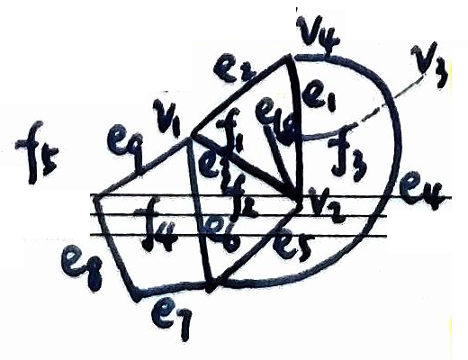

#### ⭐定理9.1（欧拉公式） 

**若连通平面图G有n个顶点，e条边和f个面，则$n-e+f=2$。称该公式为欧拉公式**。

证明：以边数为归纳变量，进行归纳证明。

**归纳基础**：对于一条边的连通平面图，欧拉公式显然成立。
当 $e=1$ 时：
- 若 $G$ 是一条边（顶点数为2），则 $n=2, e=1, f=1$；
- 若 $G$ 是一个环（顶点数为1），则 $n=1, e=1, f=2$。
都有 $n - e + f = 2$。

**归纳步骤**：假设对于任意的 $m-1$ 条边的连通平面图，欧拉公式均成立。现在考察 $m$ 条边的连通平面图$G$，分两种情况。

（1）**若$G$有悬挂点**（度为1的顶点） $v_0$，则删去该顶点及其关联边，便得到连通平面图 $G' = G - v_0$。
若 $G$ 有 $n$ 个顶点，$e$ 条边，$f$ 个面， 
则 $G'$ 有 $n-1$ 个顶点，$e-1$ 条边，$f$ 个面，且 $G'$ 也是连通的平面图。
$G'$满足欧拉公式，$(n-1)-(e-1)+f=2$。
再将删去的点和边加回$G$，得到原图$G$，其顶点数加1，边数加1，而面数不变，所以$G$也满足欧拉公式 $n-e+f=2$。

（2）**若$G$没有悬挂点，即每个顶点度数 $\ge 2$，则 $G$ 一定有一条回路（定理8.10）**，$G$ 的平面嵌入必有一个有界面。删去有界面边界上的任一边，便得到连通平面图 $G' = G-(u,v)$。
$G'$满足欧拉公式，$n-(e-1)+(f-1)=2$。
再将删去的边加回$G'$，得到原图$G$，其面数加1，边数加1，而顶点数不变，所以$G$也满足欧拉公式。$\square$

图9.3是平面图，但不是连通平面图，对于图9.3的每一个连通分支，欧拉公式成立。

若 $G$ 有 $w$ 个连通分支，则对于每个连通分支有 $n_i - e_i + f_i = 2$，$1 \le i \le w$，求和得到 $n - e + f + (w-1) = 2w$，即 $n - e + f = w + 1$。

#### ⭐推论9.1

**若 $G$ 是 $n$ （$n\geq3$）个顶点的平面简单图，则 $e\leq3n-6$**。

证明：只证明连通的平面简单图（没有多重边和自环）的情况，$G$是$n\geq3$的平面简单图，每个面由3条或更多条边围成，每条边至多是两个面的公共边，所以G中至少有$3f/2$条边，即$$3f \le \sum_{f_i为G的面} d(f_i) = 2e$$将 $e\geq3f/2$ 代入欧拉公式 $n - e + f = 2$，有$n-e+2\geq e/3$。所以$3n-6\geq e$。$\square$

#### 推论9.2

**若平面图的每个面由四条或更多条边围成，则 $e\leq2n-4$**。

证明：类似**推论9.1**的证明。
$$4f \le \sum_{f_i为G的面} d(f_i) = 2e$$
即 $f \le \frac{1}{2}e$，代入 $n - e + f = 2$ 得
$$n - e + \frac{1}{2}e \ge 2$$
即 $e \le 2n-4$。$\square$

#### 💡推论9.3

**$K_5$和$K_{3,3}$是非平面图**。

证明：用**反证法**。
若$K_5$是平面图，由**推论9.1**，当$n=5, e=10$时，$3n-6=3\times 5-6=9 < 10=e$ 不可能。所以$K_5$是非平面图。
若$K_{3,3}$是平面图，由**推论9.2**，当$n=6, e=9$时，$2n-4=8<9= e$ 不可能。所以$K_{3,3}$是非平面图。$\square$

#### ⭐定理9.2

**在平面简单图 $G$ 中至少存在一个顶点$v_0$，$d(v_0)\leq5$**。

证明：用**反证法**证明，假设简单平面图所有顶点度数大于5。
由**推论9.1**，$e\leq3n-6$，所以$6n-12\geq2e=\sum_{v\in V}d(v)\geq6n$，导致矛盾。
因此平面简单图中至少存在一个顶点$v_0$，$d(v_0)\leq5$。$\square$

### 平面图的特征

找出一个图是平面图的充分必要条件的研究曾经持续了几十年，直到1930年库拉托斯基（Kuratowski）给出了平面图的一个简洁的特征。下面给出库拉托斯基定理，但由于它的证明过程比较长，这里就不给出。

给定图 $G$ 的一个**剖分**是对 $G$ 实行有限次下述过程而得到的图：删去它的一条边$\{u, v\}$后添加一个新点w以及新的边$\{u, w\}$和$\{w, v\}$。也就是说，在 $G$ 的边上插入有限个点（度数为 $2$）便得到 $G$ 的一个剖分。

> $G$ 是平面图当且仅当 $G$ 的剖分也是平面图，因为不可能有两条边相交在度数为 $2$ 的剖分点上。
> 若 $G$ 是平面图，则 $G$ 的子图一定为平面图。

#### 💡定理9.3（库拉托斯基 Kuratovski 定理）

**图 $G$ 是平面图当且仅当它的任何子图都不是$K_5$和$K_{3,3}$的剖分**。

该定理可用于证明**彼得森图是非平面图**（**习题9.3**）。
彼得森图存在一个子图是 $K_{3,3}$ 的剖分，所以彼得森图不是平面图。

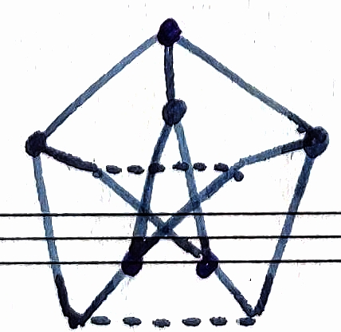

库拉托斯基定理虽然很漂亮，但是在具体判定一个图是不是平面图时，这个定理很难起作用。因此以后仍有许多这方面的研究工作。下面介绍平面图的另一个特征，即它有对偶图。

### 对偶图

#### 定义9.3（几何对偶） 

设$\bar{G}$是平面图$G$的平面嵌入，则G的几何对偶 $G^*$ 构造如下。

（1）在$\bar{G}$的每一个面$f$内恰放唯一的一个顶点$f^*$。

（2）对$\bar{G}$的两个面$f_i,f_j$的公共边$x_k$，作边$x_k^*=\{f_i^*,f_j^*\}$与$x_k$相交；得到的图记为$G^*$，即G的几何对偶（简称G的对偶）。

如图9.4（a）和（b）中G的边用实线表示，G的几何对偶$G^*$的边用虚线表示，这一例题中$\bar{G}$就是G。由定义9.3的过程可知，平面图G的任何两个几何对偶必同构。又**平面图$G_1$与$G_2$同构，但未必$G_1^*$与$G_2^*$同构**，如图9.4(a)和(b)。

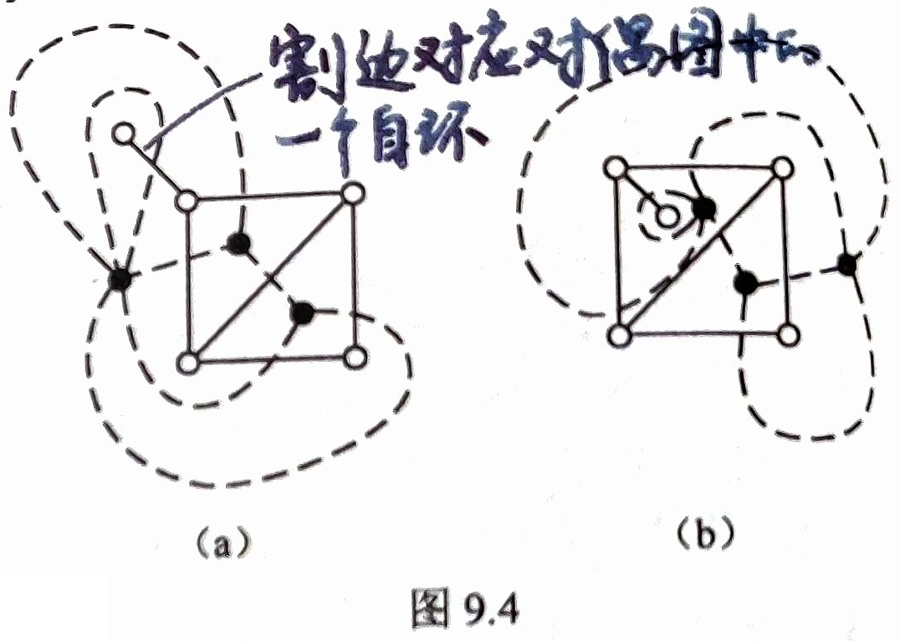

下图说明：
$$G_1 \cong G_2 \nRightarrow G_1^* \cong G_2^*$$
因为 $G_1^*$ 有度数为5的顶点，但 $G_2^*$ 没有，所以 $G_1^*$ 与 $G_2^*$ 不同构。

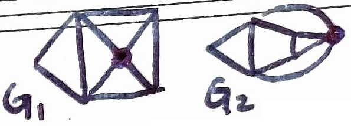

显然$G^*$有多重边当且仅当$\bar{G}$中存在两个面至少有两条公共边。

> 平面图的对偶图也是平面图。

由定义可知，若G是连通平面图，则$G^*$也是连通平面图，而且G和$G^*$的顶点数，面数和边数有下列简单的关系。

#### 😮例 2025

**连通图的对偶图也是连通的**！因为按照几何对偶的定义要求原图是平面图。

#### 定理9.4 

**设$G$是有$n$个顶点，$e$条边，$f$个面的连通平面图；又设$G$的几何对偶$G^*$有$n^*$个顶点，$e^*$条边，$f^*$个面，则$n^*=f, e^*=e, f^*=n$**。

证明：前两个关系式可直接由$G^*$的定义给出，第3个关系式由欧拉公式$n-e+f=2$以及$n^*-e^*+f^*=2$推出。$\square$

若 $f$ 为 $G$ 的面，则 $d(f) = d(f^*)$，其中 $f^*$ 表示对偶图在面 $f$ 上的一个顶点。
$$
\sum_{f为G的面} d(f) = \sum_{f^*为G^*的顶点} d(f^*) = 2|E(G^*)|
$$

#### 定理9.5

**$G$ 是连通平面图当且仅当 $G^{**}$ 同构于 $G$**。

证明留作**习题9.13**。

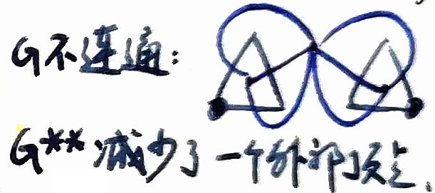

---

## 9.2 顶点着色

在这一节中，我们叙述一般图的顶点着色的概念。

#### 定义9.4（顶点着色） 

设$G$是一个没有自环的图，对$G$的每个顶点着色，使得没有两个相邻的顶点着上相同的颜色，这种着色称为图的**正常着色**。
图$G$的顶点可用$k$种颜色正常着色，称$G$为**k-可着色的**。
使$G$是$k$-可着色的数$k$的最小值称为$G$的**色数**，记为$\chi(G)$。如果$\chi(G)=k$，则称$G$是**k色的**。

> 显然 $k\geq \chi (G)$。

#### 补充概念

##### 色数与边数的关系

若 $\chi(G)=k$，则 $|E(G)| \ge \frac{1}{2}k(k-1)$。

$G$ 有一个正常的 $k$-着色 $(C_1, C_2, \dots, C_k)$，其中 $C_i$ 表示着颜色 $i$ 的顶点组成的集合。
$\forall C_i, C_j$ 之间必有一条边，否则可合并成同一颜色。

##### 临界图的定义

设 $G$ 为图，若对 $G$ 的每个真子图 $H$，均有 $\chi(H) < \chi(G)$，称 $G$ 为**临界图**。
若 $\chi(G)=k$，称 $G$ 为 $k$-临界图。

**若 $G$ 为 $k$-临界图，则 $\delta(G) \ge k-1$**。

证明：若存在 $v_0 \in V$，使得 $d(v_0) \leq k-2$， $\chi(G-v_0) < \chi(G)=k$，$G-v_0$ 是 $k-1$-可着色的，再加上顶点 $v_0$，则 $G$ 也是 $k-1$-可着色的，与 $k$-临界图矛盾。

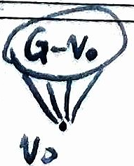

$k$-临界图至少有 $\frac{1}{2}k(k-1)$ 条边，$k$-色图也至少有这么多边。

#### 例9.1（考试安排问题）

某学校有n门选修课程需要进行期末考试，同一个学生不能在同一天里参加两门课程的考试。问：该校的期末考试至少要几天？

解：建立一个图论模型表示这一问题：设该学校有n门选修课$x_1, \cdots, x_n$，构造图$G(V, E)$，$V=\{x_1, \cdots, x_n\}$，$\{x_i, x_j\}\in E$当且仅当$x_i$和$x_j$被同一位学生选修。

考试需要的最少天数等于G的色数$\chi(G)$。$\square$

设G是连通、没有自环的图，如果有多重边，则可删去多重边，用一条边代替，因此下面考虑连通简单图G。

有几类图的色数是很容易决定的。

#### 定理9.6 

**（1）G是零图当且仅当$\chi(G)=1$**。
**（2）对于完全图$K_n$，$\chi(K_n)=n$，而$\chi(\overline{K_n})=1$**。
**（3）对于n个顶点构成的回路$C_n$，当n是偶数时，$\chi(C_n)=2$；当n是奇数时，$\chi(C_n)=3$**。
**（4）G是二分图当且仅当$\chi(G)=2$**。

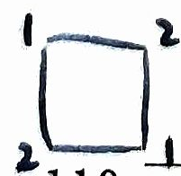

证明可以由定义很容易地给出。

对于顶点数$n\geq3$的图的着色特征至今没有得出，然而我们可以给出其色数上界。

#### 定理9.7

**如果图G的顶点最大度数为$\Delta(G)$，则$\chi(G)\leq1+\Delta(G)$**。

证明：只要证明图G是$1+\Delta(G)$-可着色的。

**证法一**：采用贪心算法，每次用标号最小的颜色进行着色，得到的色数与顶点顺序有关。对于任意一种顶点排序，对于一个顶点，已着色邻点数 $\leq$ 邻点数(即该点度数) $\leq \Delta (G)$。

**证法二**：对G的顶点数采用**归纳法**。当n=2时，G只有一条边，$\Delta(G)=1$，G是2-可着色的。所以$\chi(G)\leq1+\Delta(G)$。假设对于n-1个顶点的图，结论成立。现在设G有n个顶点，顶点的最大度数是$\Delta(G)$，如果删去任意一点v及其相关联的边，得到n-1个顶点的图$G'$，它的最大顶点度数至多是$\Delta(G)$，且$\Delta(G')\leq\Delta(G)$。根据归纳假设，该图是$1+\Delta(G)$-可着色的，再将v及其相关联的边加回该图，得到图G，顶点v的度数至多是$\Delta(G)$，v的相邻顶点最多着上$\Delta(G)$种颜色，然后v着上第$1+\Delta(G)$种颜色。因此，G是$1+\Delta(G)$-可着色的。$\square$

定理9.7的上界是很弱的，例如G是二分图时，$\chi(G)=2$，而$\chi(G)$可以取得相当大。

1941年，布鲁克斯（Brooks）证明：**使$\chi(G)=1+\Delta(G)$的图只有两类：或者是奇回路，或者是完全图**。布鲁克斯定理如下，证明过程需要掌握。

#### 🤯定理9.8（Brooks 定理）

😮 2022 && 2025

**如果连通图G的顶点的最大度数为$\Delta(G)$，G不是奇回路，又不是完全图，则$\chi(G)\leq\Delta(G)$**。

**证明**：设 $k=\Delta(G).$
##### 一、低度数情形的处理

当 $k\le 1$ 时，$G$ 是完全图，属于定理中排除的情形，结论显然成立（虚真）。

当 $k=2$ 时，连通图 $G$ 要么是路径，要么是圈。

* 若为偶圈或路径，则是二分图，有 $\chi(G)=2=\Delta(G)$；
* 若为奇圈，则属于定理中排除的情形。

因此，以下只需考虑 $k\ge 3.$

##### 二、关键思想：构造“良好顶点顺序”

💡**若能对 $G$ 的顶点作一个编号，使得每个顶点至多有 $k-1$ 个编号比它小的邻点，则 $G$ 可以用 $k$ 种颜色着色。**

事实上，按编号从小到大进行贪心着色：当给某个顶点着色时，它的低编号邻点至多使用了 $k-1$ 种颜色，因此一定还有一种颜色可用。

于是问题归结为：**如何构造这样的顶点顺序**。

##### 情形一：$G$ 不是 $k$-正则图

设 $v_n$ 是一个度数小于 $k$ 的顶点。

从 $v_n$ 出发生成 $G$ 的一棵生成树，并在搜索过程中**按广度优先访问顺序逆向编号**：先访问到的顶点编号大，后访问到的编号小。

在该编号方式下：

* 每个非根顶点在生成树中都有一个父节点，其编号比它大；
* 因此每个顶点至少有一个编号更大的邻点；
* 又因为顶点度数不超过 $k$，所以其编号更小的邻点至多为 $k-1$。

由此得到所需的顶点顺序，结论成立。

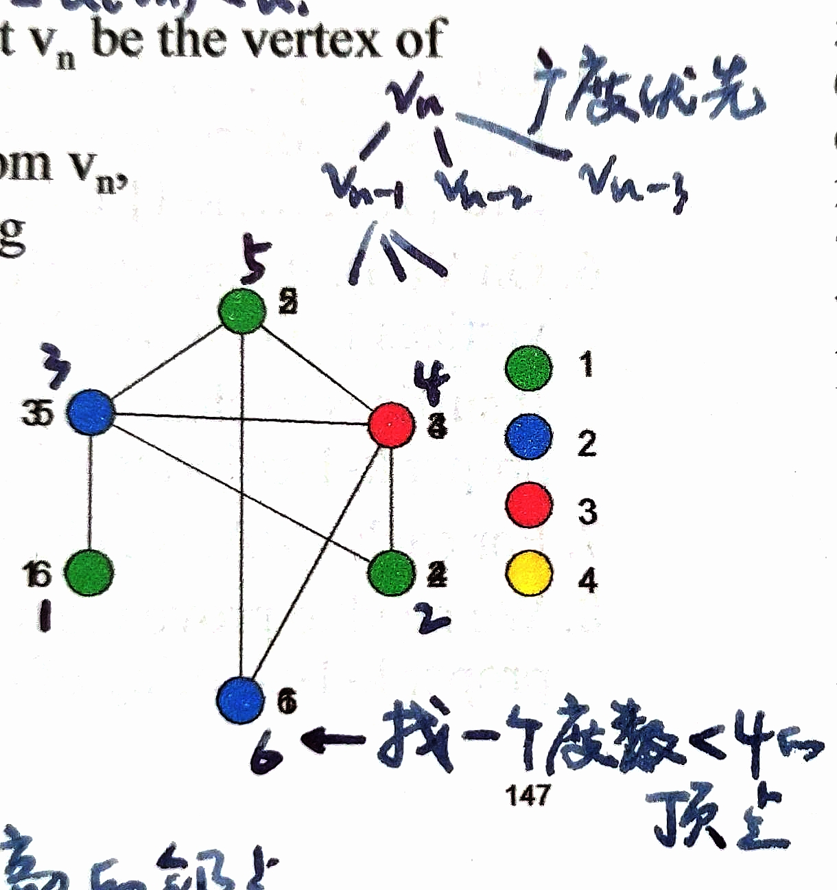

##### 情形二：$G$ 是 $k$-正则图

###### 子情形 2.1：$G$ 有割点

设 $x$ 是 $G$ 的一个割点。
**取 $G-x$ 的一个连通分支 $H$，记 $G'$ 为由 $H$ 及其与 $x$ 相连的边组成的子图**。

在 $G'$ 中，顶点 $x$ 的度数严格小于 $k$，因此可按情形一的方法对 $G'$ 作 $k$-着色。

对 $G-x$ 的其他连通分支重复上述过程，并通过对颜色名称作适当置换，使所有子图中 $x$ 的颜色一致，从而得到 $G$ 的一个合法 $k$-着色。

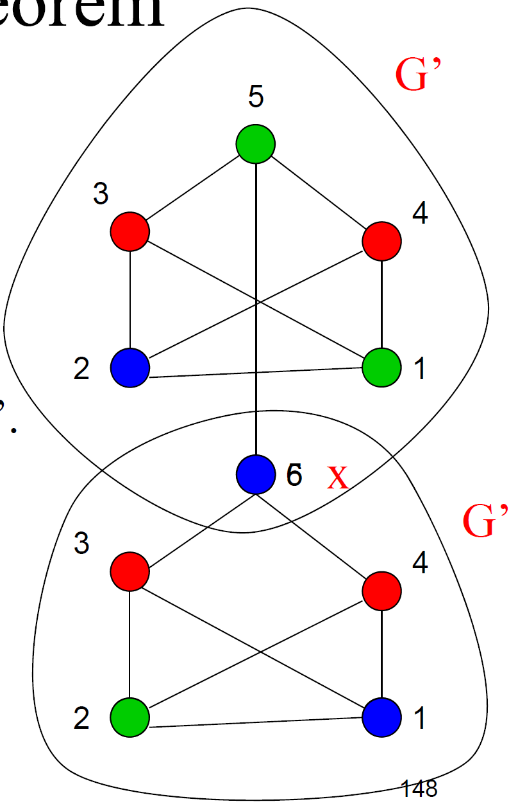

###### 子情形 2.2：$G$ 是 2-连通的

> 2-连通：没有割点的连通图，点连通度 $\kappa(G)\geq 2$，即至少删去两个顶点才能产生一个不连通图或平凡图（**定义11.2**）。

我们先说明一个关键事实：

> **若 $G$ 是一个 2-连通、$k$-正则且 $k\ge 3$ 的非完全图，则存在三个顶点 $v_1,v_2,v_n$，满足：**
> 1. $v_1,v_2$ 都与 $v_n$ 相邻；
> 2. $v_1$ 与 $v_2$ 不相邻；
> 3. $G-\{v_1,v_2\}$ 仍连通。

下面分情况证明该事实。

**(a) $\kappa(G-v_n)\ge 2$**

任取顶点 $x=v_1$，由于连通图 $G$ 不是完全图且是正则图，存在一个距离 $x$ 为 2 的顶点 $v_2$，$v_1,v_2$ 的中间顶点为 $v_n$ 为公共邻点，满足上述条件。
$$v_1 - v_n - v_2$$

**(b) $\kappa(G-v_n)=1$**

此时 $G-v$ 有割点，因此至少存在两个叶块。
由于 $G$ 是 2-连通的，顶点 $v_n$ 必与每个叶块中的某个顶点相邻。
取来自两个不同叶块的邻点 $v_1,v_2$，则：

* $v_1$ 与 $v_2$ 不相邻；
* 去掉 $v_1,v_2$ 后，剩余部分仍连通。

所需三元组 $v_1,v_2,v_n$ 存在。

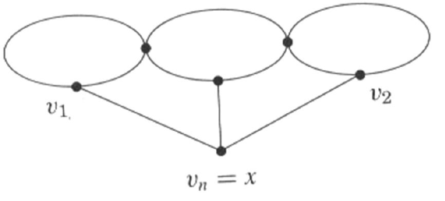

##### 利用三元组完成编号与着色

删去 $v_1,v_2$，在连通图 $G-\{v_1,v_2\}$ 上构造生成树，并按前述方法编号。
最后将 $v_1,v_2$ 编号放在最前，并赋予**相同颜色**。

由于 $v_1,v_2$ 不相邻，且它们的邻点至多使用 $k-1$ 种颜色，因此着色合法。

##### 结论

综上所述，对于任意连通图 $G$，只要它既不是完全图，也不是奇圈，就有
$$
\chi(G)\le \Delta(G).
$$
布鲁克斯定理得证。

#### 😮例 2022

设 $G$ 是非正则图，且是连通图。则 $\chi(G) \leq \Delta(G)$，其中 $\chi(G)$ 为 $G$ 的点色数，$\Delta(G)$ 为 $G$ 的最大度数（要求直接证明，不能用 Brooks 定理来证明，因为这是 Brooks 定理特殊情形）。 （12分）

---

## 9.3 平面图的面着色

本节将介绍地图四色问题并证明平面图的五色定理。

### 地图的四色问题

1852年，英国青年Guthrie在画地图时发现：如果相邻两国着上不同的颜色，那么画任何一张地图只需要四种颜色就够了。这就是地图的四色问题，100多年来，许多数学家的证明都失败了，直到1976年6月美国伊利诺斯大学两位教授阿培尔和哈根使用高速电子计算机，花了1200多个小时证明了地图的四色问题，终于解决了这个难题。然而至今仍有许多数学家用通常证明方法来论证四色问题，尚未得到解决。

地图的着色问题如何转化为图论问题来考虑呢？我们先给出图中桥的概念，然后给出地图的定义。

如果图$G$中的边$e$满足$\omega(G-e)>\omega(G)$，则称e为G的**割边**（或**桥**）。

#### 定义9.5（地图） 

一个没有割边（桥）的连通平面图称为**地图**。

地图可以有自环和多重边。地图中的每一边是两个面的公共边。两个面相邻是指两个面至少有一条公共边（而不是公共点），并且使相邻两个面着上不同的颜色，所以地图是没有桥的。

#### 定义9.6（地图的正常面着色） 

设$G$是一个地图，对$G$的每个面着色，使得没有两个相邻的面着上相同的颜色，这种着色称为地图的**正常面着色**。
地图$G$可用$k$种颜色正常面着色，称$G$是**k-面可着色的**。
使$G$的$k$-面可着色的数$k$的最小值称为$G$的**面色数**，记为$\chi^*(G)$。若$\chi^*(G)=k$，则称$G$是**k面色的**。

因此，地图的四色问题可以叙述为：任何地图是4-面可着色的。

对于一个没有自环的平面图，它的对偶是一个没有桥的连通平面图，即地图。可以证明 **一个没有自环的平面图$G$的顶点着色问题** 等价于 **它的对偶图$G^*$的面着色问题**。

#### 💡定理9.9

**设$G$是没有自环的平面图，$G^*$是$G$的对偶，则$G$是$k$-可着色当且仅当$G^*$是$k$-面可着色**。

证明：$\Rightarrow$设G是没有自环的平面图，G的对偶$G^*$是一个地图。如果G是k-可着色的，则由于$G^*$的每个面恰含G中的一个顶点，把$G^*$的每个面着上它所包含的顶点的颜色。因为G是k-可着色的，G的任何两个相邻的顶点有不同的颜色，所以$G^*$中任何两个相邻的面着上不同的颜色，因此$G^*$是k-面可着色的。

$\Leftarrow G^*$是k-面可着色的，由于G的每个顶点包含在$G^*$的一个面中，并且G的不同顶点包含在$G^*$的不同面上，把G中每个顶点着上它所在面的颜色。因为$G^*$中没有两个相邻面着相同颜色，所以G中没有两个相邻顶点着上相同颜色，因此G是k-可着色的。$\square$

总之，任何没有自环的平面图是4-可着色的等价于任何地图是4-面可着色的。也就是说，“地图的四色问题”可以转化为证明任何平面图的4-可着色的。

#### 补充：六色定理

**任何平面图都是6-可着色的（点着色）**。

> **定理9.2**：在平面简单图 $G$ 中至少存在一个顶点$v_0$，$d(v_0)\leq5$。

设 $G$ 为平面图，且 $G$ 无自环和多重边，即连通简单平面图。
由**定理9.2**，$G$ 中一定存在一个顶点 $v$，使得 $d(v) \le 5$。

对顶点数用归纳法，若删去 $v$ 之后的图 $G-v$ 是6-可着色的，则补上 $v$ 时也一定可以找到六种颜色中的一种对它上色，所以 $G$ 是6-可着色的。

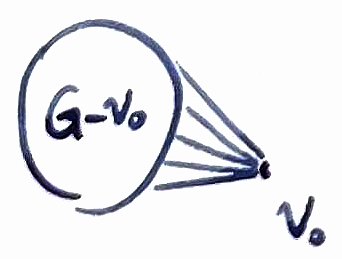

关于“地图的五色问题”早在1890年就由希伍德（Heavood）解决了，把这个问题化为证明平面图是5-可着色的。下面给出它的一个证明。

### 五色定理

#### 💡定理9.10（五色定理）

**任何平面图G是5-可着色的**。

证明：不妨设G是平面简单图。对G的顶点数采用数学归纳法。当$n\leq5$时结论成立。假设n-1个顶点的所有平面简单图G是5-可着色的。考虑n个顶点的平面简单图G，由**定理9.2**，在G中存在顶点$v_0$，使$d(v_0)\leq5$。

由归纳假设，$G-v_0$是5-可着色的，在给定$G-v_0$的一种着色之后，将$v_0$及其关联边加回到原图中，得到G，分两种情况。

（1）**如果$d(v_0)<5$**，则$v_0$的相邻点已着上的颜色小于等于4种，所以$v_0$可以着另一种颜色，使G是5-可着色的。

（2）**如果$d(v_0)=5$**，则将$v_0$的相邻点依次记为$v_1, v_2, \cdots, v_5$，并且对应的$v_i$点着第i色。

设$H_{13}$为$G-v_0$的一个子图，它是**由着色1和着色3的顶点集导出的子图**。

**如果$v_1$和$v_3$属于$H_{13}$的不同分支，将$v_1$所在分支中着色1的顶点和着色3的顶点进行颜色对换**，这时$v_1$着色3，并不影响$G-v_0$的正常着色。然后在$v_0$着色1，因此G是5-可着色的。

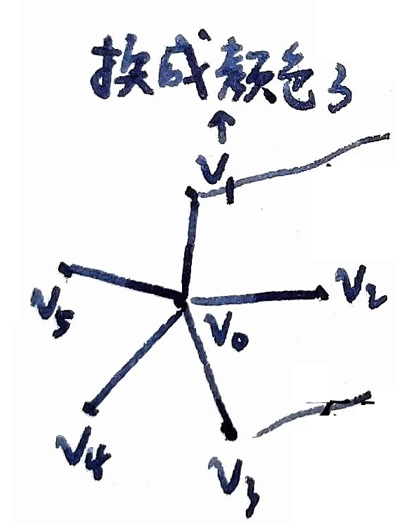

**如果$v_1$和$v_3$属于$H_{13}$的同一分支**，则在G中存在一条从$v_1$到$v_3$的路，那么这条路与$(v_1, v_0, v_3)$一起构成一条回路，并且该回路或者将$v_2$围在里面，或者把$v_4$和$v_5$围在它里面。

因为G是平面图，在任何一种情况下，都不存在连接$v_2$和$v_4$的一条路，否则 $H_{13}$ 和这条路上的某条边会出现交点，与平面图矛盾。

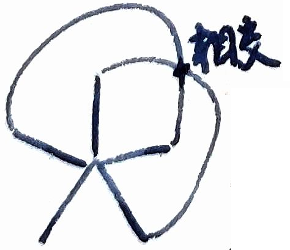

现在设$H_{24}$为$G-v_1$的另一个子图，它是由着色2和色4中的顶点集导出的子图，则$v_2$和$v_4$属于$H_{24}$的不同分支，所以**在$v_2$所在分支中将着色2的顶点和着色4的顶点进行颜色对换**，$v_2$着色4，这样导出了$G-v_0$的另一种正常着色。然后在$v_0$着色2，同样得到G是5-可着色的。$\square$

### 二色定理

#### 定理9.11

**地图$G$是2-面可着色的当且仅当它是一个欧拉图**。

**证明**：
$\Rightarrow$ 设地图G是2-面可着色的，对于G中任意一个顶点$v_i$，围绕顶点$v$的面必为偶数个，于是可推出v是偶顶点，由**定理8.14**，可知G是欧拉图。

> **定理 8.14**：$G$是连通图，则$G$是欧拉图当且仅当$G$的所有顶点都是偶顶点。

$\Leftarrow$设G是欧拉图，则由**定理8.16**可知G可分解成若干个边不相交的回路的并。对图的回路数p采用数学归纳法。当p=1时，G是2-面可着色的。假设回路数为p-1的地图G是2-面可着色的。对于由p条回路构成的地图G，由于G的每个顶点都是偶顶点，在G中删去一条回路，得到图$G'$，$G'$的每个顶点的度数也是偶数。根据归纳假设，$G'$是2-面可着色的。再把删去的回路加回到$G'$中得到G，并且使这条回路外的所有面的颜色保持不变，而回路所围的各面已着两种颜色，将这两种颜色对换，得到G是2-面可着色的。$\square$

---

## 9.4 边的着色

#### 定义9.7（边的着色）

设图$G$是没有自环的，若对G的边着色，使得没有两条相邻的边着上相同的颜色，称此种着色为**正常边着色**。
$G$的边可用$k$种颜色正常边着色称$G$是**k-边可着色**。
使$G$是$k$-边可着色的数$k$的最小值称为$G$的**边色数**，记为$\chi'(G)$。若$\chi'(G)=k$，则称$G$是**k边色的**。

因为任何一个正常边着色中，每一个顶点关联的边着色不同，所以$\chi'(G)\geq\Delta(G)$。若顶点$v$关联的某边上着色$i$，则称$v$点**出现**颜色$i$。

维津（Vizing）于1964年给出了一个重要的定理，指出一个简单图的边色数或者是$\Delta(G)$，或者是$\Delta(G)+1$。定理如下。

#### ⭐定理9.12

**设G是一个简单图，它的顶点最大度数是$\Delta(G)$，则$\chi'(G)=\Delta(G)$或者$\chi'(G)=\Delta(G)+1$**。

证明从略。

定理9.12给出了 **$\chi'(G)$的上界和下界**，即$\Delta(G)\leq\chi'(G)\leq\Delta(G)+1$，但是图G有$\chi'(G)=\Delta(G)$（或$\Delta(G)+1$）的充分必要条件是什么？这个问题至今尚未解决。仅知道某些特殊的图G有$\chi'(G)=\Delta(G)$或者$\chi'(G)=\Delta(G)+1$，例如n个顶点构成的回路$C_n$，$\Delta(G)=2$；当n为偶数时，$\chi'(G)=2$；当n为奇数时，$\chi'(G)=3$。对于二分图G，$\chi'(G)=\Delta(G)$。

#### ⭐定理9.13

**如果G是二分图，则$\chi'(G)=\Delta(G)$**。

**证明**：证明方法类似于**定理9.10（五色定理）**，对边数进行数学归纳。

边数为$1$的二分图$G$中$\Delta(G)=1$，显然$\chi'(G)=\Delta(G)=1$。

假设对任何$e-1$条边的二分图，命题成立。**对于$e$条边的二分图$G$，从$G$中删去任一边$\{u, v\}$，得$G'$**。根据归纳假设$G'$的顶点的最大度数是$\Delta(G')$，$\Delta(G')\leq\Delta(G)$，那么$G'$是$\Delta(G')$-边可着色，显然也是$\Delta(G)$-边可着色，并且在$u$点和$v$点的度数小于$\Delta(G)$，在$u$点至少缺少一种颜色，在$v$点也缺少一种颜色。将边$\{u, v\}$加回得图$G$，这时$G$中边$\{u, v\}$尚未着色。

**如果$u$点和$v$点缺少的颜色相同**，边$\{u, v\}$着上这种颜色。

**如果$u$点和$v$点缺少的颜色不同**，设$u$点缺少色1（有色2），v点缺少色2（有色1），则可以作一个连通子图$H$，它由$v$点出发的色1和色2交替边构成的路。因为$G$是二分图，并且子图$H$不包含$u$（因为不能有色1），所以可在$H$上对换色1和色2，这样并不影响$u$点已经着上的颜色。于是边$\{u, v\}$着上色1。

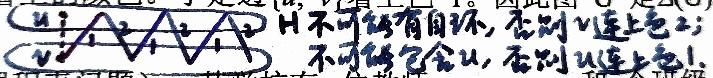

因此图$G$是$\Delta(G)$-边可着色的，并且$\chi'(G)=\Delta(G)$。$\square$

#### 😮补充定理 2022

**设 $\chi'(G) \le k$，则一定存在 $G$ 的一个正常的 $k$-边着色 $(E_1, E_2, \dots, E_k)$，其中 $E_i$ 为着颜色 $i$ 的边组成的集合，使得 $||E_i| - |E_j|| \le 1$（$1 \le i,j \le k$）**。

对于 $G$ 的一个正常的 $k$-边着色 $(E_1, E_2, \dots, E_k)$，
若 $|E_i| > |E_j| + 1$，则 $G(E_i \cup E_j)$ 中必有一个连通分支 $\mu$，$\mu$ 是 $i$ 边与 $j$ 边交替的链，且首尾两条边都是颜色 $i$ 的，否则 $|E_i| \leq |E_j|$。

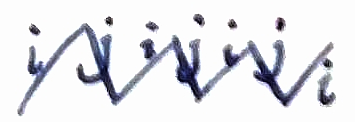

交换颜色 $i$ 和 $j$，则 $|E_i|$ 和 $|E_j|$ 之差可以减少1。

任何一个正常的 $k$-边着色都可以这样不断调整成 $||E_i| - |E_j|| \le 1$，即各种颜色尽可能“均匀”。

#### 例9.2（课程表问题）

某学校有m位教师$x_1, x_2, \cdots, x_m$和n个班级$y_1, y_2, \cdots, y_n$，要求教师$x_i$每周给班级$y_j$上课，问如何安排一张周课程表，使所排课时数目尽可能地少？

解：建立一个图论模型表示这一问题：作二分图$G(V_1, V_2)$，$V_1=\{x_1, x_2, \cdots, x_m\}$，$V_2=\{y_1, y_2, \cdots, y_n\}$，$x_i$与$y_j$有边相连当且仅当教师$x_i$给班级$y_j$上了一个课时的课。

利用边的着色理论来解决这一问题。在任何一个课时，一个教师最多只能给一个班级上课，并且每个班级最多只能由一位教师上课。于是课程表问题对应为二分图G用尽可能少的颜色对边着色，并使相邻边的颜色都不相同。根据定理9.13，如果G的顶点最大度数是$\Delta(G)$，则$\chi'(G)=\Delta(G)$。因此，如果每位教师至多上$\Delta(G)$个课时，并且每个班级至多有$\Delta(G)$个课时，则一定可以安排一张$\Delta(G)$个课时的课程表。在二分图G中，同一颜色的边对应于同一课时中教师安排班级上课的情况。$\square$

对于完全图的边色数，有下面的定理。

#### 定理9.14

**设$K_n$是完全图，当n为奇数并且$n\neq1$时，$\chi'(K_n)=n$，当n为偶数时，$\chi'(K_n)=n-1$**。

证明留作**习题9.18**。

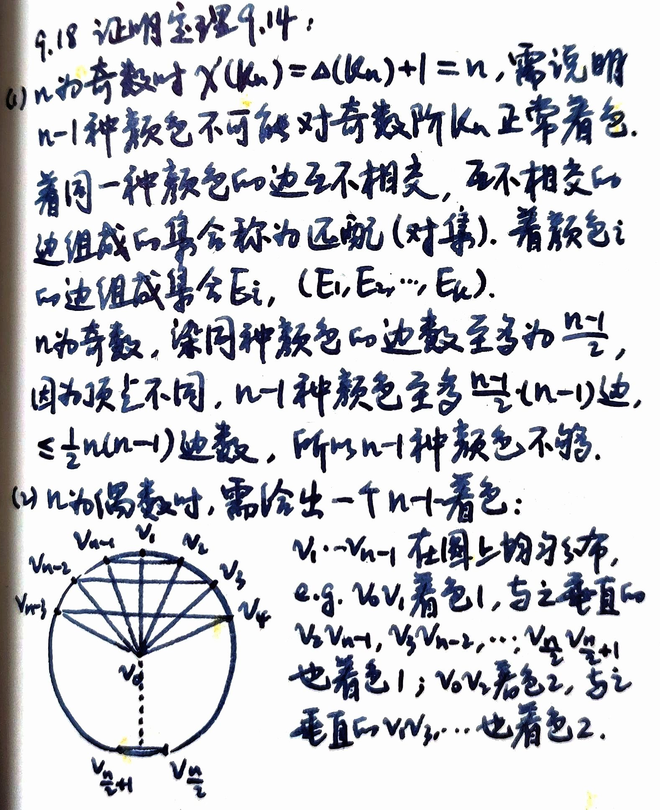

---