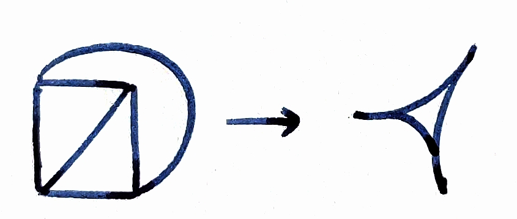
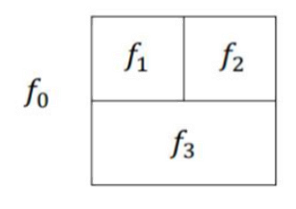
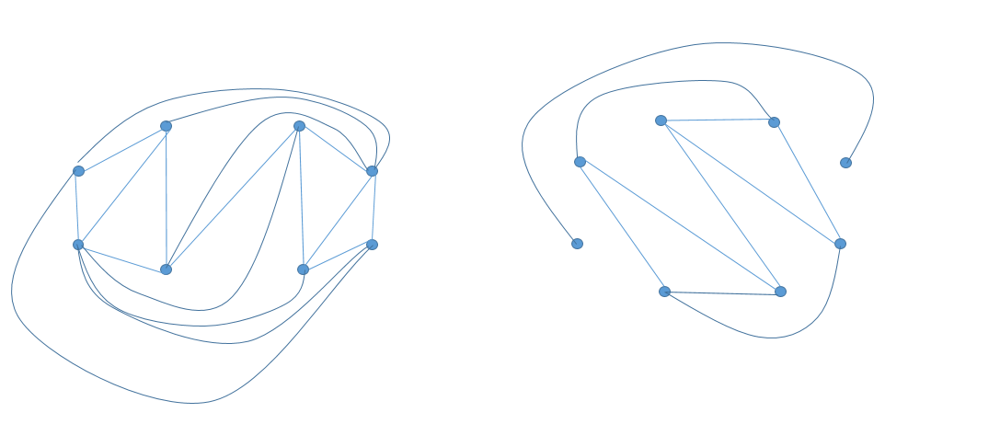

# 第 9 章 平面图与图的着色

## 习题

### 9.1 设 $G$ 是具有 $k(k\geq2)$ 个连通分支的平面图，则 $n-e+f=k+1$，其中 $n,e,f$ 分别是 $G$ 的顶点数，边数和面数。

我们知道对**连通的平面图**有欧拉公式
$$n - e + f = 2.$$
原图 $G$ 有 $k$ 个连通分支，其中 $k\ge2$。

每个连通分支 $C_i$ 都有 $n_i - e_i + f_i = 2$，这些分支共享一个外部面。累加得到
$$
\sum_{i=1}^{k} n_i = n,\quad \sum_{i=1}^{k} e_i = 3,\quad \sum_{i=1}^{k} f_i = f + (k-1).
$$
所以 $n - e + f + (k-1) = 2k$，即 $n - e + f = k + 1$。

---

### ✅9.2 在一个连通平面图中，若它有 $n$ 个顶点，$e$ 条边，每个面至少由 $k(k\geq3)$ 条边围成，证明 $e\leq\frac{k(n-2)}{k-2}$。

设图为连通平面图，面数为 $f$。在平面嵌入中，计算所有面的周长之和时，每条边恰好被两个相邻面计入一次（除非存在自环或重边，但通常我们考虑简单图；若有桥也被两个“同一面”的两侧计两次），因此
$$\sum_{\text{面 }F} \ell(F) = 2e,$$
其中 $\ell(F)$ 表示面 $F$ 的边数（周长，按边数计）。题目给出每个面至少由 $k$ 条边围成，即 $\ell(F)\ge k$ 对所有面成立，于是
$$k f \le \sum_F \ell(F) = 2e,$$
即
$$f \le \frac{2e}{k}. \tag{1}$$
又对**连通平面图欧拉公式**为
$$n - e + f = 2 \quad\Rightarrow\quad f = 2 - n + e. \tag{2}$$
**将 (2) 代入 (1)** 得
$$2 - n + e \le \frac{2e}{k}.$$
整理得到
$$e \le \frac{k(n-2)}{k-2}.$$

---

### ✅9.3 证明彼得森图是非平面图。

彼得森图存在一个子图是 $K_{3,3}$ 的剖分，所以彼得森图不是平面图。

> **定理9.3（库拉托斯基 Kuratovski 定理）**：图 $G$ 是平面图当且仅当它的任何子图都不是$K_5$和$K_{3,3}$的剖分。

另一证法：

由彼得森图的结构可知：

* 顶点数 $n = 10$；
* 边数 $e = 15$；
* 彼得森图是 **无三角形、无四边形** 的图，因此若它是平面图，则**每个面至少由 5 条边围成**。

假设彼得森图是平面图。根据 **9.2 的结论**，当 $k = 5$ 时，有
$$
e \le \frac{5(n-2)}{5-2} = \frac{5 \cdot 8}{3} = \frac{40}{3}.
$$

但彼得森图的实际边数为
$$
e = 15 > \frac{40}{3},
$$
与上述不等式矛盾。因此假设不成立，彼得森图不是平面图。

---

### 9.4 画出所有互不同构的六个顶点的非平面连通图。

<!-- ？？？ -->

---

### ✅9.5 证明：小于30条边的平面简单图中存在度数 $\leq4$ 的顶点。

**反证法**：假设每个顶点的度数都至少为 5，即最小度 $\delta(G)\ge5$。那么对所有顶点度数求和有
$$\sum_{v\in V} d(v) \ge 5n,$$
又 $\sum d(v) = 2e$，故
$$2e \ge 5n \quad\Rightarrow\quad n \le \frac{2e}{5}. \tag{1}$$
另一方面，由**推论9.1**，对简单连通平面图（当 $n\ge3$）有
$$e \le 3n - 6. \tag{2}$$
把 (1) 代入 (2) 得：
$$e \le 3n - 6 \le 3\cdot\frac{2e}{5} - 6 = \frac{6e}{5} - 6.$$
移项得到
$$e - \frac{6e}{5} \le -6 \quad\Rightarrow\quad -\frac{e}{5} \le -6 \quad\Rightarrow\quad e \ge 30.$$
这与假设 $e<30$ 矛盾。因此我们的反设不成立，即图 $G$ 中至少存在一个顶点的度数 $\le 4$。

若 $n<3$ 的退化情形显然成立：若 $n=1$ 或 $2$，都是度数 $\le4$ 的顶点。

---

### 9.6 证明：在有 6 个顶点、12 条边的连通平面简单图中，每个面由 3 条边围成。

设图 $G$ 连通，$n=6,\ e=12$。由欧拉公式，面数
$$f = 2 - n + e = 2 - 6 + 12 = 8.$$
计算所有面的周长之和等于 $2e = 24$。

$$
2e \geq kf \quad \Rightarrow \quad 24 \geq 8k \quad \Rightarrow \quad k \leq 3.
$$
简单平面图无重多边、无自环，面周长至少为 $3$，所以每个面都由恰好 $3$ 条边围成。

---

### ✅9.7 设连通平面图 $G$ 的顶点度数至少为3，且其面数$f<12$，证明 $G$ 有一个面的边数小于5。

#### 反证法思路 1  

反设所有面的边数都 $\ge5$。则可应用**习题9.2**中的结论（对连通图、每个面至少由 $k$ 条边围成，有 $e\le\frac{k(n-2)}{k-2}$）取 $k=5$，得到**边数之和**
$$e \le \frac{5(n-2)}{3}. \tag{A}$$
另一方面由图中每个顶点度数至少为 3 可得**度数之和**
$$\sum_{v} d(v) \ge 3n \quad\Rightarrow\quad 2e \ge 3n \quad\Rightarrow\quad e \ge \frac{3n}{2}. \tag{B}$$
把 (B) 代入 (A)：
$$\frac{3n}{2} \le e \le \frac{5(n-2)}{3}.$$
两边同乘 6 得
$$9n \le 10(n-2) \quad\Rightarrow\quad 9n \le 10n - 20 \quad\Rightarrow\quad n \ge 20.$$
再由**欧拉公式**
$$f = 2 - n + e \ge 2 - n + \frac{3n}{2} = 2 + \frac{n}{2} \ge 2 + \frac{20}{2}=12.$$
于是在假设每个面周长≥5 的情况下必有 $f\ge12$，这与题设 $f<12$ 矛盾。因此原假设不成立，故存在至少一个面的边数小于 5（即某面被 3 或 4 条边围成）。证毕。

#### 反证法思路 2  

假设 $G$ 的每个面的边数 $\ge 5$。  

**面的边数**和与 $f$ 的关系  
$$
2e \ge 5f \quad \Rightarrow \quad f \le \frac{2e}{5}.
$$
**顶点度数**条件  
$$
2e \ge 3n \quad \Rightarrow \quad n \le \frac{2e}{3}.
$$
代入**欧拉公式** $n - e + f = 2$  
$$
\frac{2e}{3} - e + \frac{2e}{5} \ge 2.
$$
计算得：
$$
-\frac{e}{3} + \frac{2e}{5} = \frac{e}{15} \ge 2 \quad \Rightarrow \quad e \ge 30.
$$
利用 $f < 12$ 与 $n \le \frac{2e}{3}$，由欧拉公式：
$$
n = e - f + 2 > e - 12 + 2 = e - 10.
$$
结合 $n \le \frac{2e}{3}$：
$$
e - 10 < \frac{2e}{3} \quad \Rightarrow \quad \frac{e}{3} < 10 \quad \Rightarrow \quad e < 30.
$$
矛盾。  

---

### ✅9.8 设图 $G$ 的顶点度数至少为 $3$，且其面数 $f<12$，则 $G$ 是4-面可着色的。

😮 2018

这等价于其对偶图用 4 色进行点着色。

我们可用 **习题 9.7** 的结论来做按面数 $f$ 的归纳法。由 **习题 9.7**，题设条件保证存在一个面的周长 $\le4$，即在对偶图中存在度 $\le4$ 的顶点。模仿 **定理 9.10**（**五色定理**）的证明思路：

对 $G$ 的面数 $f$ 进行归纳。  

**基础**：当 $f \le 4$ 时，用 $f$ 种颜色即可给每个面不同颜色，结论成立。  

**归纳假设**：假设对于面数 $f-1$（且 $f-1 < 12$）的平面图 $G'$（其顶点度数至少为 3），结论成立。  

**归纳步骤**：考虑面数 $f$（且 $f < 12$）的平面图 $G$，其顶点度数至少为 3。由**习题 9.7** 的结论，$G$ 中存在一个面 $F$ 的边数 ≤ 4。  

考虑 $G$ 的对偶图 $G^*$，它是一个平面图，顶点数 $f$，且存在一个顶点 $v_F^* \in V(G^*)$（对应面 $F$）的度数 $d_{G^*}(v_F^*) \le 4$。  

令 $H = G^* - v_F^*$，则 $H$ 是平面图，顶点数 $f-1$。  

由归纳假设，$H$ 是 4-可着色的。在 $H$ 的某种 4-着色下，将 $v_F^*$ 加回 $G^*$，其邻点至多 4 种颜色。  

**(1) 若邻点颜色种类 $≤ 3$**，则 $v_F^*$ 用第 4 种颜色，得到 $G^*$ 的 4-着色。  

**(2) 若邻点颜色种类 $= 4$**：

**证法一**：模仿**定理9.10**（五色定理）的证明过程

设邻点 $v_1^*, v_2^*, v_3^*, v_4^*$（若度=4）分别着色 1,2,3,4。  

  考虑由颜色 1 和 3 的顶点在 $H$ 中导出的子图 $H_{13}$。  

  - **如果 $v_1^*$ 和 $v_3^*$ 在 $H_{13}$ 的不同连通分支中**，则在 $v_1^*$ 所在分支交换颜色 1 和 3，使 $v_1^*$ 颜色变为 3，这样 $v_F^*$ 的邻点颜色集合变为 $\{3,2,3,4\}$，缺颜色 1，给 $v_F^*$ 着色 1。  
  - **如果 $v_1^*$ 和 $v_3^*$ 在 $H_{13}$ 的同一分支中**，则存在 $v_1^*$ 到 $v_3^*$ 的路，路上颜色交替 1,3。  
    这条路加上边 $(v_F^*, v_1^*)$ 和 $(v_F^*, v_3^*)$ 在 $G^*$ 中构成一个环，它分隔 $v_2^*$ 与 $v_4^*$，因此 $v_2^*$ 与 $v_4^*$ 在由颜色 2 和 4 的顶点导出的子图 $H_{24}$ 中属于不同分支。  
    在 $v_2^*$ 所在分支交换颜色 2 和 4，使 $v_2^*$ 颜色变为 4，这样 $v_F^*$ 的邻点颜色集合变为 $\{1,4,3,4\}$，缺颜色 2，给 $v_F^*$ 着色 2。  

**证法二**：

面 $A$ 至多与 4 个面相邻，假设 $A$ 恰好与 4 个面 $A_1,A_2,A_3,A_4$ 相邻。

**断言：面 $A,A_1,A_2,A_3,A_4$ 不可能两两相邻**。

否则，对偶图中对应一个完全图 $K_5$，但 $K_5$ 是非平面图，与对偶图平面性矛盾。

因此，$A_1,A_2,A_3,A_4$ 中必存在两个不相邻的面，从而面 $A$ 至多需要避开 3 种颜色，可选第 4 种颜色进行着色。

因此 $G^*$ 是 4-可着色的，从而 $G$ 是 4-面可着色的。  

---

### ✅9.9 若将平面分为f个面，每两个面都相邻，问f最大为多少？

把平面划分为若干面，若要求“每两个面都相邻”，面之间在平面划分的邻接关系构成了一个**完全图 $K_f$**（对偶图的顶点表示面，若两面相邻则对偶图中对应顶点有一条边）。因此对偶图是 $K_f$。

但对偶图本身是一个平面图（平面图的对偶仍是平面图），完全图 $K_r$ 仅当 $r\le4$ 时是平面的，而 $K_5$ 非平面。因此 $f$ 的最大可能值不得超过 4，并且存在一个划分使得 $f=4$，所以最大值为 4。

如下图是 $f=4$ 时满足条件的平面图。

---

### 9.10 证明：任何平面图是6-可着色的。

由 **定理 9.2**，任意平面图中存在一个顶点，其度数 $\le 5$。

当图只有 1 个顶点显然 6-可着色。

假设对顶点数 $n=k$ 的平面图命题成立。现令 $G$ 为任意 $k+1$-顶点的平面图。

由**定理 9.2**，取一顶点 $v$ 使得 $\deg(v)\le5$。把 $v$ 从 $G$ 中删去得到 $G-v$，它仍是平面图且顶点数为 $k$，按归纳假设可用至多 6 种颜色对 $G-v$ 着色。由于 $v$ 在 $G$ 中最多有 5 个邻点，这些邻点最多用了 5 种颜色，于是至少存在第 6 种颜色可用来给 $v$ 着色，从而得到 $G$ 的 6-着色。

所以任意平面图 6-可着色。

---

### 9.11 若G是由$K_{3,3}$与两个孤立点构成，则$\bar{G}$不是平面图。

#### 方法一：找到非平面子图 $K_5$

设 $G$ 包含 $K_{3,3}$（用顶点集 $A\cup B$，$|A|=|B|=3$）以及另外两个孤立顶点 $u,w$。将图补图 $\overline{G}$ 看作在原有顶点集上的补边关系。

* 在 $G$ 中，$A$ 内部的顶点互不相连，同样 $B$ 内部的顶点互不相连，而 $A$ 与 $B$ 之间全连。故在补图 $\overline{G}$ 中，$A$ 内部变成一个 $K_3$（三角），同样 $B$ 内部为另一个 $K_3$，而 $A$ 与 $B$ 之间没有边。
* 原来是孤立点 $u,w$ 在补图中成了**全连顶点**：每个孤立点在 $G$ 与所有其他顶点都不相连，因此在补图中 $u$ 与图中所有其它 7 个顶点均相连；同理 $w$ 与所有其它 7 个顶点均相连，而且 $u$ 与 $w$ 之间也相连。

于是在 $\overline{G}$ 中，取顶点集合 $\{u,w\}$ 加上 $A$ 中的 3 个顶点（这三点在补图中两两相连），这 5 个顶点两两之间均有边——即这 5 个顶点构成一个 $K_5$ 子图。由于 $K_5$ 是非平面的，任何包含 $K_5$ 子图的图均非平面，因此 $\overline{G}$ 非平面。

#### 方法二：连通平面图的欧拉公式

图 $G$ 由 $K_{3,3}$ 与两个孤立点构成，则 $n = 8$，$e(G) = 9$。  
完全图 $K_8$ 的边数为：
$$
\frac{8 \times 7}{2} = 28
$$

所以补图 $\bar{G}$ 的边数为：
$$
e(\bar{G}) = 28 - 9 = 19
$$

假设 $\bar{G}$ 是平面图，则利用平面图的欧拉公式：
$$
n + f - e = 2
$$

代入 $n = 8$，$e = 19$，得：
$$
8 + f - 19 = 2 \quad \Rightarrow \quad f = 13
$$

又因为平面图每个面至少由 3 条边围成，所以：
$$
2e \ge 3f
$$

代入 $e = 19$，$f = 13$：
$$
2 \times 19 = 38 \ge 3 \times 13 = 39
$$

矛盾。因此假设不成立，$\bar{G}$ 不是平面图。  

---

### 9.12 设G是连通简单图，有n个顶点。

#### （1）证明：若$n<8$，则G与$\bar{G}$中至少有一个是平面图。

G 和 G 的补图中至少有一个图不含 $K_5$ 或 $K_{3,3}$。

 

#### （2）证明：若$n\geq11$，则G与$\bar{G}$中至少有一个是非平面图。

由**推论 9.1**，对任意简单平面图（连通且 $n\ge3$），有上界
$$e \le 3n - 6.$$

记 $e(G)=e$，则 $e(\overline{G}) = \binom{n}{2} - e$。

**假设** $G$ 与 $\overline{G}$ 都是平面图，则
$$e \le 3n-6 \quad\text{且}\quad \binom{n}{2} - e \le 3n-6.$$

将两式相加得
$$\binom{n}{2} \le 6n - 12.$$

移项整理得到二次不等式
$$n^2 - 13n + 24 \le 0.$$

解之可知该不等式在整数 $n$ 上成立当且仅当 $3 \le n \le 10$（两根约为 $2.228$ 与 $10.772$，取整范围为 $3$ 到 $10$）。

与 $n\ge11$ 矛盾，从而至少有一个不是平面图。

 

#### （3）当$n=8$时，请各举一例说明下列情况都会发生。

##### （i）G与$\bar{G}$一个是平面图，另一个不是平面图。

<!-- ？？？ -->

##### （ii）G与$\bar{G}$都不是平面图。

##### （iii）G与$\bar{G}$都是平面图。

---

### 9.13 证明定理9.5：$G$ 是连通平面图当且仅当 $G^{**}$ 同构于 $G$。

<!-- ？？？ -->

#### **（→）**

设 $G$ 是连通平面图，取一个平面嵌入 $\widetilde{G}$，其对偶图为 $G^*$。  

在构造 $G^*$ 时，每个 $G$ 的面 $f$ 中放置一个顶点 $v_f^* \in V(G^*)$，每条边 $e \in E(G)$ 对应一条边 $e^* \in E(G^*)$ 连接两个相邻面的顶点。  

再取 $G^*$ 的几何对偶 $(G^*)^* = G^{**}$，则 $G^{**}$ 的顶点对应于 $G^*$ 的面。  

由于 $G$ 连通，$G^*$ 的每个面包含 $G$ 的恰好一个顶点，且 $G$ 的边与 $G^*$ 的边一一对应，因此 $G^{**}$ 与 $G$ 作为抽象图同构（顶点和边一一对应且关联关系相同）。

#### **（←）** 

设 $G^{**} \cong G$。  
由对偶图的定义，$G^*$ 是平面图（因为它是某个平面图的对偶），而 $G^{**}$ 是 $G^*$ 的对偶，所以 $G^{**}$ 是平面图，从而 $G$ 是平面图。  
下证 $G$ 连通。  
若 $G$ 不连通，则 $G^*$ 不一定连通，但已知 $G^{**} \cong G$，而 $G^{**}$ 是 $G^*$ 的几何对偶，当 $G^*$ 不连通时，$G^{**}$ 是连通的（因为平面图的对偶总是连通的，即使原图不连通，对偶图也是连通的，例如森林的对偶是“顶点加环”的图，仍是连通的）。  
于是 $G$ 作为 $G^{**}$ 的同构图也连通，矛盾。  
因此 $G$ 必须是连通平面图。

---

### ✅9.14 证明：若图G中任意两个奇回路均有一个公共顶点，则$\chi(G)\leq5$。

> **思路**：若色数至少为 6，可将图分成两个非二分子图，从而产生两个互不相交的奇回路，与题设矛盾。

**反证法**：假设 $\chi(G)\ge 6$，并设已用 $\chi(G)$ 种颜色对 $G$ 进行正确着色。

将顶点集按颜色划分，设

* $G_1$：由颜色 $1,2,3$ 的顶点在 $G$ 中诱导的子图；
* $G_2$：由其余颜色的顶点诱导的子图。

则
$$
\chi(G_1)=3,\qquad \chi(G_2)=\chi(G)-3\ge 3.
$$

二分图的色数至多为 2，因此 $G_1$ 与 $G_2$ 均不是二分图，由**定理8.13**可知，二者都含有奇回路。

> **定理 8.13（非二分图的判断方法）**：$G$是二分图当且仅当$G$中没有奇回路。

又由于 $G_1$ 与 $G_2$ 的顶点集不相交，它们中的奇回路也互不相交，这就得到 **两个没有公共顶点的奇回路**，与题设“任意两个奇回路均有一个公共顶点”矛盾。

因此假设不成立，必有
$$
\boxed{\chi(G)\le 5}.
$$

---

### ✅9.15 证明对于Petersen图 $G$，$\chi(G)=3$。

* **下界 $\chi(G)\ge3$：** Petersen 图不是二部图，因为它含有奇圈（例如 5-圈）。因此 $\chi(G)\ge3$。

* **上界 $\chi(G)\le3$：** 可以构造出一个 3-着色，或由 Brooks 定理， $\chi(G) \leq \Delta(G) = 3$。

因为下界与上界相等，故 $\chi(G)=3$。

> **定理 9.8（Brooks 定理）**：如果连通图G的顶点的最大度数为$\Delta(G)$，G不是奇回路，又不是完全图，则$\chi(G)\leq\Delta(G)$。

---

### ✅9.16 

#### （1）证明：由任意有限条直线（可以相交）划分平面所得的图是面两色的。

将平面上有限条直线视为一张平面地图。由于直线是无限延伸的，可将其交于**无限远点**，从而得到一个连通的平面图。

在该图中，从无限远点出发，沿任意一条直线行走必回到无限远点，且可以遍历所有直线，使得每条边恰好被走一次。因此该图存在欧拉回路，是一个**欧拉图**。

> **定理 9.11（二色定理）**：地图$G$是2-面可着色的当且仅当它是一个欧拉图。

故由有限条直线划分平面所得的图是 **面两色的**。

#### （2）证明：由任意有限个圆（可以相交）划分平面所得的图是面两色的。

在平面上画有限个圆（允许相交）得到的图是一个连通的平面地图。由于每个交点处的度数为偶数，图中所有顶点的度均为偶数，因此该图是一个**欧拉图**。

同样由 **二色定理**，该平面图必为 **2-面可着色的**。

> 关键：两种情形下所得平面图均为**欧拉图**，由**平面图二色定理**可知必可面两色。

或用归纳法，每增加一条直线或者一个圆时，将其中一侧的颜色颠倒，仍然得到正常着色，显然。

---

### ✅9.17 具体找一个边着色，证明：$\chi'(K_{m,n})=\Delta(K_{m,n})$。

对二分图，Kőnig 边色定理断言其色数等于其最大度数：$\chi'(B)=\Delta(B)$ 对任意二分图 $B$ 成立。因此对完全二分图 $K_{m,n}$（二分图的特例），有 $\chi'(K_{m,n})=\Delta(K_{m,n})=\max(m,n)$。

**构造性证明：**

给出一种显式的着色方法，当 $m\le n$，令右侧顶点集合为 $b_1,\dots,b_n$，左侧顶点集合为 $a_1,\dots,a_m$），把颜色标为 $1,2,\dots,n$。

对每个左侧顶点 $a_i$，用颜色循环分配给其与 $b_j$ 的边：**把边 $a_i b_j$ 赋予颜色 $(i+j \mod n)$**（若结果为 0 则记为 $n$）。由于对固定的 $a_i$，$j$ 不同产生的颜色不同；而对固定的 $b_j$，不同的 $a_i$ 也得到不同颜色（因为 $i$ 值不同导致 $(i+j-1)$ 不同模 $n$），从而相邻在同一顶点的边颜色各异。这样仅需 $n$ 色（即 $\Delta$ 色）便可合法着色。

同理，当 $m\ge n$，把边 $a_i b_j$ 赋予颜色 $(i+j \mod m)$（若结果为 0 则记为 $m$），共 $m$ 种颜色。

因此 $\chi'(K_{m,n})=\Delta(K_{m,n})$。证毕。

---

### 9.18 证明定理9.14：设 $K_n$ 是完全图，当 $n$ 为奇数并且 $n\neq1$ 时，$\chi'(K_n)=n$，当 $n$ 为偶数时，$\chi'(K_n)=n-1$。

<!-- ？？？详见课堂内容 -->

<!-- **解（经典的边色数问题——完全图的边染色）：**
称这一定理为“完全图的边色数（正则图的边染色）”的结论。原理基于 Vizing 定理 的特例以及构造性配色。

* 首先，$\Delta(K_n)=n-1$。由一般边着色下界，$\chi'(K_n)\ge\Delta$。对完全图，当 $n$ 为奇数时，$|E(K_n)|=\binom{n}{2}$ 为整数且每个颜色类在匹配中，每种颜色最多产生 $\lfloor n/2\rfloor$ 条边（即每种颜色类为匹配），因此若用 $n-1$ 色来着色，最多能容纳 $(n-1)\cdot \lfloor n/2\rfloor$ 条边；当 $n$ 为奇数时 $\lfloor n/2\rfloor=(n-1)/2$，乘积为 $(n-1)^2/2$ 而总边数为 $n(n-1)/2$，差为 $\frac{n(n-1)}{2}-\frac{(n-1)^2}{2}=\frac{n-1}{2}$（正），说明 $n-1$ 色不够，必须至少 $n$ 色；而容易构造 $n$ 色的边染色（见下），所以当 $n$ 为奇数时 $\chi'(K_n)=n$。

* 当 $n$ 为偶数，存在一种著名的构造叫做“1-因子分解（perfect 1-factorization）”或“圆排列法（round-robin tournament schedule）”：把顶点放在圆周上并固定一个顶点不动，让其他 $n-1$ 个顶点轮流与它配对，使得在 $n-1$ 轮中每一轮产生 $n/2$ 对不相交的边，$n-1$ 轮覆盖所有边且每一轮边形成完美匹配，从而使用 $n-1$ 个颜色便能把所有边分成 $n-1$ 个完美匹配，每个匹配用一种颜色，得到合法的边染色。因此当 $n$ 为偶数时 $\chi'(K_n)\le n-1$。结合下界 $\chi'(K_n)\ge \Delta=n-1$，得到 $\chi'(K_n)=n-1$。

**更具体的构造（偶数 $n$ 圆排列法）：** 将顶点编号为 $0,1,\dots,n-1$。在第 $t$ 轮（$t=0,\dots,n-2$）中，把 $i$ 与 $t-i$（模 $n-1$）配对，并把顶点 $n-1$ 固定与自己配对规则调整（教材常给出标准配对方案）。每一轮构成完美匹配，$n-1$ 轮覆盖全部 $\binom{n}{2}$ 条边，故用 $n-1$ 色即可。对奇数 $n$ 也有类似的轮转构造，但需要 $n$ 轮（每轮一个完美匹配加上一个单独的孤立点配对处理），因此需要 $n$ 色。综上即得所述结论。证毕。 -->